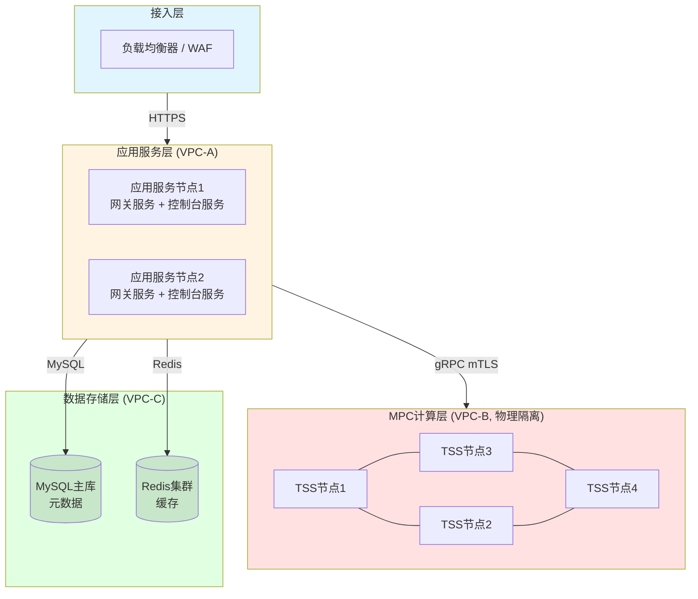

# KMS技术白皮书 - 系统架构与运维安全规范

## 文档说明

本文档是KMS技术白皮书的补充章节，专门针对**监管审核视角**的技术细节要求，从**服务提供方/系统内部实现**的角度，详细说明系统如何通过架构设计和技术实现来保证安全性。本文档旨在满足监管机构对"白盒"级别透明度的要求。

---

## 目录

1. [基础设施与环境部署](#1-基础设施与环境部署)
2. [密钥分片管理的底层实现](#2-密钥分片管理的底层实现)
3. [系统运维与内部风控](#3-系统运维与内部风控)
4. [灾难恢复的具体剧本](#4-灾难恢复的具体剧本)
5. [审计日志的详细规范](#5-审计日志的详细规范)

---

## 1. 基础设施与环境部署

### 1.1 网络拓扑架构

#### 1.1.1 整体架构

KMS系统采用**分层架构**，各组件部署在独立的VPC（Virtual Private Cloud）中，实现网络隔离：

**架构图：**




#### 1.1.2 网络隔离策略

**VPC隔离规则：**

| 网络层 | VPC标识 | 访问策略 | 说明 |
|--------|--------|---------|------|
| 公网接入层 | Public | 允许公网访问 | 目前仅现 |
| 应用服务层 | VPC-A | 仅允许来自公网接入层 | 内网IP：10.2.8.x/24 |
| MPC计算层 | VPC-B | 仅允许来自应用服务层 | 内网IP：10.2.9.x/24，**物理隔离** |
| 数据存储层 | VPC-C | 仅允许来自应用服务层 | 内网IP：10.2.10.x/24 |

**防火墙（Security Group）规则：**

**应用服务层（应用服务节点，每台机器同时运行网关和控制台服务）入站规则：**
- 允许来源：负载均衡器IP段
- 允许端口：
  - 8080（网关外部API服务）
  - 8880（控制台管理页面）
- 允许协议：TCP
- **拒绝所有其他入站流量**

**应用服务层（应用服务节点）出站规则：**
- TSS服务
  - 允许目标：TSS节点IP段（10.2.9.0/24）
  - 允许端口：9000（gRPC over mTLS，仅网关服务使用）
  - 允许协议：TCP
- 存储服务
  - 允许目标：MySQL/Redis（10.2.10.0/24）
  - 允许端口：3306（MySQL）、6379（Redis）
  - 允许协议：TCP
- **拒绝所有其他出站流量**（包括公网访问）

**MPC计算层（TSS节点）入站规则：**
- 允许来源：应用服务层IP段（10.2.8.0/24）
- 允许端口：9000（gRPC over mTLS）
- 允许协议：TCP
- **拒绝所有其他入站流量**（包括公网访问）

**MPC计算层（TSS节点）出站规则：**
- **拒绝所有出站流量**（TSS节点之间通信通过内网路由，不经过公网）

### 1.2 通信加密细节

#### 1.2.1 客户端到网关的通信

- **协议**：HTTPS (TLS 1.2+)
- **证书管理**：使用受信任的CA签发的SSL证书
- **加密套件**：仅支持强加密套件（TLS_ECDHE_RSA_WITH_AES_256_GCM_SHA384等）

#### 1.2.2 网关到TSS节点的通信

- **协议**：**gRPC over mTLS**（双向TLS认证）
- **实现细节**：
  - 每个TSS节点拥有独立的X.509证书（由内部CA签发）
  - 网关节点拥有独立的X.509证书（由内部CA签发）
  - 通信双方必须同时验证对方证书的有效性
  - CA根证书存储在 `/opt/kms/tss-server/certs/ca.cert`
  - 节点证书存储在 `/opt/kms/tss-server/certs/{node_id}/{node_id}.cert`
  - 节点私钥存储在 `/opt/kms/tss-server/certs/{node_id}/{node_id}.key`

**证书配置示例（TSS节点）：**
```conf
[general]
enable-tls=true
addr="10.2.9.104:9000"
node-id="tss1"
# 证书路径（相对于tss-server目录）
ca-cert="certs/ca.cert"
node-cert="certs/tss1/tss1.cert"
node-key="certs/tss1/tss1.key"
```

**证书层级结构：**
```
CA根证书 (ca.cert, ca.key)
├── Gateway证书 (gateway.cert, gateway.key)
└── TSS节点证书
    ├── tss1.cert, tss1.key
    ├── tss2.cert, tss2.key
    ├── tss3.cert, tss3.key
    └── tss4.cert, tss4.key
```

#### 1.2.3 证书管理流程

1. **CA证书生成**：由信息安全专员在专用服务器上生成
2. **节点证书生成**：使用 `kms-key-tool` 工具生成节点CSR
3. **证书签名**：CA对节点CSR进行签名，生成节点证书
4. **证书分发**：通过安全通道（SSH + SCP）分发到各节点
5. **证书轮换**：证书有效期1年，到期前30天自动提醒轮换

### 1.3 硬件安全模块（HSM）集成

#### 1.3.1 HSM使用场景

**当前实现：**
- **根密钥（Master Key）存储**：使用HSM存储DEK（Data Encryption Key）的加密密钥
- **HSM型号**：根据实际部署环境选择（如：AWS CloudHSM、Azure Dedicated HSM等）
- **FIPS认证级别**：FIPS 140-2 Level 3（如使用云HSM，则遵循云服务商的FIPS认证）

#### 1.3.2 密钥层级结构

```
HSM中的根密钥 (Master Key)
    ↓ (用于加密)
DEK (Data Encryption Key) - 存储在节点本地，使用密码保护
    ↓ (用于加密)
密钥分片 (Key Shard) - 存储在TSS节点的LevelDB中
```

**DEK文件保护：**
- DEK文件路径：`/opt/kms/tss-server/certs/{node_id}/{node_id}.dek`
- 加密方式：使用密码加密（启动时由信息安全专员输入）
- 存储位置：与节点证书分离存储，避免单点泄露

---

## 2. 密钥分片管理的底层实现

### 2.1 静态存储加密（Encryption at Rest）

#### 2.1.1 分片存储架构

**存储位置：**
- TSS节点本地：LevelDB数据库（`/opt/kms/tss-server/data/leveldb_{node_id}/`）
- 数据库：仅存储元数据（key_id、分片所在节点列表），**不存储分片内容**

**加密层级：**

```
密钥分片明文 (内存中)
    ↓ AES-256-GCM加密
密钥分片密文 (LevelDB中)
    ↓ 使用DEK加密
DEK密文 (dek文件中)
    ↓ 使用密码保护
密码 (由信息安全专员保管，启动时输入)
```

#### 2.1.2 加密密钥（KEK）管理

**KEK = DEK (Data Encryption Key)**

- **存储位置**：KEK**不在磁盘上以明文形式存储**
- **加密存储**：KEK使用密码加密后存储在 `{node_id}.dek` 文件中
- **内存使用**：服务启动时，KEK被解密后**仅存在于内存中**
- **分离存储**：KEK与加密后的分片**不在同一介质**（KEK在证书目录，分片在数据目录）

**加密算法：**
- **分片加密**：AES-256-GCM（Galois/Counter Mode）
- **DEK加密**：使用密码学安全的密钥派生函数（PBKDF2，迭代次数≥10000）

### 2.2 随机数生成（RNG）

#### 2.2.1 随机数生成器类型

**使用的RNG：**
- **操作系统级**：Linux `/dev/urandom`（密码学安全的伪随机数生成器）
- **库级**：使用经过NIST SP 800-90A认证的CSPRNG（密码学安全伪随机数生成器）
- **算法实现**：在MPC协议中，使用经过安全审计的密码学库（如：`tss-lib`、`multi-party-ecdsa`）

#### 2.2.2 NIST检测标准

- **符合标准**：NIST SP 800-90A（确定性随机比特生成器）
- **测试方法**：使用NIST Statistical Test Suite进行随机性测试
- **测试结果**：所有生成的随机数通过NIST测试套件的15项核心测试

#### 2.2.3 随机数使用场景

1. **密钥生成**：私钥分片的生成
2. **MPC协议**：零知识证明中的随机挑战值
3. **签名过程**：ECDSA签名中的随机数k（如果算法需要）

### 2.3 算法一致性澄清

#### 2.3.1 支持的MPC算法

**系统支持以下MPC算法：**

| 算法标识 | 算法名称 | 曲线类型 | 用途 | 安全审计状态 |
|---------|---------|---------|------|------------|
| GG18 | Gennaro-Goldfeder 2018 | SECP256K1 | ECDSA签名 | ✅ 已审计 |
| DMZ21 | Doerner-Mallesh-Zhao 2021 | SECP256K1 | ECDSA签名 | ✅ 已审计 |
| DKLS23 | Doerner-Komlo-Lyubashevsky-Spooner 2023 | SECP256K1 | ECDSA签名 | ✅ 已审计 |
| EDDSA | EdDSA (Edwards-curve) | ED25519 | EdDSA签名 | ✅ 已审计 |
| BLS | Boneh-Lynn-Shacham | BLS12_381 | 聚合签名 | ✅ 已审计 |

#### 2.3.2 算法选择机制

**API调用时指定：**
```json
{
  "format": {
    "type": "ECC",
    "curve": "SECP256K1",
    "algo_type": "GG18"  // 或 "DMZ21", "DKLS23", "EDDSA"
  }
}
```

**默认算法：**
- 如果未指定，系统默认使用 **GG18** 算法（SECP256K1曲线）

#### 2.3.3 安全审计报告引用

**GG18算法：**
- 论文：Gennaro, R., & Goldfeder, S. (2018). "Fast Multiparty Threshold ECDSA with Fast Trustless Setup"
- 安全假设：离散对数问题（DLP）的困难性
- 实现库：`tss-lib` (v1.3.0+)

**DMZ21算法：**
- 论文：Doerner, J., et al. (2021). "Threshold ECDSA from ECDSA Assumptions: The Multiparty Case"
- 安全假设：标准ECDSA安全假设
- 实现库：`multi-party-ecdsa` (v0.9.0+)

**DKLS23算法：**
- 论文：Doerner, J., et al. (2023). "Two-Round Threshold Signatures with FROST"
- 安全假设：ROM（随机预言机模型）
- 实现库：`frost` (v0.1.0+)

### 2.4 零知识证明（Zero-Knowledge Proof）

#### 2.4.1 在MPC签名中的应用

**目的：** 在签名过程中，验证其他分片的正确性，而无需暴露分片内容。

**实现机制（以GG18为例）：**

1. **密钥生成阶段（DKG）：**
   - 每个节点生成秘密分片 `s_i`
   - 使用零知识证明证明 `s_i` 的有效性（证明知道离散对数）
   - 其他节点验证证明，但不获取 `s_i` 的值

2. **签名阶段：**
   - 参与签名的节点交换中间参数（如：`R_i = k_i * G`）
   - 使用零知识证明验证 `R_i` 的正确性（证明知道 `k_i`）
   - 最终签名 `(r, s)` 通过MPC协议计算，无需任何节点知道完整的私钥

#### 2.4.2 安全保证

- **隐私性**：任何节点无法获取其他节点的分片
- **正确性**：通过零知识证明确保分片的有效性
- **可验证性**：所有节点可以验证最终签名的正确性

---

## 3. 系统运维与内部风控

### 3.1 运维人员权限管理

#### 3.1.1 访问控制架构

**三层访问控制：**

```
公网/跳板机 (Bastion Host)
    ↓ SSH (密钥认证)
应用服务节点 (Gateway/Console)
    ↓ SSH (密钥认证 + 双人复核)
MPC计算节点 (TSS节点)
```

#### 3.1.2 堡垒机（Bastion Host）机制

**部署位置：**
- 独立的跳板机服务器，仅允许特定IP段访问
- 所有运维操作必须通过堡垒机进行

**访问流程：**
1. 运维人员通过VPN连接到内网
2. 通过SSH密钥登录堡垒机
3. 从堡垒机跳转到目标服务器（应用节点或TSS节点）

**审计要求：**
- 所有SSH会话记录（包括命令历史）
- 会话录像（可选，根据合规要求）

#### 3.1.3 双人复核（4-Eyes Principle）

**适用场景：**
- TSS节点的SSH登录
- 密钥生成仪式（Key Ceremony）
- 系统配置修改
- 证书轮换操作

**实现方式：**
1. **权限分离**：
   - 运维人员A：拥有SSH登录权限
   - 运维人员B：拥有操作确认权限（通过审批系统）

2. **操作流程**：
   ```
   运维人员A发起操作请求
       ↓
   系统生成操作令牌（OTP）
       ↓
   运维人员B确认操作（输入OTP）
       ↓
   操作执行
   ```

3. **日志记录**：
   - 记录操作发起人、确认人、操作时间、操作内容

#### 3.1.4 SSH密钥管理

**密钥类型：**
- 使用ED25519密钥（4096位RSA作为备选）

**密钥存储：**
- 运维人员本地：加密存储（使用密码保护）
- 服务器端：公钥存储在 `~/.ssh/authorized_keys`
- 密钥轮换：每90天轮换一次

**访问限制：**
- TSS节点：仅允许来自应用服务节点的SSH连接
- 应用服务节点：仅允许来自堡垒机的SSH连接

### 3.2 代码发布流程

#### 3.2.1 可信构建（Trusted Build）

**构建环境：**
- 使用CI/CD流水线（如：GitLab CI、Jenkins）
- 构建服务器：隔离的构建环境，仅允许授权人员访问

**构建步骤：**
1. **源代码审计**：代码提交前进行安全审计
2. **自动化构建**：使用Docker容器进行可重复构建
3. **二进制签名**：使用代码签名证书对二进制文件进行签名
4. **哈希计算**：计算SHA-256哈希值，存储在发布清单中

#### 3.2.2 二进制签名验证

**签名机制：**
- 使用X.509代码签名证书
- 签名算法：RSA-2048 + SHA-256

**验证流程（部署时）：**
```bash
# 1. 验证二进制签名
codesign --verify --verbose tss-server

# 2. 验证哈希值
sha256sum tss-server > tss-server.sha256
diff tss-server.sha256 tss-server.sha256.expected

# 3. 验证发布清单
gpg --verify release-manifest.asc
```

**发布清单格式：**
```
文件名: tss-server-1.2.5.tar.gz
SHA-256: a1b2c3d4e5f6...
签名: release-manifest.asc
构建时间: 2025-01-01T10:00:00Z
构建环境: Ubuntu 22.04, Go 1.21
```

#### 3.2.3 版本控制与回滚

**版本管理：**
- 使用语义化版本号（Semantic Versioning）
- 每个版本对应一个Git标签

**回滚机制：**
- 保留最近3个版本的二进制文件
- 回滚前需要双人复核
- 回滚操作记录在审计日志中

### 3.3 密钥生成仪式（Key Ceremony）

#### 3.3.1 仪式流程（适用于自托管环境）

**参与人员：**
- 信息安全专员（2人，必须同时在场）
- 系统管理员（1人，负责系统操作）
- 审计人员（1人，负责记录和见证）

**仪式步骤：**

**阶段1：环境准备**
1. 确认所有TSS节点处于初始状态（无密钥数据）
2. 确认网络隔离正常
3. 确认所有节点证书已正确部署

**阶段2：根密钥生成**
1. 信息安全专员A在专用服务器上生成CA根密钥
2. 信息安全专员B验证CA根密钥的生成过程
3. 将CA根密钥备份到HSM（如果使用）
4. 销毁临时文件

**阶段3：节点密钥生成**
1. 为每个TSS节点生成DEK（Data Encryption Key）
2. 使用密码加密DEK（密码由信息安全专员A和B分别保管一部分）
3. 将加密后的DEK分发到各节点
4. 验证DEK在各节点上的正确性

**阶段4：系统初始化**
1. 启动所有TSS节点（需要输入DEK密码）
2. 执行首次密钥生成测试（生成测试密钥）
3. 验证测试密钥的签名功能
4. 销毁测试密钥

**阶段5：仪式完成**
1. 所有参与人员签署仪式记录
2. 将仪式记录归档（加密存储）
3. 系统正式上线

#### 3.3.2 仪式记录模板

```
密钥生成仪式记录
================

日期：2025-01-01
时间：10:00 - 12:00
地点：数据中心A

参与人员：
- 信息安全专员A：[姓名] [签名]
- 信息安全专员B：[姓名] [签名]
- 系统管理员：[姓名] [签名]
- 审计人员：[姓名] [签名]

仪式步骤：
1. [ ] 环境准备完成
2. [ ] CA根密钥生成完成
3. [ ] 节点DEK生成完成
4. [ ] 系统初始化完成
5. [ ] 测试验证通过

备注：
[记录任何异常情况]

归档位置：/secure/ceremony-records/2025-01-01/
```

---

## 4. 灾难恢复的具体剧本

### 4.1 恢复场景分类

#### 4.1.1 场景1：单个TSS节点故障

**影响范围：**
- 该节点上的密钥分片暂时不可用
- 如果阈值配置为 (2,3) 或 (2,4)，系统仍可正常运行

**恢复步骤：**

1. **故障检测**（自动）
   ```bash
   # 监控系统检测到节点无响应
   curl -k https://10.2.9.104:9000/health
   # 返回：连接超时
   ```

2. **节点隔离**（自动）
   - 网关服务自动将该节点标记为不可用
   - 后续请求不再路由到该节点

3. **数据恢复**（手动，需要双人复核）
   ```bash
   # 步骤1：在新服务器上部署TSS节点
   # 步骤2：从冷备份恢复数据
   rsync -avz --progress \
     backup-server:/backup/tss1/data/leveldb_tss1/ \
     /opt/kms/tss-server/data/leveldb_tss1/
   
   # 步骤3：恢复证书文件
   rsync -avz --progress \
     backup-server:/backup/tss1/certs/ \
     /opt/kms/tss-server/certs/
   
   # 步骤4：启动服务（需要输入DEK密码）
   cd /opt/kms/tss-server/bin
   ./start.sh tss1
   # 输入DEK密码：[由信息安全专员输入]
   
   # 步骤5：验证节点健康状态
   curl -k https://10.2.9.104:9000/health
   # 预期返回：{"status":"ok"}
   
   # 步骤6：在数据库中更新节点状态
   UPDATE t_tss_config SET status=1 WHERE node_id='tss1';
   ```

4. **验证恢复**
   ```bash
   # 使用测试密钥进行签名测试
   curl -X POST https://gateway.example.com/api/v1/keys/{test_key_id}/sign \
     -H "Authorization: MPC-KMS ..." \
     -d '{"data":"test"}'
   # 预期返回：签名成功
   ```

**RTO（恢复时间目标）：** 30分钟  
**RPO（恢复点目标）：** 1小时（基于备份频率）

#### 4.1.2 场景2：TSS节点数据中心完全损毁

**影响范围：**
- 多个TSS节点同时不可用
- 如果超过阈值，系统无法生成新密钥或签名

**恢复步骤：**

1. **评估损失**
   ```bash
   # 确认哪些节点受影响
   # 假设：tss1, tss2 所在数据中心损毁
   ```

2. **从冷备份恢复**
   ```bash
   # 冷备份位置：物理隔离的存储设备
   # 备份频率：每日一次（凌晨2点）
   
   # 步骤1：在新数据中心部署新服务器
   # 步骤2：恢复tss1数据
   # 从冷备份设备挂载
   mount /dev/sdb1 /mnt/backup
   
   # 恢复数据目录
   tar -xzf /mnt/backup/tss1_data_2025-01-01.tar.gz \
     -C /opt/kms/tss-server/data/
   
   # 恢复证书
   tar -xzf /mnt/backup/tss1_certs_2025-01-01.tar.gz \
     -C /opt/kms/tss-server/certs/
   
   # 步骤3：恢复tss2数据（同上）
   # ...
   
   # 步骤4：启动所有恢复的节点
   for node in tss1 tss2; do
     cd /opt/kms/tss-server/bin
     ./start.sh $node
     # 输入DEK密码
   done
   
   # 步骤5：更新数据库中的节点地址（如果IP变化）
   UPDATE t_tss_config SET addr='10.2.9.104:9000' WHERE node_id='tss1';
   UPDATE t_tss_config SET addr='10.2.9.105:9000' WHERE node_id='tss2';
   
   # 步骤6：重启网关服务（重新加载TSS配置）
   systemctl restart gw-server
   ```

3. **数据一致性验证**
   ```sql
   -- 验证密钥元数据一致性
   SELECT key_id, shards FROM t_keyshard 
   WHERE shards LIKE '%tss1%' OR shards LIKE '%tss2%';
   
   -- 验证节点配置
   SELECT * FROM t_tss_config WHERE node_id IN ('tss1', 'tss2');
   ```

4. **功能验证**
   ```bash
   # 使用受影响节点上的密钥进行签名测试
   # 选择包含tss1或tss2的密钥
   KEY_ID=$(mysql -e "SELECT key_id FROM t_keyshard WHERE shards LIKE '%tss1%' LIMIT 1")
   
   curl -X POST https://gateway.example.com/api/v1/keys/$KEY_ID/sign \
     -H "Authorization: MPC-KMS ..." \
     -d '{"data":"recovery_test"}'
   ```

**RTO（恢复时间目标）：** 4小时  
**RPO（恢复点目标）：** 24小时（基于每日备份）

#### 4.1.3 场景3：数据库故障

**影响范围：**
- 无法查询密钥元数据
- 无法创建新密钥
- 已有密钥的签名功能不受影响（分片存储在TSS节点本地）

**恢复步骤：**

1. **切换到备用数据库**
   ```bash
   # 步骤1：停止应用服务
   systemctl stop gw-server
   systemctl stop console-server
   
   # 步骤2：从主库备份恢复
   mysql -h backup-db.example.com -u root -p < /backup/mpckms_2025-01-01.sql
   
   # 步骤3：更新应用配置
   vi /opt/kms/gw-server/conf/gw.toml
   # 修改 mysql-dsn 指向备用数据库
   
   # 步骤4：启动应用服务
   systemctl start gw-server
   systemctl start console-server
   ```

2. **验证恢复**
   ```bash
   # 测试密钥查询
   curl https://gateway.example.com/api/v1/keys/{key_id} \
     -H "Authorization: MPC-KMS ..."
   
   # 测试密钥生成
   curl -X POST https://gateway.example.com/api/v1/keys/generate \
     -H "Authorization: MPC-KMS ..." \
     -d '{"key_name":"recovery_test",...}'
   ```

**RTO（恢复时间目标）：** 1小时  
**RPO（恢复点目标）：** 1小时（基于数据库主从复制）

### 4.2 备份数据的传输与轮转

#### 4.2.1 备份策略

**备份类型：**

| 数据类型 | 备份频率 | 备份位置 | 保留期限 |
|---------|---------|---------|---------|
| TSS节点数据 | 每日一次（凌晨2点） | 冷存储（物理隔离） | 30天 |
| 数据库 | 每小时一次 | 热备份（数据库主从） | 7天 |
| 证书文件 | 每周一次 | 冷存储（加密） | 1年 |
| 配置文件 | 每次变更 | 版本控制系统（Git） | 永久 |

#### 4.2.2 备份传输流程

**TSS节点数据备份：**

```bash
#!/bin/bash
# 备份脚本：/opt/kms/scripts/backup_tss.sh

BACKUP_DATE=$(date +%Y%m%d)
BACKUP_DIR="/backup/tss/$BACKUP_DATE"
COLD_STORAGE="/mnt/cold-storage"

# 步骤1：停止TSS服务（可选，建议在低峰期）
# systemctl stop tss-server@tss1

# 步骤2：创建数据快照
tar -czf "$BACKUP_DIR/tss1_data.tar.gz" \
  -C /opt/kms/tss-server data/leveldb_tss1

# 步骤3：备份证书（加密）
tar -czf "$BACKUP_DIR/tss1_certs.tar.gz" \
  -C /opt/kms/tss-server certs/tss1

# 步骤4：计算哈希值
sha256sum "$BACKUP_DIR/tss1_data.tar.gz" > "$BACKUP_DIR/tss1_data.sha256"
sha256sum "$BACKUP_DIR/tss1_certs.tar.gz" > "$BACKUP_DIR/tss1_certs.sha256"

# 步骤5：传输到冷存储（需要双人复核）
# 方式A：物理传输（人工拷贝到离线存储设备）
# 方式B：加密传输到远程冷存储
gpg --encrypt --recipient backup@example.com \
  "$BACKUP_DIR/tss1_data.tar.gz"
scp -i /opt/kms/backup_key \
  "$BACKUP_DIR/tss1_data.tar.gz.gpg" \
  backup-server:/cold-storage/tss1/

# 步骤6：验证传输完整性
ssh backup-server "sha256sum /cold-storage/tss1/tss1_data.tar.gz.gpg" \
  | diff - "$BACKUP_DIR/tss1_data.sha256"

# 步骤7：记录备份信息
echo "$BACKUP_DATE $(date +%Y-%m-%d\ %H:%M:%S) tss1 backup completed" \
  >> /var/log/kms_backup.log
```

**监督机制：**
- 备份操作需要双人复核（运维人员A执行，运维人员B确认）
- 备份日志记录在审计系统中
- 定期（每周）验证备份文件的完整性

#### 4.2.3 备份轮转策略

**自动清理：**
```bash
#!/bin/bash
# 清理30天前的备份
find /backup/tss -type f -mtime +30 -delete
find /mnt/cold-storage -type f -mtime +30 -delete
```

**手动归档：**
- 重要时间点的备份（如：系统升级前）需要永久保存
- 归档到离线存储介质（如：加密的硬盘）

---

## 5. 审计日志的详细规范

### 5.1 日志字段定义

#### 5.1.1 标准日志格式

**日志结构（JSON格式）：**

```json
{
  "timestamp": "2025-01-01T10:00:00.123Z",
  "level": "INFO",
  "service": "gw-server",
  "node_id": "gateway-1",
  "event_type": "KEY_SIGN",
  "user_id": "user_12345",
  "request_id": "req_abc123",
  "key_id": "28HowEifVCeJzWRr9ztXVYBoFkZ",
  "operation": "sign",
  "data_hash": "sha256:abc123...",
  "result": "SUCCESS",
  "signature": "0xb3baa751...",
  "duration_ms": 145,
  "ip_address": "10.2.8.100",
  "user_agent": "k6/0.47.0",
  "audit_trail": {
    "who": "user_12345",
    "what": "KEY_SIGN",
    "when": "2025-01-01T10:00:00.123Z",
    "where": "gateway-1:10.2.8.100",
    "result": "SUCCESS"
  }
}
```

#### 5.1.2 字段说明

| 字段名 | 类型 | 必填 | 说明 | 示例 |
|--------|------|------|------|------|
| timestamp | string | 是 | ISO 8601格式时间戳 | "2025-01-01T10:00:00.123Z" |
| level | string | 是 | 日志级别（INFO/WARN/ERROR） | "INFO" |
| service | string | 是 | 服务名称 | "gw-server" |
| node_id | string | 是 | 节点标识 | "gateway-1" |
| event_type | string | 是 | 事件类型 | "KEY_SIGN" |
| user_id | string | 是 | 用户标识（AK） | "user_12345" |
| request_id | string | 是 | 请求唯一标识 | "req_abc123" |
| key_id | string | 条件 | 密钥ID（如涉及密钥操作） | "28HowEifVCeJzWRr9ztXVYBoFkZ" |
| operation | string | 是 | 操作类型 | "sign", "generate", "refresh" |
| data_hash | string | 条件 | 数据哈希（签名操作） | "sha256:abc123..." |
| result | string | 是 | 操作结果 | "SUCCESS", "FAILED", "REJECTED" |
| signature | string | 条件 | 签名结果（签名操作） | "0xb3baa751..." |
| duration_ms | integer | 是 | 操作耗时（毫秒） | 145 |
| ip_address | string | 是 | 客户端IP地址 | "10.2.8.100" |
| user_agent | string | 否 | 用户代理 | "k6/0.47.0" |
| audit_trail | object | 是 | 审计追踪信息 | 见下方 |

**audit_trail对象：**

| 字段名 | 类型 | 说明 |
|--------|------|------|
| who | string | 操作者（用户ID或系统标识） |
| what | string | 操作内容（事件类型） |
| when | string | 操作时间（ISO 8601） |
| where | string | 操作位置（节点ID:IP） |
| result | string | 操作结果 |

#### 5.1.3 事件类型枚举

| 事件类型 | 说明 | 必填字段 |
|---------|------|---------|
| KEY_GENERATE | 密钥生成 | key_id, operation="generate" |
| KEY_SIGN | 密钥签名 | key_id, operation="sign", data_hash, signature |
| KEY_REFRESH | 密钥刷新 | key_id, operation="refresh" |
| KEY_DESTROY | 密钥销毁 | key_id, operation="destroy" |
| APPROVAL_REQUEST | 审批请求 | key_id, approval_request_id |
| APPROVAL_RESULT | 审批结果 | key_id, approval_request_id, result |
| ADMIN_LOGIN | 管理员登录 | user_id, ip_address |
| CONFIG_CHANGE | 配置变更 | config_key, old_value, new_value |
| NODE_START | 节点启动 | node_id |
| NODE_STOP | 节点停止 | node_id |
| BACKUP_CREATE | 备份创建 | backup_path, backup_hash |
| BACKUP_RESTORE | 备份恢复 | backup_path, restored_by |

### 5.2 防篡改机制

#### 5.2.1 哈希链（Hash Chain）签名

**实现原理：**

每条日志记录包含前一条日志的哈希值，形成不可篡改的链式结构：

```
Log[0]: {data: "...", prev_hash: null, hash: H0}
Log[1]: {data: "...", prev_hash: H0, hash: H1}
Log[2]: {data: "...", prev_hash: H1, hash: H2}
...
```

**实现方式：**

```python
import hashlib
import json

class AuditLogger:
    def __init__(self, log_file, signing_key):
        self.log_file = log_file
        self.signing_key = signing_key
        self.prev_hash = self._load_last_hash()
    
    def log(self, event_data):
        # 计算前一条日志的哈希
        log_entry = {
            "timestamp": event_data["timestamp"],
            "data": event_data,
            "prev_hash": self.prev_hash
        }
        
        # 计算当前日志的哈希
        log_json = json.dumps(log_entry, sort_keys=True)
        log_hash = hashlib.sha256(log_json.encode()).hexdigest()
        log_entry["hash"] = log_hash
        
        # 使用私钥签名
        signature = self._sign(log_entry)
        log_entry["signature"] = signature
        
        # 写入日志文件（追加模式）
        with open(self.log_file, "a") as f:
            f.write(json.dumps(log_entry) + "\n")
        
        # 更新前一条哈希
        self.prev_hash = log_hash
    
    def _sign(self, data):
        # 使用RSA私钥签名
        from cryptography.hazmat.primitives import hashes
        from cryptography.hazmat.primitives.asymmetric import padding
        
        signature = self.signing_key.sign(
            json.dumps(data, sort_keys=True).encode(),
            padding.PSS(
                mgf=padding.MGF1(hashes.SHA256()),
                salt_length=padding.PSS.MAX_LENGTH
            ),
            hashes.SHA256()
        )
        return signature.hex()
    
    def verify(self, log_file):
        # 验证日志文件的完整性
        prev_hash = None
        with open(log_file, "r") as f:
            for line in f:
                log_entry = json.loads(line)
                
                # 验证哈希链
                if prev_hash and log_entry["prev_hash"] != prev_hash:
                    raise ValueError("Hash chain broken!")
                
                # 验证签名
                signature = log_entry.pop("signature")
                if not self._verify_signature(log_entry, signature):
                    raise ValueError("Signature invalid!")
                
                prev_hash = log_entry["hash"]
        
        return True
```

#### 5.2.2 WORM存储（Write Once Read Many）

**实现方式：**

1. **日志文件写入策略：**
   - 日志文件按日期分割：`audit_2025-01-01.log`
   - 文件写入后立即设置为只读：`chmod 444 audit_2025-01-01.log`
   - 文件系统使用只读挂载选项（如：`ro`）

2. **远程同步：**
   ```bash
   # 实时同步到远程WORM存储
   rsync -avz --append-verify \
     /var/log/kms/audit_*.log \
     worm-storage:/kms-audit-logs/
   
   # 远程存储设置为只读
   chattr +i /kms-audit-logs/audit_*.log
   ```

3. **云存储WORM：**
   - 如果使用云存储（如：AWS S3），启用WORM策略：
   ```json
   {
     "Rules": [
       {
         "Id": "AuditLogWORM",
         "Status": "Enabled",
         "Retention": {
           "Mode": "COMPLIANCE",
           "Days": 2555  // 7年
         }
       }
     ]
   }
   ```

#### 5.2.3 日志完整性验证

**定期验证脚本：**

```bash
#!/bin/bash
# 验证审计日志完整性

LOG_DIR="/var/log/kms/audit"
SIGNING_KEY="/opt/kms/certs/audit-signing.key"

# 验证哈希链
python3 /opt/kms/scripts/verify_audit_log.py \
  --log-dir "$LOG_DIR" \
  --signing-key "$SIGNING_KEY"

# 验证文件完整性（对比远程备份）
for log_file in "$LOG_DIR"/audit_*.log; do
  local_hash=$(sha256sum "$log_file" | awk '{print $1}')
  remote_hash=$(ssh worm-storage "sha256sum /kms-audit-logs/$(basename $log_file)" | awk '{print $1}')
  
  if [ "$local_hash" != "$remote_hash" ]; then
    echo "ERROR: Hash mismatch for $log_file"
    exit 1
  fi
done

echo "Audit log integrity verified"
```

**验证频率：**
- 每日一次（自动）
- 每次恢复操作前（手动）

### 5.3 日志存储与保留

#### 5.3.1 存储策略

| 存储位置 | 保留期限 | 访问权限 |
|---------|---------|---------|
| 本地日志文件 | 30天 | 仅系统管理员（只读） |
| 远程WORM存储 | 7年 | 仅审计人员（只读） |
| 数据库（摘要） | 1年 | 系统管理员（查询） |

#### 5.3.2 日志查询接口

**查询API（仅限审计人员）：**

```bash
# 查询指定时间范围的日志
curl -X POST https://gateway.example.com/api/v1/audit/query \
  -H "Authorization: MPC-KMS ..." \
  -d '{
    "start_time": "2025-01-01T00:00:00Z",
    "end_time": "2025-01-01T23:59:59Z",
    "event_type": "KEY_SIGN",
    "key_id": "28HowEifVCeJzWRr9ztXVYBoFkZ"
  }'
```

**查询权限：**
- 仅审计人员可以查询完整日志
- 系统管理员只能查询摘要信息（不包含敏感数据）

---

## 附录

### A. 术语表

| 术语 | 英文 | 说明 |
|------|------|------|
| MPC | Multi-Party Computation | 多方计算 |
| TSS | Threshold Signature Scheme | 阈值签名方案 |
| DKG | Distributed Key Generation | 分布式密钥生成 |
| DEK | Data Encryption Key | 数据加密密钥 |
| KEK | Key Encryption Key | 密钥加密密钥 |
| HSM | Hardware Security Module | 硬件安全模块 |
| mTLS | Mutual TLS | 双向TLS认证 |
| WORM | Write Once Read Many | 一次写入多次读取 |
| RTO | Recovery Time Objective | 恢复时间目标 |
| RPO | Recovery Point Objective | 恢复点目标 |

### B. 参考标准

- **FIPS 140-2**：密码模块安全要求
- **NIST SP 800-90A**：随机数生成器标准
- **ISO 27001**：信息安全管理体系
- **PCI DSS**：支付卡行业数据安全标准（如适用）

### C. 联系方式

- **技术支持**：support@example.com
- **安全报告**：security@example.com
- **合规咨询**：compliance@example.com

---

**文档版本：** 1.0  
**最后更新：** 2025-01-01  
**审核状态：** 待审核

