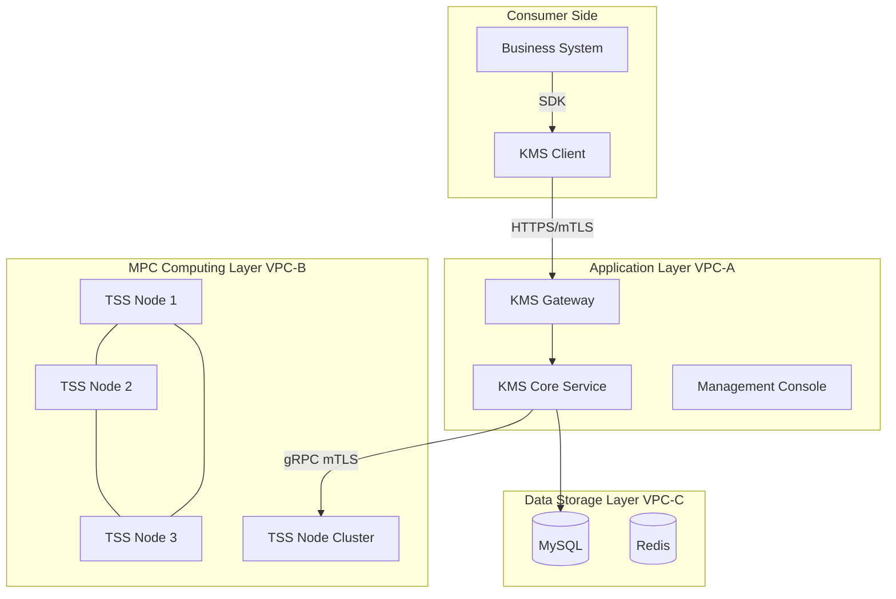
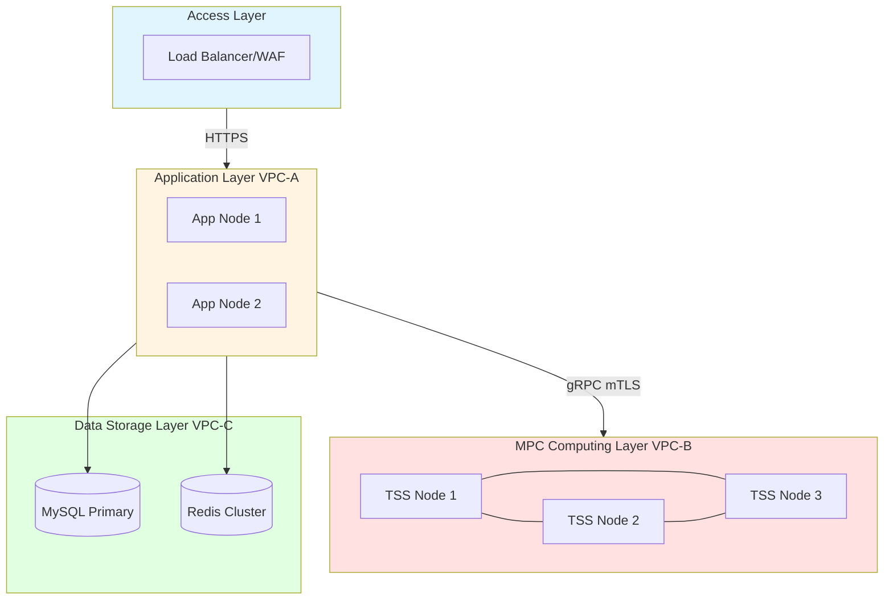
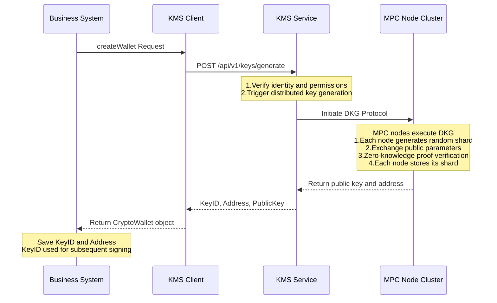
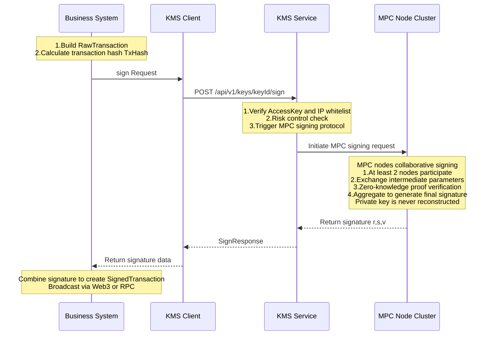
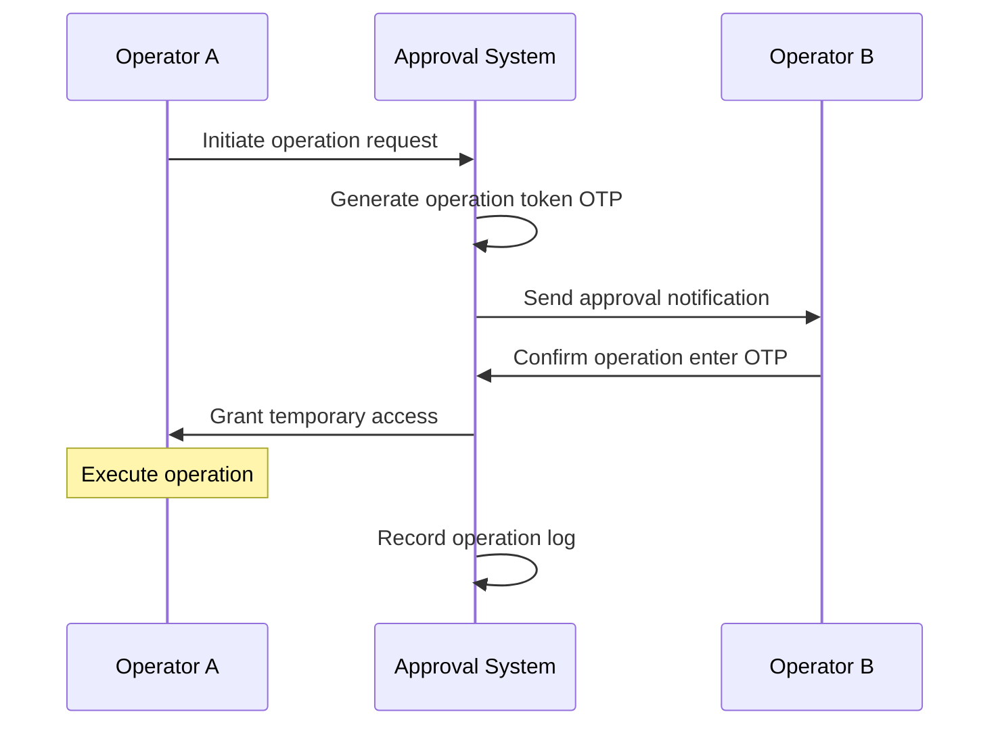

# Digital Asset Custody System Technical Specification

**Document ID:** KMS-TECH-SPEC-2026-001  
**Version:** 1.0  
**Last Updated:** January 2026  
**Document Type:** Technical Specification

---

## Table of Contents

1. [System Overview](#1-system-overview)
2. [System Architecture and Network Security](#2-system-architecture-and-network-security)
3. [Core Business Processes](#3-core-business-processes)
4. [Key Management and Cryptographic Implementation](#4-key-management-and-cryptographic-implementation)
5. [Operational Security and Access Control](#5-operational-security-and-access-control)
6. [Business Continuity and Disaster Recovery](#6-business-continuity-and-disaster-recovery)
7. [Audit Logging and Compliance Traceability](#7-audit-logging-and-compliance-traceability)
8. [Appendix](#8-appendix)

---

## 1. System Overview

### 1.1 System Positioning

This system is an enterprise-grade distributed Key Management Service (KMS) built on Multi-Party Computation (MPC) and Threshold Signature Scheme (TSS) technologies. The system provides secure and reliable private key management and transaction signing services for digital asset custody scenarios.

### 1.2 Core Technical Features

| Feature | Technical Implementation | Description |
|---------|-------------------------|-------------|
| **No Private Key Storage** | MPC + TSS | The private key never exists in its complete form in memory or on disk of any single node throughout its lifecycle |
| **Threshold Signing** | (2, 3) Threshold Scheme | System generates 3 key shards; at least 2 shards are required to produce a valid signature |
| **Distributed Architecture** | Physical Isolation | Shards are stored on different physical nodes with network isolation between nodes |
| **Multi-Chain Support** | EVM / Bitcoin / TRON, etc. | Supports address generation and transaction signing for mainstream blockchain networks |

### 1.3 Supported Cryptographic Algorithms

The system supports the following security-audited MPC signing algorithms:

| Algorithm ID | Algorithm Name | Curve Type | Use Case |
|--------------|----------------|------------|----------|
| **GG18** | Gennaro-Goldfeder 2018 | SECP256K1 | ECDSA signing (Ethereum, Bitcoin, etc.) |
| **DMZ21** | Doerner-Mallesh-Zhao 2021 | SECP256K1 | ECDSA signing (optimized performance) |
| **DKLS23** | Doerner-Komlo-Lyubashevsky-Spooner 2023 | SECP256K1 | ECDSA signing (two-round protocol) |
| **EDDSA** | Edwards-curve DSA | ED25519 | EdDSA signing (Solana, etc.) |
| **BLS** | Boneh-Lynn-Shacham | BLS12_381 | Aggregate signatures (Ethereum 2.0, etc.) |

**Default Configuration:** The system defaults to **GG18** algorithm (SECP256K1 curve). Other algorithms can be specified via API parameters.

### 1.4 Compliance Standards

| Standard ID | Standard Name | Application Scope |
|-------------|---------------|-------------------|
| NIST SP 800-57 Part 1 Rev 5 | Key Management Recommendations | Key lifecycle management |
| NIST SP 800-90A | Deterministic Random Bit Generator | Random number generation |
| FIPS 140-2 Level 3 | Cryptographic Module Security Requirements | HSM integration standard (supported) |
| ISO 27001 | Information Security Management System | Operational security management |

---

## 2. System Architecture and Network Security

### 2.1 Overall Architecture

The system adopts a layered architecture design, completely decoupling business logic from key management. Each component is deployed in an independent Virtual Private Cloud (VPC) for network isolation.

**System Architecture Diagram:**



**Network Topology Diagram:**



### 2.2 Component Description

| Component | Function | Deployment Location |
|-----------|----------|---------------------|
| **Business System** | Handles transaction construction, nonce management, and blockchain broadcasting. Only holds KeyID, no access to private key information | Consumer Environment |
| **KMS Client (SDK)** | Encapsulates underlying communication, provides high-level interfaces such as `generateKey` and `sign`, handles request signing and encrypted transmission | Consumer Environment |
| **KMS Gateway** | External API entry point, handles authentication, request routing, and rate limiting | VPC-A |
| **KMS Core Service** | Handles authorization, risk control policy checks, and MPC task scheduling | VPC-A |
| **Management Console** | Provides web interface for key management, configuration, and audit queries | VPC-A |
| **TSS Node Cluster** | Distributed MPC computing nodes, each node holds key shards and collaborates to complete signature computation | VPC-B (Physical Isolation) |
| **MySQL** | Stores key metadata (KeyID, address, shard distribution), **does not store shard content** | VPC-C |
| **Redis** | Caches session state, rate limit counters, and other temporary data | VPC-C |

### 2.3 Network Isolation Policy

The system implements strict network isolation for defense-in-depth.

**VPC Isolation Rules:**

| Network Layer | VPC ID | IP Segment | Access Policy |
|---------------|--------|------------|---------------|
| Public Access Layer | Public | - | Allows public access (filtered by WAF) |
| Application Layer | VPC-A | 10.2.8.x/24 | Only allows traffic from public access layer |
| MPC Computing Layer | VPC-B | 10.2.9.x/24 | **Physical isolation**, only allows traffic from VPC-A |
| Data Storage Layer | VPC-C | 10.2.10.x/24 | Only allows traffic from VPC-A |

**Firewall Rules:**

**Application Layer Inbound Rules:**
| Source | Port | Protocol | Description |
|--------|------|----------|-------------|
| Load Balancer IP Range | 8080 | TCP | Gateway API Service |
| Load Balancer IP Range | 8880 | TCP | Management Console |
| — | — | — | **Deny all other inbound traffic** |

**Application Layer Outbound Rules:**
| Destination | Port | Protocol | Description |
|-------------|------|----------|-------------|
| TSS Node IP Range (10.2.9.0/24) | 9000 | TCP | gRPC over mTLS |
| MySQL (10.2.10.0/24) | 3306 | TCP | Database connection |
| Redis (10.2.10.0/24) | 6379 | TCP | Cache connection |
| — | — | — | **Deny all other outbound traffic** (including public internet) |

**MPC Computing Layer (TSS Nodes) Rules:**
| Direction | Source/Destination | Port | Policy |
|-----------|-------------------|------|--------|
| Inbound | VPC-A (10.2.8.0/24) | 9000 | Allow gRPC over mTLS |
| Inbound | Others | — | **Deny all** (including public internet) |
| Outbound | — | — | **Deny all outbound traffic** |

> **Security Note:** The MPC Computing Layer implements a "deny all outbound traffic" policy. Even if an attacker breaches a TSS node, they cannot transmit key shard data to external servers, fundamentally blocking data exfiltration.

### 2.4 Communication Encryption

**External Communication (Client → Gateway):**
| Protocol | Cipher Suite | Certificate Management |
|----------|--------------|------------------------|
| HTTPS (TLS 1.2+) | TLS_ECDHE_RSA_WITH_AES_256_GCM_SHA384 and other strong cipher suites | SSL certificates issued by trusted CA |

**Internal Communication (Gateway → TSS Nodes):**
| Protocol | Authentication Method | Description |
|----------|----------------------|-------------|
| gRPC over mTLS | Mutual TLS Authentication | Both parties must verify each other's certificate validity |

**mTLS Certificate Configuration:**
- Each TSS node has an independent X.509 certificate (issued by internal CA)
- Gateway nodes have independent X.509 certificates (issued by internal CA)
- Connection requests without valid certificates are rejected

**Certificate Hierarchy:**
```
CA Root Certificate (ca.cert, ca.key)
├── Gateway Certificate (gateway.cert, gateway.key)
└── TSS Node Certificates
    ├── tss1.cert, tss1.key
    ├── tss2.cert, tss2.key
    └── tss3.cert, tss3.key
```

**Certificate Storage Paths:**
- CA Root Certificate: `/opt/kms/tss-server/certs/ca.cert`
- Node Certificate: `/opt/kms/tss-server/certs/{node_id}/{node_id}.cert`
- Node Private Key: `/opt/kms/tss-server/certs/{node_id}/{node_id}.key`

**Certificate Rotation:** Certificates are valid for 1 year; the system automatically alerts for rotation 30 days before expiration.

---

## 3. Core Business Processes

### 3.1 Wallet Creation Process

When the business system requests a new wallet address, KMS generates key shards through the MPC protocol and returns a unique KeyID.

**Process Diagram:**



**Key Security Features:**
1. **Private key never exists in complete form:** During key generation, each node independently generates random shards; the private key never exists in complete form in any node's memory or disk
2. **Zero-knowledge proofs:** Nodes verify each other's shard validity through zero-knowledge proofs without exposing shard content
3. **Isolated shard storage:** The 3 generated shards are stored on different physical nodes with network isolation

### 3.2 Transaction Signing Process

The business system constructs an unsigned transaction hash and requests KMS to sign it.

**Process Diagram:**



**Key Security Features:**
1. **Private key not reconstructed:** During signing, nodes exchange intermediate computation parameters and directly synthesize the final signature; the private key is never reconstructed
2. **Threshold control:** Uses (2, 3) threshold scheme, at least 2 nodes must participate to generate a valid signature
3. **Dual verification:** Requests must pass identity authentication (AccessKey) and risk control checks

### 3.3 Supported Wallet Operations

| Function | API Endpoint | Description |
|----------|-------------|-------------|
| Create Wallet | `POST /api/v1/keys/generate` | Generate key shards, return KeyID and address |
| Query Details | `GET /api/v1/keys/{keyId}` | Query wallet address, public key, and status |
| Transaction Signing | `POST /api/v1/keys/{keyId}/sign` | MPC signing for transaction hash |
| Message Signing | `POST /api/v1/keys/{keyId}/sign` | Supports EIP-191, EIP-712 formats |
| Status Management | `PUT /api/v1/keys/{keyId}/status` | Activate, freeze, or archive wallet |

### 3.4 Integration Guide

Business parties integrate via KMS Client SDK. Main configuration parameters:

| Parameter | Description | Notes |
|-----------|-------------|-------|
| `kms.gateway.baseUrl` | KMS service address | Internal network or public via HTTPS |
| `kms.gateway.accessKey` | Access Key ID | Identifies application identity |
| `kms.gateway.secretKey` | Access Key Secret | Used for request signing, supports encrypted storage |
| `retry.policy` | Retry policy | Exponential backoff recommended |

**SDK Usage Example (Java):**
```java
// 1. Initialize Client
KmsHighLevelClient client = new KmsHighLevelClientImpl(lowLevelClient);

// 2. Generate wallet address
GenerateKeyRequest req = new GenerateKeyRequest();
req.setFormat(new KeyFormat("ECC", "SECP256K1", "GG18", 32));
req.setShardProperties(new ShardProperties(3, 2));  // (2, 3) threshold

GenerateKeyResponse keyResp = client.generateKey(req);
String keyId = keyResp.getKeyId();
String address = keyResp.getAddress();

// 3. Sign transaction
SignRequest signReq = new SignRequest();
signReq.setData(txHash);
signReq.setDataType("HASH");

SignResponse signResp = client.sign(keyId, signReq);
String signature = signResp.getSignature();  // RSV format signature
```

---

## 4. Key Management and Cryptographic Implementation

### 4.1 Key Generation and Sharding

**Shard Configuration:**

| Parameter | Value | Description |
|-----------|-------|-------------|
| ShardCount | 3 | System generates 3 private key shards |
| Threshold | 2 | At least 2 shards required to sign |

**Generation Mechanism:**
- Uses Distributed Key Generation (DKG) protocol
- During key generation, the private key never exists in complete form in any single node
- Each node only holds its own shard and cannot derive the complete private key

**Key Specification:**
```json
{
  "format": {
    "type": "ECC",
    "curve": "SECP256K1",
    "algo_type": "GG18",
    "size": 32
  },
  "shard_properties": {
    "shard_count": 3,
    "threshold": 2
  }
}
```

### 4.2 Random Number Generation

The system employs a multi-layer random number generation strategy to ensure cryptographic security.

| Layer | Source | Standard |
|-------|--------|----------|
| Operating System Level | Linux `/dev/urandom` | Cryptographically secure PRNG |
| Library Level | CSPRNG | NIST SP 800-90A certified |
| Algorithm Level | MPC Protocol Built-in RNG | Security-audited cryptographic library implementation |

**NIST Test Verification:** All generated random numbers pass the 15 core tests of the NIST Statistical Test Suite.

**Random Number Use Cases:**
1. Key generation: Generation of private key shards
2. MPC protocol: Random challenge values in zero-knowledge proofs
3. Signing process: Random number k in ECDSA signing (if required by algorithm)

### 4.3 Encryption at Rest

All key shards undergo multi-layer encryption protection before storage.

**Storage Architecture:**
| Data Type | Storage Location | Encryption Method |
|-----------|-----------------|-------------------|
| Key Shards | TSS Node Local LevelDB | AES-256-GCM encryption |
| Metadata (KeyID, address, shard distribution) | MySQL | Does not contain shard content |

**Storage Paths:**
```
TSS Node Local:
└── /opt/kms/tss-server/data/leveldb_{node_id}/  (encrypted shard data)

Certificate Directory:
└── /opt/kms/tss-server/certs/{node_id}/
    ├── {node_id}.cert    (node certificate)
    ├── {node_id}.key     (node private key)
    └── {node_id}.dek     (encrypted DEK file)
```

**Encryption Hierarchy:**

```
Key Shard Plaintext (exists only in memory)
    ↓ AES-256-GCM encryption
Key Shard Ciphertext (stored in LevelDB)
    ↓ Encrypted with DEK
DEK Ciphertext (stored in .dek file)
    ↓ Password protected
Password (held by Information Security Officer, entered at startup)
```

**DEK (Data Encryption Key) Management:**
| Feature | Description |
|---------|-------------|
| Storage Method | Encrypted with password, stored in `{node_id}.dek` file |
| Memory Resident | Decrypted at service startup, exists only in volatile memory, never written to disk |
| Physical Separation | DEK file and shard data stored in different directory paths |
| Key Derivation | Uses PBKDF2 (iteration count ≥ 10000) to derive encryption key from password |

> **Protection Against "Pull Hard Drive" Attack:** After server power-off, the DEK in memory immediately disappears, and the shard data on disk becomes undecryptable ciphertext.

### 4.4 Zero-Knowledge Proofs

During MPC signing, nodes verify the correctness of each other's parameters through zero-knowledge proofs without exposing shard content.

**Key Generation Phase (DKG):**
1. Each node generates secret shard `s_i`
2. Uses zero-knowledge proof to prove validity of `s_i` (proves knowledge of discrete logarithm)
3. Other nodes verify the proof without obtaining the value of `s_i`

**Signing Phase:**
1. Participating nodes exchange intermediate parameters (e.g., `R_i = k_i × G`)
2. Uses zero-knowledge proof to verify correctness of `R_i` (proves knowledge of `k_i`)
3. Final signature `(r, s)` is computed through MPC protocol

**Security Guarantees:**
| Property | Description |
|----------|-------------|
| Privacy | No node can obtain other nodes' shards |
| Correctness | Zero-knowledge proofs ensure shard validity |
| Verifiability | All nodes can verify final signature correctness |

### 4.5 Hardware Security Module (HSM) Integration

The system supports integration with Hardware Security Modules (HSM) for storing root keys, further enhancing security.

**Supported HSM Types:**
| Type | Examples | Certification Level |
|------|----------|---------------------|
| Cloud HSM | AWS CloudHSM, Azure Dedicated HSM | FIPS 140-2 Level 3 |
| On-premises HSM | Thales Luna, Utimaco | FIPS 140-2 Level 3 |

**HSM Use Case:**
```
Root Key in HSM (Master Key)
    ↓ (used to encrypt)
DEK (Data Encryption Key) - stored locally on node
    ↓ (used to encrypt)
Key Shard - stored in TSS node LevelDB
```

---

## 5. Operational Security and Access Control

### 5.1 Access Control Architecture

The system employs a three-layer access control architecture. All operational activities must go through the bastion host.

**Access Path:**

```
Public/VPN
    ↓ SSH (key authentication)
Bastion Host
    ↓ SSH (key authentication)
Application Service Nodes (Gateway/Console)
    ↓ SSH (key authentication + dual authorization)
MPC Computing Nodes (TSS Nodes)
```

**Bastion Host Mechanism:**
| Feature | Description |
|---------|-------------|
| Deployment Location | Dedicated server, only allows access from specific IP ranges |
| Authentication Method | SSH key authentication (ED25519 or RSA-4096) |
| Audit Recording | All SSH session recordings (including command history) |
| Session Recording | Optional, enabled based on compliance requirements |

### 5.2 Dual Authorization (4-Eyes Principle)

For critical operations, the system enforces dual authorization.

**Applicable Scenarios:**
- SSH login to TSS nodes
- Key Ceremony
- System configuration changes
- Certificate rotation

**Operation Flow:**



**Log Content:** Operation initiator, approver, operation time, operation content, operation result.

### 5.3 SSH Key Management

| Item | Specification |
|------|---------------|
| Key Type | ED25519 (preferred) or RSA-4096 |
| Local Storage | Encrypted storage (password protected) |
| Server Side | Public key stored in `~/.ssh/authorized_keys` |
| Rotation Cycle | Every 90 days |

**Access Restrictions:**
- TSS Nodes: Only allow SSH connections from application service nodes
- Application Nodes: Only allow SSH connections from bastion host

### 5.4 Code Release and Trusted Build

**Build Process:**
1. **Source Code Audit:** Security audit before code commit
2. **Automated Build:** Reproducible builds using Docker containers
3. **Binary Signing:** Sign binary files with code signing certificate
4. **Hash Calculation:** Calculate SHA-256 hash, store in release manifest

**Deployment Verification:**
```bash
# 1. Verify binary signature
codesign --verify --verbose tss-server

# 2. Verify hash
sha256sum tss-server | diff - tss-server.sha256.expected

# 3. Verify release manifest
gpg --verify release-manifest.asc
```

**Version Management:**
- Uses Semantic Versioning
- Retains last 3 versions of binary files for rollback
- Rollback requires dual authorization

### 5.5 Key Ceremony

System initialization and root key generation follow strict ceremony procedures.

**Participants:**
| Role | Count | Responsibility |
|------|-------|----------------|
| Information Security Officer | 2 | Must be present simultaneously, execute key generation |
| System Administrator | 1 | System operations |
| Auditor | 1 | Record and witness |

**Ceremony Process:**

**Phase 1: Environment Preparation**
1. Confirm all TSS nodes are in initial state (no key data)
2. Confirm network isolation is working
3. Confirm all node certificates are correctly deployed

**Phase 2: Root Key Generation**
1. Security Officer A generates CA root key on dedicated server
2. Security Officer B verifies generation process
3. Back up root key to HSM (if applicable)
4. Destroy temporary files

**Phase 3: Node Key Generation**
1. Generate DEK for each TSS node
2. Encrypt DEK with password (password held separately by two officers)
3. Distribute encrypted DEK to each node
4. Verify DEK correctness on each node

**Phase 4: System Initialization**
1. Start all TSS nodes (requires DEK password input)
2. Execute initial key generation test
3. Verify test key signing function
4. Destroy test key

**Phase 5: Ceremony Completion**
1. All participants sign ceremony record
2. Archive ceremony record (encrypted storage)
3. System goes live

**Ceremony Record Template:**

```
=====================================
KEY CEREMONY RECORD
=====================================

Date: ____/____/____
Time: ____:____ - ____:____
Location: ____________________

Participants:
┌────────────────────┬──────────────┬──────────────┐
│ Role               │ Name         │ Signature    │
├────────────────────┼──────────────┼──────────────┤
│ Security Officer A │              │              │
│ Security Officer B │              │              │
│ System Admin       │              │              │
│ Auditor            │              │              │
└────────────────────┴──────────────┴──────────────┘

Ceremony Steps Confirmation:
[ ] 1. Environment preparation complete
[ ] 2. CA root key generation complete
[ ] 3. Node DEK generation complete
[ ] 4. System initialization complete
[ ] 5. Test verification passed

Exception Notes:
__________________________________________________
__________________________________________________

Archive Location: /secure/ceremony-records/____-__-__/

Confirmation:
I confirm the above record is accurate and the ceremony
followed all security requirements.

Security Officer A: ______________ Date: __________
Security Officer B: ______________ Date: __________
System Admin:       ______________ Date: __________
Auditor:            ______________ Date: __________
=====================================
```

---

## 6. Business Continuity and Disaster Recovery

### 6.1 Recovery Scenarios and Metrics

| Disaster Level | Scenario Description | Response Strategy | RTO | RPO |
|----------------|---------------------|-------------------|-----|-----|
| L1 | Single TSS Node Failure | Auto-isolate failed node, maintain service with remaining nodes | < 30 min | 0 (real-time redundancy) |
| L2 | Data Center Destruction | Activate offsite cold backup, rebuild nodes through key recovery ceremony | < 4 hours | < 24 hours |
| L3 | Database Failure | Switch to backup database | < 1 hour | < 1 hour |

> **Notes:**  
> - RTO (Recovery Time Objective): Maximum time to restore system  
> - RPO (Recovery Point Objective): Maximum acceptable data loss

### 6.2 Scenario 1: Single TSS Node Failure

**Impact Scope:** Key shards on that node temporarily unavailable. Due to (2, 3) threshold configuration, system can continue operating normally.

**Recovery Steps:**

1. **Failure Detection (Automatic)**
   - Monitoring system detects node unresponsive
   - Gateway service automatically marks node as unavailable

2. **Data Recovery (Manual, requires dual authorization)**
   ```bash
   # Step 1: Deploy TSS node on new server
   # Step 2: Restore data from cold backup
   rsync -avz backup-server:/backup/tss1/data/ /opt/kms/tss-server/data/
   
   # Step 3: Restore certificate files
   rsync -avz backup-server:/backup/tss1/certs/ /opt/kms/tss-server/certs/
   
   # Step 4: Start service (requires DEK password)
   ./start.sh tss1
   
   # Step 5: Verify node health
   curl -k https://10.2.9.104:9000/health
   ```

3. **Verify Recovery**
   - Test signing with test key
   - Resume normal service after confirming success

### 6.3 Scenario 2: Data Center Destruction

**Impact Scope:** Multiple TSS nodes simultaneously unavailable.

**Recovery Steps:**

1. **Assess Damage**
   - Confirm list of affected nodes

2. **Restore from Cold Backup**
   ```bash
   # Mount cold backup device
   mount /dev/sdb1 /mnt/backup
   
   # Restore data directory
   tar -xzf /mnt/backup/tss1_data.tar.gz -C /opt/kms/tss-server/data/
   
   # Restore certificates
   tar -xzf /mnt/backup/tss1_certs.tar.gz -C /opt/kms/tss-server/certs/
   
   # Start all restored nodes
   for node in tss1 tss2; do
     ./start.sh $node
     # Enter DEK password
   done
   ```

3. **Data Consistency Verification**
   - Verify key metadata consistency
   - Verify node configuration

4. **Functional Verification**
   - Test signing with keys from affected nodes

### 6.4 Backup Strategy

| Data Type | Backup Frequency | Backup Location | Retention Period |
|-----------|-----------------|-----------------|------------------|
| TSS Node Data | Daily at 2:00 AM | Cold storage (physical isolation) | 30 days |
| Database | Hourly | Hot backup (primary-replica) | 7 days |
| Certificate Files | Weekly | Cold storage (encrypted) | 1 year |
| Configuration Files | On each change | Version control (Git) | Permanent |

**Backup Security Measures:**
- Backup operations require dual authorization
- Backup logs recorded in audit system
- Weekly verification of backup file integrity
- Backup transmission uses GPG encryption

**TSS Node Data Backup Script Example:**

```bash
#!/bin/bash
# Backup script: /opt/kms/scripts/backup_tss.sh
# Execution frequency: Daily at 2:00 AM (crontab)
# Required authorization: Dual authorization (Operator A executes, Operator B confirms)

set -e

# === Configuration ===
BACKUP_DATE=$(date +%Y%m%d)
BACKUP_DIR="/backup/tss/$BACKUP_DATE"
COLD_STORAGE="/mnt/cold-storage"
NODE_ID="tss1"

echo "[$(date)] Starting backup for $NODE_ID..."

# === Step 1: Create backup directory ===
mkdir -p "$BACKUP_DIR"

# === Step 2: Create data snapshot ===
tar -czf "$BACKUP_DIR/${NODE_ID}_data.tar.gz" \
  -C /opt/kms/tss-server data/leveldb_${NODE_ID}

# === Step 3: Backup certificates ===
tar -czf "$BACKUP_DIR/${NODE_ID}_certs.tar.gz" \
  -C /opt/kms/tss-server certs/${NODE_ID}

# === Step 4: Calculate hash (integrity check) ===
sha256sum "$BACKUP_DIR/${NODE_ID}_data.tar.gz" > "$BACKUP_DIR/${NODE_ID}_data.sha256"
sha256sum "$BACKUP_DIR/${NODE_ID}_certs.tar.gz" > "$BACKUP_DIR/${NODE_ID}_certs.sha256"

# === Step 5: GPG encrypt and transfer to cold storage ===
gpg --encrypt --recipient backup@example.com \
  "$BACKUP_DIR/${NODE_ID}_data.tar.gz"

scp -i /opt/kms/backup_key \
  "$BACKUP_DIR/${NODE_ID}_data.tar.gz.gpg" \
  backup-server:/cold-storage/${NODE_ID}/

# === Step 6: Verify transfer integrity ===
REMOTE_HASH=$(ssh backup-server "sha256sum /cold-storage/${NODE_ID}/${NODE_ID}_data.tar.gz.gpg" | awk '{print $1}')
LOCAL_HASH=$(sha256sum "$BACKUP_DIR/${NODE_ID}_data.tar.gz.gpg" | awk '{print $1}')

if [ "$REMOTE_HASH" != "$LOCAL_HASH" ]; then
  echo "[ERROR] Backup transfer integrity check failed!"
  exit 1
fi

# === Step 7: Record backup log ===
echo "$BACKUP_DATE $(date '+%Y-%m-%d %H:%M:%S') $NODE_ID backup completed" \
  >> /var/log/kms_backup.log

echo "[$(date)] Backup complete: $NODE_ID"
```

**Auto-cleanup Script (retain 30 days):**

```bash
#!/bin/bash
# Clean up backups older than 30 days
find /backup/tss -type f -mtime +30 -delete
find /mnt/cold-storage -type f -mtime +30 -delete
echo "[$(date)] Backup cleanup complete"
```

---

## 7. Audit Logging and Compliance Traceability

### 7.1 Logging Scope

The system provides complete recording of all critical operations, supporting post-hoc audit and compliance traceability.

**Recorded Event Types:**

| Event Type | Description | Recorded Content |
|------------|-------------|------------------|
| KEY_GENERATE | Key generation | KeyID, public key, address, requester |
| KEY_SIGN | Key signing | KeyID, data hash, signature result, duration |
| KEY_REFRESH | Key refresh | KeyID, refresh reason |
| KEY_DESTROY | Key destruction | KeyID, destruction reason, approval info |
| APPROVAL_REQUEST | Approval request | Request ID, operation type, requester |
| APPROVAL_RESULT | Approval result | Request ID, approver, approval result |
| ADMIN_LOGIN | Administrator login | User ID, IP address, login result |
| CONFIG_CHANGE | Configuration change | Config key, old value, new value, operator |
| NODE_START/STOP | Node start/stop | Node ID, operation time, operator |
| BACKUP_CREATE/RESTORE | Backup operation | Backup path, hash value, operator |

### 7.2 Log Format Specification

**Standard Log Structure (JSON format):**

```json
{
  "timestamp": "2026-01-01T10:00:00.123Z",
  "level": "INFO",
  "service": "gw-server",
  "node_id": "gateway-1",
  "event_type": "KEY_SIGN",
  "user_id": "user_12345",
  "request_id": "req_abc123",
  "key_id": "28HowEifVCeJzWRr9ztXVYBoFkZ",
  "operation": "sign",
  "data_hash": "sha256:abc123...",
  "result": "SUCCESS",
  "signature": "0xb3baa751...",
  "duration_ms": 145,
  "ip_address": "10.2.8.100",
  "audit_trail": {
    "who": "user_12345",
    "what": "KEY_SIGN",
    "when": "2026-01-01T10:00:00.123Z",
    "where": "gateway-1:10.2.8.100",
    "result": "SUCCESS"
  }
}
```

**Audit Trail Fields:**

| Field | Description |
|-------|-------------|
| who | Operator (user ID or system identifier) |
| what | Operation content (event type) |
| when | Operation time (ISO 8601 format) |
| where | Operation location (node ID:IP) |
| result | Operation result |

### 7.3 Anti-Tampering Mechanism

**Hash Chain Signing:**

Each log record contains the hash of the previous log, forming a tamper-proof chain structure:

```
Log[0]: {data: "...", prev_hash: null, hash: H0}
Log[1]: {data: "...", prev_hash: H0, hash: H1}
Log[2]: {data: "...", prev_hash: H1, hash: H2}
...
```

Any deletion or modification of historical logs will cause hash verification failure for all subsequent logs, immediately exposing tampering.

**Hash Chain Implementation (Python Example):**

```python
import hashlib
import json
from datetime import datetime
from cryptography.hazmat.primitives import hashes
from cryptography.hazmat.primitives.asymmetric import padding

class AuditLogger:
    """
    Audit Logger
    - Implements hash chain anti-tampering mechanism
    - Supports digital signature verification
    """
    
    def __init__(self, log_file: str, signing_key):
        self.log_file = log_file
        self.signing_key = signing_key
        self.prev_hash = self._load_last_hash()
    
    def _load_last_hash(self) -> str:
        """Load hash of last log entry"""
        try:
            with open(self.log_file, 'r') as f:
                lines = f.readlines()
                if lines:
                    last_entry = json.loads(lines[-1])
                    return last_entry.get('hash')
        except FileNotFoundError:
            pass
        return None
    
    def log(self, event_data: dict):
        """Record an audit log entry"""
        # Build log entry
        log_entry = {
            "timestamp": datetime.utcnow().isoformat() + "Z",
            "data": event_data,
            "prev_hash": self.prev_hash
        }
        
        # Calculate current log hash
        log_json = json.dumps(log_entry, sort_keys=True)
        log_hash = hashlib.sha256(log_json.encode()).hexdigest()
        log_entry["hash"] = log_hash
        
        # Sign with private key
        signature = self._sign(log_entry)
        log_entry["signature"] = signature
        
        # Write to log file (append mode)
        with open(self.log_file, "a") as f:
            f.write(json.dumps(log_entry) + "\n")
        
        # Update previous hash
        self.prev_hash = log_hash
    
    def _sign(self, data: dict) -> str:
        """Sign with RSA private key"""
        signature = self.signing_key.sign(
            json.dumps(data, sort_keys=True).encode(),
            padding.PSS(
                mgf=padding.MGF1(hashes.SHA256()),
                salt_length=padding.PSS.MAX_LENGTH
            ),
            hashes.SHA256()
        )
        return signature.hex()
    
    def verify(self) -> bool:
        """Verify log file integrity"""
        prev_hash = None
        
        with open(self.log_file, "r") as f:
            for line_num, line in enumerate(f, 1):
                log_entry = json.loads(line)
                
                # Verify hash chain
                if prev_hash and log_entry["prev_hash"] != prev_hash:
                    raise ValueError(
                        f"Hash chain broken! Line: {line_num}, "
                        f"Expected: {prev_hash}, Actual: {log_entry['prev_hash']}"
                    )
                
                # Verify hash calculation
                stored_hash = log_entry.pop("hash")
                stored_sig = log_entry.pop("signature")
                
                calculated_hash = hashlib.sha256(
                    json.dumps(log_entry, sort_keys=True).encode()
                ).hexdigest()
                
                if calculated_hash != stored_hash:
                    raise ValueError(f"Hash mismatch! Line: {line_num}")
                
                log_entry["hash"] = stored_hash
                log_entry["signature"] = stored_sig
                prev_hash = stored_hash
        
        return True

# === Usage Example ===
# logger = AuditLogger("/var/log/kms/audit.log", signing_key)
# logger.log({
#     "event_type": "KEY_SIGN",
#     "key_id": "28HowEifVCeJzWRr9ztXVYBoFkZ",
#     "user_id": "user_12345",
#     "result": "SUCCESS"
# })
# logger.verify()  # Verify log integrity
```

**WORM Storage (Write Once Read Many):**

| Measure | Description |
|---------|-------------|
| Read-only Files | Log files set to read-only immediately after writing |
| Remote Sync | Real-time sync to remote WORM storage |
| Immutable | Uses `chattr +i` or cloud storage WORM policy |
| Retention Period | 7 years (compliance requirement) |

### 7.4 Log Storage and Retention

| Storage Location | Retention Period | Access Permission |
|-----------------|-----------------|-------------------|
| Local Log Files | 30 days | System administrators only (read-only) |
| Remote WORM Storage | 7 years | Auditors only (read-only) |
| Database (Summary) | 1 year | System administrators (query) |

**Integrity Verification:**
- Daily automatic verification of log hash chain integrity
- Compare local and remote backup hash values
- Alert immediately on detecting anomalies

---

## 8. Appendix

### 8.1 Glossary

| Term | Full Name | Description |
|------|-----------|-------------|
| MPC | Multi-Party Computation | A cryptographic protocol allowing multiple parties to jointly compute without revealing individual inputs |
| TSS | Threshold Signature Scheme | A signature scheme requiring threshold number of participants to generate valid signature |
| DKG | Distributed Key Generation | Protocol for multiple parties to collaboratively generate keys |
| DEK | Data Encryption Key | Key used to encrypt actual data |
| KEK | Key Encryption Key | Key used to encrypt DEK |
| HSM | Hardware Security Module | Dedicated hardware for key storage and cryptographic operations |
| mTLS | Mutual TLS | Mutual TLS authentication where both parties verify certificates |
| WORM | Write Once Read Many | Immutable storage for audit logs |
| RTO | Recovery Time Objective | Maximum time required for system recovery |
| RPO | Recovery Point Objective | Maximum acceptable data loss |
| VPC | Virtual Private Cloud | Isolated cloud network environment |
| ECDSA | Elliptic Curve Digital Signature Algorithm | Elliptic curve based digital signature algorithm |

### 8.2 Reference Standards

| Standard ID | Standard Name | Application Scope |
|-------------|---------------|-------------------|
| FIPS 140-2 | Cryptographic Module Security Requirements | HSM certification standard |
| NIST SP 800-57 | Key Management Recommendations | Key lifecycle management |
| NIST SP 800-90A | Deterministic Random Bit Generator | Random number generation |
| ISO 27001 | Information Security Management System | Operational security management |
| PCI DSS | Payment Card Industry Data Security Standard | Payment scenarios (if applicable) |

### 8.3 Algorithm References

| Algorithm | Paper | Security Assumption |
|-----------|-------|---------------------|
| GG18 | Gennaro, R., & Goldfeder, S. (2018). "Fast Multiparty Threshold ECDSA with Fast Trustless Setup" | Discrete Logarithm Problem (DLP) |
| DMZ21 | Doerner, J., et al. (2021). "Threshold ECDSA from ECDSA Assumptions: The Multiparty Case" | Standard ECDSA security assumptions |
| DKLS23 | Doerner, J., et al. (2023). "Two-Round Threshold Signatures with FROST" | Random Oracle Model (ROM) |

### 8.4 Version History

| Version | Date | Revision Notes |
|---------|------|----------------|
| 1.0 | 2026-01 | Initial version |

---

**Document Prepared by:** The Company Technical Department  
**Document Type:** Technical Specification  
**Applicable Scope:** Digital Asset Custody Business
