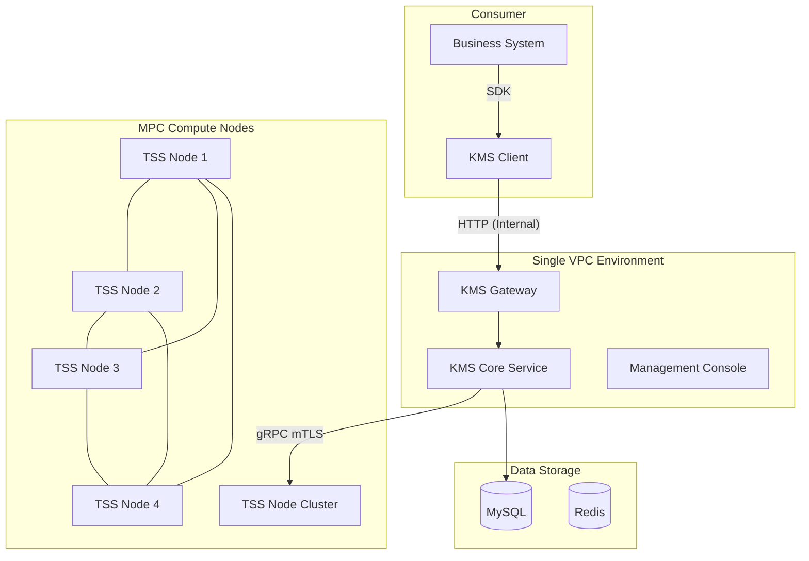
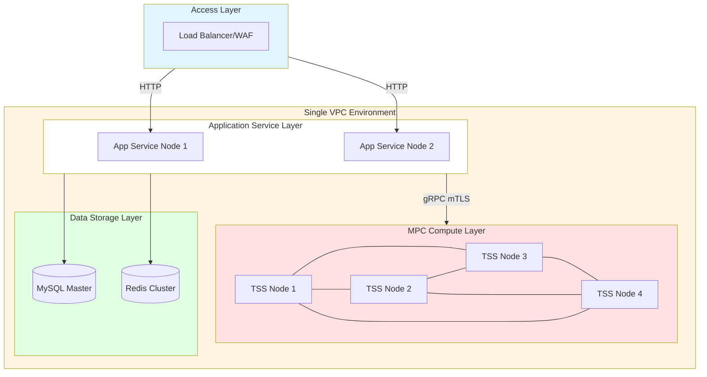
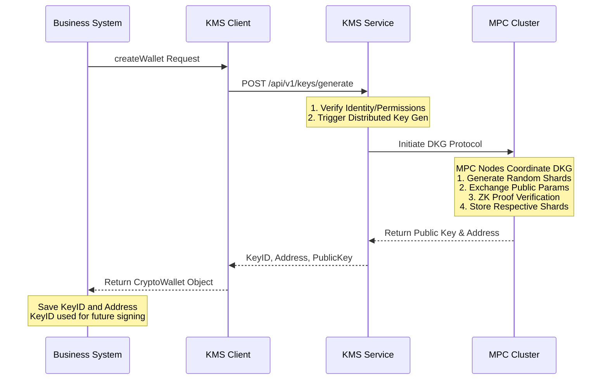
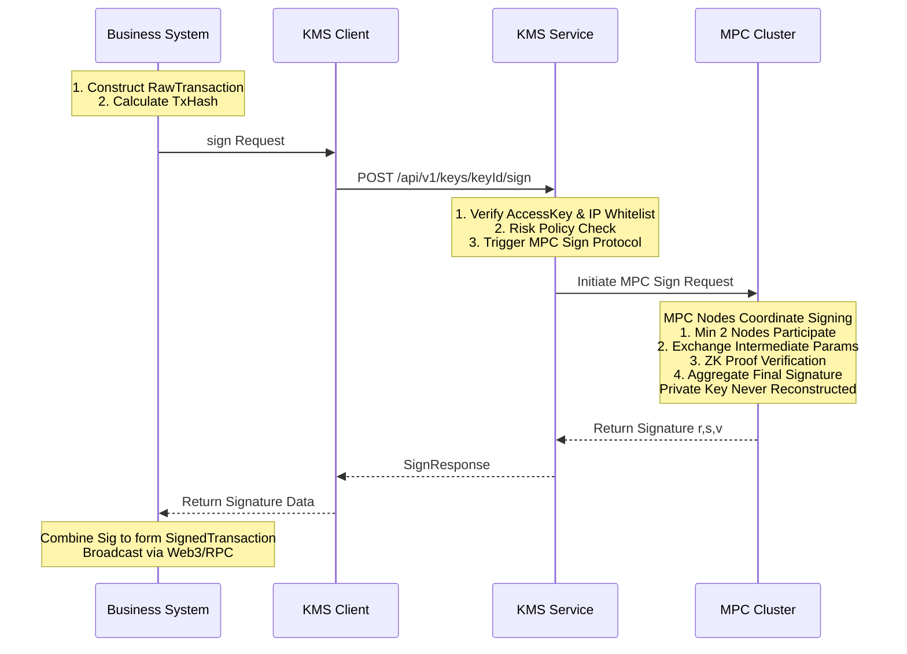

# Digital Asset Custody System Technical Specification

**Document ID:** KMS-TECH-SPEC-2026-001
**Version:** 1.0
**Last Updated:** Jan 2026
**Document Type:** Technical Specification

---

## Table of Contents

1. [System Overview](#1-system-overview)
2. [System Architecture & Network Security](#2-system-architecture--network-security)
3. [Core Business Processes](#3-core-business-processes)
4. [Key Management & Cryptography Implementation](#4-key-management--cryptography-implementation)
5. [Operational Security & Access Control](#5-operational-security--access-control)
6. [Business Continuity & Disaster Recovery](#6-business-continuity--disaster-recovery)
7. [Audit Logs & Compliance Traceability](#7-audit-logs--compliance-traceability)
8. [Appendices](#8-appendices)

---

## 1. System Overview

### 1.1 System Positioning

This system is an enterprise-grade Distributed Key Management Service (KMS) built upon Multi-Party Computation (MPC) and Threshold Signature Scheme (TSS) technologies. It provides strict, secure, and reliable private key management and transaction signing services for digital asset custody scenarios.

### 1.2 Core Technical Features

| Feature                 | Technical Implementation  | Description                                                                                                                                                                                                                                                     |
| :---------------------- | :------------------------ | :-------------------------------------------------------------------------------------------------------------------------------------------------------------------------------------------------------------------------------------------------------------- |
| **Keyless Storage**     | MPC + TSS                 | Private keys never appear in full in memory or on disk of any single node throughout their lifecycle (generation, usage, destruction).                                                                                                                          |
| **Threshold Signing**   | (2, 3) Threshold Scheme   | The system deploys 4 computational nodes and generates 3 key shards. At least 2 shards are required to generate a valid signature. The 4-node architecture ensures that 3 nodes remain available for key creation even during single-node upgrades or failures. |
| **Distributed Arch.**   | Logic Isolation           | Each shard is stored on a different node, and nodes are isolated via logical networks.                                                                                                                                                                          |
| **Multi-Chain Support** | EVM / Bitcoin / TRON etc. | Supports address generation and transaction signing for mainstream blockchain networks.                                                                                                                                                                         |

### 1.3 Supported Cryptographic Algorithms

The system supports the following security-audited MPC signing algorithms:

| Algorithm ID | Algorithm Name                          | Curve Type | Applicable Scenarios                             |
| :----------- | :-------------------------------------- | :--------- | :----------------------------------------------- |
| **GG18**     | Gennaro-Goldfeder 2018                  | SECP256K1  | ECDSA signatures (Ethereum, Bitcoin, etc.)       |
| **DMZ21**    | Doerner-Mallesh-Zhao 2021               | SECP256K1  | ECDSA signatures (Optimized performance version) |
| **DKLS23**   | Doerner-Komlo-Lyubashevsky-Spooner 2023 | SECP256K1  | ECDSA signatures (Two-round protocol)            |
| **EDDSA**    | Edwards-curve DSA                       | ED25519    | EdDSA signatures (Solana, etc.)                  |
| **BLS**      | Boneh-Lynn-Shacham                      | BLS12_381  | Aggregate signatures (Ethereum 2.0, etc.)        |

**Default Configuration:** The system defaults to using the **GG18** algorithm (SECP256K1 curve), but other algorithms can be specified via API parameters.

### 1.4 Technical Standards Compliance

| Standard ID                 | Standard Name                                   | Scope of Application                        |
| :-------------------------- | :---------------------------------------------- | :------------------------------------------ |
| NIST SP 800-57 Part 1 Rev 5 | Recommendation for Key Management               | Key Lifecycle Management                    |
| NIST SP 800-90A             | Deterministic Random Bit Generators             | Random Number Generation                    |
| FIPS 140-2 Level 3          | Security Requirements for Cryptographic Modules | HSM Integration Standard (System Supported) |
| ISO 27001                   | Information Security Management Systems         | Operational Security Management             |

---

## 2. System Architecture & Network Security

### 2.1 Overall Architecture

The system adopts a layered architecture design, completely decoupling business logic from key management. Each component is deployed in an independent Virtual Private Cloud (VPC) to achieve network isolation.

**System Architecture Diagram:**



**Network Topology Diagram:**



### 2.2 Component Description

| Component            | Function Description                                                                                                                                  | Deployment Location |
| :------------------- | :---------------------------------------------------------------------------------------------------------------------------------------------------- | :------------------ |
| **Business System**  | Responsible for transaction construction, nonce management, broadcasting to chain, etc. Holds KeyIDs only, never touches private key info.            | Consumer Env        |
| **KMS Client (SDK)** | Encapsulates underlying communication, provides high-level interfaces like `generateKey`, `sign`, handles request signing and encrypted transmission. | Consumer Env        |
| **KMS Gateway**      | External API entry point, responsible for authentication, request routing, and traffic control.                                                       | Same VPC            |
| **KMS Core Service** | Responsible for authorization, risk control policy checks, and MPC task scheduling.                                                                   | Same VPC            |
| **Mgmt Console**     | Provides Web interface for key management, configuration management, and audit queries.                                                               | Same VPC            |
| **TSS Node Cluster** | Distributed MPC compute nodes; each node holds key shards and collaborates to complete signature computation.                                         | Same VPC            |
| **MySQL**            | Stores key metadata (KeyID, address, shard distribution info), **does NOT store shard content**.                                                      | Same VPC            |
| **Redis**            | Caches session states, rate limiting counters, and other temporary data.                                                                              | Same VPC            |

### 2.3 Network Isolation Policy

The system adopts a strict network isolation policy to implement defense-in-depth.

**VPC Isolation Rules:**

| Network Layer       | VPC ID       | IP Range        | Access Policy                                |
| :------------------ | :----------- | :-------------- | :------------------------------------------- |
| Public Access Layer | Public       | Any (Internet)  | Allows public access via IP Whitelist        |
| App Service Layer   | VPC (Single) | Internal Subnet | Contains Gateway, Console, TSS Nodes, and DB |
| MPC Compute Layer   | VPC (Single) | Internal Subnet | In the same VPC as App Services              |
| Data Storage Layer  | VPC (Single) | Internal Subnet | In the same VPC as App Services              |

**Firewall Rules:**

| Zone                  | Direction | Source/Destination              | Port      | Protocol | Description                                          |
| :-------------------- | :-------- | :------------------------------ | :-------- | :------- | :--------------------------------------------------- |
| **App Service Layer** | Inbound   | Load Balancer IP                | 8080/8880 | TCP      | Gateway API & Console Service                        |
|                       | Inbound   | * (Other)                       | *         | *        | **Deny All**                                         |
|                       | Outbound  | TSS Nodes (10.2.9.0/24)         | 9000      | TCP      | gRPC over mTLS                                       |
|                       | Outbound  | MySQL/Redis (10.2.10.0/24)      | 3306/6379 | TCP      | Data Persistence & Caching                           |
|                       | Outbound  | * (Other)                       | *         | *        | **Deny All**                                         |
| **MPC Compute Layer** | Inbound   | App Service Layer (10.2.8.0/24) | 9000      | TCP      | Only allows mTLS connections from App Layer          |
| (TSS Nodes)           | Inbound   | * (Other)                       | *         | *        | **Deny All**                                         |
|                       | Outbound  | * (Any Destination)             | *         | *        | **Deny All Outbound Traffic** (Prevents Key Leakage) |

> **Security Note:** The MPC Compute Layer adopts a "Deny All Outbound Traffic" policy. Even if an attacker compromises a TSS node, they cannot transmit key shard data to external servers, fundamentally blocking data exfiltration paths.

### 2.4 Communication Encryption Mechanism

**External Communication (Client → Gateway):**

| Protocol        | Cipher Suite | Certificate Mgmt     |
| :-------------- | :----------- | :------------------- |
| HTTP (Internal) | None         | IP Whitelist Control |

**Access Control Policy Explanation:**
For HTTP communication within the internal network environment, the system implements a strict **IP Whitelist** access control policy as a critical security barrier. Only pre-registered, trusted business system IP addresses are allowed to access KMS Gateway interfaces. All requests from non-whitelisted IPs are directly rejected at the network access layer, establishing a trusted communication boundary.

**Internal Communication (Gateway → TSS Nodes):**

| Protocol       | Authentication | Description                                                              |
| :------------- | :------------- | :----------------------------------------------------------------------- |
| gRPC over mTLS | Mutual TLS     | Both communicating parties must verify each other's certificate validity |

**mTLS Certificate Configuration:**
- Each TSS node possesses an independent X.509 certificate (issued by internal CA).
- The Gateway node possesses an independent X.509 certificate (issued by internal CA).
- Only requests holding a valid internal certificate are accepted, ensuring TSS nodes hosting shards do not accept any unauthorized connections.

**Certificate Hierarchy:**
```
CA Root Certificate (ca.cert, ca.key)
├── Gateway Certificate (gateway.cert, gateway.key)
└── TSS Node Certificates
    ├── tss1.cert, tss1.key
    ├── tss2.cert, tss2.key
    ├── tss3.cert, tss3.key
    └── tss4.cert, tss4.key
```

**Certificate Storage Paths:**
- CA Root Cert: `/opt/kms/tss-server/certs/ca.cert`
- Node Cert: `/opt/kms/tss-server/certs/{node_id}/{node_id}.cert`
- Node Private Key: `/opt/kms/tss-server/certs/{node_id}/{node_id}.key`

**Certificate Rotation:**
Validity period of 1 year. Follows the lifecycle management process defined in the "Key Management Standard". The Rotation operation is performed periodically by the security operations team to ensure continuous communication security.

---

## 3. Core Business Processes

### 3.1 Wallet Creation Process

When the business system requests a new wallet address, KMS generates key shards via the MPC protocol and returns a unique KeyID.

**Flowchart:**



**Key Security Features:**
1. **Private Key Never Appears Whole:** During generation, each node independently generates random shards. The private key never appears in full in any node's memory or disk.
2. **Zero-Knowledge Proofs:** Each node uses ZK proofs to verify the validity of other nodes' shards without revealing shard content.
3. **Isolated Shard Storage:** Generated shards (3) are stored on different physical nodes which are network isolated.

### 3.2 Transaction Signing Process

The business system constructs the raw transaction hash and requests KMS to sign it.

**Flowchart:**



**Key Security Features:**
1. **Private Key Non-Reconstruction:** During signing, nodes exchange intermediate parameters and directly synthesize the final signature; the private key is never reconstructed.
2. **Threshold Control:** Uses (2, 3) threshold scheme; at least 2 nodes are needed to generate a valid signature.
3. **Dual Validation:** Requests must pass both identity authentication (AccessKey) and risk control checks.

### 3.3 Supported Wallet Operations

| Function      | API Endpoint                      | Description                                     |
| :------------ | :-------------------------------- | :---------------------------------------------- |
| Create Wallet | `POST /api/v1/keys/generate`      | Generates key shards, returns KeyID and Address |
| Query Details | `GET /api/v1/keys/{keyId}`        | Queries wallet address, public key, and status  |
| Sign Tx       | `POST /api/v1/keys/{keyId}/sign`  | Performs MPC signature on transaction hash      |
| Sign Msg      | `POST /api/v1/keys/{keyId}/sign`  | Supports EIP-191, EIP-712 formats               |
| State Mgmt    | `PUT /api/v1/keys/{keyId}/status` | Activate, Freeze, Archive wallet                |

### 3.4 Integration Guide

Business partners integrate via the KMS Client SDK. Main configuration parameters:

| Parameter               | Description         | Note                                               |
| :---------------------- | :------------------ | :------------------------------------------------- |
| `kms.gateway.baseUrl`   | KMS Service Address | Internal Access Only (HTTP + IP Whitelist)         |
| `kms.gateway.accessKey` | Access Key ID       | Identifies Application Identity                    |
| `kms.gateway.secretKey` | Access Key Secret   | Used for request signing, secure storage supported |
| `retry.policy`          | Retry Policy        | Exponential backoff strategy recommmended          |

**SDK Usage Example (Java):**

```java
// 1. Initialize Client
KmsHighLevelClient client = new KmsHighLevelClientImpl(lowLevelClient);

// 2. Generate Wallet Address
GenerateKeyRequest req = new GenerateKeyRequest();
req.setFormat(new KeyFormat("ECC", "SECP256K1", "GG18", 32));
req.setShardProperties(new ShardProperties(3, 2));  // (3, 2) threshold, 4 nodes for HA

GenerateKeyResponse keyResp = client.generateKey(req);
String keyId = keyResp.getKeyId();
String address = keyResp.getAddress();

// 3. Transaction Signing
SignRequest signReq = new SignRequest();
signReq.setData(txHash);
signReq.setDataType("HASH");

SignResponse signResp = client.sign(keyId, signReq);
String signature = signResp.getSignature();  // RSV format signature
```

---

## 4. Key Management & Cryptography Implementation

### 4.1 Key Generation & Sharding

**Shard Configuration:**

| Parameter  | Value | Description                                                                                 |
| :--------- | :---- | :------------------------------------------------------------------------------------------ |
| ShardCount | 3     | System generates 3 private key shards                                                       |
| Threshold  | 2     | Minimum 2 shards required to sign                                                           |
| NodeCount  | 4     | 4 TSS nodes deployed; ensures 3 nodes available for key creation during single node failure |

**Generation Mechanism:**
- Uses Distributed Key Generation (DKG) protocol.
- Private key never appears whole in any single node during generation.
- Each node holds only its own shard and cannot derive the full private key.

**Key Specification:**

```json
{
  "format": {
    "type": "ECC",
    "curve": "SECP256K1",
    "algo_type": "GG18",
    "size": 32
  },
  "shard_properties": {
    "shard_count": 3,
    "threshold": 2
  }
}
```

### 4.2 Random Number Generation

The system employs high-strength random number generation strategies to ensure cryptographic security.

| Layer         | Source                    | Standard                                                |
| :------------ | :------------------------ | :------------------------------------------------------ |
| OS Layer      | Linux `/dev/urandom`      | Cryptographically Secure Pseudo-Random Number Generator |
| Library Layer | **ChaCha20**              | High Performance CSPRNG                                 |
| Algo Layer    | MPC Protocol Built-in RNG | Security Audited Crypto Library Implementation          |

**NIST Testing:** All generated random numbers pass the 15 core tests of the NIST Statistical Test Suite.

**RNG Usage Scenarios (Full Coverage):**
1. Key Generation: Private key shard generation
2. MPC Protocol: Random challenge values in Zero-Knowledge Proofs (incl. homomorphic key validity proofs)
3. Signing Process: Random number 'k' in ECDSA signing
4. **OT Protocol:** Oblivious Transfer random seed generation

### 4.3 Encryption at Rest

All sensitive data is protected by multi-layer encryption before storage. **AES-256-GCM strong encryption is used across the entire link.**

**Storage Architecture & Encryption Status:**

| Data Type              | Storage Location       | Encryption Method              |
| :--------------------- | :--------------------- | :----------------------------- |
| Key Shards             | TSS Node Local LevelDB | AES-256-GCM Encryption         |
| DB Password            | Config File            | AES-256-GCM Encryption         |
| Redis Password         | Config File            | AES-256-GCM Encryption         |
| Metadata (KeyID, etc.) | MySQL                  | Does NOT contain shard content |

**Storage Paths:**

```
TSS Node Local:
└── /opt/kms/tss-server/data/leveldb_{node_id}/  (Encrypted shard data)

Cert Directory:
└── /opt/kms/tss-server/certs/{node_id}/
    ├── {node_id}.cert    (Node Cert)
    ├── {node_id}.key     (Node Private Key)
    └── {node_id}.dek     (Encrypted DEK File)
```

**Encryption Hierarchy:**

```
Plaintext Key Shard (Memory Only)
    ↓ AES-256-GCM
Ciphertext Key Shard (Stored in LevelDB)
    ↓ Encrypted by DEK
DEK Ciphertext (Stored in .dek file)
    ↓ Protected by Password
Password (Manually held by Security Specialist, entered manually at startup)
```

**DEK (Data Encryption Key) Management:**

| Feature             | Description                                                                 |
| :------------------ | :-------------------------------------------------------------------------- |
| Storage Mode        | Stored in `{node_id}.dek` file after password encryption                    |
| Memory Residency    | Decrypted at startup, exists only in volatile memory, never written to disk |
| Physical Separation | DEK file and shard data are stored in different directory paths             |
| Key Derivation      | Uses PBKDF2 (Iterations ≥ 10000) to derive encryption key from password     |

> **Anti-"Disk Pull" Attack:** Upon server power loss, the DEK in memory disappears immediately, rendering shard data on disk as undecryptable ciphertext.

### 4.4 Zero-Knowledge Proof (ZKP)

During MPC signing, nodes verify the correctness of other nodes' parameters via zero-knowledge proofs without exposing shard content.

**Key Generation Phase (DKG):**
1. Each node generates a secret shard `s_i`.
2. Uses ZKP to prove validity of `s_i` (Proving knowledge of discrete log).
3. Other nodes verify the proof but cannot obtain the value of `s_i`.

**Signing Phase:**
1. Signing nodes exchange intermediate parameters (e.g., `R_i = k_i × G`).
2. Uses ZKP to verify correctness of `R_i` (Proving knowledge of `k_i`).
3. Final signature `(r, s)` is computed via MPC protocol.

**Security Guarantees:**

| Attribute     | Description                                                 |
| :------------ | :---------------------------------------------------------- |
| Privacy       | No node can obtain another node's shard                     |
| Correctness   | Validity of shards ensured via ZKP                          |
| Verifiability | All nodes can verify the correctness of the final signature |

### 4.5 Hardware Security Module (HSM) Compatible Architecture

The system adopts a Hardware-Ready architecture design, supporting seamless integration with various Hardware Security Modules.

**Current Key Management:**
Adopts a **Layered Encryption Scheme**. Root keys are securely held by Security Specialists in an offline environment via physical isolation, ensuring controllability of the root trust source.

**Extension Capability (HSM):**
The system has pre-configured standard PKCS#11 interfaces, supporting smooth migration of root keys to FIPS 140-2 Level 3 certified hardware devices in scenarios requiring higher security levels.

**Planned Supported HSM Types:**

| Type      | Examples                          | Certification Level |
| :-------- | :-------------------------------- | :------------------ |
| Cloud HSM | AWS CloudHSM, Azure Dedicated HSM | FIPS 140-2 Level 3  |
| Local HSM | Thales Luna, Utimaco              | FIPS 140-2 Level 3  |

---

## 5. Operational Security & Access Control

### 5.1 Access Control Architecture

The system adopts a three-tier access control architecture. All operational actions must pass through a Bastion Host.

**Access Path:**

```
Public/VPN
    ↓ SSH (Key Auth)
Bastion Host
    ↓ SSH (Key Auth)
App Service Node (Gateway/Console)
    ↓ SSH (Key Auth + Dual Check)
MPC Compute Node (TSS Node)
```

**Bastion Host Mechanism (Fully Implemented):**

| Feature        | Description                                                        |
| :------------- | :----------------------------------------------------------------- |
| Deployment     | Independent server, allows specific IP range access only           |
| Authentication | SSH Key Authentication (ED25519 or RSA-4096)                       |
| Audit Record   | **Automatically records all SSH sessions (incl. command history)** |
| Access Control | All operations must jump through the Bastion Host                  |

### 5.2 Multi-Identity Verification Mechanism

To ensure the safety of highly sensitive operations, the system implements strict identity verification and permission controls at the technical level.

**Current Control Measures:**
1. **Link Control:** All operations must jump through the Bastion Host; direct connection attempts are refused.
2. **Identity Credential:** Mandatory use of high-strength SSH keys (ED25519/RSA-4096) for identity recognition.
3. **Permission Separation:** Key distribution for different roles is strictly isolated; developers cannot access production nodes.

**Planned Enhancements:**
Plan to integrate a Four-Eyes Principle approval flow in the management console, introducing multi-person joint signing for critical configuration changes to further strengthen operational compliance.

### 5.3 SSH Key Management

| Item           | Standard                                       |
| :------------- | :--------------------------------------------- |
| Key Type       | ED25519 (Preferred) or RSA-4096                |
| Local Storage  | Encrypted Storage (Protected by Password)      |
| Server Side    | Public keys stored in `~/.ssh/authorized_keys` |
| Rotation Cycle | Rotate every 90 days                           |

**Access Restrictions:**
- TSS Nodes: Allow SSH connections only from App Service Nodes
- App Service Nodes: Allow SSH connections only from Bastion Host

### 5.4 Code Release & Trusted Build

The system adopts a standardized CI/CD pipeline for code build and release, ensuring controllability and traceability of the release process.

**Build Process:**
1. **Version Control:** All code is hosted in Git version control systems; critical branches are protected.
2. **Automated Build:** Uses Jenkins pipelines to compile code automatically, avoiding inconsistencies from manual builds.
3. **Release Record:** Each build generates a unique Build ID and records relevant metadata.

**Planned Enhancements:**
To further elevate software supply chain security, plan to introduce code signing certificates and isolated build environments to generate verifiable SBOMs (Software Bill of Materials).

### 5.5 Key Ceremony

The system executes a strict secret key generation process to ensure the secure generation and storage of root keys.

**Current Execution Process:**
1. **Execution Personnel:** Executed by authorized Security Specialists in a secure environment with dedicated responsibility.
2. **Physical Environment:** Key generation is performed in an independent offline environment or controlled server to preclude network attacks.
3. **Key Distribution:** Generated DEK and related credentials are distributed directly to target nodes via encrypted channels.

**Planned Enhancements:**
Plan to introduce a more formal multi-party witness ceremony process, including on-site verification by auditors and full video archiving, to meet top-tier compliance audit requirements.

---

## 6. Business Continuity & Disaster Recovery

### 6.1 Recovery Scenarios & Metrics

| Disaster Level | Scenario                | Response Strategy                            | RTO       | RPO                      |
| :------------- | :---------------------- | :------------------------------------------- | :-------- | :----------------------- |
| L1             | Key Shard Malfunction   | Auto-isolate node; rely on remaining nodes   | Assessing | 0 (Real-time Redundancy) |
| L2             | Data Center Destruction | Activate off-site cold backup (Cross-region) | Assessing | < 24 Hours               |
| L3             | Database Failure        | Switch to standby DB                         | Assessing | < 24 Hours               |

> **Note:**
> - RTO (Recovery Time Objective): Max tolerable length of time that a computer, system, network or application can be down.
> - RPO (Recovery Point Objective): Max amount of data that can be lost.

### 6.2 Scenario 1: Single TSS Node Failure

**Impact:** Key shards on this node are temporarily unavailable. Due to the (2, 3) threshold configuration and 4-node deployment, the remaining 3 nodes can still satisfy the signature threshold (needs 2 shards) and key creation requirements (needs 3 nodes).

**Recovery Steps:**

1. **Failure Detection (Auto)**
   - Monitoring system detects node unresponsiveness.
   - Gateway service automatically marks the node as unavailable.

2. **Data Recovery Process (Standard Op Procedure)**
   ```bash
   # Step 1: Deploy TSS node on new server
   # Step 2: Restore data from cold backup
   rsync -avz backup-server:/backup/tss1/data/ /opt/kms/tss-server/data/
   
   # Step 3: Restore certificate files
   rsync -avz backup-server:/backup/tss1/certs/ /opt/kms/tss-server/certs/
   
   # Step 4: Start Service (Enter DEK Password)
   ./start.sh tss1
   
   # Step 5: Verify Node Health
   curl -k https://10.2.9.104:9000/health
   ```

3. **Verify Recovery**
   - Use test keys to perform signing test.
   - Resume normal service after successful signing.

### 6.2 Scenario 2: Data Center Destruction

**Status: System has implemented cross-continent production-DR architecture.**
- **Production:** Singapore Region
- **Off-site DR:** Frankfurt Region
- **Sync Mechanism:** Encrypted cross-region backup via VPC Peering

**Impact:** Multiple TSS nodes unavailable simultaneously.

**Recovery Steps (Drill Verified):**

1. **Assess Damage**
   - Confirm list of affected nodes.

2. **Restore from Cold Backup**
   ```bash
   # Mount cold backup device
   mount /dev/sdb1 /mnt/backup
   
   # Restore data directory
   tar -xzf /mnt/backup/tss1_data.tar.gz -C /opt/kms/tss-server/data/
   
   # Restore certificates
   tar -xzf /mnt/backup/tss1_certs.tar.gz -C /opt/kms/tss-server/certs/
   
   # Start all restored nodes
   for node in tss1 tss2; do
     ./start.sh $node
     # Enter DEK password
   done
   ```

3. **Data Consistency Verification**
   - Verify key metadata consistency.
   - Verify node configuration.

4. **Functional Verification**
   - Use keys from affected nodes to test signing.

### 6.4 Backup Strategy

The system implements backup frequencies superior to industry standards to ensure data security.

| Data Type         | Frequency    | Location                        | Retention |
| :---------------- | :----------- | :------------------------------ | :-------- |
| TSS Node Data     | Daily (2 AM) | Cross-region Backup (Frankfurt) | 30 Days   |
| Database          | Daily        | Cloud Provider Auto-Backup      | 7 Days    |
| Certificate Files | **Daily**    | S3 Bucket                       | 1 Year    |
| Config Files      | Daily        | Cross-region Backup             | Permanent |

**Backup Security Measures:**
- Backup operations require dual verification (process).
- Backup logs recorded in audit system.
- Integrity of backup files verified weekly.
- Backup transmission uses GPG encryption.

**TSS Node Backup Script Example:**

```bash
#!/bin/bash
# Backup Script: /opt/kms/scripts/backup_tss.sh
# Frequency: Daily at 2 AM (crontab)
# Permission: Dual Control (Operator A executes, Operator B confirms)

set -e

# === Config Params ===
BACKUP_DATE=$(date +%Y%m%d)
BACKUP_DIR="/backup/tss/$BACKUP_DATE"
COLD_STORAGE="/mnt/cold-storage"
NODE_ID="tss1"

echo "[$(date)] Starting backup for $NODE_ID ..."

# === Step 1: Create Backup Dir ===
mkdir -p "$BACKUP_DIR"

# === Step 2: Create Data Snapshot ===
tar -czf "$BACKUP_DIR/${NODE_ID}_data.tar.gz" \
  -C /opt/kms/tss-server data/leveldb_${NODE_ID}

# === Step 3: Backup Certs ===
tar -czf "$BACKUP_DIR/${NODE_ID}_certs.tar.gz" \
  -C /opt/kms/tss-server certs/${NODE_ID}

# === Step 4: Calc Hash (Integrity Check) ===
sha256sum "$BACKUP_DIR/${NODE_ID}_data.tar.gz" > "$BACKUP_DIR/${NODE_ID}_data.sha256"
sha256sum "$BACKUP_DIR/${NODE_ID}_certs.tar.gz" > "$BACKUP_DIR/${NODE_ID}_certs.sha256"

# === Step 5: GPG Encrypt & Transfer ===
gpg --encrypt --recipient backup@example.com \
  "$BACKUP_DIR/${NODE_ID}_data.tar.gz"

scp -i /opt/kms/backup_key \
  "$BACKUP_DIR/${NODE_ID}_data.tar.gz.gpg" \
  backup-server:/cold-storage/${NODE_ID}/

# === Step 6: Verify Transfer Integrity ===
REMOTE_HASH=$(ssh backup-server "sha256sum /cold-storage/${NODE_ID}/${NODE_ID}_data.tar.gz.gpg" | awk '{print $1}')
LOCAL_HASH=$(sha256sum "$BACKUP_DIR/${NODE_ID}_data.tar.gz.gpg" | awk '{print $1}')

if [ "$REMOTE_HASH" != "$LOCAL_HASH" ]; then
  echo "[ERROR] Backup transfer integrity check failed!"
  exit 1
fi

# === Step 7: Log Backup ===
echo "$BACKUP_DATE $(date '+%Y-%m-%d %H:%M:%S') $NODE_ID backup completed" \
  >> /var/log/kms_backup.log

echo "[$(date)] Backup Completed: $NODE_ID"
```

**Auto-Cleanup Script (Retain 30 Days):**

```bash
#!/bin/bash
# Clean up backups older than 30 days
find /backup/tss -type f -mtime +30 -delete
find /mnt/cold-storage -type f -mtime +30 -delete
echo "[$(date)] Backup Cleanup Completed"
```

---

## 7. Audit Logs & Compliance Traceability

### 7.1 Log Scope

The system records all critical operations completely, supporting post-event auditing and compliance traceability.

**Recorded Event Types:**

| Event Type            | Description     | Content Recorded                     |
| :-------------------- | :-------------- | :----------------------------------- |
| KEY_GENERATE          | Key Generation  | KeyID, PubKey, Address, Requester    |
| KEY_SIGN              | Key Signing     | KeyID, DataHash, Signature, Duration |
| KEY_REFRESH           | Key Refresh     | KeyID, Reason                        |
| KEY_DESTROY           | Key Destruction | KeyID, Reason, Approval Info         |
| APPROVAL_REQUEST      | Approval Req    | Req ID, Op Type, Requester           |
| APPROVAL_RESULT       | Approval Res    | Req ID, Approver, Result             |
| ADMIN_LOGIN           | Admin Login     | User ID, IP, Result                  |
| CONFIG_CHANGE         | Config Change   | Item, Old Val, New Val, Operator     |
| NODE_START/STOP       | Node Op         | Node ID, Time, Operator              |
| BACKUP_CREATE/RESTORE | Backup Op       | Path, Hash, Operator                 |

### 7.2 Log Format Specification

**Storage Architecture:**
Audit logs adopt a structured storage scheme, persisting in the core business database (e.g., `t_key_operation_log`) to ensure strong consistency between log data and business transactions and to enable efficient relational querying.

**Record Fields:**

| Field        | Description         |
| :----------- | :------------------ |
| user_id      | Operator User ID    |
| key_id       | Key ID              |
| operation    | Operation Type      |
| result       | Operation Result    |
| created_time | Operation Time      |
| service_name | Service Name        |
| node_id      | Node ID             |
| duration_ms  | Duration (ms)       |
| data_hash    | Data Hash           |
| audit_trail  | Audit Trail (IP/UA) |

### 7.3 Tamper-Proof Mechanism

**Integrity Protection Mechanism:**
The system implements log tamper-proofing through strict Database Access Control Lists (ACL). Only authorized audit service accounts possess write permissions; direct modification of log table data by any business account or admin account is strictly prohibited.

**Planned Anti-Tampering Solutions:**
- Introduce Hash Chain Signatures
- Introduce Digital Signature Verification
- Introduce WORM Storage

### 7.4 Log Storage & Retention

| Storage Location                       | Retention | Permissions                               |
| :------------------------------------- | :-------- | :---------------------------------------- |
| **Online Storage** (Business DB)       | 1 Year    | Authorized Service Account (AppRole) Only |
| **Archive Storage** (S3 Cold Internal) | Permanent | Auditor (Read-Only)                       |

**Integrity Verification:**
Adopts a periodic audit mechanism, where the internal audit team performs consistency checks on log records and backup data quarterly to ensure the authenticity and validity of archived data.

---

## 8. Appendices

### 8.1 Glossary

| Term  | Full Name                                  | Description                                                                   |
| :---- | :----------------------------------------- | :---------------------------------------------------------------------------- |
| MPC   | Multi-Party Computation                    | Crypto protocol allowing parties to compute jointly keeping inputs private.   |
| TSS   | Threshold Signature Scheme                 | Scheme requiring a threshold number of parties to generate a valid signature. |
| DKG   | Distributed Key Generation                 | Protocol for parties to collaboratively generate keys.                        |
| DEK   | Data Encryption Key                        | Key used to encrypt actual data.                                              |
| KEK   | Key Encryption Key                         | Key used to encrypt the DEK.                                                  |
| HSM   | Hardware Security Module                   | Hardware device for key storage and crypto operations.                        |
| mTLS  | Mutual TLS                                 | Mutual certificate authentication between communicating parties.              |
| WORM  | Write Once Read Many                       | Storage method to prevent data modification, used for audit logs.             |
| RTO   | Recovery Time Objective                    | Target max time for system recovery.                                          |
| RPO   | Recovery Point Objective                   | Target max data loss.                                                         |
| VPC   | Virtual Private Cloud                      | Isolated cloud network environment.                                           |
| ECDSA | Elliptic Curve Digital Signature Algorithm | Digital signature algorithm used by Bitcoin/Ethereum.                         |

### 8.2 Reference Standards

| Standard ID     | Standard Name                                | Application Scope        |
| :-------------- | :------------------------------------------- | :----------------------- |
| FIPS 140-2      | Security Requirements for Crypto Modules     | HSM Certification        |
| NIST SP 800-57  | Recommendation for Key Management            | Key Lifecycle Mgmt       |
| NIST SP 800-90A | Deterministic Random Bit Generators          | RNG                      |
| ISO 27001       | Information Security Management              | Operational Security     |
| PCI DSS         | Payment Card Industry Data Security Standard | Payments (if applicable) |

### 8.3 Algorithm References

| Algo   | Paper                                                                                            | Security Assumption       |
| :----- | :----------------------------------------------------------------------------------------------- | :------------------------ |
| GG18   | Gennaro, R., & Goldfeder, S. (2018). "Fast Multiparty Threshold ECDSA with Fast Trustless Setup" | DLP                       |
| DMZ21  | Doerner, J., et al. (2021). "Threshold ECDSA from ECDSA Assumptions: The Multiparty Case"        | Standard ECDSA Assumption |
| DKLS23 | Doerner, J., et al. (2023). "Two-Round Threshold Signatures with FROST"                          | Random Oracle Model (ROM) |

### 8.4 Version History

| Version | Date    | Description     |
| :------ | :------ | :-------------- |
| 1.0     | 2026-01 | Initial Version |

---

**Prepared By:** AppWorks Technical Dept.
**Document Type:** Technical Specification
**Scope:** Digital Asset Custody Business
