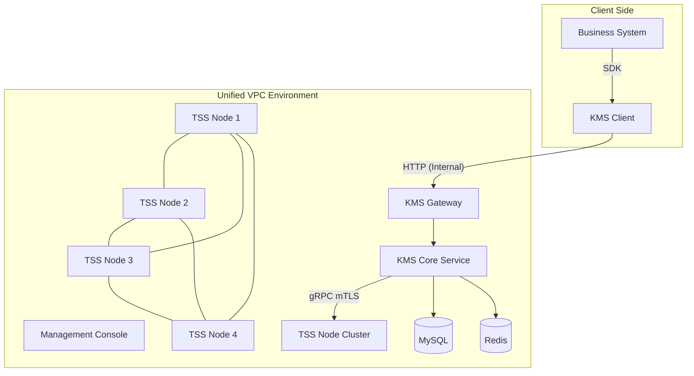
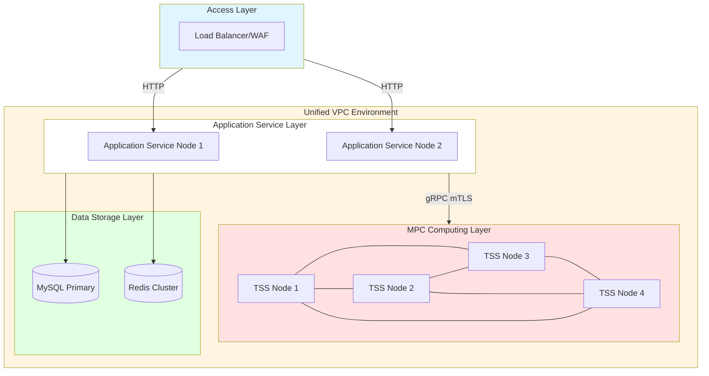
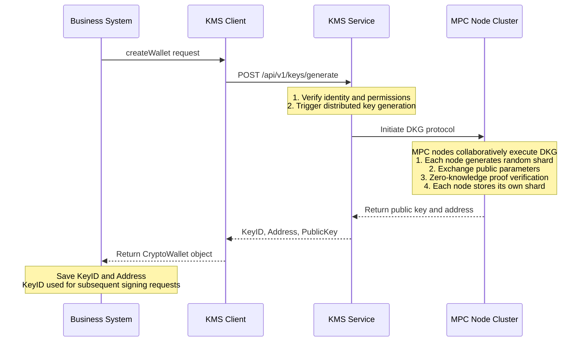
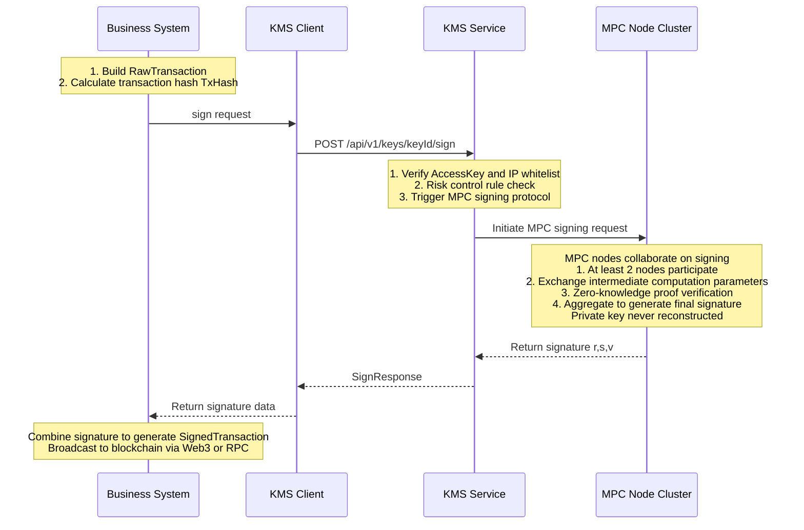

# Digital Asset Custody System Technical Specification

**Document Number:** KMS-TECH-SPEC-2026-001  
**Version:** 3.0  
**Last Updated:** January 2026  
**Document Type:** Technical Specification

---

## Table of Contents

1. [System Overview](#1-system-overview)
2. [System Architecture and Network Security](#2-system-architecture-and-network-security)
3. [Core Business Processes](#3-core-business-processes)
4. [Key Management and Cryptographic Implementation](#4-key-management-and-cryptographic-implementation)
5. [Operations Security and Access Control](#5-operations-security-and-access-control)
6. [Business Continuity and Disaster Recovery](#6-business-continuity-and-disaster-recovery)
7. [Audit Logs and Compliance Traceability](#7-audit-logs-and-compliance-traceability)
8. [Appendix](#8-appendix)

---

## 1. System Overview

### 1.1 System Positioning

This system is an enterprise-grade distributed Key Management Service (KMS) built on Multi-Party Computation (MPC) and Threshold Signature Scheme (TSS) technologies. The system provides secure and reliable private key management and transaction signing services for digital asset custody scenarios.

### 1.2 Core Technical Features

| Feature                      | Technical Implementation     | Description                                                                                                                                                                                                                    |
| ---------------------------- | ---------------------------- | ------------------------------------------------------------------------------------------------------------------------------------------------------------------------------------------------------------------------------ |
| **No Private Key Storage**   | MPC + TSS                    | Private keys never appear in their entirety in the memory or disk of any single node throughout generation, usage, and destruction                                                                                             |
| **Threshold Signature**      | (2, 3) Threshold Scheme      | System deploys 4 computing nodes, generates 3 key shards, requires at least 2 shards to generate valid signatures. 4-node architecture ensures 3 nodes remain available for key creation during single node upgrade or failure |
| **Distributed Architecture** | Logical Isolation Deployment | Each shard is stored on different nodes with logical network isolation between nodes                                                                                                                                           |
| **Multi-Chain Support**      | EVM / Bitcoin / TRON, etc.   | Supports address generation and transaction signing for mainstream blockchain networks                                                                                                                                         |

### 1.3 Supported Cryptographic Algorithms

The system supports the following security-audited MPC signing algorithms:

| Algorithm ID | Algorithm Name                          | Curve Type | Use Case                                  |
| ------------ | --------------------------------------- | ---------- | ----------------------------------------- |
| **GG18**     | Gennaro-Goldfeder 2018                  | SECP256K1  | ECDSA signing (Ethereum, Bitcoin, etc.)   |
| **DMZ21**    | Deng-Ma-Zhang 2021                      | SECP256K1  | ECDSA signing (optimized performance)     |
| **DKLS23**   | Doerner-Komlo-Lyubashevsky-Spooner 2023 | SECP256K1  | ECDSA signing (two-round protocol)        |
| **EDDSA**    | Edwards-curve DSA                       | ED25519    | EdDSA signing (Solana, etc.)              |
| **BLS**      | Boneh-Lynn-Shacham                      | BLS12_381  | Aggregate signatures (Ethereum 2.0, etc.) |

**Default Configuration:** The system uses **GG18** algorithm (SECP256K1 curve) by default, with other algorithms selectable via API parameters.

### 1.4 Compliance with Technical Standards

| Standard Number             | Standard Name                                   | Application Scope              |
| --------------------------- | ----------------------------------------------- | ------------------------------ |
| NIST SP 800-57 Part 1 Rev 5 | Recommendation for Key Management               | Key lifecycle management       |
| NIST SP 800-90A             | Recommendation for Random Number Generation     | Random number generation       |
| FIPS 140-2 Level 3          | Security Requirements for Cryptographic Modules | HSM compatibility standard     |
| ISO 27001                   | Information Security Management System          | Operations security management |

---

## 2. System Architecture and Network Security

### 2.1 Overall Architecture

The system adopts a layered architecture design that completely decouples business logic from key management. All components are deployed in a unified Virtual Private Cloud (VPC) environment with logical isolation implemented through network policies.

**System Architecture Diagram:**



**Network Topology Diagram:**



### 2.2 Component Description

| Component              | Function Description                                                                                                                                 | Deployment Location |
| ---------------------- | ---------------------------------------------------------------------------------------------------------------------------------------------------- | ------------------- |
| **Business System**    | Responsible for transaction construction, nonce management, blockchain broadcasting. Only holds KeyID, never touches private keys                    | Client environment  |
| **KMS Client (SDK)**   | Encapsulates underlying communication, provides high-level interfaces like `generateKey`, `sign`, handles request signing and encrypted transmission | Client environment  |
| **KMS Gateway**        | External API entry point, responsible for authentication, request routing, traffic control                                                           | Unified VPC         |
| **KMS Core Service**   | Responsible for authorization, risk control policy checks, and MPC task scheduling                                                                   | Unified VPC         |
| **Management Console** | Provides web interface for key management, configuration management, and audit queries                                                               | Unified VPC         |
| **TSS Node Cluster**   | Distributed MPC computing nodes, each holding key shards, collaborating to complete signature computation                                            | Unified VPC         |
| **MySQL**              | Stores key metadata (KeyID, address, shard distribution), **does not store shard content**                                                           | Unified VPC         |
| **Redis**              | Caches session state, rate limiting counters, and other temporary data                                                                               | Unified VPC         |

### 2.3 Network Isolation Strategy

The system implements strict network isolation policies for defense in depth.

**Network Segmentation:**

| Network Layer             | IP Segment     | Access Policy                              |
| ------------------------- | -------------- | ------------------------------------------ |
| Public Access Layer       | Any (Internet) | Public access allowed through IP whitelist |
| Application Service Layer | 10.2.8.0/24    | Contains gateway and console services      |
| MPC Computing Layer       | 10.2.9.0/24    | Contains TSS node cluster                  |
| Data Storage Layer        | 10.2.10.0/24   | Contains MySQL and Redis                   |

**Firewall Rules:**

| Zone                          | Direction | Source/Destination              | Port      | Protocol | Description                                         |
| :---------------------------- | :-------- | :------------------------------ | :-------- | :------- | :-------------------------------------------------- |
| **Application Service Layer** | Inbound   | Load Balancer IP                | 8080/8880 | TCP      | Gateway API and Console services                    |
|                               | Inbound   | * (Other)                       | *         | *        | **Deny All**                                        |
|                               | Outbound  | TSS Nodes (10.2.9.0/24)         | 9000      | TCP      | gRPC over mTLS                                      |
|                               | Outbound  | MySQL/Redis (10.2.10.0/24)      | 3306/6379 | TCP      | Data persistence and caching                        |
|                               | Outbound  | * (Other)                       | *         | *        | **Deny All**                                        |
| **MPC Computing Layer**       | Inbound   | Application Layer (10.2.8.0/24) | 9000      | TCP      | Only allow mTLS connections from application layer  |
| (TSS Nodes)                   | Inbound   | * (Other)                       | *         | *        | **Deny All**                                        |
|                               | Outbound  | * (Any destination)             | *         | *        | **Deny All Outbound Traffic** (prevent key leakage) |

> **Security Note:** The MPC computing layer implements a "deny all outbound traffic" policy. Even if an attacker breaches a TSS node, they cannot transmit key shard data to external servers, fundamentally blocking data exfiltration paths.

### 2.4 Communication Encryption Mechanisms

**External Communication (Client → Gateway):**

For internal network communications, the system implements strict **IP whitelist** access control as a critical security barrier.

| Protocol        | Access Control       | Description                                                                                                                            |
| --------------- | -------------------- | -------------------------------------------------------------------------------------------------------------------------------------- |
| HTTP (Internal) | IP Whitelist Control | Only allows pre-registered, trusted business system IP addresses to access KMS gateway interfaces                                      |
|                 |                      | All requests from non-whitelisted IPs are directly rejected at the network access layer, establishing a trusted communication boundary |

**Internal Communication (Gateway → TSS Nodes):**

| Protocol       | Authentication Method     | Description                                                      |
| -------------- | ------------------------- | ---------------------------------------------------------------- |
| gRPC over mTLS | Mutual TLS Authentication | Both communicating parties must verify each other's certificates |

**mTLS Certificate Configuration:**
- Each TSS node has an independent X.509 certificate (issued by internal CA)
- Gateway node has an independent X.509 certificate (issued by internal CA)
- Only requests with valid internal certificates are accepted, ensuring TSS nodes storing shards do not accept any unauthorized connections

**Certificate Hierarchy:**
```
CA Root Certificate (ca.cert, ca.key)
├── Gateway Certificate (gateway.cert, gateway.key)
└── TSS Node Certificates
    ├── tss1.cert, tss1.key
    ├── tss2.cert, tss2.key
    ├── tss3.cert, tss3.key
    └── tss4.cert, tss4.key
```

**Certificate Storage Paths:**
- CA Root Certificate: `/opt/kms/tss-server/certs/ca.cert`
- Node Certificate: `/opt/kms/tss-server/certs/{node_id}/{node_id}.cert`
- Node Private Key: `/opt/kms/tss-server/certs/{node_id}/{node_id}.key`

**Certificate Rotation:** Certificates have a one-year validity period and follow the lifecycle management process defined in the "Key Management Specification". The security operations team performs regular rotation operations to ensure continuous communication security.

---

## 3. Core Business Processes

### 3.1 Wallet Creation Process

When a business system requests a new wallet address, KMS generates key shards through the MPC protocol and returns a unique KeyID.

**Process Flow:**



**Key Security Features:**
1. **Private key never appears in full:** During key generation, each node independently generates random shards; the private key never appears in its entirety in any node's memory or disk
2. **Zero-knowledge proof:** Nodes verify the validity of other nodes' shards through zero-knowledge proofs without exposing shard content
3. **Shard isolation storage:** The 3 generated shards are stored on different physical nodes with network isolation between nodes

### 3.2 Transaction Signing Process

Business systems construct unsigned transaction hashes and request KMS to sign them.

**Process Flow:**



**Key Security Features:**
1. **Private key not reconstructed:** During signing, nodes exchange intermediate computation parameters and directly synthesize the final signature; the private key is never reconstructed
2. **Threshold control:** Uses (2, 3) threshold scheme; at least 2 nodes participating can generate valid signatures
3. **Dual verification:** Requests must pass authentication (AccessKey) and risk control rule checks

### 3.3 Supported Wallet Operations

| Function          | API Endpoint                      | Description                                   |
| ----------------- | --------------------------------- | --------------------------------------------- |
| Create Wallet     | `POST /api/v1/keys/generate`      | Generate key shards, return KeyID and address |
| Query Details     | `GET /api/v1/keys/{keyId}`        | Query wallet address, public key, and status  |
| Transaction Sign  | `POST /api/v1/keys/{keyId}/sign`  | Perform MPC signing on transaction hash       |
| Message Sign      | `POST /api/v1/keys/{keyId}/sign`  | Support EIP-191, EIP-712 formats              |
| Status Management | `PUT /api/v1/keys/{keyId}/status` | Activate, freeze, archive wallet              |

### 3.4 Integration Instructions

Business parties integrate with the system through the KMS Client SDK. Main configuration parameters:

| Parameter               | Description         | Notes                                                |
| ----------------------- | ------------------- | ---------------------------------------------------- |
| `kms.gateway.baseUrl`   | KMS service address | Internal network access only (HTTP + IP whitelist)   |
| `kms.gateway.accessKey` | Access key ID       | Identifies application identity                      |
| `kms.gateway.secretKey` | Access key secret   | Used for request signing, supports encrypted storage |
| `retry.policy`          | Retry policy        | Recommend configuring exponential backoff            |

**SDK Usage Example (Java):**
```java
// 1. Initialize Client
KmsHighLevelClient client = new KmsHighLevelClientImpl(lowLevelClient);

// 2. Generate wallet address
GenerateKeyRequest req = new GenerateKeyRequest();
req.setFormat(new KeyFormat("ECC", "SECP256K1", "GG18", 32));
req.setShardProperties(new ShardProperties(3, 2));  // (2, 3) threshold, 4-node deployment for high availability

GenerateKeyResponse keyResp = client.generateKey(req);
String keyId = keyResp.getKeyId();
String address = keyResp.getAddress();

// 3. Transaction signing
SignRequest signReq = new SignRequest();
signReq.setData(txHash);
signReq.setDataType("HASH");

SignResponse signResp = client.sign(keyId, signReq);
String signature = signResp.getSignature();  // RSV format signature
```

---

## 4. Key Management and Cryptographic Implementation

### 4.1 Key Generation and Sharding

**Shard Configuration:**

| Parameter                 | Value | Description                                                                                        |
| ------------------------- | ----- | -------------------------------------------------------------------------------------------------- |
| ShardCount (Total Shards) | 3     | System generates 3 private key shards                                                              |
| Threshold                 | 2     | At least 2 shards required for signing                                                             |
| NodeCount (Total Nodes)   | 4     | Deploys 4 TSS nodes, ensuring 3 nodes remain available for key creation during single node failure |

**Generation Mechanism:**
- Uses Distributed Key Generation (DKG) protocol
- During key generation, the private key never appears in its entirety in any single node
- Each node only holds its own shard and cannot derive the complete private key

**Key Specification:**
```json
{
  "format": {
    "type": "ECC",
    "curve": "SECP256K1",
    "algo_type": "GG18",
    "size": 32
  },
  "shard_properties": {
    "shard_count": 3,
    "threshold": 2
  }
}
```

### 4.2 Random Number Generation

The system employs high-strength random number generation strategies to ensure cryptographic security.

| Level            | Source                    | Standard                                                |
| ---------------- | ------------------------- | ------------------------------------------------------- |
| Operating System | Linux `/dev/urandom`      | Cryptographically secure pseudo-random number generator |
| Library          | **ChaCha20**              | High-performance CSPRNG                                 |
| Algorithm        | MPC protocol built-in RNG | Security-audited cryptographic library implementation   |

**NIST Test Verification:** All generated random numbers pass the 15 core tests of the NIST Statistical Test Suite.

**Random Number Usage Scenarios:**
1. Key generation: Generation of private key shards
2. MPC protocol: Random challenge values in zero-knowledge proofs (including homomorphic key validity proofs)
3. Signing process: Random number k in ECDSA signatures
4. **OT protocol:** Oblivious Transfer random seed generation

### 4.3 Encryption at Rest

All sensitive data undergoes multi-layer encryption protection before being stored, with **full-chain AES-256-GCM strong encryption**.

**Storage Architecture and Encryption:**

| Data Type                                     | Storage Location       | Encryption Method              |
| --------------------------------------------- | ---------------------- | ------------------------------ |
| Key shards                                    | TSS node local LevelDB | AES-256-GCM encryption         |
| Database password                             | Configuration file     | AES-256-GCM encryption         |
| Redis password                                | Configuration file     | AES-256-GCM encryption         |
| Metadata (KeyID, address, shard distribution) | MySQL                  | Does not contain shard content |

**Storage Paths:**
```
TSS node local:
└── /opt/kms/tss-server/data/leveldb_{node_id}/  (encrypted shard data)

Certificate directory:
└── /opt/kms/tss-server/certs/{node_id}/
    ├── {node_id}.cert    (node certificate)
    ├── {node_id}.key     (node private key)
    └── {node_id}.dek     (encrypted DEK file)
```

**Encryption Hierarchy:**

```
Key shard plaintext (exists only in memory)
    ↓ AES-256-GCM encryption
Key shard ciphertext (stored in LevelDB)
    ↓ Encrypted using DEK
DEK ciphertext (stored in .dek file)
    ↓ Protected by password
Password (kept by information security officer, manually entered at startup)
```

**DEK (Data Encryption Key) Management:**

| Feature             | Description                                                                       |
| ------------------- | --------------------------------------------------------------------------------- |
| Storage Method      | Encrypted with password and stored in `{node_id}.dek` file                        |
| Memory Residence    | Decrypted at service startup, exists only in volatile memory, not written to disk |
| Physical Separation | DEK file and shard data stored in different directory paths                       |
| Key Derivation      | Uses PBKDF2 (iteration count ≥ 10000) to derive encryption key from password      |

> **Protection Against "Pull Hard Drive" Attacks:** After server power loss, the DEK in memory immediately disappears, and shard data on disk becomes undecryptable ciphertext.

### 4.4 Zero-Knowledge Proof

During the MPC signing process, nodes verify the correctness of other nodes' parameters through zero-knowledge proofs without exposing shard content.

**Key Generation Phase (DKG):**
1. Each node generates secret shard `s_i`
2. Uses zero-knowledge proof to prove the validity of `s_i` (proof of knowing discrete logarithm)
3. Other nodes verify the proof but cannot obtain the value of `s_i`

**Signing Phase:**
1. Participating signing nodes exchange intermediate parameters (e.g., `R_i = k_i × G`)
2. Use zero-knowledge proof to verify the correctness of `R_i` (proof of knowing `k_i`)
3. Final signature `(r, s)` is calculated through MPC protocol

**Security Guarantees:**

| Property      | Description                                                 |
| ------------- | ----------------------------------------------------------- |
| Privacy       | No node can obtain other nodes' shards                      |
| Correctness   | Zero-knowledge proofs ensure shard validity                 |
| Verifiability | All nodes can verify the correctness of the final signature |

### 4.5 Hardware Security Module (HSM) Compatible Architecture

The system employs a layered key encryption system with root keys securely managed by information security officers. The system architecture is designed to be compatible with Hardware Security Module (HSM) integration, supporting smooth upgrades for scenarios requiring higher security levels.

**Current Key Management:**

| Level      | Management Method                                                      |
| ---------- | ---------------------------------------------------------------------- |
| Root Key   | Securely managed by information security officer in secure environment |
| DEK        | Encrypted with password and stored in `.dek` file                      |
| Key Shards | Encrypted with DEK and stored in TSS node local LevelDB                |

**HSM Compatibility:**

The system architecture supports integration with Hardware Security Modules certified to FIPS 140-2 Level 3, allowing root key management to be migrated to hardware devices when needed.

| HSM Type  | Examples                          | Certification Level |
| --------- | --------------------------------- | ------------------- |
| Cloud HSM | AWS CloudHSM, Azure Dedicated HSM | FIPS 140-2 Level 3  |
| Local HSM | Thales Luna, Utimaco              | FIPS 140-2 Level 3  |

---

## 5. Operations Security and Access Control

### 5.1 Access Control Architecture

The system implements a three-tier access control architecture where all operations must go through a bastion host.

**Access Path:**

```
Public Network/VPN
    ↓ SSH (key authentication)
Bastion Host
    ↓ SSH (key authentication)
Application Service Nodes (Gateway/Console)
    ↓ SSH (key authentication)
MPC Computing Nodes (TSS nodes)
```

**Bastion Host Mechanism:**

| Feature         | Description                                                        |
| --------------- | ------------------------------------------------------------------ |
| Deployment      | Independent server, only allows specific IP ranges                 |
| Authentication  | SSH key authentication (ED25519 or RSA-4096)                       |
| Audit Recording | Automatically records all SSH sessions (including command history) |
| Access Control  | All operations must go through bastion host                        |

### 5.2 Operations Personnel Permission Management

The system implements strict identity verification and permission control at the technical level.

**Access Control Measures:**

1. **Link Control:** All operations must go through bastion host; direct connections are rejected
2. **Identity Credentials:** Uses high-strength SSH keys (ED25519/RSA-4096) for identity verification
3. **Permission Separation:** Key distribution for different roles is strictly isolated; developers cannot access production nodes
4. **Session Auditing:** Bastion host automatically records all operation history for post-event auditing

### 5.3 SSH Key Management

| Item           | Specification                                 |
| -------------- | --------------------------------------------- |
| Key Type       | ED25519 (preferred) or RSA-4096               |
| Local Storage  | Encrypted storage (password protected)        |
| Server Side    | Public key stored in `~/.ssh/authorized_keys` |
| Rotation Cycle | Rotated every 90 days                         |

**Access Restrictions:**
- TSS nodes: Only allow SSH connections from application service nodes
- Application service nodes: Only allow SSH connections from bastion host

### 5.4 Code Release Process

The system uses standardized CI/CD pipelines for code building and release.

**Build Process:**

1. **Version Control:** All code is hosted in Git version control system with protected critical branches
2. **Automated Building:** Uses Jenkins pipeline for automated code compilation
3. **Version Management:** Code releases include version information for traceability and management

### 5.5 Key Generation and Initialization Process

The system employs a standardized key generation process executed by authorized information security officers in a secure environment.

**Process Steps:**

1. **CA Root Key Generation**
   - Generate CA root key on dedicated server (RSA 4096-bit)
   - CA certificate validity set to 10 years
   - Root key used to issue all node certificates

2. **Node Key Generation**
   - Generate independent DEK for each TSS node
   - DEK encrypted using PBKDF2 key derivation function (iteration count ≥ 10000)
   - Encrypted DEK stored in `{node_id}.dek` file

3. **Key Distribution and Deployment**
   - Distribute key files to target nodes through SSH encrypted channels
   - Set file permissions to 600, accessible only by service process
   - Key files and data files physically separated in storage

4. **System Startup Verification**
   - Service startup requires manual input of DEK password
   - Execute key generation tests to verify system functionality
   - Confirm all node communications are normal before putting into service

**Security Safeguards:**

| Control Point           | Implementation Method                                                               |
| ----------------------- | ----------------------------------------------------------------------------------- |
| Personnel Authorization | Only authorized information security officers can execute key generation operations |
| Environment Isolation   | Key generation performed in independent secure environment                          |
| Key Strength            | Uses high-strength key algorithms compliant with NIST standards                     |
| Encrypted Storage       | DEK encrypted with password using PBKDF2 key derivation (iteration count ≥ 10000)   |
| Permission Control      | Key files set with strict access permissions, readable only by service process      |
| Startup Verification    | Service startup requires manual password input to prevent unauthorized startup      |
| Password Management     | DEK encryption password securely managed by information security officer            |

---

## 6. Business Continuity and Disaster Recovery

### 6.1 Recovery Scenarios and Capabilities

The system has comprehensive disaster recovery capabilities supporting rapid recovery from various failure scenarios.

| Disaster Level | Scenario Description          | Response Strategy                                                        | RPO                      |
| -------------- | ----------------------------- | ------------------------------------------------------------------------ | ------------------------ |
| L1             | Single TSS node failure       | Automatically isolate failed node, maintain service with remaining nodes | 0 (real-time redundancy) |
| L2             | Data center level destruction | Activate remote cold backup (cross-region recovery)                      | < 24 hours               |
| L3             | Database failure              | Switch to backup database                                                | < 24 hours               |

> **Note:**  
> - RTO (Recovery Time Objective): Recovery time target  
> - RPO (Recovery Point Objective): Maximum acceptable data loss

### 6.2 Scenario 1: Single TSS Node Failure

**Impact Scope:** Key shards on that node are temporarily unavailable. Due to the (2, 3) threshold configuration and 4-node deployment, the remaining 3 nodes can still meet signing threshold requirements (only 2 shards needed) and key creation requirements (3 nodes needed).

**Recovery Steps:**

1. **Failure Detection (Automatic)**
   - Monitoring system detects node unresponsiveness
   - Gateway service automatically marks the node as unavailable

2. **Data Recovery Process**
   ```bash
   # Step 1: Deploy TSS node on new server
   # Step 2: Restore data from cold backup
   rsync -avz backup-server:/backup/tss1/data/ /opt/kms/tss-server/data/
   
   # Step 3: Restore certificate files
   rsync -avz backup-server:/backup/tss1/certs/ /opt/kms/tss-server/certs/
   
   # Step 4: Start service (requires DEK password input)
   ./start.sh tss1
   
   # Step 5: Verify node health status
   curl -k https://10.2.9.104:9000/health
   ```

3. **Verify Recovery**
   - Use test key for signing test
   - Resume normal service after confirming successful signing

### 6.3 Scenario 2: Data Center Level Destruction

**Cross-Region Backup Architecture:**

The system implements a production-disaster recovery architecture at the intercontinental level.

- **Production Environment:** Singapore Region
- **Remote Disaster Recovery:** Frankfurt Region
- **Synchronization Mechanism:** Encrypted cross-region backup through VPC peering connection

**Impact Scope:** Multiple TSS nodes simultaneously unavailable.

**Recovery Steps:**

1. **Assess Damage**
   - Confirm list of affected nodes

2. **Restore from Cold Backup**
   ```bash
   # Mount cold backup device
   mount /dev/sdb1 /mnt/backup
   
   # Restore data directory
   tar -xzf /mnt/backup/tss1_data.tar.gz -C /opt/kms/tss-server/data/
   
   # Restore certificates
   tar -xzf /mnt/backup/tss1_certs.tar.gz -C /opt/kms/tss-server/certs/
   
   # Start all recovered nodes
   for node in tss1 tss2; do
     ./start.sh $node
     # Input DEK password
   done
   ```

3. **Data Consistency Verification**
   - Verify key metadata consistency
   - Verify node configuration

4. **Functional Verification**
   - Perform signing tests using keys on affected nodes

### 6.4 Backup Strategy

The system implements a comprehensive backup strategy to ensure data security.

| Data Type           | Backup Frequency | Backup Location                 | Retention Period |
| ------------------- | ---------------- | ------------------------------- | ---------------- |
| TSS Node Data       | Daily (2 AM)     | Cross-region backup (Frankfurt) | 30 days          |
| Database            | Daily            | Cloud provider automatic backup | 7 days           |
| Certificate Files   | Daily            | S3 storage bucket               | 1 year           |
| Configuration Files | Daily            | Cross-region backup             | Permanent        |

**Backup Security Measures:**
- Backup logs recorded in audit system
- Regular verification of backup file integrity
- Backup transmission uses GPG encryption

**TSS Node Data Backup Script Example:**

```bash
#!/bin/bash
# Backup script: /opt/kms/scripts/backup_tss.sh
# Execution frequency: Daily at 2 AM (crontab)

set -e

# === Configuration Parameters ===
BACKUP_DATE=$(date +%Y%m%d)
BACKUP_DIR="/backup/tss/$BACKUP_DATE"
COLD_STORAGE="/mnt/cold-storage"
NODE_ID="tss1"

echo "[$(date)] Starting backup for $NODE_ID ..."

# === Step 1: Create backup directory ===
mkdir -p "$BACKUP_DIR"

# === Step 2: Create data snapshot ===
tar -czf "$BACKUP_DIR/${NODE_ID}_data.tar.gz" \
  -C /opt/kms/tss-server data/leveldb_${NODE_ID}

# === Step 3: Backup certificates ===
tar -czf "$BACKUP_DIR/${NODE_ID}_certs.tar.gz" \
  -C /opt/kms/tss-server certs/${NODE_ID}

# === Step 4: Calculate hash values (integrity check) ===
sha256sum "$BACKUP_DIR/${NODE_ID}_data.tar.gz" > "$BACKUP_DIR/${NODE_ID}_data.sha256"
sha256sum "$BACKUP_DIR/${NODE_ID}_certs.tar.gz" > "$BACKUP_DIR/${NODE_ID}_certs.sha256"

# === Step 5: GPG encrypt and transfer to cold storage ===
gpg --encrypt --recipient backup@example.com \
  "$BACKUP_DIR/${NODE_ID}_data.tar.gz"

scp -i /opt/kms/backup_key \
  "$BACKUP_DIR/${NODE_ID}_data.tar.gz.gpg" \
  backup-server:/cold-storage/${NODE_ID}/

# === Step 6: Verify transmission integrity ===
REMOTE_HASH=$(ssh backup-server "sha256sum /cold-storage/${NODE_ID}/${NODE_ID}_data.tar.gz.gpg" | awk '{print $1}')
LOCAL_HASH=$(sha256sum "$BACKUP_DIR/${NODE_ID}_data.tar.gz.gpg" | awk '{print $1}')

if [ "$REMOTE_HASH" != "$LOCAL_HASH" ]; then
  echo "[ERROR] Backup transmission integrity check failed!"
  exit 1
fi

# === Step 7: Record backup log ===
echo "$BACKUP_DATE $(date '+%Y-%m-%d %H:%M:%S') $NODE_ID backup completed" \
  >> /var/log/kms_backup.log

echo "[$(date)] Backup completed: $NODE_ID"
```

**Automatic Cleanup Script (30-day retention):**

```bash
#!/bin/bash
# Clean up backups older than 30 days
find /backup/tss -type f -mtime +30 -delete
find /mnt/cold-storage -type f -mtime +30 -delete
echo "[$(date)] Backup cleanup completed"
```

---

## 7. Audit Logs and Compliance Traceability

### 7.1 Log Recording Scope

The system performs complete recording of all critical operations, supporting post-event auditing and compliance traceability.

**Recorded Event Types:**

| Event Type            | Description          | Recorded Content                                   |
| --------------------- | -------------------- | -------------------------------------------------- |
| KEY_GENERATE          | Key generation       | KeyID, public key, address, requester              |
| KEY_SIGN              | Key signing          | KeyID, data hash, signature result, duration       |
| KEY_REFRESH           | Key refresh          | KeyID, refresh reason                              |
| KEY_DESTROY           | Key destruction      | KeyID, destruction reason, approval information    |
| APPROVAL_REQUEST      | Approval request     | Request ID, operation type, requester              |
| APPROVAL_RESULT       | Approval result      | Request ID, approver, approval result              |
| ADMIN_LOGIN           | Administrator login  | User ID, IP address, login result                  |
| CONFIG_CHANGE         | Configuration change | Configuration item, old value, new value, operator |
| NODE_START/STOP       | Node start/stop      | Node ID, operation time, operator                  |
| BACKUP_CREATE/RESTORE | Backup operation     | Backup path, hash value, operator                  |

### 7.2 Log Format Specification

**Storage Architecture:** Audit logs use a structured storage solution, persisted in the core business database (e.g., `t_key_operation_log`) to ensure strong consistency between log data and business transactions and efficient associated queries.

**Record Fields:**

| Field        | Description         |
| ------------ | ------------------- |
| user_id      | Operating user ID   |
| key_id       | Key ID              |
| operation    | Operation type      |
| result       | Operation result    |
| created_time | Operation time      |
| service_name | Service name        |
| node_id      | Node ID             |
| duration_ms  | Duration            |
| data_hash    | Data hash           |
| audit_trail  | Audit trail (IP/UA) |

### 7.3 Log Access Control

The system restricts log modification permissions through strict database Access Control Lists (ACL).

**Access Control Policy:**
- Only authorized audit service accounts have write permissions
- All business accounts and administrator accounts are strictly prohibited from directly modifying log table data
- All log query operations are recorded in the audit trail

### 7.4 Log Storage and Retention

| Storage Location                       | Retention Period | Access Permissions                         |
| :------------------------------------- | :--------------- | :----------------------------------------- |
| **Online Storage** (Business Database) | 1 year           | Only authorized service accounts (AppRole) |
| **Archive Storage** (S3 Cold Backup)   | Permanent        | Auditors (read-only)                       |

**Integrity Verification:** 
A regular audit mechanism is employed where the internal audit team performs consistency checks on log records and backup data quarterly to ensure the authenticity and validity of archived data.

---

## 8. Appendix

### 8.1 Glossary

| Term  | Full Name                                  | Description                                                                                                     |
| ----- | ------------------------------------------ | --------------------------------------------------------------------------------------------------------------- |
| MPC   | Multi-Party Computation                    | A cryptographic protocol allowing multiple parties to jointly compute without revealing their individual inputs |
| TSS   | Threshold Signature Scheme                 | A signature scheme requiring a threshold number of participants to generate valid signatures                    |
| DKG   | Distributed Key Generation                 | A protocol for collaborative key generation among multiple parties                                              |
| DEK   | Data Encryption Key                        | Encryption key used to encrypt actual data                                                                      |
| KEK   | Key Encryption Key                         | Encryption key used to encrypt DEK                                                                              |
| HSM   | Hardware Security Module                   | Dedicated hardware device for key storage and cryptographic operations                                          |
| mTLS  | Mutual TLS                                 | Mutual TLS authentication where both parties verify each other's certificates                                   |
| WORM  | Write Once Read Many                       | Storage for immutable audit logs                                                                                |
| RTO   | Recovery Time Objective                    | Maximum time required for system recovery                                                                       |
| RPO   | Recovery Point Objective                   | Maximum acceptable data loss                                                                                    |
| VPC   | Virtual Private Cloud                      | Isolated cloud network environment                                                                              |
| ECDSA | Elliptic Curve Digital Signature Algorithm | Digital signature algorithm based on elliptic curves                                                            |

### 8.2 Reference Standards

| Standard Number | Standard Name                                   | Application Scope                 |
| --------------- | ----------------------------------------------- | --------------------------------- |
| FIPS 140-2      | Security Requirements for Cryptographic Modules | HSM certification standard        |
| NIST SP 800-57  | Recommendation for Key Management               | Key lifecycle management          |
| NIST SP 800-90A | Recommendation for Random Number Generation     | Random number generation          |
| ISO 27001       | Information Security Management System          | Operations security management    |
| PCI DSS         | Payment Card Industry Data Security Standard    | Payment scenarios (if applicable) |

### 8.3 Algorithm References

| Algorithm | Paper                                                                                                                                                     | Security Assumption                |
| --------- | --------------------------------------------------------------------------------------------------------------------------------------------------------- | ---------------------------------- |
| GG18      | Gennaro, R., & Goldfeder, S. (2018). "Fast Multiparty Threshold ECDSA with Fast Trustless Setup"                                                          | Discrete Logarithm Problem (DLP)   |
| DMZ21     | Yi Deng, Shunli Ma, Xinxuan Zhang, et al. (2021). "Promise σ protocol: How to Construct Efficient Threshold ECDSA from Encryptions Based on Class Groups" | Groups of Unknown Order assumption |
| DKLS23    | Jack Doerner, Yashvanth Kondi, et al. (2023). "Threshold ECDSA in Three Rounds"                                                                           | Random Oracle Model (ROM)          |

---

**Document Prepared By:** Company Technical Department  
**Document Type:** Technical Specification  
**Applicable Scope:** Digital Asset Custody Business

