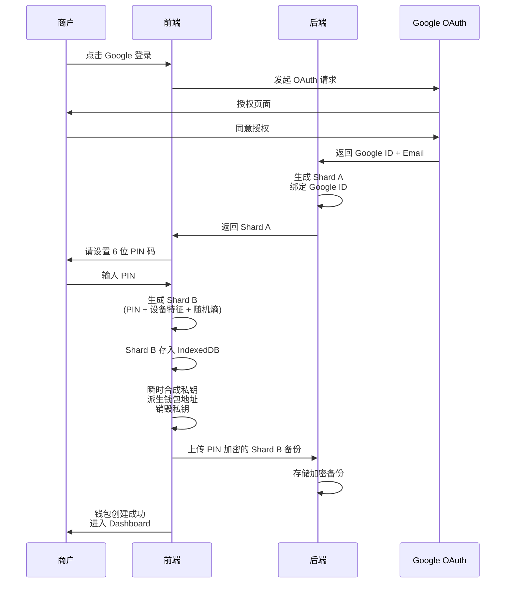
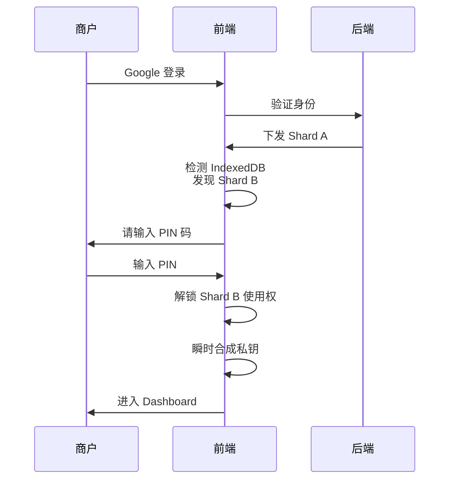
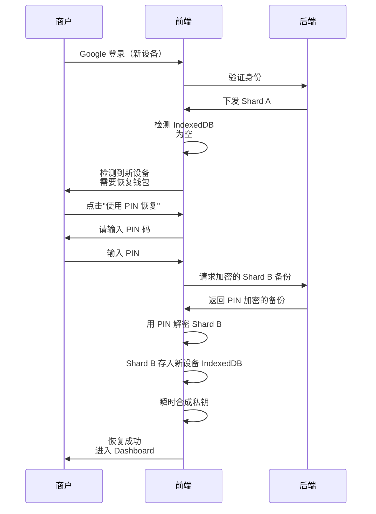

# PICA 商户认证与 MPC 钱包 PRD

**文档版本**: v2.1  
**创建日期**: 2026-01-08  
**目标受众**: 产品团队、开发团队  
**认证方式**: Google OAuth + Email OTP  
**钱包架构**: 2/2 MPC 分片模式

---

## 0. 文档说明

本文档描述 PICA 商户端第一版本的认证系统产品需求，重点阐述：
1. Google 登录与 Email OTP 的双轨认证机制
2. **2/2 MPC 钱包架构**：平台一半（Shard A）+ 用户一半（Shard B）
3. PIN 码作为本地分片的钥匙
4. 新设备恢复机制（基于加密备份）

**核心设计原则**：
> "平台只有一半（A），用户只有一半（B），只有拼在一起才能动钱。"

---

## 1. 认证方式概览

### 1.1 双轨登录机制

PICA 为 B 端商户提供两种并行的登录方式，解决不同场景下的稳定性需求：

| 登录方式         | 适用场景                        | 优势                        |
| ---------------- | ------------------------------- | --------------------------- |
| **Google OAuth** | 办公室环境、Chrome 浏览器       | 0.5秒快速登录，无需输入密码 |
| **Email OTP**    | 出差、Safari、Google 服务不稳定 | 不依赖第三方服务，仅需邮箱  |

**核心设计原则**：
- 两种方式最终关联到**同一个账户**
- 两种方式派生出**同一个钱包地址**
- 登录成功后的**权限完全一致**

### 1.2 Google OAuth 作为"身份锚点"

在 2/2 分片模式下，**Google 账号充当了身份锚点**：
- Google 登录后，后端通过 `Google ID (sub)` 识别用户
- 后端下发该用户专属的 **Shard A（服务器分片）**
- 即使用户换设备，只要 Google 账号不丢，就能取回 Shard A

---

## 2. 账户统一机制

### 2.1 账号关联：建立"数字身份证"

当商户第一次进入 PICA 时，系统通过登录方式获取关键数据：

**Google OAuth 路径**：
- `Google ID (sub)`：不可更改的唯一标识，作为身份锚点
- `Email`：商户的业务沟通地址

**Email OTP 路径**：
- `Email`：作为唯一标识

**数据库记录示例**：
```
{
  UserID: 101,
  Email: "boss@company.com",
  GoogleID: "G_998877",
  ShardA: "encrypted_server_shard_data",
  ShardB_Backup: "pin_encrypted_client_shard_backup",
  AuthMethods: ["google_oauth", "email_otp"],
  WalletAddress: "0x742d35Cc6634C0532925a3b844Bc9e7595f0bEb8",
  Status: "Active"
}
```

### 2.2 为什么要强绑定？

**防止恶意伪造**：即使有人知道商户的邮箱地址，也无法用同样的邮箱创建新账号。系统检测到邮箱已存在时，会要求验证 Google 账号或输入 OTP，防止身份冒充。

**账户唯一性**：无论商户通过哪种方式登录，系统都认定他是 `UserID 101`，确保：
- 钱包地址一致
- Shard A 绑定一致
- 订单历史一致

---

## 3. MPC 钱包生成机制（2/2 模式）

### 3.1 两分片架构

| 分片名称                        | 生成位置                               | 存储位置         | 加密方式                    | 用途                           |
| ------------------------------- | -------------------------------------- | ---------------- | --------------------------- | ------------------------------ |
| **Shard A<br/>（服务器分片）**  | 后端生成                               | PICA 后端数据库  | 服务器密钥加密（HSM）       | 与 Google 账号绑定，登录时下发 |
| **Shard B<br/>（本地分片）**    | 前端生成<br/>(PIN + 设备特征 + 随机熵) | 浏览器 IndexedDB | 不可导出，内存保护          | 用户本地持有，PIN 解锁使用权   |
| **Shard B 备份<br/>（恢复用）** | 前端生成                               | PICA 云端数据库  | **PIN 码强加密**（AES-256） | 用于新设备恢复                 |

**门限签名规则**：
- 必须 **Shard A + Shard B** 同时存在才能合成完整私钥（2/2 模式）
- 单独 1 个分片无法推导出私钥

**安全保障**：
- 黑客攻破 PICA 服务器 → 只拿到 Shard A 和加密的 Shard B 备份，没有 PIN 码无法使用
- 黑客攻破用户浏览器 → 只拿到 Shard B，无法转账
- 用户忘记 PIN → **资产永久丢失**（这是 2/2 模式的风险）

### 3.2 派生分片：定义"数学种子"

**Shard A 生成**（后端）：
```
ShardA = DeriveServerShard(GoogleID, RandomSalt)
```
- 后端在用户首次注册时立即生成
- 与 Google ID 强绑定
- 加密存储在数据库

**Shard B 生成**（前端）：
```
ShardB = DeriveClientShard(PIN, DeviceFingerprint, RandomEntropy)
```
- 前端在用户设置 PIN 时计算
- 存入 IndexedDB（设置为不可导出）
- **同时用 PIN 加密后上传备份到云端**

**钱包地址派生**：
```
PrivateKey_Temp = Combine(ShardA, ShardB)  // 仅在内存中瞬时存在
WalletAddress = DeriveAddress(PrivateKey_Temp)
销毁(PrivateKey_Temp)  // 立即从内存清除
```

---

## 4. 用户体验流程

### 4.1 首次注册流程



**Step 1：身份锚定**
- 用户通过 Google 登录
- 后端获取唯一标识（Google ID）
- 后端立即生成 **Shard A**，并将其加密存储在云端数据库，与该 Google 账号绑定

**Step 2：设置 PIN 码**
```
┌─────────────────────────────────┐
│  设置 6 位 PIN 码               │
│  ┌─┬─┬─┬─┬─┬─┐                 │
│  │ │ │ │ │ │ │                 │
│  └─┴─┴─┴─┴─┴─┘                 │
│                                 │
│  ⚠️ 重要提示：                  │
│  • PIN 码是解锁钱包的唯一钥匙    │
│  • 忘记 PIN 将永久丢失资产       │
│  • 请务必牢记或安全保管          │
└─────────────────────────────────┘
```

**Step 3：派生 Shard B（本地分片）**
- 前端在用户设置 PIN 码时，利用 **PIN 码 + 设备特征 + 随机熵** 在浏览器本地计算出 **Shard B**

**Step 4：存储与备份**
- **Shard A**：留在后端，用户看不见
- **Shard B**：存入浏览器的 IndexedDB（安全存储），并设置为"不可导出"
- **Shard B 备份**：用 PIN 码进行强加密（AES-256），上传到后端的"恢复服务器"

**Step 5：生成钱包地址**
- 前端同时调用 Shard A 和 Shard B
- 在内存中瞬时合成完整私钥
- 派生出钱包地址（0x...）
- **立即销毁内存里的完整私钥**

**Step 6：完成注册**
```
✓ 钱包地址：0x742d35Cc6634C0532925a3b844Bc9e7595f0bEb8
✓ PIN 码已设置
✓ 云端备份已完成
✓ 进入 Dashboard
```

---

### 4.2 常用设备登录（已有 Shard B）



**设备识别**：
1. 用户选择登录方式（Google 或 Email）
2. 身份验证成功，后端下发 **Shard A**
3. 前端扫描 IndexedDB，发现存在 `shard_B_boss@company.com`

**触发 PIN 验证**：
```
┌─────────────────────────────────┐
│  欢迎回来，boss@company.com      │
│                                 │
│  请输入 6 位 PIN 码解锁钱包      │
│  ┌─┬─┬─┬─┬─┬─┐                 │
│  │ │ │ │ │ │ │                 │
│  └─┴─┴─┴─┴─┴─┘                 │
│                                 │
│  [忘记 PIN? 联系客服]            │
└─────────────────────────────────┘
```

**解锁流程**：
1. 输入 PIN 码（前端本地验证）
2. 解锁 Shard B 的使用权
3. 前端已有 Shard A（刚刚从后端下发）
4. 本地瞬时合成私钥（Shard A + Shard B）
5. 进入 Dashboard
6. **15 分钟无操作自动锁定，需重新输入 PIN**

**重要交互**：
- 任何涉及资金的操作（退款、提现），都会再次要求输入 PIN 码
- PIN 码错误 5 次，锁定 30 分钟

**用户感知时间**：
```
登录 (0.5s) → 输入 PIN (2s) → 进入后台
总计：约 3 秒
```

---

### 4.3 新设备/清除缓存后恢复（基于加密备份）



**设备识别**：
1. 用户选择登录方式（Google 或 Email）
2. 身份验证成功，后端下发 **Shard A**
3. 前端扫描 IndexedDB，发现为空

**触发恢复流程**：
```
┌─────────────────────────────────┐
│  ⚠️ 检测到新设备                │
│                                 │
│  系统检测到您在此设备上没有      │
│  钱包分片，需要从云端恢复。      │
│                                 │
│  恢复方式：                     │
│  • 输入您的 6 位 PIN 码          │
│  • 系统将自动恢复钱包            │
│                                 │
│  [使用 PIN 恢复]                │
│  [联系客服]                     │
└─────────────────────────────────┘
```

**恢复流程**（用户视角）：
1. 用户点击"使用 PIN 恢复"
2. 输入 6 位 PIN 码

```
┌─────────────────────────────────┐
│  请输入您的 PIN 码恢复钱包       │
│  ┌─┬─┬─┬─┬─┬─┐                 │
│  │ │ │ │ │ │ │                 │
│  └─┴─┴─┴─┴─┴─┘                 │
│                                 │
│  [确认]                         │
└─────────────────────────────────┘
```

3. 系统显示恢复进度

```
┌─────────────────────────────────┐
│  正在恢复钱包...                │
│                                 │
│  ✓ 已获取服务器分片              │
│  ⏳ 正在解密云端备份             │
│  ⏳ 正在恢复本地分片             │
│                                 │
└─────────────────────────────────┘
```

4. 恢复成功

```
┌─────────────────────────────────┐
│  ✓ 钱包恢复成功！               │
│                                 │
│  钱包地址：                     │
│  0x742d35Cc6634C0532925a3b844... │
│                                 │
│  您现在可以正常使用钱包了        │
│                                 │
│  [进入 Dashboard]               │
└─────────────────────────────────┘
```

**技术流程（后台）**：

**Step 1：获取云端分片**
- 在新设备登录 Google，后端验证通过
- 下发 **Shard A**（服务器分片）

**Step 2：拉取加密备份**
- 用户输入 PIN 码
- 前端向后端请求 **PIN 加密的 Shard B 备份**

**Step 3：PIN 解密还原**
- 前端用 PIN 码解密 Shard B 备份
- **如果 PIN 错误，解密失败，无法恢复**

**Step 4：重新落库**
- 解密后的 Shard B 再次存入新设备的 IndexedDB
- 瞬时合成私钥，验证钱包地址正确
- 销毁内存中的完整私钥

**用户感知时间**：
```
登录 (0.5s) → 输入 PIN (2s) → 解密恢复 (3s) → 进入后台
总计：约 6 秒
```

---

### 4.4 忘记 PIN 码的处理

```
┌─────────────────────────────────┐
│  ⚠️ 无法恢复钱包                │
│                                 │
│  由于采用非托管钱包架构，        │
│  PIN 码是唯一的解密钥匙。        │
│                                 │
│  如果忘记 PIN 码，资产将永久丢失。│
│                                 │
│  您可以：                       │
│  • 重新尝试输入 PIN（剩余3次）   │
│  • 联系客服申请人工审核恢复      │
│    （需提供 KYC 材料，48小时）   │
│                                 │
│  [重新输入]  [联系客服]         │
└─────────────────────────────────┘
```

**客服人工恢复流程**（特殊情况）：
1. 用户提交工单，提供账号邮箱和身份证明
2. 客服要求上传营业执照/法人身份证
3. **多重签名审批**（需 2/3 PICA 管理员签名）
4. 后端通过 HSM 重新生成新的 Shard B
5. 用户在设备上重新设置新 PIN 码
6. 恢复完成（需 24-48 小时）

> **注意**：人工恢复仅作为极端情况的兜底方案，不应作为常规流程。

---

## 5. 安全性分析

### 5.1 风险点与应对机制

| 风险场景               | 黑客能拿到什么                | 系统如何防御                                            | 结果                           |
| ---------------------- | ----------------------------- | ------------------------------------------------------- | ------------------------------ |
| **Google 账号被盗**    | Shard A                       | 黑客没有用户的 Shard B（在用户浏览器），也不知道 PIN 码 | ❌ 无法转账                     |
| **邮箱被盗**           | 收到 OTP 验证码               | 同上，没有 Shard B 或 PIN 码                            | ❌ 只能看登录界面，无法动用资产 |
| **PICA 服务器被黑**    | Shard A + 加密的 Shard B 备份 | PIN 码不在服务器，无法解密 Shard B 备份                 | ❌ 无法合成私钥                 |
| **用户浏览器被黑**     | Shard B                       | 没有 Shard A（需 Google 登录获取）                      | ❌ 无法转账                     |
| **用户忘记 PIN**       | 无                            | **资产永久丢失**（2/2 模式风险）                        | ❌ 需客服人工恢复（48小时）     |
| **用户换新电脑**       | 无                            | Google 登录 + PIN 解密云端备份                          | ✅ 6 秒恢复                     |
| **用户清除浏览器缓存** | Shard B 丢失                  | 同"换新电脑"，从云端恢复                                | ✅ 6 秒恢复                     |

### 5.2 门限签名的数学保障（2/2 模式）

**攻击者的必要条件**：
要成功盗取资产，攻击者必须**同时**满足：

- ✓ 攻破 PICA 服务器（拿到 Shard A）
- ✓ 攻破用户浏览器（拿到 Shard B）

**或者**：

- ✓ 攻破 PICA 服务器（拿到 Shard A + 加密的 Shard B 备份）
- ✓ 知道用户的 PIN 码（暴力破解 6 位数字需要 100 万次尝试）

**现实难度**：
- Shard A、Shard B 分别存储在**物理隔离**的系统中
- PIN 码**不存储**在任何服务器，仅存在于用户大脑中
- 加密的 Shard B 备份使用 AES-256，破解需要天文时间

**PIN 码的防护作用**：
- **解密钥匙**：加密/解密 Shard B 备份的唯一钥匙
- **会话锁**：15 分钟无操作自动锁定，需重新输入
- **操作确认**：退款、提现等关键操作二次确认

---

## 6. 产品优势总结

### 6.1 对商户的价值

| 传统方案             | PICA 2/2 MPC 方案             | 优势           |
| -------------------- | ----------------------------- | -------------- |
| 助记词抄在纸上       | 无需抄写任何内容，PIN 码即可  | ✅ 降低丢失风险 |
| 私钥存在 USB         | 云端加密备份，换设备 6 秒恢复 | ✅ 提高容灾能力 |
| MetaMask 弹窗        | 内置钱包，无需安装插件        | ✅ 降低操作门槛 |
| 单点故障             | 双分片架构，缺一不可          | ✅ 提高安全性   |
| Google 登录 + PIN 码 | 3 秒进入后台                  | ✅ 极致体验     |

### 6.2 对 PICA 的价值

**用户体验**：
- Google 登录：0.5 秒完成身份验证
- 常用设备：3 秒进入后台
- 新设备：6 秒完成恢复

**安全等级**：
- 通过 2/2 MPC 技术达到**非托管钱包**安全标准
- 即使 PICA 服务器被攻破，用户资产仍然安全（没有 PIN 无法解密）

**合规性**：
- 符合 GDPR（用户可删除云端备份）
- 符合非托管钱包定义（PICA 无法单方面动用资产）

---

## 7. 实施要点

### 7.1 Google OAuth 集成

**前提条件**：
- 已完成 Google Cloud Console 配置
- 已获得 Client ID 和 Client Secret

**核心需求**：
- 支持 popup 窗口模式
- 支持获取用户 Email 和 Google ID (sub)
- Google ID 作为身份锚点

### 7.2 Email OTP 集成

**前提条件**：
- 系统已集成邮件服务（SendGrid/AWS SES）

**核心需求**：
- 6 位数字 OTP，10 分钟有效期
- 同一邮箱 1 小时内最多发送 5 次

### 7.3 MPC 钱包服务

**核心功能**：
1. **Shard A 生成与存储**：
   - 后端生成，HSM 加密
   - 与 Google ID 绑定
   
2. **Shard B 生成**（前端）：
   - 基于 PIN + 设备特征 + 随机熵
   - 存入 IndexedDB（不可导出）
   - **PIN 加密后上传备份**
   
3. **门限签名**：
   - 2/2 模式，Shard A + Shard B 合成私钥
   - 仅在内存中瞬时存在，立即销毁
   
4. **恢复机制**：
   - 拉取加密备份
   - PIN 解密
   - 重新存入新设备

### 7.4 PIN 码管理

**核心需求**：
1. 6 位数字，易记易输
2. 用于加密/解密 Shard B 备份（AES-256）
3. 错误 5 次锁定 30 分钟
4. **不存储在任何服务器**

---

## 8. 后续优化方向

### 8.1 第二版本（引入 Shard C）

- [ ] 支持 3/3 或 2/3 模式
- [ ] Shard C 作为安全密码保护的恢复分片
- [ ] 降低 PIN 码丢失的风险

### 8.2 中期优化

- [ ] 支持生物识别（Face ID / Touch ID）替代 PIN 码输入
- [ ] 支持社交恢复（指定 3-5 个信任联系人）
- [ ] 支持硬件钱包集成（Ledger / Trezor）

### 8.3 长期愿景

- [ ] 支持 Passkey（WebAuthn）替代密码
- [ ] 支持跨链钱包（一个账户管理多链资产）
- [ ] 支持 DID（去中心化身份）

---

## 9. 风险提示与用户教育

### 9.1 注册时的强提示

在用户设置 PIN 码时，必须显示清晰的风险提示：

```
┌─────────────────────────────────┐
│  ⚠️ 重要安全提示                │
│                                 │
│  PIN 码是您钱包的唯一钥匙：      │
│                                 │
│  √ 用于解锁钱包                  │
│  √ 用于新设备恢复                │
│  √ 用于所有资金操作              │
│                                 │
│  请务必：                       │
│  • 使用您能牢记的 6 位数字       │
│  • 不要与他人分享                │
│  • 如果忘记，资产可能永久丢失    │
│                                 │
│  □ 我已理解并同意               │
│                                 │
│  [继续设置]                     │
└─────────────────────────────────┘
```

### 9.2 Dashboard 安全提示

在用户首次进入 Dashboard 时，显示安全建议：

```
┌─────────────────────────────────┐
│  安全建议                       │
│                                 │
│  √ 请在常用设备上操作            │
│  √ 牢记您的 6 位 PIN 码          │
│  √ 请勿清除浏览器缓存            │
│    （会删除本地钱包分片）        │
│                                 │
│  [我知道了]                     │
└─────────────────────────────────┘
```

---

## 10. 参考资料

- MPC 技术白皮书：[Threshold Signatures](https://eprint.iacr.org/2019/114.pdf)
- Google OAuth 2.0 文档
- NIST 密码学标准（AES-256）
- 非托管钱包安全最佳实践
