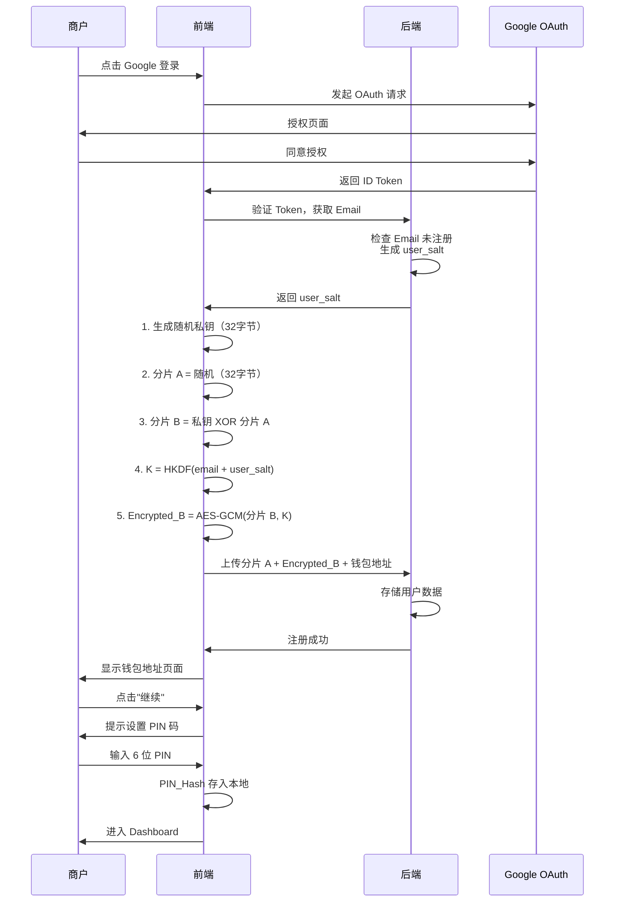
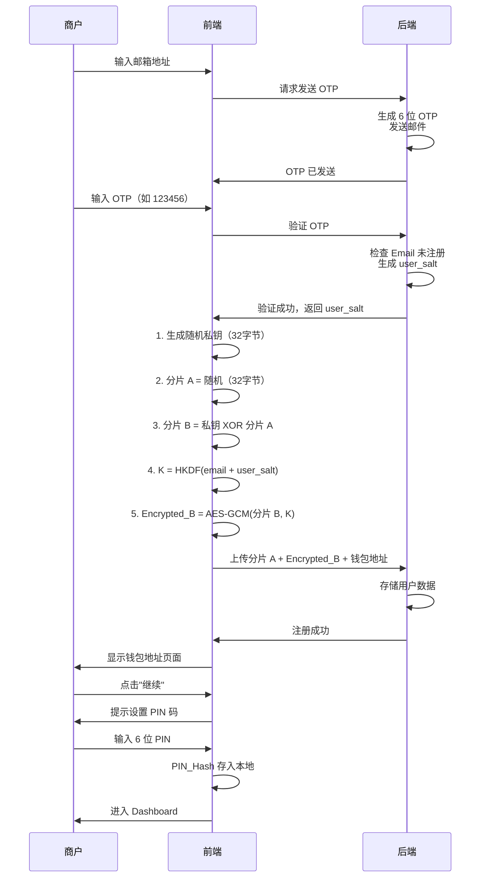
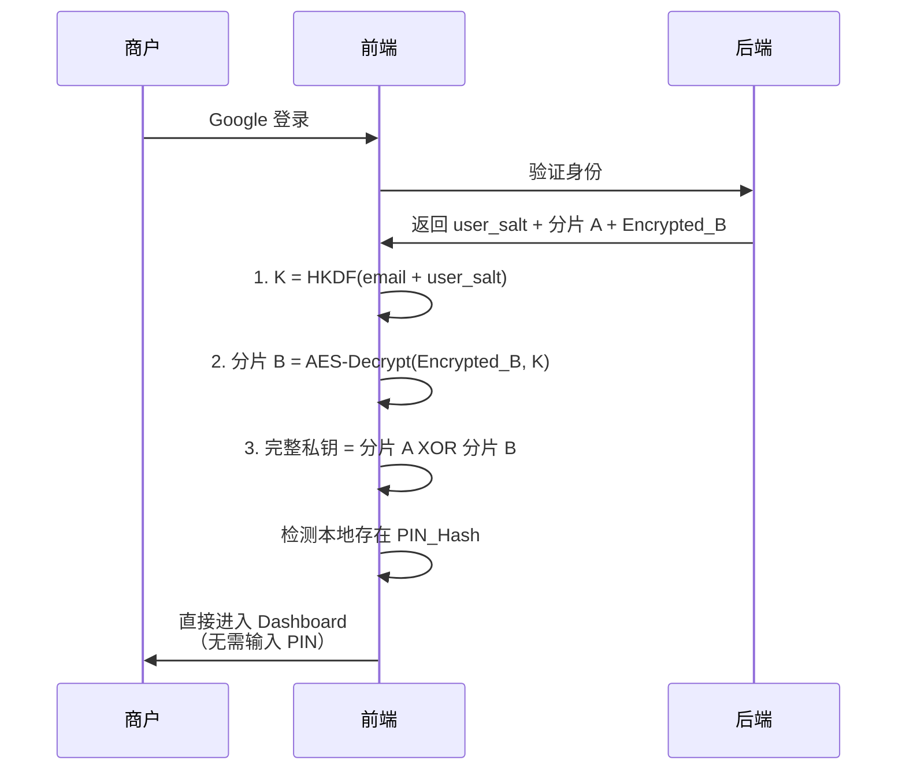
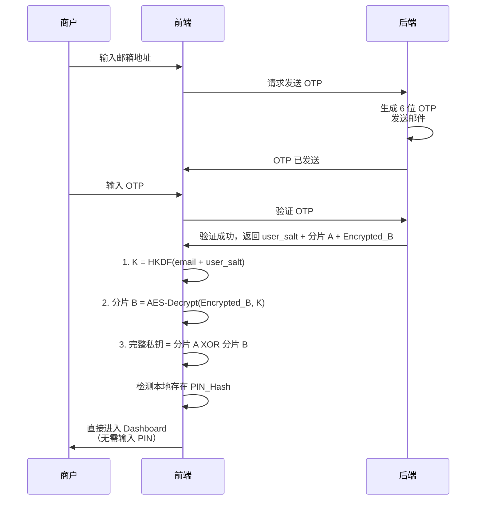
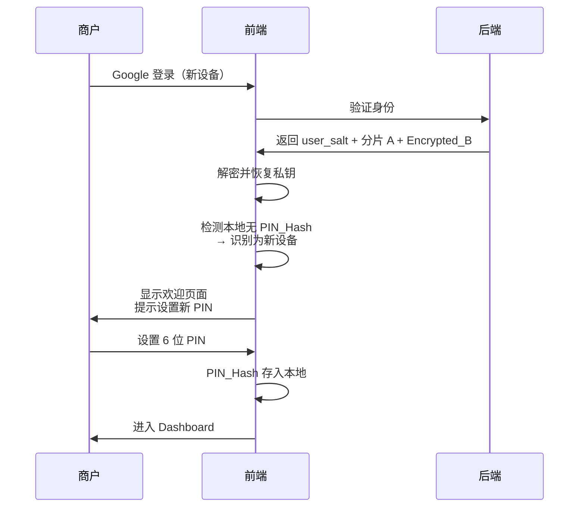
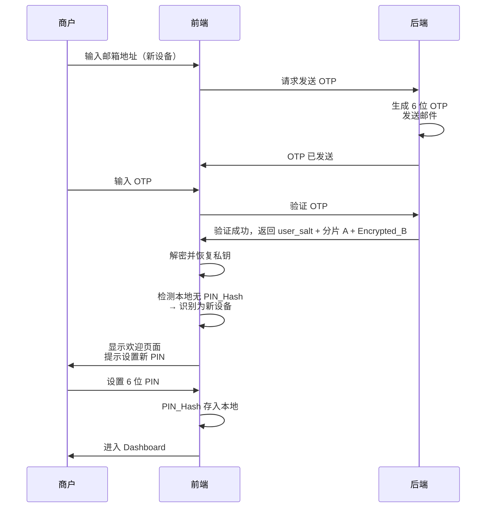

# PICA 商户认证与 MPC 钱包 PRD v3.0

**文档版本**: v3.0  
**创建日期**: 2026-01-09  
**目标受众**: 产品团队、开发团队  
**认证方式**: Google OAuth + Email OTP  
**钱包架构**: 2/2 分片模式（XOR 分片 + HKDF 密钥派生）

---

## 0. 文档说明

本文档描述 PICA 商户端新版认证系统产品需求，核心特点：
1. **统一密钥派生**：Email + user_salt 派生加密密钥，Google 和邮箱登录共享同一解密逻辑
2. **2/2 分片架构**：分片 A（后端存储）+ 加密的分片 B（后端存储，用户密钥加密）
3. **PIN 与私钥解耦**：PIN 码仅用于本地操作授权，不参与私钥生成或恢复
4. **设备级 PIN 管理**：每个设备独立设置 PIN，新设备需重新设置

**核心设计原则**：
> "私钥生成与 PIN 完全解耦。用户先看到钱包，再设置 PIN。PIN 忘记不影响资产安全。"

---

## 1. 认证方式概览

### 1.1 双轨登录机制

PICA 为 B 端商户提供两种并行的登录方式：

| 登录方式         | 适用场景                        | 优势                        |
| ---------------- | ------------------------------- | --------------------------- |
| **Google OAuth** | 办公室环境、Chrome 浏览器       | 0.5秒快速登录，无需输入密码 |
| **Email OTP**    | 出差、Safari、Google 服务不稳定 | 不依赖第三方服务，仅需邮箱  |

**核心设计原则**：
- 两种方式关联到**同一个账户**（以 Email 为唯一标识）
- 两种方式使用**同一个加密密钥**（HKDF(email + user_salt)）
- 两种方式恢复**同一个钱包地址**
- 登录成功后的**权限完全一致**

### 1.2 Email 作为"身份锚点"

在新架构下，**Email 是统一的身份标识**：
- 无论通过 Google OAuth 还是邮箱 OTP 登录，系统都通过 Email 识别用户
- 加密密钥通过 `HKDF(email + user_salt)` 派生
- Google 和邮箱登录共享同一个加密的分片 B

---

## 2. 密钥派生与分片存储

### 2.1 统一密钥派生方案

**核心公式**：
```
加密密钥 K = HKDF-SHA256(
    输入密钥材料 = email(小写) + user_salt,
    盐 = "PICA_WALLET_SHARD_B_V1",
    信息 = "shard_b_encryption_key",
    输出长度 = 32 字节
)
```

**关键参数**：
- `email`：用户邮箱地址（小写规范化）
- `user_salt`：用户注册时后端生成的16字节随机值
- 加密算法：AES-256-GCM（带认证的加密）

**为什么这样设计**：
- Google 登录和邮箱登录使用相同的 `email + user_salt`
- 无论用户用哪种方式登录，都能派生出相同的密钥 K
- 用户可以无缝切换登录方式，不需要复杂的"绑定"流程

### 2.2 分片存储架构

| 分片名称           | 生成位置 | 存储位置   | 加密方式                     | 用途                     |
| ------------------ | -------- | ---------- | ---------------------------- | ------------------------ |
| **分片 A**         | 前端生成 | 后端数据库 | 可选：后端主密钥加密         | 私钥的一半               |
| **加密后的分片 B** | 前端生成 | 后端数据库 | HKDF(email + user_salt) 加密 | 私钥的另一半（加密存储） |
| **user_salt**      | 后端生成 | 后端数据库 | 明文存储                     | 用于密钥派生             |

**私钥分片方式**：XOR 分割
```
分片 A = 随机生成的 32 字节
分片 B = 完整私钥 XOR 分片 A
完整私钥 = 分片 A XOR 分片 B
```

**门限规则**：
- 必须 **分片 A + 分片 B** 同时存在才能恢复完整私钥
- 单独的分片无法推导出私钥
- 攻击者必须同时获得分片 A 和解密密钥 K 才能恢复私钥

### 2.3 后端数据模型

```sql
CREATE TABLE users (
    user_id VARCHAR(255) PRIMARY KEY,  -- email（主键）
    google_sub VARCHAR(255) UNIQUE NULL,  -- Google 用户唯一 ID
    user_salt VARCHAR(64) NOT NULL,  -- 16字节随机值的 Base64 编码
    shard_a TEXT NOT NULL,  -- 分片 A
    encrypted_shard_b TEXT NOT NULL,  -- 加密后的分片 B
    wallet_address VARCHAR(42) NOT NULL,  -- 0x 开头的以太坊地址
    created_at TIMESTAMP DEFAULT CURRENT_TIMESTAMP,
    last_login_at TIMESTAMP,
    last_login_method VARCHAR(20)  -- 'google' 或 'email'
);
```

---

## 3. PIN 码的角色重新定义

### 3.1 PIN 的本质定位

**PIN 不是**：
- ❌ 钱包的"密码"（不参与加密/解密）
- ❌ 恢复钱包的凭证（恢复依赖 OAuth/OTP）
- ❌ 钱包的必要组成部分（没有 PIN 钱包仍然存在）

**PIN 是**：
- ✅ 本地设备的操作授权凭证
- ✅ 便捷性和安全性的平衡点（避免每次都 OAuth）
- ✅ 防止设备丢失后的临时保护措施
- ✅ 可选的快捷验证方式（可以不设置，只是体验差）

### 3.2 PIN 的存储方式

**本地存储**（每台设备独立）：
```
PIN_Hash = PBKDF2-HMAC-SHA256(PIN, email, 10000 iterations)
存储位置：浏览器 localStorage 或 IndexedDB
```

**PIN 不上传到服务器**：
- 服务器无法验证 PIN
- 服务器无法重置 PIN
- 忘记 PIN 只需重新通过 OAuth/OTP 登录，设置新 PIN

### 3.3 PIN 的使用场景

| 场景           | 是否需要 PIN | 说明                         |
| -------------- | ------------ | ---------------------------- |
| 登录（Google） | ❌ 不需要     | OAuth 已验证身份             |
| 登录（邮箱）   | 可选         | OTP 已验证身份，但可要求 PIN |
| 转账操作       | ✅ 需要       | 敏感操作需要二次确认         |
| 签名交易       | ✅ 需要       | 敏感操作需要二次确认         |
| 导出私钥       | ✅ 需要       | 高危操作需要多重验证         |
| 新设备登录     | 需设置新 PIN | 每个设备独立的 PIN           |

---

## 4. 用户体验流程

### 4.1 首次注册流程

#### 4.1.1 Google OAuth 注册



#### 4.1.2 邮箱 OTP 注册



**关键点**：邮箱 OTP 注册流程与 Google OAuth 注册流程在钱包生成步骤（步骤 1-5）完全一致，因为两种方式使用相同的密钥派生公式 `HKDF(email + user_salt)`。

#### 4.1.3 关键时序

1. **T0**: 用户完成 Google/邮箱验证
2. **T1**: 后端返回 user_salt
3. **T2-T6**: 前端生成私钥、分片、加密、上传
4. **T7**: 前端显示钱包地址 ← **用户第一次看到成果**
5. **T8**: 提示用户设置 PIN ← **PIN 设置在钱包生成之后**
6. **T9**: 进入钱包主界面

**注册成功页面**：
```
┌─────────────────────────────────┐
│  ✅ 钱包创建成功!               │
│                                 │
│  你的钱包地址：                  │
│  0x742d35Cc6634C0532925a3b844...│
│                                 │
│  [复制地址] [继续]              │
└─────────────────────────────────┘
```

**PIN 设置页面**：
```
┌─────────────────────────────────┐
│  🔐 为此设备设置操作密码         │
│                                 │
│  请设置 6 位数字 PIN 码          │
│  ┌─┬─┬─┬─┬─┬─┐                 │
│  │ │ │ │ │ │ │                 │
│  └─┴─┴─┴─┴─┴─┘                 │
│                                 │
│  用途：                         │
│  • 转账时需要输入                │
│  • 签名交易时需要输入            │
│                                 │
│  忘记 PIN 可通过邮箱/Google 重新登录 │
│                                 │
│  [设置 PIN] [暂不设置]          │
└─────────────────────────────────┘
```

---

### 4.2 常用设备登录（已有 PIN）

#### 4.2.1 Google OAuth 登录



**用户感知时间**：
```
Google 登录 (0.5s) → 解密恢复 (0.3s) → 进入后台
总计：约 1 秒
```

#### 4.2.2 邮箱 OTP 登录



**用户感知时间**：
```
输入邮箱 (2s) → 等待 OTP (5-10s) → 输入 OTP (3s) → 解密恢复 (0.3s) → 进入后台
总计：约 10-15 秒
```

#### 4.2.3 敏感操作时的 PIN 验证

无论使用哪种登录方式，执行转账等敏感操作时都需要 PIN 验证：

```
┌─────────────────────────────────┐
│  🔐 请输入 PIN 确认转账          │
│                                 │
│  向 0xABC...DEF 发送 1.5 ETH    │
│                                 │
│  ┌─┬─┬─┬─┬─┬─┐                 │
│  │ │ │ │ │ │ │                 │
│  └─┴─┴─┴─┴─┴─┘                 │
│                                 │
│  [取消] [确认]                  │
└─────────────────────────────────┘
```

---

### 4.3 新设备登录

#### 4.3.1 Google OAuth 新设备登录



**用户感知时间**：
```
Google 登录 (0.5s) → 解密恢复 (0.3s) → 设置 PIN (3s) → 进入后台
总计：约 4 秒
```

#### 4.3.2 邮箱 OTP 新设备登录



**用户感知时间**：
```
输入邮箱 (2s) → 等待 OTP (5-10s) → 输入 OTP (3s) → 解密恢复 (0.3s) → 设置 PIN (3s) → 进入后台
总计：约 13-18 秒
```

#### 4.3.3 新设备欢迎页面

```
┌─────────────────────────────────┐
│  👋 欢迎回来！                  │
│                                 │
│  检测到你已有钱包：              │
│  0x742d35Cc6634C0532925a3b844...│
│                                 │
│  请为此设备设置新的操作密码       │
│                                 │
│  [设置 PIN] [暂不设置]          │
└─────────────────────────────────┘
```

**关键点**：
- 新设备不是"重新注册"，而是"为新设备设置 PIN"
- 强调"此设备"的概念，让用户理解 PIN 是设备级的
- 每个设备的 PIN 可以不同，互不影响

---

### 4.4 忘记 PIN 的处理

**场景**：用户在老设备输入 PIN 错误 5 次

```
┌─────────────────────────────────┐
│  🔒 PIN 已锁定                  │
│                                 │
│  连续输入错误 5 次，已锁定       │
│                                 │
│  你可以通过以下方式重新获得访问：│
│                                 │
│  [通过 Google 重新登录]         │
│  [通过邮箱验证码登录]           │
└─────────────────────────────────┘
```

**处理流程**：
1. 清除当前会话（内存中的私钥）
2. 清除本地的 PIN_Hash
3. 重新走 OAuth/OTP 登录流程
4. 按照"新设备登录"流程设置新 PIN

**关键点**：
- 忘记 PIN **不会导致资产丢失**
- 实质是"清除本地 PIN → 重新验证身份 → 重新设置 PIN"
- 相当于把当前设备当作"新设备"处理

---

## 5. 安全性分析

### 5.1 三层安全机制

| 层级   | 机制                      | 作用                         | 是否必需 |
| ------ | ------------------------- | ---------------------------- | -------- |
| 第一层 | 身份验证（OAuth/OTP）     | 证明"你是账户的拥有者"       | ✅ 是     |
| 第二层 | 分片加密（HKDF 派生密钥） | 保护分片 B，防止后端泄露     | ✅ 是     |
| 第三层 | PIN 码（本地操作授权）    | 快速验证，防止设备丢失后滥用 | ❌ 可选   |

### 5.2 风险点与应对机制

| 风险场景            | 攻击者能拿到什么                 | 系统如何防御                                | 结果             |
| ------------------- | -------------------------------- | ------------------------------------------- | ---------------- |
| **Google 账号被盗** | 可登录获取分片                   | 攻击者不知道 email + user_salt 的组合方式   | ⚠️ 可能被盗       |
| **邮箱被盗**        | 可收到 OTP 验证码                | 同上                                        | ⚠️ 可能被盗       |
| **后端数据库被黑**  | 分片 A + Encrypted_B + user_salt | 没有 email 无法派生 K（email 来自认证过程） | ❌ 无法解密分片 B |
| **用户设备被盗**    | 本地 PIN_Hash                    | 没有 OAuth/OTP 无法获取分片                 | ❌ 无法恢复私钥   |
| **用户忘记 PIN**    | 无                               | 重新 OAuth/OTP 登录，设置新 PIN             | ✅ 资产安全       |
| **用户换新电脑**    | 无                               | OAuth/OTP 登录恢复，设置新设备 PIN          | ✅ 4 秒恢复       |

**最严重风险**：
- 如果攻击者同时控制了用户的 **Google 账号/邮箱**，就能恢复私钥
- 这是所有基于身份验证的钱包系统的共同风险

**缓解措施**：
1. 建议用户开启 Google 两步验证
2. 敏感操作发送邮件通知
3. 可选：引入硬件密钥（YubiKey）作为第二因素

### 5.3 与传统方案的对比

| 传统方案       | PICA 新方案                       | 优势           |
| -------------- | --------------------------------- | -------------- |
| 助记词抄在纸上 | 无需抄写，OAuth/OTP 即可恢复      | ✅ 降低丢失风险 |
| 私钥存在 USB   | 云端加密存储，换设备 4 秒恢复     | ✅ 提高容灾能力 |
| MetaMask 弹窗  | 内置钱包，无需安装插件            | ✅ 降低操作门槛 |
| PIN 参与加密   | PIN 与私钥解耦，忘记 PIN 不丢资产 | ✅ 降低丢失风险 |

---

## 6. 实施要点

### 6.1 前端密码学库

**推荐使用 Web Crypto API**：
- `crypto.getRandomValues()`：生成随机私钥和分片
- `crypto.subtle.deriveKey()`：HKDF 密钥派生
- `crypto.subtle.encrypt()/decrypt()`：AES-GCM 加密解密

**核心函数**：
```typescript
// 密钥派生
async function deriveKeyFromEmailAndSalt(email: string, userSalt: string): Promise<CryptoKey>

// 分片生成
async function generateWalletForRegistration(email: string, userSalt: string): Promise<{
    privateKey: string;
    walletAddress: string;
    shardA: string;
    encryptedShardB: string;
}>

// 钱包恢复
async function recoverWalletForLogin(
    email: string,
    userSalt: string,
    shardA: string,
    encryptedShardB: string
): Promise<{ privateKey: string; walletAddress: string }>

// PIN 哈希
async function hashPinForStorage(pin: string, email: string): Promise<string>
async function verifyPinHash(pin: string, email: string, storedHash: string): Promise<boolean>
```

### 6.2 后端 API

**用户注册**：
```
POST /api/auth/register
Request:
{
    "email": "user@example.com",
    "google_sub": "G_123456789",  // 可选
    "shard_a": "base64...",
    "encrypted_shard_b": "base64...",
    "wallet_address": "0x..."
}
Response:
{
    "success": true,
    "user_id": "user@example.com"
}
```

**检查用户**：
```
POST /api/auth/check-user
Request:
{
    "email": "user@example.com"
}
Response:
{
    "is_new": true,
    "user_salt": "base64..."  // 新用户才返回
}
```

**获取分片**：
```
POST /api/auth/get-shards
Request:
{
    "email": "user@example.com",
    "auth_token": "..."  // OAuth token 或 OTP session
}
Response:
{
    "user_salt": "base64...",
    "shard_a": "base64...",
    "encrypted_shard_b": "base64...",
    "wallet_address": "0x..."
}
```

### 6.3 模拟器逻辑

**场景控制**：
- **用户类型**：由 localStorage 中的注册表自动判断（新用户 vs 老用户）
- **设备场景**：由模拟器选择（新设备 vs 常用设备）

```
模拟器选项：
┌─────────────────────────────────┐
│  模拟设备场景：                  │
│  用户类型由 localStorage 决定    │
│                                 │
│  ○ 新设备（模拟未存储 PIN）      │
│  ● 常用设备（模拟已存储 PIN）    │
│                                 │
│  [🔄 重置 Demo 数据]            │
└─────────────────────────────────┘
```

---

## 7. 后续优化方向

### 7.1 短期优化

- [ ] 支持生物识别（Face ID / Touch ID）替代 PIN 码输入
- [ ] 敏感操作的邮件/推送通知
- [ ] 登录设备管理（查看/移除已授权设备）

### 7.2 中期优化

- [ ] 导出私钥功能（多重验证保护）
- [ ] 备份文件下载（加密的分片 B 本地副本）
- [ ] 支持硬件密钥（YubiKey）作为第二因素

### 7.3 长期愿景

- [ ] 支持 Passkey（WebAuthn）替代 PIN 码
- [ ] 支持多签钱包（需要多个设备/人员授权）
- [ ] 支持社交恢复（指定 3-5 个信任联系人）

---

## 8. 风险提示与用户教育

### 8.1 注册时的安全提示

```
┌─────────────────────────────────┐
│  🔐 安全提示                    │
│                                 │
│  你的钱包安全取决于：            │
│                                 │
│  1. Google/邮箱账号的安全        │
│     • 建议开启两步验证           │
│     • 不要与他人共享密码         │
│                                 │
│  2. 设备的安全                   │
│     • 不要在公共设备上登录       │
│     • 离开时请退出登录           │
│                                 │
│  □ 我已理解并同意               │
│                                 │
│  [继续]                         │
└─────────────────────────────────┘
```

### 8.2 Dashboard 安全提示

在用户首次进入 Dashboard 时：

```
┌─────────────────────────────────┐
│  安全建议                       │
│                                 │
│  ✓ 已为此设备设置操作密码        │
│  ✓ 转账等操作需要输入 PIN       │
│                                 │
│  建议：                         │
│  • 定期检查登录设备              │
│  • 大额转账前确认地址            │
│  • 开启邮件通知                  │
│                                 │
│  [我知道了]                     │
└─────────────────────────────────┘
```

---

## 9. 参考资料

- HKDF 标准：[RFC 5869](https://tools.ietf.org/html/rfc5869)
- AES-GCM 标准：[NIST SP 800-38D](https://csrc.nist.gov/publications/detail/sp/800-38d/final)
- Web Crypto API：[MDN 文档](https://developer.mozilla.org/en-US/docs/Web/API/Web_Crypto_API)
- PBKDF2 标准：[RFC 2898](https://tools.ietf.org/html/rfc2898)
- Google OAuth 2.0：[官方文档](https://developers.google.com/identity/protocols/oauth2)
