# PICA 商户认证与 MPC 钱包 PRD v3.0

**文档版本**: v3.2
**创建日期**: 2026-01-09
**更新日期**: 2026-02-03
**目标受众**: 产品团队、开发团队
**认证方式**: Google OAuth + Email OTP
**钱包架构**: KMS 托管式钱包（云端加密存储）

---

## 变更记录
| 日期       | 版本 | 变更内容                                                             | 修改人      |
| ---------- | ---- | -------------------------------------------------------------------- | ----------- |
| 2026-01-21 | v3.1 | 增加 POS-First 接入机制 (1.3)、Wallet Login 同步逻辑及云端主权 (4.6) | Antigravity |
| 2026-02-03 | v3.2 | 抽象化分片机制，使用KMS服务代替详细的密码学实现步骤                  | Antigravity |

---

## 0. 文档说明

本文档描述 PICA 商户端新版认证系统产品需求，核心特点：

1. **双轨认证机制**：支持 Google OAuth 和 Email OTP 两种登录方式
2. **KMS 托管钱包**：私钥由 KMS 服务管理，云端加密存储，用户无需记忆助记词
3. **PIN 与私钥解耦**：PIN 码仅用于本地操作授权，不参与私钥生成或恢复
4. **设备级 PIN 管理**：每个设备独立设置 PIN，新设备需重新设置

**核心设计原则**：

> "私钥生成与 PIN 完全解耦。用户先看到钱包，再设置 PIN。PIN 忘记不影响资产安全。"

---

## 1. 认证方式概览

### 1.1 双轨登录机制

PICA 为 B 端商户提供两种并行的登录方式：

| 登录方式         | 适用场景                        | 优势                       |
| ---------------- | ------------------------------- | -------------------------- |
| **Google OAuth** | 办公室环境、Chrome 浏览器       | 一键登录，安全便捷         |
| **Email OTP**    | 出差、Safari、Google 服务不稳定 | 不依赖第三方服务，仅需邮箱 |

**核心设计原则**：

- 两种方式关联到**同一个账户**（以 Email 为唯一标识）
- 两种方式使用**同一个 KMS 密钥标识**（基于 Email）
- 两种方式恢复**同一个钱包地址**
- 登录成功后的**权限完全一致**
- **智能账号绑定**：通过邮箱注册的用户可自动绑定 Google 账号，实现无缝快速登录

**Google OAuth 安全配置**：

- Yes 使用 `prompt=select_account` 参数，每次登录都需要用户在 Google 页面确认
- Yes 防止静默登录，避免误操作
- Yes 用户需主动选择账号并点击"继续"按钮
- No 不需要额外的 PIN 验证（Google 确认页已提供足够安全保障）

**Email PIN 快捷登录**：

- Yes 老设备使用 PIN 代替 OTP（省成本，快速）
- Yes 新设备强制设置 PIN（为下次快捷登录做准备）
- Yes 忘记 PIN 可通过 OTP 重置

### 1.2 Email 作为"身份锚点"

在新架构下，**Email 是统一的身份标识**：

- 无论通过 Google OAuth 还是邮箱 OTP 登录，系统都通过 Email 识别用户
- KMS 服务使用 Email 作为密钥标识符
- Google 和邮箱登录恢复的是同一个钱包

### 1.3 POS-First 接入机制 (Hardware-Centric)

针对先有 POS 设备、后有 Web Portal 需求的商户，提供专属接入路径：

- **Wallet Login 登录**：商户在 Web 端直接通过 "Connect Wallet" 登录（连接 POS 同源钱包或管理员钱包）。
- **零干扰同步**：此类商户无需 Email 注册流程，直接以 Wallet 为身份标识。
- **配置进阶**：
  - **Standalone (单机模式)**：POS 初始开机时，配置极简，从小票到限额均使用本地/默认设置，实现极致开箱即用。
  - **Managed (云端管理)**：一旦通过 Wallet 登录 Web Portal 完成登记，POS 自动同步云端设置，实现主权切换。

---

## 2. KMS 钱包管理

### 2.1 KMS 服务职责

**核心功能**：

- **钱包生成**：为新用户创建钱包（生成私钥、派生地址）
- **钱包恢复**：为老用户恢复钱包（通过身份验证后还原私钥）
- **密钥保护**：确保私钥安全存储，防止泄露

**关键特性**：

- Google 登录和邮箱登录使用相同的身份标识（Email）
- 无论用户用哪种方式登录，都能恢复同一个钱包
- 用户可以无缝切换登录方式，不需要复杂的"绑定"流程

### 2.2 后端数据模型

```sql
CREATE TABLE users (
    user_id VARCHAR(255) PRIMARY KEY,  -- email（主键）
    google_sub VARCHAR(255) UNIQUE NULL,  -- Google 用户唯一 ID
    user_salt VARCHAR(64) NOT NULL,  -- 用于 KMS 密钥派生的随机盐值
    kms_data TEXT NOT NULL,  -- KMS 加密存储的钱包数据
    wallet_address VARCHAR(42) NOT NULL,  -- 0x 开头的以太坊地址
    created_at TIMESTAMP DEFAULT CURRENT_TIMESTAMP,
    last_login_at TIMESTAMP,
    last_login_method VARCHAR(20)  -- 'google' 或 'email'
);
```

**字段说明**：

- `user_salt`：每个用户的唯一随机值，用于 KMS 服务生成和还原钱包
- `kms_data`：KMS 服务返回的加密钱包数据（内部结构对前端和后端透明）
- `wallet_address`：钱包地址，用于快速查询和校验

---

## 3. PIN 码的角色重新定义

### 3.1 PIN 的本质定位

**PIN 不是**：

- No 钱包的"密码"（不参与加密/解密）
- No 恢复钱包的凭证（恢复依赖 OAuth/OTP）
- No 钱包的必要组成部分（没有 PIN 钱包仍然存在）

**PIN 是**：

- Yes 本地设备的操作授权凭证
- Yes 便捷性和安全性的平衡点（避免每次都 OAuth）
- Yes 防止设备丢失后的临时保护措施
- Yes 可选的快捷验证方式（可以不设置，只是体验差）

### 3.2 PIN 的存储方式

**本地存储**（每台设备独立）：

```
PIN_Hash = PBKDF2-HMAC-SHA256(PIN, email, 10000 iterations)
存储位置：浏览器 localStorage 或 IndexedDB
```

**PIN 不上传到服务器**：

- 服务器无法验证 PIN
- 服务器无法重置 PIN
- 忘记 PIN 只需重新通过 OAuth/OTP 登录，设置新 PIN

### 3.3 PIN 的使用场景

| 场景           | 是否需要 PIN | 说明                         |
| -------------- | ------------ | ---------------------------- |
| 登录（Google） | No 不需要    | OAuth 已验证身份             |
| 登录（邮箱）   | 可选         | OTP 已验证身份，但可要求 PIN |
| 转账操作       | Yes 需要     | 敏感操作需要二次确认         |
| 签名交易       | Yes 需要     | 敏感操作需要二次确认         |
| 导出私钥       | Yes 需要     | 高危操作需要多重验证         |
| 新设备登录     | 需设置新 PIN | 每个设备独立的 PIN           |

---

## 4. 用户体验流程

### 4.1 首次注册流程

#### 4.1.1 Google OAuth 注册

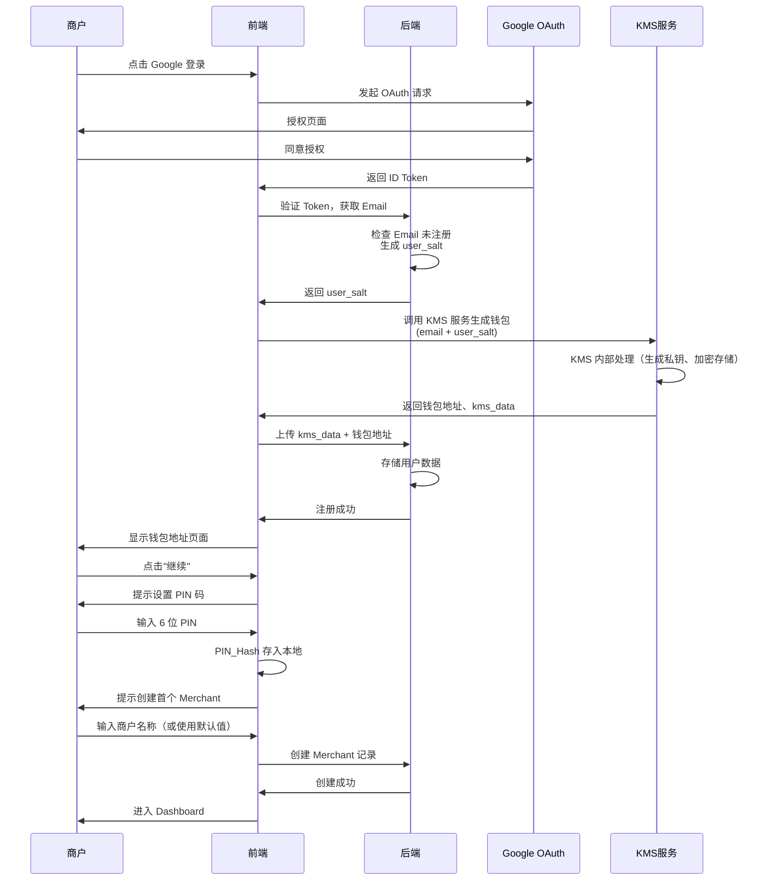

#### 4.1.2 邮箱 OTP 注册

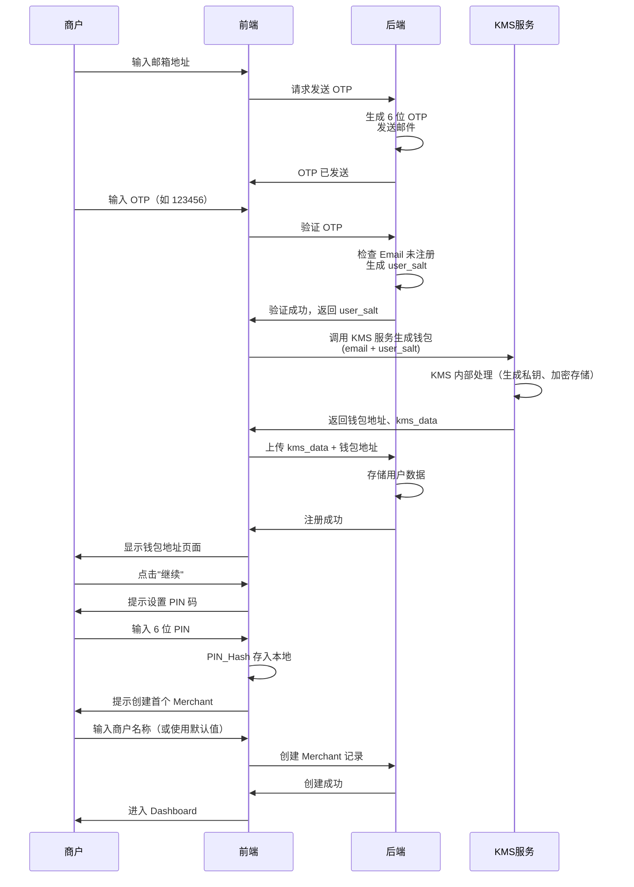

**关键点**：邮箱 OTP 注册流程与 Google OAuth 注册流程在钱包生成步骤完全一致，都是调用 KMS 服务，因为两种方式使用相同的身份标识（Email + user_salt）。

#### 4.1.3 关键时序

1. **T0**: 用户完成 Google/邮箱验证
2. **T1**: 后端返回 user_salt
3. **T2**: 调用 KMS 服务生成钱包（KMS 内部处理）
4. **T3**: 上传 kms_data 到后端
5. **T4**: 前端显示钱包地址 ← **用户第一次看到成果**
6. **T5**: 提示用户设置 PIN ← **PIN 保护整个账户**
7. **T6**: 提示用户创建 Merchant ← **创建业务实体**
8. **T7**: 进入钱包主界面

**重要**: PIN 在 Merchant 之前设置，强调 PIN 是账户级别的保护，而非商户级别。

**注册成功页面**：

```
┌─────────────────────────────────┐
│  Yes 钱包创建成功!               │
│                                 │
│  你的钱包地址：                  │
│  0x742d35Cc6634C0532925a3b844...│
│                                 │
│  [复制地址] [继续]              │
└─────────────────────────────────┘
```

**Merchant 创建页面**（新增）：

```
┌─────────────────────────────────┐
│  🏢 创建您的首个商户             │
│                                 │
│  商户名称：                      │
│  ┌─────────────────────────┐   │
│  │ Weiluo Merchant         │   │
│  └─────────────────────────┘   │
│                                 │
│  💡提示：                       │
│  • 已为您自动生成默认名称        │
│  • 您可以修改或直接使用           │
│  • 后续可在Dashboard创建更多商户  │
│                                 │
│  [快速创建] [自定义名称后创建]   │
└─────────────────────────────────┘
```

**PIN 设置页面**：

```
┌─────────────────────────────────┐
│  🔐 为此设备设置操作密码         │
│                                 │
│  请设置 6 位数字 PIN 码          │
│  ┌─┬─┬─┬─┬─┬─┐                 │
│  │ │ │ │ │ │ │                 │
│  └─┴─┴─┴─┴─┴─┘                 │
│                                 │
│  用途：                         │
│  • 转账时需要输入                │
│  • 签名交易时需要输入            │
│                                 │
│  忘记 PIN 可通过邮箱/Google 重新登录 │
│                                 │
│  [设置 PIN]                     │
└─────────────────────────────────┘
```

---

### 4.2 常用设备登录（已有 PIN）

#### 4.2.1 Google OAuth 登录

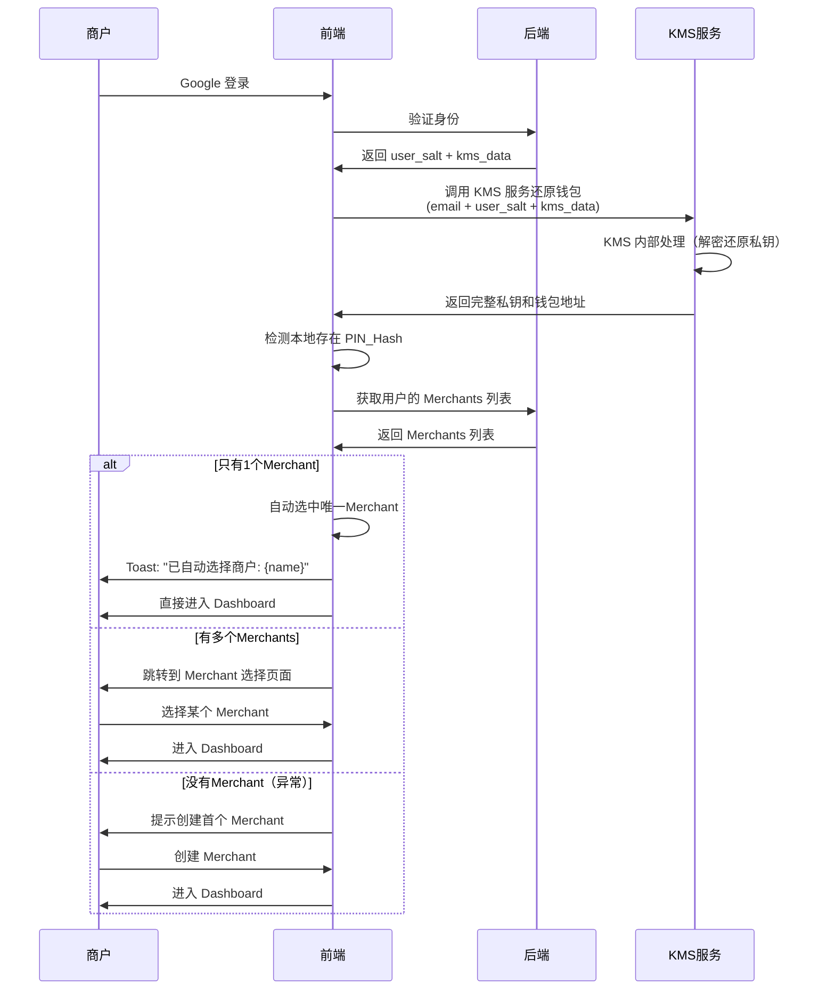

**用户感知时间**：

```
Google 登录 (0.5s) → KMS还原钱包 (0.3s) → Merchant选择/自动选中 (0.2s) → 进入后台
总计：约 1 秒（单merchant）或 需用户选择（多merchant）
```

#### 4.2.2 邮箱 OTP 登录

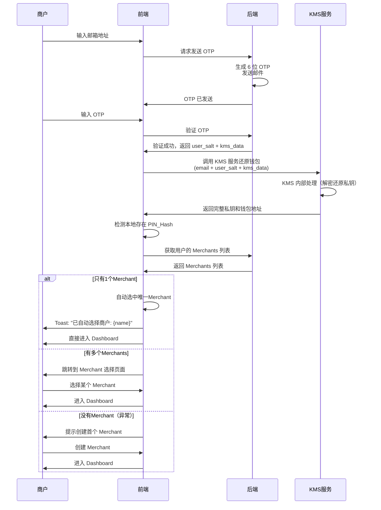

**用户感知时间**：

```
输入邮箱 (2s) → 等待 OTP (5-10s) → 输入 OTP (3s) → KMS还原钱包 (0.3s) → Merchant选择/自动选中 (0.2s) → 进入后台
总计：约 10-15 秒（单merchant）或 需用户选择（多merchant）
```

#### 4.2.3 敏感操作时的 PIN 验证

无论使用哪种登录方式，执行转账等敏感操作时都需要 PIN 验证：

```
┌─────────────────────────────────┐
│  🔐 请输入 PIN 确认转账          │
│                                 │
│  向 0xABC...DEF 发送 1.5 ETH    │
│                                 │
│  ┌─┬─┬─┬─┬─┬─┐                 │
│  │ │ │ │ │ │ │                 │
│  └─┴─┴─┴─┴─┴─┘                 │
│                                 │
│  [取消] [确认]                  │
└─────────────────────────────────┘
```

---

### 4.3 新设备登录

#### 4.3.1 Google OAuth 新设备登录

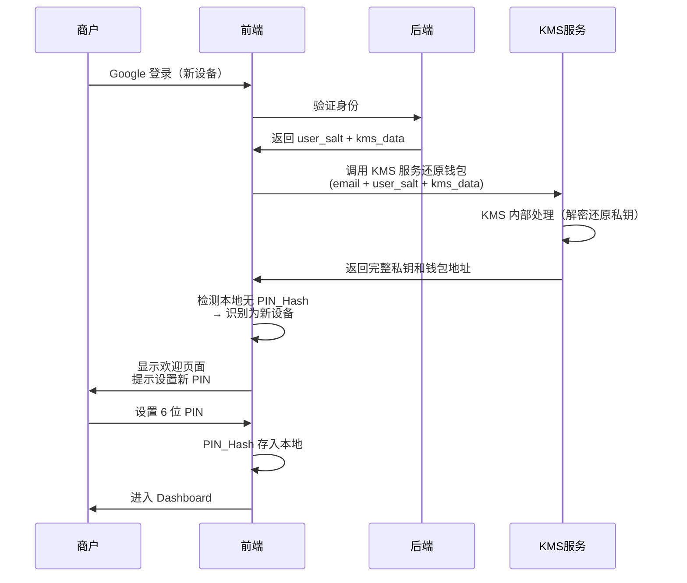

**用户感知时间**：

```
Google 登录 (0.5s) → KMS还原钱包 (0.3s) → 设置 PIN (3s) → 进入后台
总计：约 4 秒
```

#### 4.3.2 邮箱 OTP 新设备登录

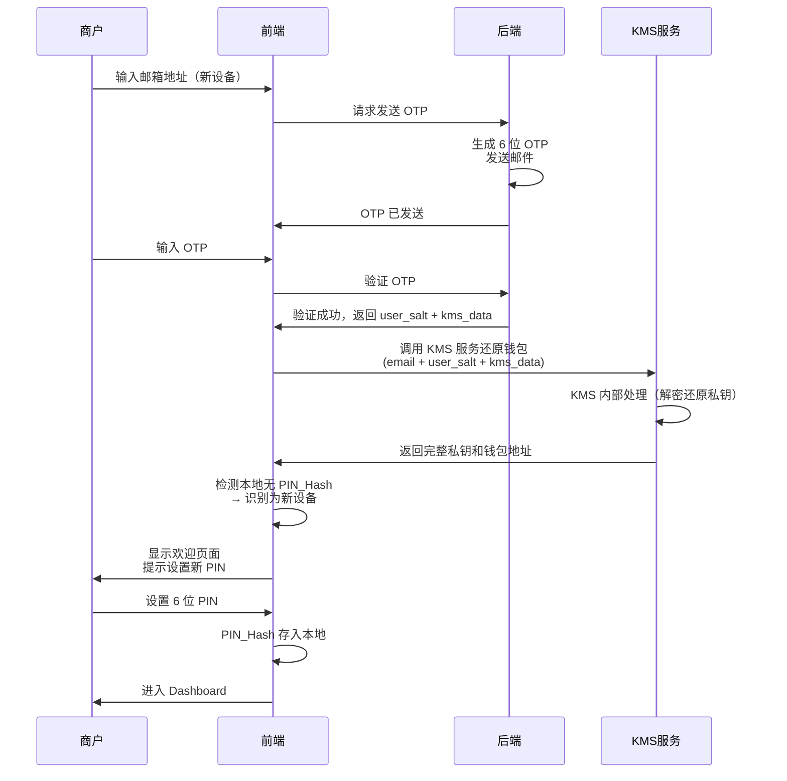

**用户感知时间**：

```
输入邮箱 (2s) → 等待 OTP (5-10s) → 输入 OTP (3s) → KMS还原钱包 (0.3s) → 设置 PIN (3s) → 进入后台
总计：约 13-18 秒
```

#### 4.3.3 新设备欢迎页面

```
┌─────────────────────────────────┐
│  👋 欢迎回来！                  │
│                                 │
│  检测到你已有钱包：              │
│  0x742d35Cc6634C0532925a3b844...│
│                                 │
│  请为此设备设置新的操作密码       │
│                                 │
│  [设置 PIN]                     │
└─────────────────────────────────┘
```

**关键点**：

- 新设备不是"重新注册"，而是"为新设备设置 PIN"
- 强调"此设备"的概念，让用户理解 PIN 是设备级的
- 每个设备的 PIN 可以不同，互不影响

---

### 4.4 忘记 PIN 的处理

**场景**:用户在老设备输入 PIN 错误 5 次

```
┌─────────────────────────────────┐
│  🔒 PIN 已锁定                  │
│                                 │
│  连续输入错误 5 次，已锁定       │
│                                 │
│  你可以通过以下方式重新获得访问:│
│                                 │
│  [通过 Google 重新登录]         │
│  [通过邮箱验证码登录]           │
└─────────────────────────────────┘
```

**处理流程**:

1. 清除当前会话（内存中的私钥）
2. 清除本地的 PIN_Hash
3. 重新走 OAuth/OTP 登录流程
4. 按照"新设备登录"流程设置新 PIN

**关键点**:

- 忘记 PIN **不会导致资产丢失**
- 实质是"清除本地 PIN → 重新验证身份 → 重新设置 PIN"
- 相当于把当前设备当作"新设备"处理

---

## 4.5 用户操作流程图

本节详细描述了不同场景下的完整用户操作流程，包括登录和注册时遇到的各种账号状态。

### 4.5.1 用户登录 - Google OAuth

> **Warning 注意**：Google OAuth 登录和邮箱 OTP 登录的核心验证流程相似，主要区别在于身份验证方式（OAuth vs OTP）和后续的 PIN 处理逻辑。两个流程图保持独立完整，方便单独查看。

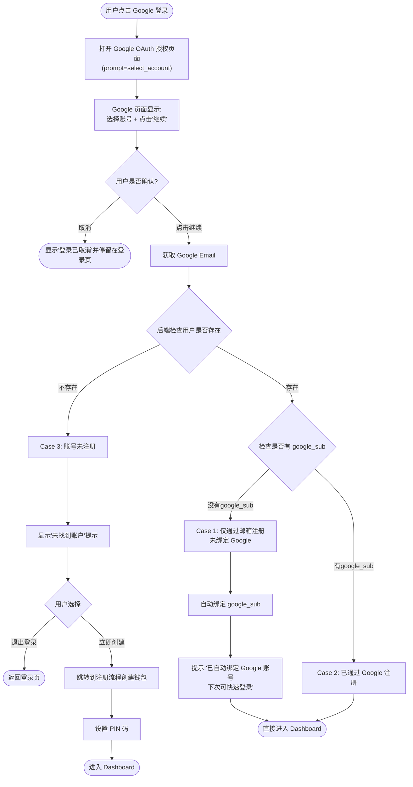

### 4.5.2 用户登录 - 邮箱 OTP

> **Warning 注意**：邮箱 OTP 登录和 Google OAuth 登录的核心流程相似（用户检查、设备 PIN 判断），主要区别在于身份验证方式（OTP vs OAuth）。两个流程图保持独立完整，方便单独查看。

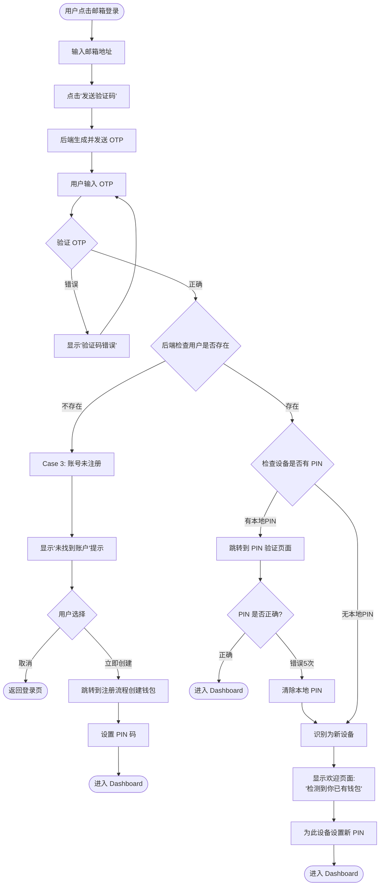

### 4.5.3 用户注册 - Google OAuth

> **Warning 注意**：Google OAuth 注册和邮箱 OTP 注册的核心流程（用户检查、钱包生成、PIN 设置）完全相同，仅在身份验证方式和上传字段上有差异（`google_sub` vs `user_salt`）。两个流程图保持独立完整，方便单独查看。

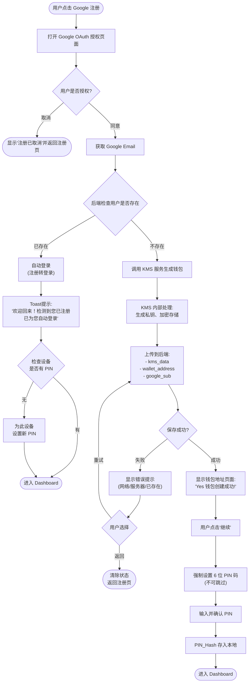

### 4.5.4 用户注册 - 邮箱 OTP

> **Warning 注意**：邮箱 OTP 注册和 Google OAuth 注册的核心流程（用户检查、钱包生成、PIN 设置）完全相同，仅在身份验证方式（OTP vs OAuth）和上传字段（`user_salt` vs `google_sub`）上有差异。两个流程图保持独立完整，方便单独查看。

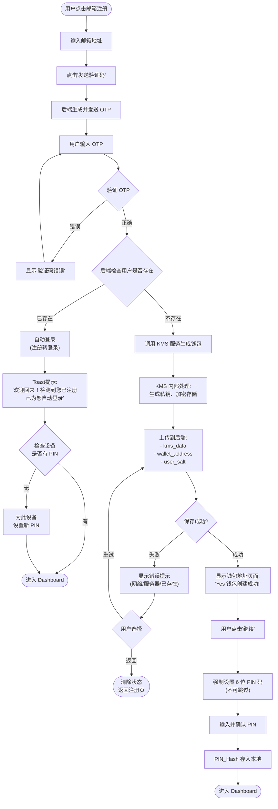

### 4.5.5 流程说明总结

#### 登录场景处理逻辑

**Google 登录**:

- **OAuth 确认**: 每次登录都需在 Google 页面选择账号并点击"继续"（使用 `prompt=select_account`）
- **Case 1** (邮箱注册，无Google绑定): 自动绑定 `google_sub` 到账户，提示用户绑定成功，直接进入 Dashboard
- **Case 2** (Google注册): 直接进入 Dashboard
- **Case 3** (未注册): 显示"未找到账户"提示，提供创建新账户选项
- Yes **无需 PIN 验证**：Google OAuth 确认页已提供足够安全保障

**邮箱 OTP 登录**:

- **Case 1** (账号已注册): 正常登录流程，检查设备PIN状态
- **Case 2** (账号未注册): 显示"未找到账户"提示，提供创建新账户选项

#### 注册场景处理逻辑

**Google 注册**:

- **已存在用户**: 自动转为登录，显示"欢迎回来！已为您自动登录"（不显示错误）
- **新用户**: 正常注册流程，创建钱包 → 强制设置 PIN → Dashboard
- **保存失败**: 提供重试/返回选项，附带详细错误提示

**邮箱 OTP 注册**:

- **已存在用户**: 自动转为登录，显示"欢迎回来！已为您自动登录"（不区分google_sub）
- **新用户**: 正常注册流程，创建钱包 → 强制设置 PIN → Dashboard
- **保存失败**: 提供重试/返回选项，附带详细错误提示

#### 关键设计原则

1. **Email 作为唯一标识**: 无论通过哪种方式注册，Email 都是账户的唯一标识
2. **注册转登录**: 检测到已存在用户时，自动登录而非显示错误（更好的用户体验）
3. **强制设置 PIN**: 注册时必须设置 PIN，移除"暂不设置"选项（安全性考虑）
4. **容错处理**: 保存失败时提供重试机制，避免用户重新输入所有信息
5. **设备 PIN 独立性**: 每个设备独立管理 PIN，新设备需重新设置
6. **安全与便捷平衡**: Google 登录提供便捷性，邮箱 OTP 提供备用方案

### 5.1 三层安全机制

| 层级   | 机制                   | 作用                         | 是否必需 |
| ------ | ---------------------- | ---------------------------- | -------- |
| 第一层 | 身份验证（OAuth/OTP）  | 证明"你是账户的拥有者"       | Yes 是   |
| 第二层 | KMS 加密保护           | 保护钱包数据，防止后端泄露   | Yes 是   |
| 第三层 | PIN 码（本地操作授权） | 快速验证，防止设备丢失后滥用 | No 可选  |

### 5.2 风险点与应对机制

| 风险场景            | 攻击者能拿到什么         | 系统如何防御                      | 结果             |
| ------------------- | ------------------------ | --------------------------------- | ---------------- |
| **Google 账号被盗** | 可登录获取钱包数据       | KMS 服务加密保护，需要身份验证    | Warning 可能被盗 |
| **邮箱被盗**        | 可收到 OTP 验证码        | 同上                              | Warning 可能被盗 |
| **后端数据库被黑**  | KMS 加密数据 + user_salt | KMS 加密数据无法直接解密          | No 无法获取私钥  |
| **用户设备被盗**    | 本地 PIN_Hash            | 没有 OAuth/OTP 无法获取钱包数据   | No 无法恢复私钥  |
| **用户忘记 PIN**    | 无                       | 重新 OAuth/OTP 登录，设置新 PIN   | Yes 资产安全     |
| **用户换新电脑**    | 无                       | OAuth/OTP 登录恢复，设置新设备PIN | Yes 4 秒恢复     |

**最严重风险**：

- 如果攻击者同时控制了用户的 **Google 账号/邮箱**，就能恢复私钥
- 这是所有基于身份验证的钱包系统的共同风险

**缓解措施**：

1. 建议用户开启 Google 两步验证
2. 敏感操作发送邮件通知
3. 可选：引入硬件密钥（YubiKey）作为第二因素

### 5.3 与传统方案的对比

| 传统方案       | PICA 新方案                       | 优势             |
| -------------- | --------------------------------- | ---------------- |
| 助记词抄在纸上 | 无需抄写，OAuth/OTP 即可恢复      | Yes 降低丢失风险 |
| 私钥存在 USB   | 云端加密存储，换设备 4 秒恢复     | Yes 提高容灾能力 |
| MetaMask 弹窗  | 内置钱包，无需安装插件            | Yes 降低操作门槛 |
| PIN 参与加密   | PIN 与私钥解耦，忘记 PIN 不丢资产 | Yes 降低丢失风险 |

---

## 6. 实施要点

### 6.1 KMS 服务接口

**推荐使用 KMS（Key Management Service）服务**封装所有密钥相关操作：

**核心接口**：

```typescript
// KMS 服务接口定义
interface KMSService {
  // 钱包生成（注册时调用）
  generateWallet(params: {
    email: string;
    userSalt: string;
  }): Promise<{
    privateKey: string;        // 完整私钥（仅在前端内存中存在）
    walletAddress: string;      // 钱包地址
    shardA: string;             // 分片 A（上传到后端）
    encryptedShardB: string;    // 加密后的分片 B（上传到后端）
  }>;

  // 钱包还原（登录时调用）
  recoverWallet(params: {
    email: string;
    userSalt: string;
    shardA: string;
    encryptedShardB: string;
  }): Promise<{
    privateKey: string;         // 完整私钥（仅在前端内存中存在）
    walletAddress: string;       // 钱包地址
  }>;
}

// PIN 本地处理函数
async function hashPinForStorage(pin: string, email: string): Promise<string>
async function verifyPinHash(pin: string, email: string, storedHash: string): Promise<boolean>
```

**KMS 服务内部实现**（对前端透明）：

- 使用 Web Crypto API 进行密钥派生（HKDF）
- 使用 AES-256-GCM 进行加密/解密
- 使用 XOR 进行分片生成和组合
- 使用安全随机数生成器（`crypto.getRandomValues()`）

### 4.6 POS-First 发现与登记流程 (Wallet Identity)

对于使用 Wallet 直接登录的高级商户，系统采用"自动识别"逻辑。

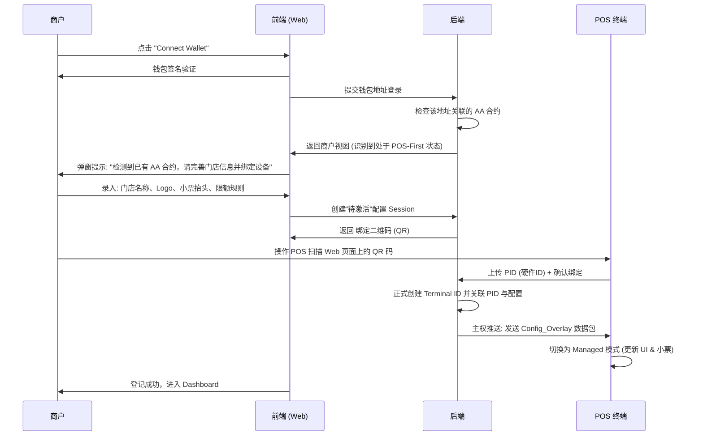

**设计要点**：
- **Web 端先行录入**：为了确保"云端主权"，小票和门店信息必须由商户在 Web 端设置后，通过二维码下发给 POS，而不是由 POS 上传给 Web。
- **一对一绑定**：每个物理设备 (PID) 必须完成一次扫码动作，才能与后台的 `Terminal ID` 建立一一对应关系，从而实现精准的风控限额推送。

### 6.2 后端 API

**用户注册**：

```
POST /api/auth/register
Request:
{
    "email": "user@example.com",
    "google_sub": "G_123456789",  // 可选
    "kms_data": "base64...",      // KMS 返回的加密钱包数据
    "wallet_address": "0x..."
}
Response:
{
    "success": true,
    "user_id": "user@example.com"
}
```

**检查用户**：

```
POST /api/auth/check-user
Request:
{
    "email": "user@example.com"
}
Response:
{
    "is_new": true,
    "user_salt": "base64..."  // 新用户才返回
}
```

**获取钱包数据**：

```
POST /api/auth/get-wallet
Request:
{
    "email": "user@example.com",
    "auth_token": "..."  // OAuth token 或 OTP session
}
Response:
{
    "user_salt": "base64...",
    "kms_data": "base64...",
    "wallet_address": "0x..."
}
```

### 6.3 模拟器逻辑

**场景控制**：

- **用户类型**：由 localStorage 中的注册表自动判断（新用户 vs 老用户）
- **设备场景**：由模拟器选择（新设备 vs 常用设备）

```
模拟器选项：
┌─────────────────────────────────┐
│  模拟设备场景：                  │
│  用户类型由 localStorage 决定    │
│                                 │
│  ○ 新设备（模拟未存储 PIN）      │
│  ● 常用设备（模拟已存储 PIN）    │
│                                 │
│  [ 重置 Demo 数据]            │
└─────────────────────────────────┘
```

---

## 7. 后续优化方向

### 7.1 短期优化

- [ ] 支持生物识别（Face ID / Touch ID）替代 PIN 码输入
- [ ] 敏感操作的邮件/推送通知
- [ ] 登录设备管理（查看/移除已授权设备）

### 7.2 中期优化

- [ ] 导出私钥功能（多重验证保护）
- [ ] 备份文件下载（加密的分片 B 本地副本）
- [ ] 支持硬件密钥（YubiKey）作为第二因素

### 7.3 长期愿景

- [ ] 支持 Passkey（WebAuthn）替代 PIN 码
- [ ] 支持多签钱包（需要多个设备/人员授权）
- [ ] 支持社交恢复（指定 3-5 个信任联系人）

---

## 8. 风险提示与用户教育

### 8.1 注册时的安全提示

```
┌─────────────────────────────────┐
│  🔐 安全提示                    │
│                                 │
│  你的钱包安全取决于：            │
│                                 │
│  1. Google/邮箱账号的安全        │
│     • 建议开启两步验证           │
│     • 不要与他人共享密码         │
│                                 │
│  2. 设备的安全                   │
│     • 不要在公共设备上登录       │
│     • 离开时请退出登录           │
│                                 │
│  □ 我已理解并同意               │
│                                 │
│  [继续]                         │
└─────────────────────────────────┘
```

### 8.2 Dashboard 安全提示

在用户首次进入 Dashboard 时：

```
┌─────────────────────────────────┐
│  安全建议                       │
│                                 │
│  ✓ 已为此设备设置操作密码        │
│  ✓ 转账等操作需要输入 PIN       │
│                                 │
│  建议：                         │
│  • 定期检查登录设备              │
│  • 大额转账前确认地址            │
│  • 开启邮件通知                  │
│                                 │
│  [我知道了]                     │
└─────────────────────────────────┘
```

---

## 9. 参考资料

- HKDF 标准：[RFC 5869](https://tools.ietf.org/html/rfc5869)
- AES-GCM 标准：[NIST SP 800-38D](https://csrc.nist.gov/publications/detail/sp/800-38d/final)
- Web Crypto API：[MDN 文档](https://developer.mozilla.org/en-US/docs/Web/API/Web_Crypto_API)
- PBKDF2 标准：[RFC 2898](https://tools.ietf.org/html/rfc2898)
- Google OAuth 2.0：[官方文档](https://developers.google.com/identity/protocols/oauth2)
