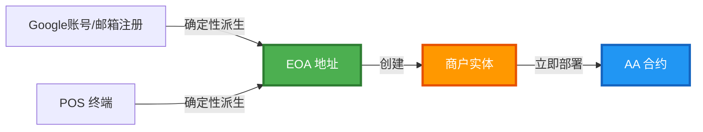
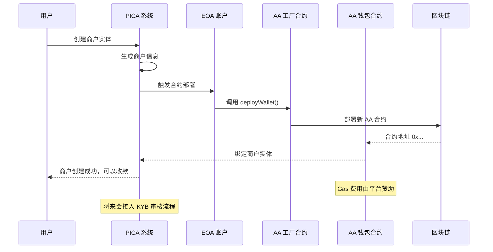
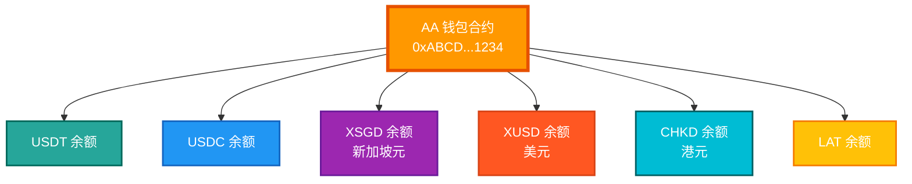
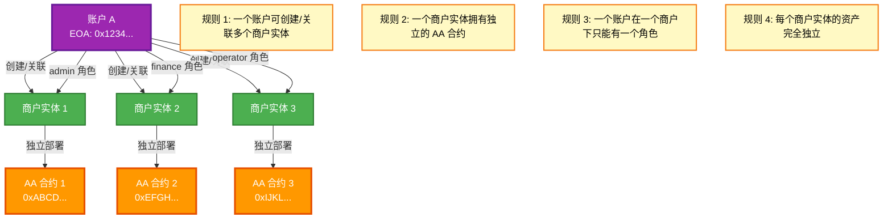
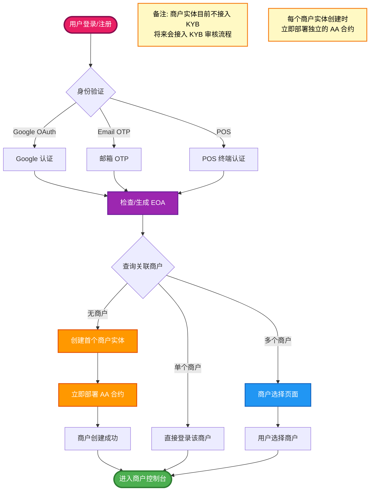
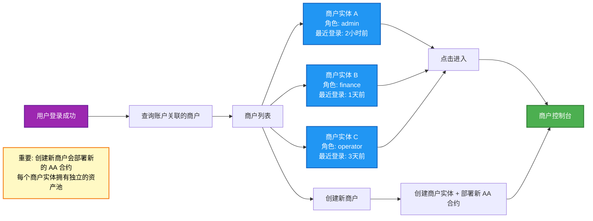
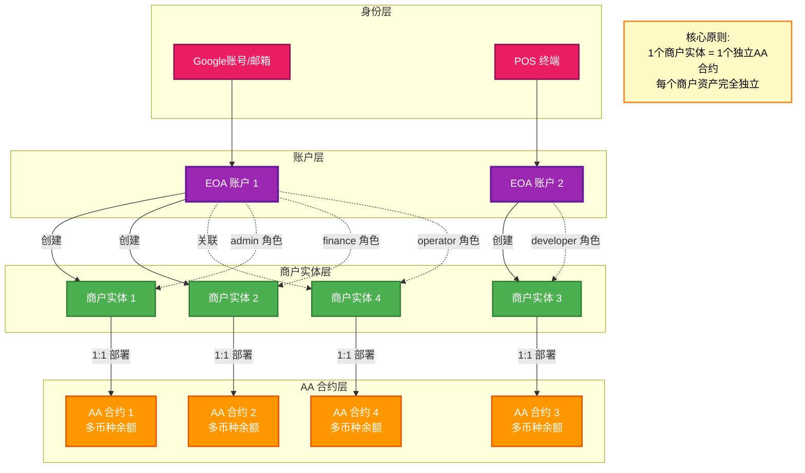

# PICA 区块链架构说明

**更新日期**: 2026-02-04  
**文档版本**: v2.0  
**目标受众**: PICA 技术团队

---

## 1. 架构概览

PICA 采用分层区块链架构，核心由四层组成：

1. **EOA 账户层** - 外部拥有账户生成
2. **商户实体层** - 商户业务实体
3. **AA 合约层** - 账户抽象智能合约
4. **角色权限层** - 商户与账户的角色映射关系

### 1.1 核心原则

- **一个 EOA 账户可以创建/关联多个商户实体**
- **一个商户实体 = 一个独立的 AA 合约**
- **一个账户在一个商户下只能有一个角色**
- **每个商户实体的资产完全独立，不共享**

---

## 2. EOA 账户生成机制

### 2.1 生成源

EOA（Externally Owned Account，外部拥有账户）可以通过以下两种方式生成：

1. **Google账号和邮箱** - 用户通过Google OAuth或邮箱注册
2. **POS 终端** - POS 设备自动生成



### 2.2 账户唯一性

- 每个邮箱地址对应唯一 EOA
- 每个 POS 终端对应唯一 EOA
- EOA 地址通过确定性算法从身份标识派生

---

## 3. AA 合约架构

### 3.1 合约部署流程

**每个商户实体在创建时**，立即自动部署一个独立的 AA（Account Abstraction）智能合约。

> **重要**：AA 合约在商户实体创建后立即部署，与 KYB 审核状态无关。  
> **备注**：商户实体目前不接入 KYB 审核，将来会接入。无论是否接KYB，商户实体创建后就生成 AA 合约。



### 3.2 支持的币种

PICA 作为收单业务平台，目前支持以下稳定币：

| 币种代码 | 币种名称                  | 说明                      |
| :------- | :------------------------ | :------------------------ |
| **USDT** | Tether USD                | 最广泛使用的稳定币        |
| **USDC** | USD Coin                  | Circle 发行的合规稳定币   |
| **XSGD** | StraitsX Singapore Dollar | 新加坡元稳定币            |
| **XUSD** | StraitsX USD              | StraitsX 发行的美元稳定币 |
| **CHKD** | -                         | 港元稳定币                |
| **LAT**  | -                         | LAT 代币                  |

### 3.3 多币种余额管理

AA 合约负责管理该商户实体在各支持币种中的资产余额：



> **注意**：虽然 AA 合约技术上可以接收任何 ERC20 代币，但 PICA 平台仅在前端展示和处理上述支持的币种。

---

## 4. 商户角色映射架构

### 4.1 映射关系规则



### 4.2 角色权限示例

| 角色          | 权限说明               | 典型场景         |
| :------------ | :--------------------- | :--------------- |
| **admin**     | 管理员，配置和审批权限 | 被邀请的管理人员 |
| **finance**   | 财务人员，财务管理权限 | 财务负责人       |
| **developer** | 开发者，API 和技术权限 | 技术集成人员     |
| **operator**  | 操作员，日常业务操作   | 收银员、客服     |

---

## 5. 登录与商户选择流程

### 5.1 完整注册与登录流程



### 5.2 商户选择界面逻辑

当用户关联了多个商户时，登录后展示商户选择页面：



---

## 6. 整体架构关系图



---

## 7. 关键设计说明

### 7.1 为什么商户创建时就部署 AA 合约？

**简化流程，快速上线**

- **即时可用**：商户实体创建后立即可以接收资金，无需等待审核
- **架构简洁**：每个商户实体对应一个独立的 AA 合约，资产隔离清晰
- **未来扩展**：将来接入 KYB 审核后，可以控制商户状态，但不影响 AA 合约的存在
- **Gas 赞助**：平台承担 Gas 费用，用户无需持有原生代币

### 7.2 为什么是商户实体与 AA 合约 1:1 关系？

**商户实体 : AA 合约 = 1 : 1**

- 资产独立：每个商户实体拥有独立的资产池，账目清晰
- 安全隔离：不同商户的资产完全隔离，互不影响
- 合规要求：独立的资金管理符合财务和审计要求
- 业务灵活：用户可以为不同业务创建多个商户实体

### 7.3 为什么允许一个账户关联多个商户？

**真实业务场景**：

1. **个人创业者**：一个人可能同时经营多个商户（餐厅、咖啡店、在线商店）
2. **合伙人模式**：同一个人在不同商户中担任不同角色
3. **员工流动**：员工可能同时为多个关联商户工作

### 7.4 为什么限制一个账户在一个商户下只能有一个角色？

**权限管理清晰性**：

- 避免角色冲突（既是 Owner 又是 Operator 会导致权限混乱）
- 审计追踪简单（每个操作明确对应一个角色）
- 符合企业管理常规（一个人在一个组织内只有一个职位）

---

## 8. 数据流示例

### 8.1 新用户注册流程（含 KYB）

```
1. 用户输入邮箱 user@example.com
2. 系统派生 EOA 地址 0x1234...
3. 用户创建首个商户 "ABC Coffee"
4. 用户提交 KYB 资料（营业执照、法人信息等）
5. Compliance Team 审核（1-3 个工作日）
6. 审核通过 → 系统自动部署 AA 合约 0xABCD...
7. 建立映射关系：
   - 账户: user@example.com (EOA: 0x1234...)
   - 商户: ABC Coffee (状态: 已激活)
   - 角色: Owner
   - AA 合约: 0xABCD...
8. 商户可以开始收款
```

### 8.2 已有用户添加商户

```
1. 用户 user@example.com 已登录
2. 已有 EOA: 0x1234... 和商户实体 1 (AA: 0xABCD...)
3. 用户创建新商户实体 "XYZ Store"
4. 系统立即为新商户实体部署新的 AA 合约 0xEFGH...
5. 新增映射关系：
   - 账户: user@example.com (EOA: 0x1234...)
   - 商户实体: XYZ Store
   - 角色: admin
   - AA 合约: 0xEFGH...（新部署）
6. 商户实体 XYZ Store 拥有独立的资产池
```

> **重要**：每个新商户实体都会部署独立的 AA 合约，不与其他商户共享资产。

### 8.3 用户被邀请加入商户

```
1. 商户 B 的 Owner 邀请 user@other.com
2. 系统检查 user@other.com：
   - 已有 EOA: 0x5678...
   - 已有 AA: 0xEFGH...
3. 建立新映射关系：
   - 账户: user@other.com (EOA: 0x5678...)
   - 商户: XYZ Store
   - 角色: Admin
   - AA 合约: 0xEFGH...（使用被邀请者的 AA）
```

---

## 9. 架构优势

| 优势         | 说明                                                               |
| :----------- | :----------------------------------------------------------------- |
| **资产安全** | 每个商户实体独立 AA 合约，资产完全隔离                             |
| **业务独立** | 不同商户实体资产独立，账目清晰，便于财务管理                       |
| **灵活权限** | 支持多商户多角色，适应复杂业务场景                                 |
| **Gas 优化** | AA 合约由平台赞助，用户无需持有原生代币                            |
| **币种专注** | 仅支持主流稳定币（USDT/USDC/XSGD/XUSD/CHKD/LAT），满足收单业务需求 |
| **可扩展性** | 架构支持未来添加更多币种和功能                                     |
| **审计友好** | 明确的账户-商户实体-角色映射，完整的审计链                         |

---

## 变更记录

| 版本  | 日期       | 说明                                                                                                                                                                              |
| :---- | :--------- | :-------------------------------------------------------------------------------------------------------------------------------------------------------------------------------- |
| 1.0.0 | 2026-02-02 | 初始版本，定义核心架构和流程图                                                                                                                                                    |
| 1.1.0 | 2026-02-02 | 添加 KYB 审核流程，明确 AA 合约部署时机为 KYB 通过后，更新支持币种列表                                                                                                            |
| 2.0.0 | 2026-02-04 | **重大更新**：修正架构为 EOA→商户实体→AA 合约三层关系，每个商户实体拥有独立 AA 合约，添加 LAT 币种，更新角色为 admin/finance/developer/operator，修正注册方式为 Google 账号和邮箱 |
