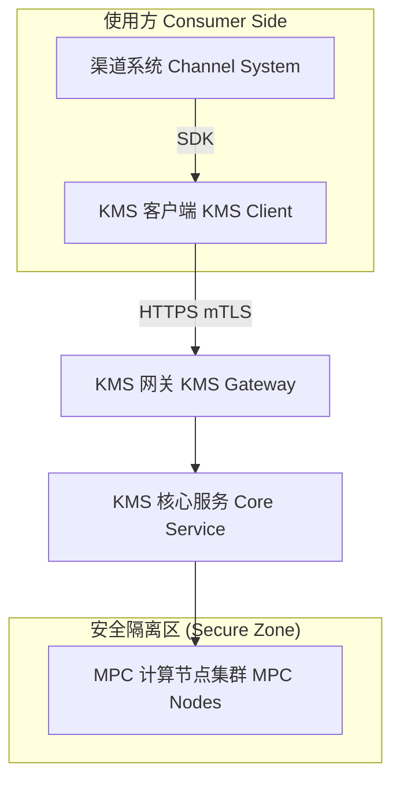
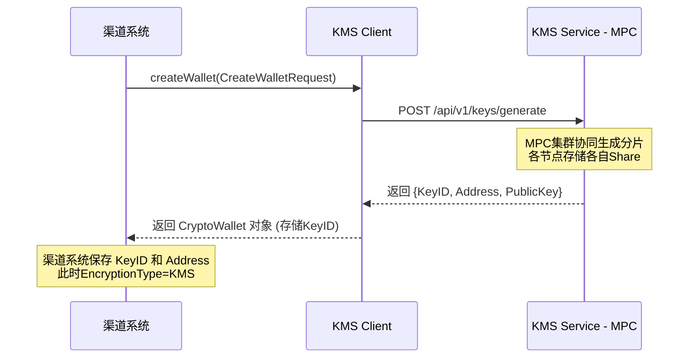
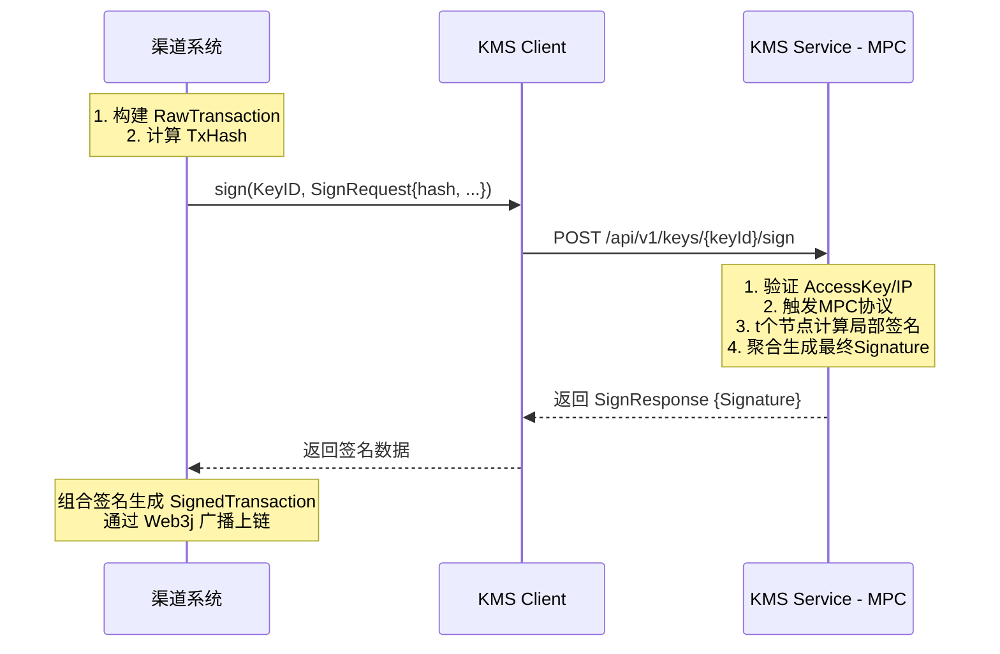

# KMS 托管钱包技术白皮书

## 1. 概述
本白皮书旨在阐述 KMS（Key Management Service）托管钱包系统的技术架构与核心功能。该方案采用先进的多方安全计算（MPC）与门限签名方案（TSS），提供企业级的高安全、高可用数字资产托管服务。通过物理隔离、密钥分片和多层审批机制，解决传统私钥管理中的单点故障与内鬼风险，实现真正的无私钥（Keyless）管理体验。

## 2. 核心功能

### 2.1 钱包管理
提供全生命周期的钱包管理功能，支持多种区块链网络（ETH, BTC, TRON 等）：
- **创建钱包**：生成全新的密钥分片并绑定唯一的 KeyID，过程中任何一方均无法获取完整私钥。
- **查询详情**：基于 KeyID 查询钱包地址、公钥及状态。
- **状态管理**：支持钱包的激活、冻结与归档。

### 2.2 交易签名
支持并在云端安全环境中完成签名计算：
- **通用交易签名**：支持 ETH 转账、ERC20 代币转账等标准 EVM 交易。
- **自定义消息签名**：支持 EIP-191、EIP-712 等格式的消息签名。
- **高并发支持**：基于异步任务机制，支持高并发的签名请求处理。

## 3. 技术架构

系统采用经典的分层架构设计，确保业务逻辑与密钥管理的解耦。



### 3.1 组件说明
- **渠道系统 (cc-channel-eth)**：负责交易构建、nonce 管理、广播上链等业务逻辑。不触碰任何私钥信息，仅持有 KeyID。
- **KMS Client**：封装底层通信细节，提供 `generateKey`, `sign` 等高阶接口，负责请求的签名与加密传输。
- **KMS Core Service**：负责鉴权、风控策略检查及任务调度。
- **MPC 节点集群**：分布式部署的计算节点，各自持有密钥分片，通过多方计算协议协同完成签名。

## 4. 系统调用流程

### 4.1 钱包创建流程
渠道系统申请新钱包地址，KMS 返回 KeyID。



### 4.2 交易签名流程
渠道系统构建未签名的交易哈希，请求 KMS 进行签名。



## 5. 接口集成说明

业务方通过 `KMS Client` SDK 接入，主要配置参数如下：

| 参数 | 说明 | 备注 |
| :--- | :--- | :--- |
| `kms.gateway.baseUrl` | KMS 服务地址 | 内网或公网通过 HTTPS 访问 |
| `kms.gateway.accessKey` | 访问密钥 ID | 标识应用身份 |
| `kms.gateway.secretKey` | 访问密钥 Secret | 用于请求签名，支持 `ues:` 加密存储 |
| `retry.policy` | 重试策略 | 建议配置指数退避策略以应对网络波动 |

### SDK 使用示例 (Java)
```java
// 1. 初始化 Client
KmsHighLevelClient client = new KmsHighLevelClientImpl(lowLevelClient);

// 2. 生成地址
GenerateKeyResponse keyResp = client.generateKey(new GenerateKeyRequest(...));
String keyId = keyResp.getKeyId();

// 3. 签名
SignResponse signResp = client.sign(keyId, new SignRequest(txHash));
String rsvSignature = signResp.getSignature();
```

## 6. 安全与密钥管理 (Security & Key Management)

本系统基于 OpenTSS / MPC 门限签名技术构建，从根本上消除了私钥单点泄露的风险。

### 6.1 密钥规格与参数 (Key Specifications)
系统采用工业级标准的密码学参数配置：
- **KeyFormat (密钥格式)**:
  - Type: `ECC` (Elliptic Curve Cryptography)
  - Curve: `SECP256K1` (比特币/以太坊标准曲线)
  - AlgorithmType: `GG18` (Gennaro & Goldfeder 2018 MPC 协议)
  - Size: `32` (Bytes)
- **KeyShardProperties (分片配置)**:
  - ShardCount (分片总数): `3`
  - Threshold (门限阈值): `2` (即 2-of-3 签名模式)

### 6.2 分片管理 (Sharding Management)
- **私钥碎片化**：密钥生成过程中，私钥从未在内存或磁盘中完整出现。系统生成 3 个私钥分片（Key Shares），分别存储在不同的物理节点或不同机构手中。
- **门限签名**：采用 2-of-3 门限签名方案，只有当至少 2 个分片参与计算时，才能生成合法的链上签名。
- **网络隔离**：各 MPC 节点部署在不同的可用区（AZ）或隔离网络中，杜绝共谋攻击。

### 6.3 备份与恢复 (Backup & Recovery)
- **分片独立备份**：每个分片独立加密备份，存储在物理隔离的冷存储介质中（如离线 HSM 或保险库）。
- **灾难恢复 (DR)**：当部分节点故障时，利用剩余的 $t$ 个分片及备份数据，可将服务迁移至新节点，无需重置钱包地址。
- **助记词碎纸机**：系统不依赖单一助记词，避免了助记词记录和保管的人为风险。

### 6.4 签名流程安全性
- **不还原私钥**：在签名过程中，各 MPC 节点交换中间计算参数，直接合成最终签名。**私钥从未被还原**，不仅防止了外部黑客攻击，也防止了内部内存转储攻击。
- **异步审批**：涉及资金流出的签名请求，需经过业务层的风控规则（如限额、白名单）及 KMS 层的多重审批（M-of-N 审批流）。
- **可审计性**：所有操作均有不可篡改的审计日志（Audit Log）。
