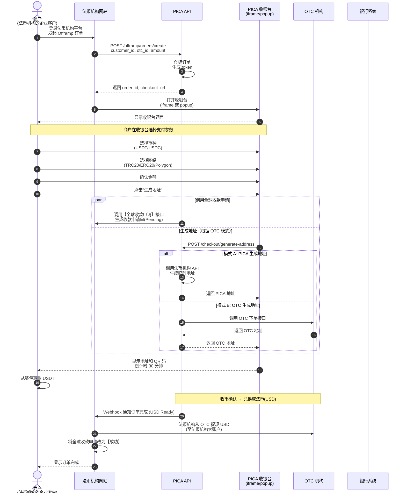
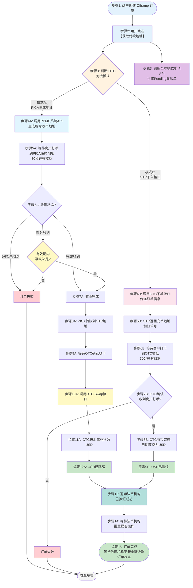
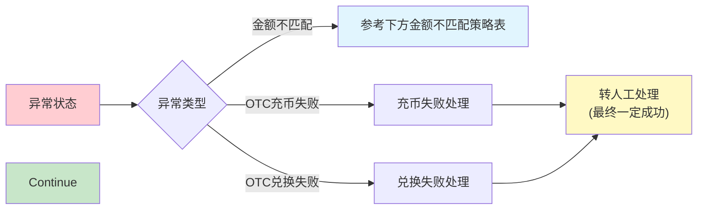
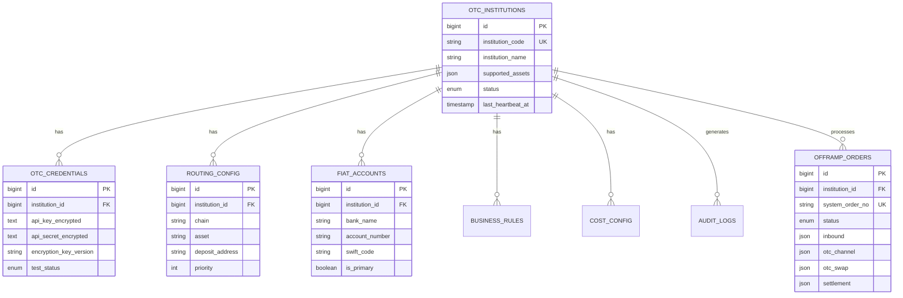
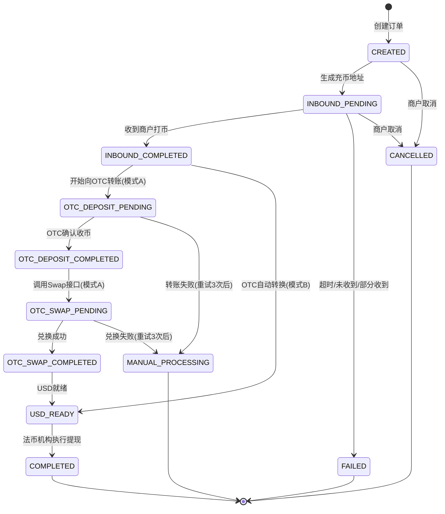
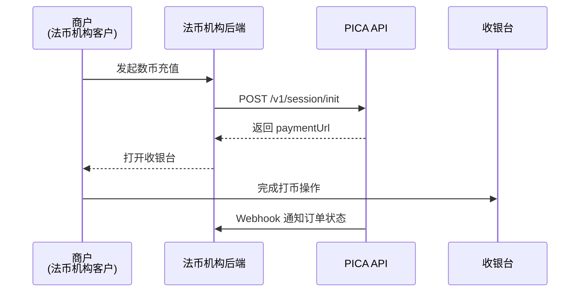

# Offramp 模块产品需求文档 (PRD)

**文档版本**: v1.0  
**创建日期**: 2026-01-04  
**目标受众**: 内部开发团队  
**产品负责人**: Product Manager  

---

## 0. 前言

我们期望的架构是一个法币机构（如Jpay）支持多个OTC（Sparrow, DTCpay, Straitsx）的模型，所以本文档中会比较完整的描述整体设计，以便技术团队在实施时会考虑到将来的兼容性。

但是在第一期，我们只实现下列方式下单：
1. OTC机构是模式B（DTCpay模式）
2. Iframe方式嵌入收银台只支持web
3. 下单接口中暂只支持固定crypto金额


---


## 1. 产品概述

### 1.1 业务背景

Offramp（数币转法币）是 PICA 平台的核心功能模块，采用 **B2B2B 业务模式**，为法币机构提供嵌入式数字货币兑换解决方案。

**业务架构**：
```
PICA 平台（服务提供方）
  └── 法币机构（客户/合作伙伴）
      └── 法币机构的商户（企业客户，最终使用者）
```

**核心能力**：
- 法币机构在 PICA 平台开户并完成 OTC 配置
- 法币机构的商户在法币机构网站登录并发起 Offramp 订单
- PICA 提供嵌入式收银台（iframe/popup），商户在收银台完成数币充值操作
- 通过与第三方 OTC 机构集成，实现从商户数字钱包到商户银行账户的全自动化资金流转

### 1.2 核心价值

- **法币机构价值**: 快速集成数币兑换能力，为其企业客户提供数币变现服务，无需自建技术团队和 OTC 对接
- **商户价值**: 通过法币机构平台，便捷地将持有的数字货币兑换成法币到账
- **平台价值**: 提供 SaaS 化服务，扩大业务覆盖面

### 1.3 版本对比：BONUSPAY vs PICA

#### 1.3.1 资金流程对比表

| 对比维度                | **BONUSPAY (现有版本)**                         | **PICA (新版)**                                 |
| ----------------------- | ----------------------------------------------- | ----------------------------------------------- |
| **1. 初始报价**         |                                                 |                                                 |
| 用户充值金额            | 10,000 USDT                                     | 10,000 USDT                                     |
| 手续费率                | 3% (法币机构Jpay对该商户做的配置)               | 3% (法币机构Jpay对该商户做的配置)               |
| 预计到账                | 9,700 USD                                       | 9,700 USD                                       |
| **2. 实际扣费**         |                                                 |                                                 |
| 用户实付                | **10,001 USDT**                                 | **10,000 USDT**                                 |
| Bonuspay提现费          | 1 USDT                                          | -                                               |
| PICA业务手续费          | -                                               | 1 USDT                                          |
| OTC机构到账             | 10,000 USDT                                     | **9,999 USDT**                                  |
| **3. 兑换环节**         |                                                 |                                                 |
| OTC兑换结果             | ~9,900 USD (实际可能波动)                       | ~9,899 USD (实际可能波动)                       |
| USD到账主体             | Jpay在OTC账户户                                 | Jpay在OTC账户                                   |
| **4. 全球收款申请时机** |                                                 |                                                 |
| 调用时机                | **DTC充值结束 或 Sparrow SWAP结束后**           | **用户点击【获取充值地址】时立即调用**          |
| 订单金额                | 9,700 USD (初始预计到账金额)                    | 9,700 USD (初始预计到账金额)                    |
| 订单状态                | Pending                                         | **Pending (此时用户尚未付款)**                  |
| **5. 通知与状态更新**   |                                                 |                                                 |
| 换汇成功通知JPay时机    | 生成全球收款订单                                | **需新增：换汇成功时通知JPay**                  |
| JPay操作                | 工作人员去OTC提USD → 更新全球收款订单为【成功】 | 工作人员去OTC提USD → 更新全球收款订单为【成功】 |
| Bonuspay响应            | 收到全球收款成功状态 → 法转数订单标记【成功】   | 收到全球收款成功状态 → 法转数订单标记【成功】   |

#### 1.3.2 关键差异分析

##### 🔸 差异1：全球收款申请时机提前

| 对比项       | BONUSPAY                 | PICA                                           |
| ------------ | ------------------------ | ---------------------------------------------- |
| **调用时机** | 用户完成打币且换汇完成后 | 用户点击"获取充值地址"时                       |
| **优势**     | 订单金额更准确           | **更早锁定收款意向，便于JPay财务管理**         |
| **风险**     | -                        | **用户可能点击获取地址后不付款**，需要超时机制 |

**解决方案**：
- PICA需实现订单过期机制（如30分钟）
- 过期未付款订单自动取消或标记为失败
- JPay需要能处理`Pending`状态的收款申请被撤销的情况

##### 🔸 差异2：手续费扣费主体不同

| 对比项       | BONUSPAY                         | PICA                                |
| ------------ | -------------------------------- | ----------------------------------- |
| **扣费方**   | Bonuspay平台                     | PICA平台                            |
| **扣费方式** | 提现手续费1U（从用户打币中扣除） | 业务手续费1U（从用户打币中扣除）    |
| **OTC到账**  | 10,000 USDT（完整金额）          | 9,999 USDT（扣除手续费后）          |
| **影响**     | OTC换汇基数更大                  | **OTC换汇基数略小，需调整报价逻辑** |

**解决方案**：
- PICA需在前端收银台显示报价时，将业务手续费计算在内
- 确保`预计到账金额` = `(用户实付 - 业务手续费) × (1 - JPay费率) × 汇率`

##### 🔸 差异3：需要新增换汇成功通知

| 对比项       | BONUSPAY                           | PICA                                                |
| ------------ | ---------------------------------- | --------------------------------------------------- |
| **通知JPay** | 自动（换汇完成即调用全球收款申请） | **需新增通知接口/Webhook**                          |
| **实现方式** | -                                  | PICA在OTC换汇成功后，调用JPay的Webhook通知USD已就绪 |

**解决方案**：
- PICA需为JPay提供Webhook配置入口
- 在订单状态变更为`USD_READY`时触发通知
- JPay工作人员收到通知后执行提现操作

#### 1.3.3 实施建议

**阶段1：接口对齐**
- [ ] 确认JPay全球收款申请API是否支持提前调用（用户未付款时）
- [ ] 确认JPay是否需要接收"换汇成功"的Webhook通知

**阶段2：前端调整**
- [ ] 收银台在用户点击"获取充值地址"时调用全球收款申请
- [ ] 收银台报价计算需包含PICA业务手续费

**阶段3：后端逻辑**
- [ ] 实现订单过期机制，自动取消未付款订单
- [ ] 在`USD_READY`状态时通知JPay（新增Webhook）


---

## 2. 用户角色与权限

### 2.1 角色定义

| 角色                | 描述                  | 所属组织       | 权限范围                                   |
| ------------------- | --------------------- | -------------- | ------------------------------------------ |
| **PICA 平台管理员** | PICA 平台的超级管理员 | PICA           | 全局配置、法币机构管理、系统监控           |
| **法币机构管理员**  | 法币机构的超级管理员  | 法币机构       | OTC 设置、API 密钥、订单查看               |
| **法币机构财务**    | 负责资金管理          | 法币机构       | 订单查看、异常处理、退款操作               |
| **法币机构开发**    | API 集成开发          | 法币机构       | API 密钥管理、Webhook 配置、技术文档       |
| **商户**            | 法币机构的企业客户    | 法币机构的客户 | 在法币机构平台登录，发起数币兑换法币的订单 |


---

## 3. 业务流程图

### 3.1 完整 B2B2B 业务流程

> **业务模式说明**：法币机构的商户在法币机构网站登录，发起 Offramp 订单，PICA 返回收银台 URL，商户在收银台完成币种选择和打币操作。



**关键步骤说明**：

1. **步骤 1-3**: 商户在法币机构网站发起订单，获取收银台 URL
2. **步骤 4-5**: 法币机构页面打开 PICA 收银台（iframe 或 popup）
3. **步骤 6-9**: 商户在收银台选择币种、网络、确认金额
4. **步骤 10**: 用户点击"生成地址"，触发 **并行流程**：调用全球收款申请 API & 生成充币地址
5. **步骤 11**: 商户从钱包转账到生成的地址
6. **后续步骤**: PICA 确认收币并兑换为 USD，通知法币机构；法币机构进行提现并更新收款申请状态

---

### 3.2 详细订单流程（支持两种 OTC 对接模式）

> **重要说明**：不同 OTC 机构的对接方式不同，系统需要支持两种模式：
> - **模式 A**：PICA 生成临时地址，商户打币后再转给 OTC
> - **模式 B**：直接调用 OTC 下单接口，OTC 返回充币地址，商户直接打币到 OTC



### 3.2.1 两种对接模式对比

| 对比项           | 模式 A: PICA 生成地址           | 模式 B: OTC 下单接口（如DTC）     |
| ---------------- | ------------------------------- | --------------------------------- |
| **地址生成方**   | 法币机构（PICA 控制）           | OTC 机构                          |
| **用户打币目标** | PICA 临时地址                   | OTC 充币地址                      |
| **资金流转**     | 用户 → PICA → OTC               | 用户 → OTC（直接）                |
| **中间转账**     | 需要（PICA 转给 OTC）           | 不需要                            |
| **Swap接口调用** | **需要调用OTC Swap接口兑换USD** | **自动转换USD，无需调用Swap接口** |
| **典型 OTC**     | 其他 OTC 机构                   | DTC PAY 等                        |

### 3.2.2 OTC 机构配置字段

为支持两种模式，OTC 机构配置需要增加以下字段：

```typescript
interface OTCInstitution {
  // ... 其他字段
  
  // 对接模式配置
  integration_mode: 'pica_address' | 'otc_order_api';  // 对接模式
  
  // 模式 A 相关配置
  fiat_institution_api?: {
    generate_address_endpoint: string;  // 生成地址接口
    webhook_url: string;                // 接收通知的 Webhook
  };
  
  // 模式 B 相关配置
  otc_order_api?: {
    create_order_endpoint: string;      // 创建订单接口
    query_order_endpoint: string;       // 查询订单接口
    webhook_url: string;                // OTC 回调地址
  };
}
```

### 3.2.3 流程步骤详解

#### 模式 A 流程（PICA 生成地址）

1. **步骤 1**: 商户创建 Offramp 订单
2. **步骤 2**: 用户在收银台点击【获取付款地址】
3. **步骤 3 (并行)**: **判断 OTC 模式** 与 **调用全球收款申请API**（生成 Pending 收款单）同时进行
4. **步骤 4A**: 调用PPMC系统API 生成临时收币地址
5. **步骤 5A**: 返回地址给商户，等待商户从钱包打币（30分钟有效期）
6. **步骤 6A-7A**: 监听链上确认。**完整收到**则直接成功；**部分收到**可在有效期内确认以继续；**超时/未收到**则失败
7. **步骤 8A-9A**: 收币成功后，PICA 将币转给 OTC，等待 OTC 确认
8. **步骤 10A-12A**: **调用 OTC Swap 接口**，将数币兑换为 USD，确认 USD 就绪
9. **步骤 13-15**: 通知法币机构 USD 已到账（同时自动更新全球收款申请为成功），等待法币机构批量提现

#### 模式 B 流程（OTC 下单接口，如 DTC）

1. **步骤 1**: 商户创建 Offramp 订单
2. **步骤 2**: 用户在收银台点击【获取付款地址】
3. **步骤 3 (并行)**: **判断 OTC 模式** 与 **调用全球收款申请API**（生成 Pending 收款单）同时进行
4. **步骤 4B**: 调用 OTC 下单接口，传递订单信息
5. **步骤 5B**: OTC 返回充币地址和 OTC 订单号
6. **步骤 6B**: 返回地址给商户，等待商户直接打币到 OTC 地址（30分钟有效期）
7. **步骤 7B-8B**: OTC 监听确认。**确认收到**（自动转换为 USD）则成功；**超时/未收到**则失败。通过 Webhook 通知 PICA
8. **步骤 9B**: USD 已就绪（无需调用 Swap 接口）
9. **步骤 13-15**: 通知法币机构 USD 已到账（同时自动更新全球收款申请为成功），等待法币机构批量提现


### 3.3 异常处理流程



**金额不匹配策略表：**

| 场景        | DTC模式收币                              | PICA模式收币                                               |
| :---------- | :--------------------------------------- | :--------------------------------------------------------- |
| **If 多付** | 按照下单金额结算，超过部分通过线下退款。 | **收多少结多少**                                           |
| **If 少付** | 不接受抹平差额到账，等订单过期线下退款。 | **给法币机构后台"接受抹平"，把订单置为成功，收多少结多少** |
| **If 过期** | 订单过期时间内没付完，线下退款。         | 订单过期时间内没付完，线下退款。                           |


---

## 4. 数据模型

### 4.1 核心实体关系图



### 4.2 订单状态机

## 状态定义

### 主要状态

| 状态码                  | 状态名称              | 中文名称    | 描述                                     |
| ----------------------- | --------------------- | ----------- | ---------------------------------------- |
| `CREATED`               | Created               | 已创建      | 订单已创建，等待商户打币                 |
| `INBOUND_PENDING`       | Inbound Pending       | 等待收币    | 临时地址已生成，等待链上确认             |
| `INBOUND_COMPLETED`     | Inbound Completed     | 收币完成    | 已确认收到商户打币                       |
| `OTC_DEPOSIT_PENDING`   | OTC Deposit Pending   | OTC充币中   | 正在向OTC地址转账（仅模式A）             |
| `OTC_DEPOSIT_COMPLETED` | OTC Deposit Completed | OTC充币完成 | OTC机构已确认收到数币                    |
| `OTC_SWAP_PENDING`      | OTC Swap Pending      | OTC兑换中   | 正在执行OTC兑换（仅模式A需调用Swap接口） |
| `OTC_SWAP_COMPLETED`    | OTC Swap Completed    | OTC兑换完成 | 已完成数币到USD的兑换                    |
| `USD_READY`             | USD Ready             | USD就绪     | USD已到账，已通知法币机构，等待批量提现  |
| `COMPLETED`             | Completed             | 已完成      | 订单已完成，法币机构已执行提现           |

### 异常状态

| 状态码              | 状态名称          | 中文名称   | 描述                                 |
| ------------------- | ----------------- | ---------- | ------------------------------------ |
| `FAILED`            | Failed            | 订单失败   | 收币阶段失败（超时/未收到/部分收到） |
| `MANUAL_PROCESSING` | Manual Processing | 人工处理中 | OTC充币/兑换失败，转人工处理         |
| `CANCELLED`         | Cancelled         | 已取消     | 订单已被取消                         |

## 状态转换图



## 失败重试机制

| 失败场景               | 可重试 | 最大重试次数 | 重试间隔 | 最终状态              |
| ---------------------- | ------ | ------------ | -------- | --------------------- |
| OTC 充币失败（模式 A） | ✅      | 3次          | 5分钟    | → `MANUAL_PROCESSING` |
| OTC 兑换失败           | ✅      | 3次          | 2分钟    | → `MANUAL_PROCESSING` |

## 数据库模型

```typescript
interface OfframpOrder {
  id: string;
  merchantOrderNo: string;
  customerId: string;
  status: OrderStatus;
  createdTime: string;
  lastUpdated: string;
  
  inbound: {
    orderNo: string;
    currency: string;
    network: string;
    address: string;
    expectedAmount: string;
    actualAmount?: string;
    result?: 'completed' | 'failed' | 'pending';
    completionTime?: string;
    expiryTime: string;
  };
  
  otcChannel?: {
    otcName: string;
    depositAddress: string;
    orderNo: string;
    depositTime?: string;
    status?: 'completed' | 'failed' | 'pending';
    txHash?: string;
    receivedAmount?: string;
  };
  
  otcSwap?: {
    orderNo: string;
    time?: string;
    rate?: string;
    fiatAmount?: string;
    result?: 'completed' | 'failed' | 'pending';
  };
  
  settlement?: {
    orderNo: string;
    time?: string;
    status?: 'completed' | 'failed' | 'pending';
    amount?: string;
    fee?: string;
    finalAmount?: string;
  };
  
  retryCount?: Record<string, number>;
  errorMessages?: string[];
  integrationMode?: 'pica_address' | 'otc_order_api';
}

type OrderStatus = 
  | 'CREATED'
  | 'INBOUND_PENDING'
  | 'INBOUND_COMPLETED'
  | 'OTC_DEPOSIT_PENDING'
  | 'OTC_DEPOSIT_COMPLETED'
  | 'OTC_SWAP_PENDING'
  | 'OTC_SWAP_COMPLETED'
  | 'USD_READY'
  | 'COMPLETED'
  | 'FAILED'
  | 'MANUAL_PROCESSING'
  | 'CANCELLED';
```

---

## 5. API 集成指南

> **说明**：本章节重点描述**法币机构调用 PICA API** 的集成方式，包括订单创建、状态查询和 Webhook 回调处理。

---

### 5.1 整体集成流程



**集成步骤**：
1. **后端**：调用 `Init Session` 获取 `paymentUrl`
2. **前端**：嵌入 Iframe 或跳转到收银台
3. **用户**：在收银台完成币种选择、网络选择及链上打币
4. **回调**：法币机构后端接收 Webhook，根据最终状态执行业务逻辑

---

### 5.2 核心 API 接口

#### 5.2.1 创建出金会话 (Init Session)

**Endpoint**: `POST /v1/session/init`

**请求参数**：

| 字段名        | 类型   | 必填   | 描述                                                                                                                                                                                             |
| ------------- | ------ | ------ | ------------------------------------------------------------------------------------------------------------------------------------------------------------------------------------------------ |
| `externalId`  | String | **是** | 法币机构侧订单号                                                                                                                                                                                 |
| `customerId`  | String | **是** | 商户 ID（最终收款人）                                                                                                                                                                            |
| `otcId`       | String | **是** | OTC 机构代码（如 `FLASH_OTC`）                                                                                                                                                                   |
| `amount`      | String | 否     | 交易金额<br/>- 若传值：收银台金额输入框置灰，商户不可修改<br/>- 若不传：收银台金额输入框允许商户自由输入<br/>- `PAYMENT`: 为数币金额 (如 1000 USDT)<br/>- `SETTLEMENT`: 为法币金额 (如 1000 USD) |
| `amountType`  | String | 否     | 金额类型，默认 `SETTLEMENT`<br/>- `PAYMENT`: 固定支付金额 (Crypto)。用户支付固定数币，到账 = 支付 * (1-费率)<br/>- `SETTLEMENT`: 固定到账金额 (Fiat)。用户到账固定法币，支付 = 到账 / (1-费率)   |
| `callbackUrl` | String | **是** | Webhook 回调地址                                                                                                                                                                                 |
| `returnUrl`   | String | 否     | 支付完成后的跳转地址                                                                                                                                                                             |

**响应示例**：

```json
{
  "code": 200,
  "data": {
    "systemOrderNo": "GIM-20260105-8899",
    "merchantOrderNo": "MO-20260105-001",
    "paymentUrl": "https://checkout.pica.com/v1/payout/xxx",
    "status": "pendingPayment"
  }
}
```

**重要说明**：
- 保存返回的 `systemOrderNo`，用于后续查询
- 将 `paymentUrl` 透传给前端，用于打开收银台

---

#### 5.2.2 获取订单详情 (Get Order Details)

**Endpoint**: `GET /v1/orders/{systemOrderNo}`

**响应示例**：

```json
{
  "code": 200,
  "data": {
    "orderSummary": {
      "merchantOrderNo": "MO-998877",
      "systemOrderNo": "GIM-20260105-8899",
      "customerId": "CLIENT-001",
      "status": "completed",
      "requestAmount": 1000.00,        // 下单请求金额
      "requestAmountType": "SETTLEMENT", // 下单金额类型
      "cryptoAmount": 1030.93,         // 应付数币金额 (USDT)
      "fiatAmount": 1000.00,           // 应结算法币金额 (USD)
      "feeRate": 0.03,                 // 手续费率 (3%)
      "depositAsset": "USDT",
      "createdAt": "2026-01-05T10:30:00Z"
    },
    "fiatInstCollection": {
      "asset": "USDT",
      "network": "Ethereum (ERC20)",
      "address": "0xdac17f958d2ee523a2206206994597c13d831ec7",
      "actualReceived": 1000.00,
      "completedAt": "2026-01-05T10:45:00Z"
    },
    "otcChannelDeposit": {
      "otcId": "FLASH_OTC",
      "otcName": "Flash OTC Ltd.",
      "txHash": "0xabc123...789",
      "depositTime": "2026-01-05T10:55:00Z"
    },
    "otcExchange": {
      "otcRate": 0.995,
      "fiatAmount": 995.00,
      "fiatCurrency": "USD",
      "exchangeTime": "2026-01-05T11:00:00Z"
    },
    "otcFiatWithdrawal": {
      "grossAmount": 995.00,
      "withdrawalFee": 5.00,
      "netReceived": 990.00,
      "currency": "USD",
      "withdrawalTime": "2026-01-05T11:15:00Z"
    },
    "profitAnalysis": {
      "platformProfit": 7.00,
      "currency": "USD"
    }
  }
}
```

**字段说明**：
- `estimatedReceivedAmount`: 用户侧预计到账金额
- `netReceived`: 法币机构大账户实收金额
- `platformProfit`: 平台利润 = `estimatedReceivedAmount` - `netReceived`

---

#### 5.2.3 取消订单 (Cancel Order)

**Endpoint**: `POST /v1/orders/{systemOrderNo}/cancel`

**请求参数**：

```json
{
  "reason": "User cancelled on merchant site"
}
```

**响应示例**：

```json
{
  "code": 200,
  "data": {
    "systemOrderNo": "GIM-20260105-8899",
    "status": "cancelled",
    "updatedAt": "2026-01-05T11:40:00Z"
  }
}
```

---

### 5.3 Webhook 异步回调

PICA 会向 `callbackUrl` 发送 `POST` 请求，法币机构必须实现**幂等性处理**。

#### 5.3.1 收到数币 (order.cryptoReceived)

```json
{
  "event": "order.cryptoReceived",
  "data": {
    "systemOrderNo": "GIM-20260105-8899",
    "merchantOrderNo": "MO-20260105-001",
    "status": "confirming",
    "actualReceived": 1000.00,
    "asset": "USDT"
  }
}
```

**业务含义**：链上收币成功，可告知商户"已收币，正在处理换汇"

---

#### 5.3.2 兑换完成 (order.otcExchanged)

```json
{
  "event": "order.otcExchanged",
  "data": {
    "otcId": "FLASH_OTC",
    "exchangeRate": 0.995,
    "fiatAmount": 995.00,
    "fiatCurrency": "USD"
  }
}
```

---

#### 5.3.3 USD就绪通知 (order.usdReady)

```json
{
  "event": "order.usdReady",
  "data": {
    "systemOrderNo": "GIM-20260105-8899",
    "merchantOrderNo": "MO-20260105-001",
    "status": "usdReady",
    "otcId": "FLASH_OTC",
    "exchangeRate": 0.995,
    "usdAmount": 995.00,
    "currency": "USD",
    "readyTime": "2026-01-05T11:00:00Z"
  }
}
```

**业务含义**：OTC已完成兑换，USD已到账OTC账户，**请法币机构安排批量提现**
- 法币机构可以选择立即提现或批量提现以节省手续费
- 此时订单状态为 `USD_READY`，等待法币机构执行提现操作

---

#### 5.3.4 异常挂起 (order.exception)

```json
{
  "event": "order.exception",
  "data": {
    "exceptionType": "amountMismatch",
    "expectedAmount": 1000.00,
    "actualReceived": 995.00,
    "status": "exception"
  }
}
```

**业务含义**：实收与下单金额不符时触发
- **多付**：系统挂起，法币机构通过管理后台选择线下退款
- **少付**：系统挂起，法币机构可在管理后台点击"接受实收"抹平差额继续流程

---

### 5.4 前端集成方案

#### 5.4.1 Web 端 (Modal 弹窗模式)

建议将 Iframe 嵌入在固定宽度的 Modal 中：

```html
<iframe 
  id="pica-checkout" 
  src="PAYMENT_URL" 
  allow="clipboard-write" 
  style="width:100%; height:600px; border:none;">
</iframe>
```

**必做事项 (postMessage)**：
- 监听 `PICA_HEIGHT_UPDATE`：根据内容动态调整 Iframe 高度
- 监听 `PICA_CHECKOUT_CLOSE`：用户完成操作或点击返回时，销毁 Modal

---

#### 5.4.2 移动端 (Mobile / WeChat)

**推荐方案**：直接重定向

```javascript
window.location.href = paymentUrl;
```

**微信环境适配**：
- 增加提示层引导用户"在外部浏览器中打开"
- 确保复制充币地址功能有兼容方案

---

### 5.5 两种 OTC 对接模式说明

PICA 支持两种 OTC 对接模式，法币机构在配置 OTC 机构时选择：

| 对比项           | 模式 A: PICA 生成地址           | 模式 B: OTC 下单接口（如DTC）     |
| ---------------- | ------------------------------- | --------------------------------- |
| **地址生成方**   | 法币机构（PICA 控制）           | OTC 机构                          |
| **商户打币目标** | PICA 临时地址                   | OTC 充币地址                      |
| **资金流转**     | 商户 → PICA → OTC               | 商户 → OTC（直接）                |
| **中间转账**     | 需要（PICA 转给 OTC）           | 不需要                            |
| **Swap接口调用** | **需要调用OTC Swap接口兑换USD** | **自动转换USD，无需调用Swap接口** |
| **Gas 费**       | PICA 承担一次转账 Gas           | 无额外 Gas 费                     |
| **到账速度**     | 较慢（多一次转账+Swap调用）     | 较快（直接到账+自动转换）         |
| **适用场景**     | 需要 PICA 控制资金流            | OTC 机构要求直接收币且自动兑换    |

**对 API 调用的影响**：
- 两种模式的 API 调用方式**完全相同**
- 区别仅在于 PICA 后端的处理逻辑不同
- 法币机构无需关心具体模式，只需配置 `otcId` 即可

---

### 5.6 开发者集成 Checklist

- [ ] 后端已通过 `systemOrderNo` 关联法币机构本地订单
- [ ] 前端已实现 Iframe 高度自适应逻辑
- [ ] Webhook 接收端已实现签名校验，确保安全性
- [ ] 财务对账逻辑已包含 `netReceived` 与 `estimatedReceivedAmount` 的差额分析
- [ ] 已测试异常场景（多付/少付/超时）的处理流程

---
## 6. 前端页面结构

### 6.1 页面层级

```
/dashboard/offramp
├── /orders                    # 订单列表页（法币机构查看）
│   └── /[id]                  # 订单详情页
├── /settings                  # OTC 设置首页（机构列表）
│   ├── /new                   # 添加新机构
│   └── /[institutionId]       # 机构配置详情页
│       ├── credentials        # Tab: API 凭证
│       ├── routing            # Tab: 资金路由
│       ├── fiat-accounts      # Tab: 法币账户
│       ├── business-rules     # Tab: 业务规则
│       ├── cost-config        # Tab: 成本配置
│       └── audit-logs         # Tab: 审计日志
└── /demo                      # Demo 模拟器

/checkout                       # 收银台页面（独立页面，供嵌入）
├── ?token={checkout_token}     # 通过 token 访问
└── 功能：
    ├── 显示订单信息
    ├── 选择币种（USDT/USDC）
    ├── 选择网络（TRC20/ERC20/Polygon/BSC）
    ├── 生成充币地址和 QR 码
    ├── 实时监控打币状态
    └── 支付成功后跳转到 return_url
```

### 6.2 收银台设计要点

#### 6.2.1 嵌入方式
- 支持 iframe 嵌入
- 支持 popup 弹窗
- 响应式设计，适配移动端

#### 6.2.2 核心功能
1. **订单信息展示**：金额、法币币种、有效期
2. **币种选择**：USDT、USDC
3. **网络选择**：TRC20、ERC20、Polygon、BSC
4. **地址生成**：点击按钮生成充币地址和 QR 码
5. **打币监控**：实时轮询打币状态
6. **倒计时**：30 分钟订单有效期倒计时
7. **异常处理**：金额不匹配、订单超时提示

#### 6.2.3 UI 参考
参考现有 Demo 页面设计


## 7. 附录

### 7.1 术语表

| 术语       | 说明                                   |
| ---------- | -------------------------------------- |
| Offramp    | 数币转法币，即将数字货币兑换成法定货币 |
| OTC        | Over-The-Counter，场外交易             |
| Inbound    | 用户向法币机构打币的阶段               |
| Settlement | 法币提现到商户账户的阶段               |
| Depeg      | 脱锚，稳定币价格偏离锚定价格           |
| bps        | Basis Points，基点，1bps = 0.01%       |


**文档结束**

如有疑问，请联系产品团队。
