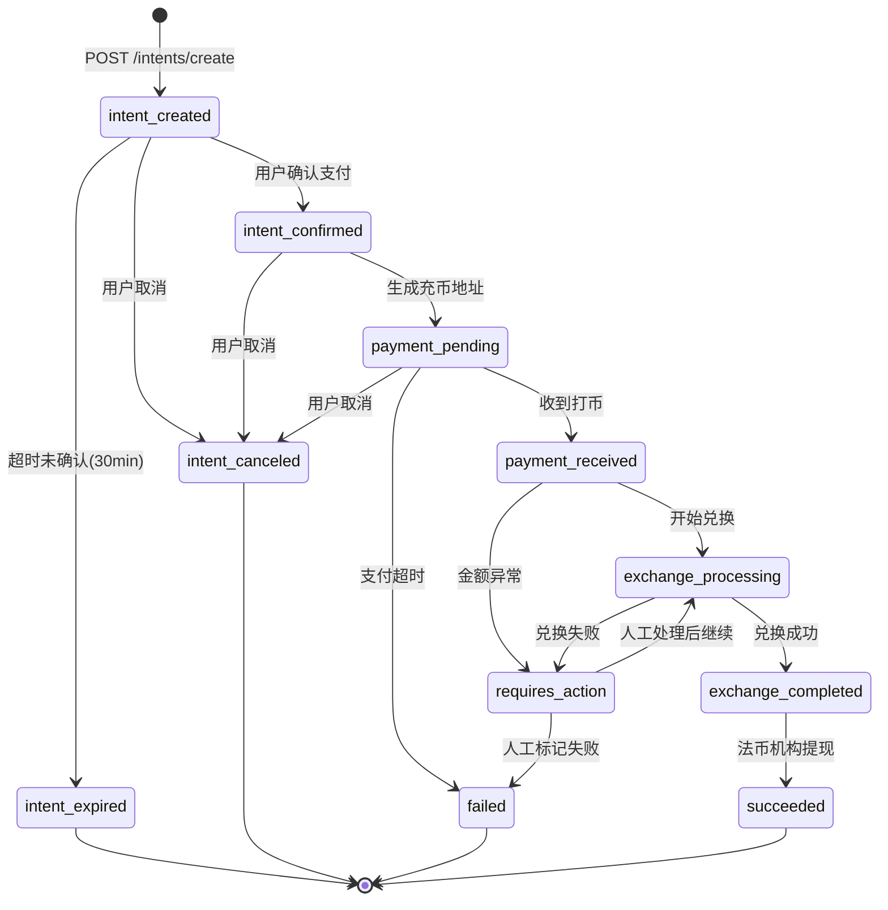
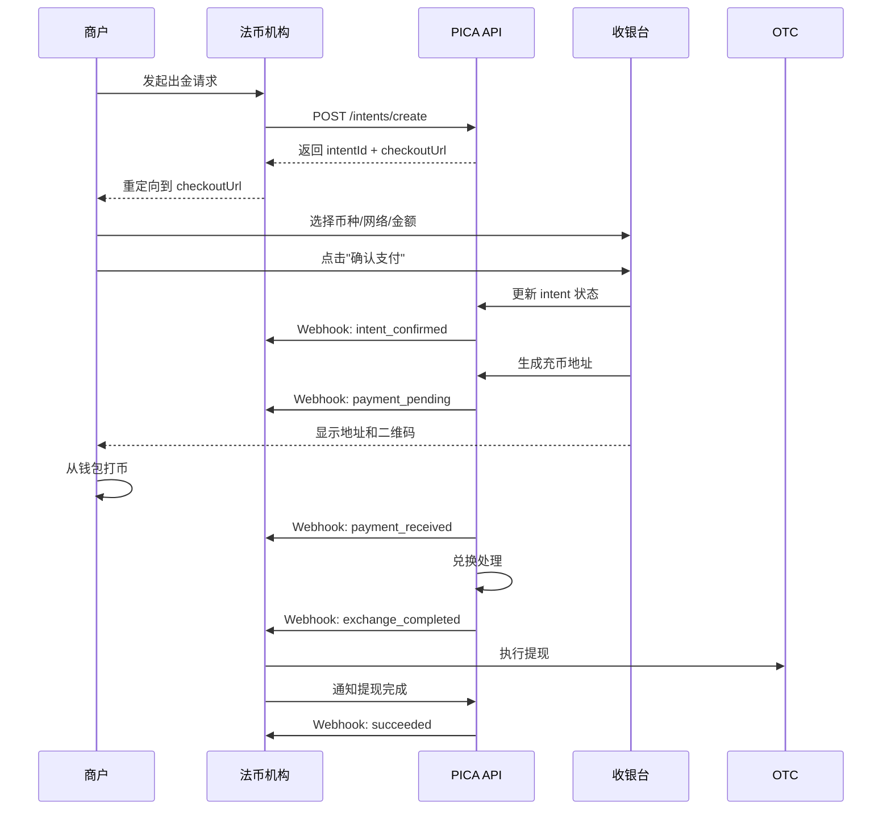

# Offramp 模块产品需求文档 (PRD) - Intent 模式

**文档版本**: v2.0 (Intent 模式)  
**创建日期**: 2026-01-14  
**更新说明**: 采用 Intent（出金意图）模式，参考 Stripe Payment Intent 设计  
**目标受众**: 内部开发团队  

---

## 0. 设计理念

### Intent 模式优势

本版本采用 **Intent（出金意图）** 模式，相比之前的 Session + SystemOrder 两层设计，具有以下优势：

✅ **单一ID贯穿始终**：从创建到完成始终使用 `intentId`，无需维护多个ID映射  
✅ **状态驱动**：通过清晰的状态流转表达业务阶段  
✅ **概念清晰**：Intent 本身就是订单，无需区分会话和订单  
✅ **符合业界实践**：参考 Stripe、Adyen 等支付平台的最佳实践  
✅ **简化集成**：商户只需关注一个 `intentId`，大幅降低集成复杂度  

---

## 1. 产品概述

### 1.1 业务背景

Offramp（数币转法币）是 PICA 平台的核心功能模块，采用 **B2B2B 业务模式**，为法币机构提供嵌入式数字货币兑换解决方案。

**业务架构**：
```
PICA 平台（服务提供方）
  └── 法币机构（客户/合作伙伴）
      └── 法币机构的商户（企业客户，最终使用者）
```

**核心能力**：
- 法币机构在 PICA 平台开户并完成 OTC 配置
- 法币机构的商户发起 Offramp 请求，PICA 创建出金意图（Intent）
- PICA 提供嵌入式收银台，商户在收银台完成参数选择和打币操作
- 通过与第三方 OTC 机构集成，实现从商户钱包到银行账户的全自动化资金流转

### 1.2 Intent 生命周期

```
创建意图 → 用户确认参数 → 生成充币地址 → 等待打币 → 兑换处理 → 完成
```

一个 Intent 代表**一次完整的出金请求**，使用唯一的 `intentId` 贯穿整个生命周期。

---

## 2. 核心概念

### 2.1 Intent（出金意图）

**定义**：代表用户的一次出金请求，从意图创建到资金到账的完整过程。

**核心特性**：
- **唯一标识**：`intentId`（如 `OFI-20260105-7788`）
- **状态驱动**：通过11个清晰状态表达业务阶段
- **金额可选**：创建时可不传金额，用户在收银台填写
- **幂等性**：同一 intentId 多次查询返回一致结果

**与 Stripe Payment Intent 的类比**：
| Stripe Payment Intent | PICA Offramp Intent |
|----------------------|-------------------|
| 用户支付意图 | 用户出金意图 |
| 收款 → 确认 → 成功 | 创建 → 确认 → 收币 → 兑换 → 提现 |
| `pi_xxx` | `OFI-xxx` |

---

## 3. 状态机设计

### 3.1 Intent 状态定义

| 状态码 | 状态名称 | 中文名称 | 描述 | 法币机构操作 |
|--------|---------|---------|------|------------|
| `intent_created` | Intent Created | 意图已创建 | 调用 /intents/create 成功 | 可取消 |
| `intent_confirmed` | Intent Confirmed | 意图已确认 | 用户确认支付，参数已确定 | 可取消 |
| `payment_pending` | Payment Pending | 等待支付 | 充币地址已生成，等待打币 | 可取消 |
| `payment_received` | Payment Received | 已收币 | 链上确认收到打币 | - |
| `exchange_processing` | Exchange Processing | 兑换处理中 | 正在进行数币→法币兑换 | - |
| `exchange_completed` | Exchange Completed | 兑换完成 | USD 已就绪，等待提现 | 执行提现 |
| `succeeded` | Succeeded | 已完成 | 法币机构已提现 | - |
| `intent_expired` | Intent Expired | 意图过期 | 超时未确认（30分钟） | - |
| `intent_canceled` | Intent Canceled | 意图取消 | 用户或系统取消 | - |
| `failed` | Failed | 失败 | 支付超时或兑换失败 | - |
| `requires_action` | Requires Action | 需人工处理 | 金额不符等异常 | 人工介入 |

### 3.2 状态流转图



### 3.3 状态说明

**正常流程**：
```
intent_created → intent_confirmed → payment_pending → payment_received 
  → exchange_processing → exchange_completed → succeeded
```

**异常情况**：
- **用户未确认**：`intent_created` → `intent_expired`（30分钟）
- **用户取消**：任意可取消状态 → `intent_canceled`
- **支付超时**：`payment_pending` → `failed`
- **金额异常**：`payment_received` → `requires_action`

---

## 4. API 设计

### 4.1 创建出金意图

**Endpoint**: `POST /v1/intents/create`

**请求参数**：
```json
{
  "merchantOrderNo": "MO-20260105-001",
  "customerId": "CLIENT-001",
  "otcId": "FLASH_OTC",
  "amount": 1000,                    // 可选，不传则用户在收银台输入
  "amountType": "SETTLEMENT",        // PAYMENT 或 SETTLEMENT
  "callbackUrl": "https://merchant.com/webhook",
  "returnUrl": "https://merchant.com/success"
}
```

**响应**：
```json
{
  "code": 200,
  "data": {
    "intentId": "OFI-20260105-7788",
    "merchantOrderNo": "MO-20260105-001",
    "status": "intent_created",
    "checkoutUrl": "https://checkout.pica.com/intents/OFI-20260105-7788",
    "expiresAt": "2026-01-05T11:00:00Z",
    "createdAt": "2026-01-05T10:30:00Z"
  }
}
```

**字段说明**：
- `intentId`: 唯一意图ID，后续所有操作使用此ID
- `checkoutUrl`: 收银台URL，法币机构将用户重定向到此URL
- `expiresAt`: 意图过期时间，超时未确认则自动过期

---

### 4.2 查询意图详情

**Endpoint**: `GET /v1/intents/{intentId}`

**响应示例（payment_pending 状态）**：
```json
{
  "code": 200,
  "data": {
    "intentId": "OFI-20260105-7788",
    "merchantOrderNo": "MO-20260105-001",
    "customerId": "CLIENT-001",
    "status": "payment_pending",
    
    "amount": 1000,
    "amountType": "SETTLEMENT",
    "asset": "USDT",
    "network": "TRC20",
    
    "payment": {
      "depositAddress": "TXabc123...",
      "expectedAmount": 1030.93,
      "qrCodeUrl": "https://api.qrserver.com/...",
      "expiresAt": "2026-01-05T11:00:00Z"
    },
    
    "createdAt": "2026-01-05T10:30:00Z",
    "updatedAt": "2026-01-05T10:35:00Z"
  }
}
```

**响应示例（succeeded 状态）**：
```json
{
  "code": 200,
  "data": {
    "intentId": "OFI-20260105-7788",
    "status": "succeeded",
    
    "payment": {
      "depositAddress": "TXabc123...",
      "actualAmount": 1000.00,
      "txHash": "0xabc123..."
    },
    
    "exchange": {
      "rate": 0.995,
      "fiatAmount": 995.00,
      "fiatCurrency": "USD",
      "exchangedAt": "2026-01-05T11:00:00Z"
    },
    
    "settlement": {
      "grossAmount": 995.00,
      "fee": 5.00,
      "netAmount": 990.00,
      "settledAt": "2026-01-05T11:15:00Z"
    },
    
    "completedAt": "2026-01-05T11:15:00Z"
  }
}
```

---

### 4.3 取消意图

**Endpoint**: `POST /v1/intents/{intentId}/cancel`

**请求参数**：
```json
{
  "reason": "User cancelled on merchant site"
}
```

**响应**：
```json
{
  "code": 200,
  "data": {
    "intentId": "OFI-20260105-7788",
    "status": "intent_canceled",
    "canceledAt": "2026-01-05T10:40:00Z"
  }
}
```

**限制**：只有 `intent_created`、`intent_confirmed`、`payment_pending` 状态可取消。

---

## 5. Webhook 设计

### 5.1 统一事件：intent.status_updated

所有状态变更通过同一个事件类型通知：

```json
{
  "event": "intent.status_updated",
  "timestamp": "2026-01-05T10:35:00Z",
  "data": {
    "intentId": "OFI-20260105-7788",
    "merchantOrderNo": "MO-20260105-001",
    "status": "payment_pending",
    "previousStatus": "intent_confirmed",
    
    "payment": {
      "depositAddress": "TXabc123...",
      "expectedAmount": 1030.93,
      "expiresAt": "2026-01-05T11:00:00Z"
    }
  }
}
```

### 5.2 关键状态的 Webhook

| 状态 | 业务含义 | 法币机构操作 |
|------|----------|------------|
| `intent_confirmed` | 用户确认支付，参数已确定 | 记录用户选择的参数 |
| `payment_pending` | 充币地址已生成 | 可展示给商户（如需要） |
| `payment_received` | 已收到打币 | 通知商户"已收币" |
| `exchange_completed` | USD 已就绪 | **执行提现操作** |
| `succeeded` | 订单完成 | 更新本地订单状态 |
| `failed` / `intent_expired` / `intent_canceled` | 异常状态 | 通知商户失败原因 |

### 5.3 Webhook 实现要点

**法币机构后端示例**：
```javascript
app.post('/webhook/pica', (req, res) => {
  const { event, data } = req.body;
  
  if (event === 'intent.status_updated') {
    const { intentId, status } = data;
    
    // 根据 intentId 更新本地订单
    await db.updateOrderByIntentId(intentId, {
      status,
      ...data
    });
    
    // 特殊处理：USD 就绪时执行提现
    if (status === 'exchange_completed') {
      await triggerWithdrawal(intentId);
    }
  }
  
  res.status(200).json({ received: true });
});
```

---

## 6. 集成流程

### 6.1 整体流程



### 6.2 前端集成（iframe 模式）

```html
<iframe 
  id="pica-checkout" 
  src="{checkoutUrl}" 
  allow="clipboard-write" 
  style="width:100%; height:600px; border:none;">
</iframe>
```

**监听事件**：
```javascript
window.addEventListener('message', (event) => {
  if (event.data.event === 'PICA_PAYMENT_SUCCESS') {
    const { intentId } = event.data.data;
    // 关闭 iframe，跳转到成功页
    window.location.href = `/success?intentId=${intentId}`;
  }
});
```

---

## 7. 数据模型

### 7.1 OfframpIntent 接口

```typescript
interface OfframpIntent {
  // 基本信息
  intentId: string;                      // "OFI-20260105-7788"
  merchantOrderNo: string;
  customerId: string;
  otcId: string;
  
  // 状态
  status: IntentStatus;
  
  // 金额信息（用户确认后填充）
  amount?: number;
  amountType?: 'PAYMENT' | 'SETTLEMENT';
  asset?: string;                        // "USDT"
  network?: string;                      // "TRC20"
  
  // 支付信息（payment_pending 后填充）
  payment?: {
    depositAddress: string;
    expectedAmount: number;
    actualAmount?: number;
    qrCodeUrl: string;
    txHash?: string;
    expiresAt: string;
  };
  
  // 兑换信息（exchange_completed 后填充）
  exchange?: {
    rate: number;
    fiatAmount: number;
    fiatCurrency: string;
    exchangedAt: string;
  };
  
  // 结算信息（succeeded 后填充）
  settlement?: {
    grossAmount: number;
    fee: number;
    netAmount: number;
    settledAt: string;
  };
  
  // URL
  checkoutUrl: string;
  callbackUrl: string;
  returnUrl?: string;
  
  // 时间戳
  createdAt: string;
  updatedAt: string;
  expiresAt: string;
  completedAt?: string;
}

type IntentStatus = 
  | 'intent_created'
  | 'intent_confirmed'
  | 'payment_pending'
  | 'payment_received'
  | 'exchange_processing'
  | 'exchange_completed'
  | 'succeeded'
  | 'intent_expired'
  | 'intent_canceled'
  | 'failed'
  | 'requires_action';
```

---

## 8. 法币机构集成指南

### 8.1 数据库设计建议

```sql
CREATE TABLE fiat_institution_orders (
  id BIGINT PRIMARY KEY,
  merchant_order_no VARCHAR(50) UNIQUE,
  intent_id VARCHAR(50) UNIQUE,        -- PICA intentId（唯一且不变）
  status VARCHAR(30),
  amount DECIMAL(20, 8),
  asset VARCHAR(10),
  network VARCHAR(20),
  created_at TIMESTAMP,
  updated_at TIMESTAMP
);
```

**关键点**：
- ✅ 只需保存一个 `intent_id`
- ✅ 所有查询和更新都通过 `intent_id` 进行
- ✅ 无需维护多个 ID 的映射关系

### 8.2 集成检查清单

- [ ] 后端已通过 `intentId` 关联法币机构本地订单
- [ ] 前端已实现跳转到 `checkoutUrl` 或嵌入 iframe
- [ ] Webhook 接收端已实现签名校验
- [ ] 已处理 `exchange_completed` 状态，触发提现流程
- [ ] 已测试异常场景（超时、取消、金额不符）

---

## 9. OTC 对接模式

系统支持两种 OTC 对接模式，对法币机构透明：

| 对比项 | 模式 A | 模式 B（如 DTC） |
|--------|--------|-----------------|
| 地址生成 | PICA 控制 | OTC 直接生成 |
| 资金流转 | 用户→PICA→OTC | 用户→OTC |
| Swap 调用 | 需要 | 自动转换 |
| 到账速度 | 较慢 | 较快 |

**对 API 的影响**：两种模式的 API 调用方式完全相同，差异仅在 PICA 后端处理逻辑。

---

## 10. 异常处理

### 10.1 金额不匹配

| 场景 | 处理方式 |
|------|---------|
| **用户多付** | 按下单金额结算，多余部分线下退款 |
| **用户少付** | 状态变为 `requires_action`，法币机构可选择接受或退款 |
| **支付超时** | 状态变为 `failed`，未打币或部分打币线下处理 |

### 10.2 重试机制

| 失败场景 | 重试次数 | 重试间隔 | 最终状态 |
|---------|---------|---------|---------|
| OTC 兑换失败 | 3次 | 2分钟 | `requires_action` |
| OTC 充币失败（模式A） | 3次 | 5分钟 | `requires_action` |

---

## 11. 附录

### 11.1 Intent vs Session+Order 对比

| 对比项 | Session + Order 模式 | Intent 模式 |
|--------|---------------------|------------|
| **ID 数量** | 2个（sessionId + systemOrderNo） | 1个（intentId） |
| **概念复杂度** | 需区分会话和订单 | 单一概念 |
| **商户集成** | 需维护ID映射 | 只关注 intentId |
| **状态管理** | 两层状态 | 单层状态 |
| **Webhook** | 多个事件类型 | 统一事件 |
| **查询方式** | 需先获取 systemOrderNo | 始终用 intentId |

### 11.2 术语表

| 术语 | 说明 |
|------|------|
| Intent | 出金意图，代表一次完整的出金请求 |
| Offramp | 数币转法币 |
| OTC | Over-The-Counter，场外交易 |
| Settlement | 结算，法币到账 |

---

**文档结束**

如有疑问，请联系产品团队。
