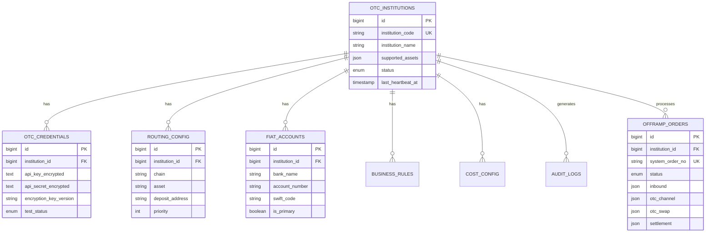

# Offramp 模块产品需求文档 (PRD)

**文档版本**: v2.0 (Intent 模式)  
**重要更新**: 采用 **Intent（出金意图）** 模式，参考 Stripe Payment Intent 设计。使用单一 `intentId` 贯穿整个流程，替代之前的 Session + SystemOrder 两层设计  
**最后更新**: 2026-01-14  
**目标受众**: 内部开发团队  
**产品负责人**: Product Manager  

---

## 0. 前言

我们期望的架构是一个法币机构（如Jpay）支持多个OTC（Sparrow, DTCpay, Straitsx）的模型，所以本文档中会比较完整的描述整体设计，以便技术团队在实施时会考虑到将来的兼容性。

但是在第一期，我们只实现下列方式下单：
1. OTC机构是模式B（DTCpay模式）
2. Iframe方式嵌入收银台只支持web
3. 下单接口中暂只支持固定crypto金额


---


## 1. 产品概述

### 1.1 业务背景

Offramp（数币转法币）是 PICA 平台的核心功能模块，采用 **B2B2B 业务模式**，为法币机构提供嵌入式数字货币兑换解决方案。

**业务架构**：
```
PICA 平台（服务提供方）
  └── 法币机构（客户/合作伙伴）
      └── 法币机构的商户（企业客户，最终使用者）
```

**核心能力**：
- 法币机构在 PICA 平台开户并完成 OTC 配置
- 法币机构的商户在法币机构网站登录并发起 Offramp 订单
- PICA 提供嵌入式收银台（iframe/popup），商户在收银台完成数币充值操作
- 通过与第三方 OTC 机构集成，实现从商户数字钱包到商户银行账户的全自动化资金流转

### 1.2 核心价值

- **法币机构价值**: 快速集成数币兑换能力，为其企业客户提供数币变现服务，无需自建技术团队和 OTC 对接
- **商户价值**: 通过法币机构平台，便捷地将持有的数字货币兑换成法币到账
- **平台价值**: 提供 SaaS 化服务，扩大业务覆盖面

### 1.3 版本对比：BONUSPAY vs PICA

#### 1.3.1 资金流程对比表

| 对比维度                | **BONUSPAY (现有版本)**                         | **PICA (新版)**                                 |
| ----------------------- | ----------------------------------------------- | ----------------------------------------------- |
| **1. 初始报价**         |                                                 |                                                 |
| 用户充值金额            | 10,000 USDT                                     | 10,000 USDT                                     |
| 手续费率                | 3% (法币机构Jpay对该商户做的配置)               | 3% (法币机构Jpay对该商户做的配置)               |
| 预计到账                | 9,700 USD                                       | 9,700 USD                                       |
| **2. 实际扣费**         |                                                 |                                                 |
| 用户实付                | **10,001 USDT**                                 | **10,000 USDT**                                 |
| Bonuspay提现费          | 1 USDT                                          | -                                               |
| PICA业务手续费          | -                                               | 1 USDT                                          |
| OTC机构到账             | 10,000 USDT                                     | **9,999 USDT**                                  |
| **3. 兑换环节**         |                                                 |                                                 |
| OTC兑换结果             | ~9,900 USD (实际可能波动)                       | ~9,899 USD (实际可能波动)                       |
| USD到账主体             | Jpay在OTC账户户                                 | Jpay在OTC账户                                   |
| **4. 全球收款申请时机** |                                                 |                                                 |
| 调用时机                | **DTC充值结束 或 Sparrow SWAP结束后**           | **用户点击【获取充值地址】时立即调用**          |
| 订单金额                | 9,700 USD (初始预计到账金额)                    | 9,700 USD (初始预计到账金额)                    |
| 订单状态                | Pending                                         | **Pending (此时用户尚未付款)**                  |
| **5. 通知与状态更新**   |                                                 |                                                 |
| 换汇成功通知JPay时机    | 生成全球收款订单                                | **需新增：换汇成功时通知JPay**                  |
| JPay操作                | 工作人员去OTC提USD → 更新全球收款订单为【成功】 | 工作人员去OTC提USD → 更新全球收款订单为【成功】 |
| Bonuspay响应            | 收到全球收款成功状态 → 法转数订单标记【成功】   | 收到全球收款成功状态 → 法转数订单标记【成功】   |

#### 1.3.2 关键差异分析

##### 🔸 差异1：全球收款申请时机提前

| 对比项       | BONUSPAY                 | PICA                                           |
| ------------ | ------------------------ | ---------------------------------------------- |
| **调用时机** | 用户完成打币且换汇完成后 | 用户点击"获取充值地址"时                       |
| **优势**     | 订单金额更准确           | **更早锁定收款意向，便于JPay财务管理**         |
| **风险**     | -                        | **用户可能点击获取地址后不付款**，需要超时机制 |

**解决方案**：
- PICA需实现订单过期机制（如30分钟）
- 过期未付款订单自动取消或标记为失败
- JPay需要能处理`Pending`状态的收款申请被撤销的情况

##### 🔸 差异2：手续费扣费主体不同

| 对比项       | BONUSPAY                         | PICA                                |
| ------------ | -------------------------------- | ----------------------------------- |
| **扣费方**   | Bonuspay平台                     | PICA平台                            |
| **扣费方式** | 提现手续费1U（从用户打币中扣除） | 业务手续费1U（从用户打币中扣除）    |
| **OTC到账**  | 10,000 USDT（完整金额）          | 9,999 USDT（扣除手续费后）          |
| **影响**     | OTC换汇基数更大                  | **OTC换汇基数略小，需调整报价逻辑** |

**解决方案**：
- PICA需在前端收银台显示报价时，将业务手续费计算在内
- 确保`预计到账金额` = `(用户实付 - 业务手续费) × (1 - JPay费率) × 汇率`

##### 🔸 差异3：需要新增换汇成功通知

| 对比项       | BONUSPAY                           | PICA                                                |
| ------------ | ---------------------------------- | --------------------------------------------------- |
| **通知JPay** | 自动（换汇完成即调用全球收款申请） | **需新增通知接口/Webhook**                          |
| **实现方式** | -                                  | PICA在OTC换汇成功后，调用JPay的Webhook通知USD已就绪 |

**解决方案**：
- PICA需为JPay提供Webhook配置入口
- 在订单状态变更为`USD_READY`时触发通知
- JPay工作人员收到通知后执行提现操作

#### 1.3.3 实施建议

**阶段1：接口对齐**
- [ ] 确认JPay全球收款申请API是否支持提前调用（用户未付款时）
- [ ] 确认JPay是否需要接收"换汇成功"的Webhook通知

**阶段2：前端调整**
- [ ] 收银台在用户点击"获取充值地址"时调用全球收款申请
- [ ] 收银台报价计算需包含PICA业务手续费

**阶段3：后端逻辑**
- [ ] 实现订单过期机制，自动取消未付款订单
- [ ] 在`USD_READY`状态时通知JPay（新增Webhook）


---

## 2. 用户角色与权限

### 2.1 角色定义

| 角色                | 描述                  | 所属组织       | 权限范围                                   |
| ------------------- | --------------------- | -------------- | ------------------------------------------ |
| **PICA 平台管理员** | PICA 平台的超级管理员 | PICA           | 全局配置、法币机构管理、系统监控           |
| **法币机构管理员**  | 法币机构的超级管理员  | 法币机构       | OTC 设置、API 密钥、订单查看               |
| **法币机构财务**    | 负责资金管理          | 法币机构       | 订单查看、异常处理、退款操作               |
| **法币机构开发**    | API 集成开发          | 法币机构       | API 密钥管理、Webhook 配置、技术文档       |
| **商户**            | 法币机构的企业客户    | 法币机构的客户 | 在法币机构平台登录，发起数币兑换法币的订单 |


---

## 3. 业务流程图

### 3.1 完整 B2B2B 业务流程

> **业务模式说明**：法币机构的商户在法币机构网站登录，发起 Offramp 订单，PICA 返回收银台 URL，商户在收银台完成币种选择和打币操作。

```mermaid
sequenceDiagram
    autonumber
    actor Merchant as 商户<br/>(法币机构的企业客户)
    participant FiatWeb as 法币机构网站
    participant PICAAPI as PICA API
    participant Checkout as PICA 收银台<br/>(iframe/popup)
    participant OTC as OTC 机构
    participant Bank as 银行系统
    
    %% 商户发起订单
    Merchant->>FiatWeb: 登录法币机构平台<br/>发起 Offramp 订单
    FiatWeb->>PICAAPI: POST /offramp/orders/create<br/>customer_id, otc_id, amount
    PICAAPI->>PICAAPI: 创建订单<br/>生成 token
    
    PICAAPI-->>FiatWeb: 返回 order_id, checkout_url
    
    %% 打开收银台
    FiatWeb->>Checkout: 打开收银台<br/>(iframe 或 popup)
    Checkout-->>Merchant: 显示收银台界面
    
    %% 商户在收银台操作
    Note over Merchant,Checkout: 商户在收银台选择支付参数
    Merchant->>Checkout: 选择币种<br/>(USDT/USDC)
    Merchant->>Checkout: 选择网络<br/>(TRC20/ERC20/Polygon)
    Merchant->>Checkout: 确认金额
    Merchant->>Checkout: 点击"生成地址"
    
    %% 全球收款申请 & 模式判断（并行处理）
    par 调用全球收款申请
        PICAAPI->>FiatWeb: 调用【全球收款申请】接口<br/>生成收款申请单(Pending)
    and 生成地址（根据 OTC 模式）
        Checkout->>PICAAPI: POST /checkout/generate-address
        alt 模式 A: PICA 生成地址
            PICAAPI->>PICAAPI: 调用法币机构 API<br/>生成临时地址
            PICAAPI-->>Checkout: 返回 PICA 地址
        else 模式 B: OTC 生成地址
            PICAAPI->>OTC: 调用 OTC 下单接口
            OTC-->>PICAAPI: 返回 OTC 地址
            PICAAPI-->>Checkout: 返回 OTC 地址
        end
    end
    
    %% 商户打币
    Checkout-->>Merchant: 显示地址和 QR 码<br/>倒计时 30 分钟
    Merchant->>Merchant: 从钱包转账 USDT
    
    %% 后续流程
    Note over PICAAPI,OTC: 收币确认 → 兑换成法币(USD)
    
    %% 回调通知
    PICAAPI->>FiatWeb: Webhook 通知订单完成 (USD Ready)
    
    %% 提现与结单
    FiatWeb->>OTC: 法币机构从 OTC 提现 USD<br/>(至法币机构大账户)
    FiatWeb->>FiatWeb: 将全球收款申请改为【成功】
    FiatWeb-->>Merchant: 显示订单完成

```



**关键步骤说明**：

1. **步骤 1-3**: 商户在法币机构网站发起出金请求，获取收银台 URL（此时创建会话，返回 sessionId）
2. **步骤 4-5**: 法币机构页面打开 PICA 收银台（iframe 或 popup）
3. **步骤 6-9**: 商户在收银台选择币种、网络、确认金额（此时仍为会话状态，未生成订单）
4. **步骤 10**: 用户点击"确认支付"，触发 **订单创建** 并 **并行流程**：生成 systemOrderNo、调用全球收款申请 API、生成充币地址
5. **步骤 11**: 商户从钱包转账到生成的地址
6. **后续步骤**: PICA 确认收币并兑换为 USD，通知法币机构；法币机构进行提现并更新收款申请状态

---

### 3.2 详细订单流程（支持两种 OTC 对接模式）

> **重要说明**：不同 OTC 机构的对接方式不同，系统需要支持两种模式：
> - **模式 A**：PICA 生成临时地址，商户打币后再转给 OTC
> - **模式 B**：直接调用 OTC 下单接口，OTC 返回充币地址，商户直接打币到 OTC

```mermaid
flowchart TB
    SessionStart([步骤0: 商户发起出金请求]) 
    
    SessionStart --> CreateSession[步骤0.1: 调用 /init API<br/>创建会话<br/>返回 sessionId + checkoutUrl<br/>状态: SESSION_CREATED]
    CreateSession --> OpenCheckout[步骤0.2: 打开收银台<br/>用户选择币种/网络/金额]
    OpenCheckout --> UserConfirm{步骤0.3: 用户是否<br/>点击确认支付?}
    UserConfirm -->|否，超时| SessionExpired[会话过期<br/>SESSION_EXPIRED]
    UserConfirm -->|是| Start([步骤1: 生成订单<br/>systemOrderNo<br/>状态: CREATED])
    
    Start --> UserClick[步骤2: 生成充币地址]
    
    %% 并行流程
    UserClick --> CheckMode{步骤3: 判断 OTC<br/>对接模式}
    UserClick --> CallGCA[步骤3: 调用全球收款申请API<br/>生成Pending收款单]
    
    %% 模式 A: PICA 生成地址
    CheckMode -->|模式A:<br/>PICA生成地址| GenerateAddrPICA[步骤4A: 调用PPMC系统API<br/>生成临时收币地址]
    GenerateAddrPICA --> WaitUserA[步骤5A: 等待商户打币<br/>到PICA临时地址<br/>30分钟有效期]
    WaitUserA --> CheckDepositA{步骤6A: 收币状态?}
    CheckDepositA -->|完整收到| InboundOKA[步骤7A: 收币完成]
    CheckDepositA -->|超时/未收到| FailedA[订单失败]
    CheckDepositA -->|部分收到| PartialA{有效期内<br/>确认补足?}
    PartialA -->|是| InboundOKA
    PartialA -->|否| FailedA
    InboundOKA --> TransferOTC[步骤8A: PICA转账到OTC地址]
    TransferOTC --> WaitOTC[步骤9A: 等待OTC确认收币]
    WaitOTC --> CallSwapA[步骤10A: 调用OTC Swap接口]
    CallSwapA --> SwapProcessA[步骤11A: OTC按汇率兑换为USD]
    SwapProcessA --> USDReadyA[步骤12A: USD已就绪]
    
    %% 模式 B: 直接调用 OTC 下单接口
    CheckMode -->|模式B:<br/>OTC下单接口| CallOTCOrder[步骤4B: 调用OTC下单接口<br/>传递订单信息]
    CallOTCOrder --> GetOTCAddr[步骤5B: OTC返回充币地址<br/>和订单号]
    GetOTCAddr --> WaitUserB[步骤6B: 等待商户打币<br/>到OTC地址<br/>30分钟有效期]
    WaitUserB --> CheckDepositB{步骤7B: OTC确认<br/>收到商户打币?}
    CheckDepositB -->|是| InboundOKB[步骤8B: OTC收币完成<br/>自动转换为USD]
    CheckDepositB -->|否| FailedB[订单失败]
    InboundOKB --> USDReadyB[步骤9B: USD已就绪]
    
    %% 共同流程：通知法币机构
    USDReadyA --> NotifyFiat[步骤13: 通知法币机构<br/>已换汇成功<br/>]
    USDReadyB --> NotifyFiat
    NotifyFiat --> WaitWithdrawal[步骤14: 等待法币机构<br/>批量提现操作]
    WaitWithdrawal --> Complete([步骤15: 订单完成<br/>等待法币机构更新全球收款订单状态])
    
    SessionExpired --> End([流程结束])
    FailedA --> End
    FailedB --> End
    Complete --> End
    
    style SessionStart fill:#e3f2fd
    style CreateSession fill:#e1bee7
    style OpenCheckout fill:#e1bee7
    style UserConfirm fill:#fff3e0
    style SessionExpired fill:#ffcdd2
    style Start fill:#e3f2fd
    style UserClick fill:#e3f2fd
    style CheckMode fill:#fff3e0
    style CallGCA fill:#e1bee7
    style GenerateAddrPICA fill:#e1f5fe
    style CallOTCOrder fill:#fce4ec
    style CallSwapA fill:#fff9c4
    style PartialA fill:#fff9c4
    style USDReadyA fill:#c8e6c9
    style USDReadyB fill:#c8e6c9
    style NotifyFiat fill:#b2dfdb
    style Complete fill:#c8e6c9
    style FailedA fill:#ffcdd2
    style FailedB fill:#ffcdd2
    style End fill:#f5f5f5
```



### 3.2.1 两种对接模式对比

| 对比项           | 模式 A: PICA 生成地址           | 模式 B: OTC 下单接口（如DTC）     |
| ---------------- | ------------------------------- | --------------------------------- |
| **地址生成方**   | 法币机构（PICA 控制）           | OTC 机构                          |
| **用户打币目标** | PICA 临时地址                   | OTC 充币地址                      |
| **资金流转**     | 用户 → PICA → OTC               | 用户 → OTC（直接）                |
| **中间转账**     | 需要（PICA 转给 OTC）           | 不需要                            |
| **Swap接口调用** | **需要调用OTC Swap接口兑换USD** | **自动转换USD，无需调用Swap接口** |
| **典型 OTC**     | 其他 OTC 机构                   | DTC PAY 等                        |

### 3.2.2 OTC 机构配置字段

为支持两种模式，OTC 机构配置需要增加以下字段：

```typescript
interface OTCInstitution {
  // ... 其他字段
  
  // 对接模式配置
  integration_mode: 'pica_address' | 'otc_order_api';  // 对接模式
  
  // 模式 A 相关配置
  fiat_institution_api?: {
    generate_address_endpoint: string;  // 生成地址接口
    webhook_url: string;                // 接收通知的 Webhook
  };
  
  // 模式 B 相关配置
  otc_order_api?: {
    create_order_endpoint: string;      // 创建订单接口
    query_order_endpoint: string;       // 查询订单接口
    webhook_url: string;                // OTC 回调地址
  };
}
```

### 3.2.3 流程步骤详解

#### 会话创建阶段（Session Creation）

**步骤 0.1-0.3**：会话创建和用户确认
1. 商户在法币机构网站发起出金请求
2. 法币机构调用 PICA `/init` API，创建会话，返回 `sessionId` 和 `checkoutUrl`
3. 用户打开收银台，选择币种、网络、金额等参数
4. 用户点击"确认支付"，或超时未确认导致会话过期

#### 模式 A 流程（PICA 生成地址）

1. **步骤 1**: 用户点击"确认支付"，系统生成 `systemOrderNo`，订单正式创建，状态为 `CREATED`
2. **步骤 2**: 生成充币地址
3. **步骤 3 (并行)**: **判断 OTC 模式** 与 **调用全球收款申请API**（生成 Pending 收款单）同时进行
4. **步骤 4A**: 调用PPMC系统API 生成临时收币地址
5. **步骤 5A**: 返回地址给商户，等待商户从钱包打币（30分钟有效期）
6. **步骤 6A-7A**: 监听链上确认。**完整收到**则直接成功；**部分收到**可在有效期内确认以继续；**超时/未收到**则失败
7. **步骤 8A-9A**: 收币成功后，PICA 将币转给 OTC，等待 OTC 确认
8. **步骤 10A-12A**: **调用 OTC Swap 接口**，将数币兑换为 USD，确认 USD 就绪
9. **步骤 13-15**: 通知法币机构 USD 已到账（同时自动更新全球收款申请为成功），等待法币机构批量提现

#### 模式 B 流程（OTC 下单接口，如 DTC）

1. **步骤 1**: 用户点击"确认支付"，系统生成 `systemOrderNo`，订单正式创建，状态为 `CREATED`
2. **步骤 2**: 生成充币地址
3. **步骤 3 (并行)**: **判断 OTC 模式** 与 **调用全球收款申请API**（生成 Pending 收款单）同时进行
4. **步骤 4B**: 调用 OTC 下单接口，传递订单信息
5. **步骤 5B**: OTC 返回充币地址和 OTC 订单号
6. **步骤 6B**: 返回地址给商户，等待商户直接打币到 OTC 地址（30分钟有效期）
7. **步骤 7B-8B**: OTC 监听确认。**确认收到**（自动转换为 USD）则成功；**超时/未收到**则失败。通过 Webhook 通知 PICA
8. **步骤 9B**: USD 已就绪（无需调用 Swap 接口）
9. **步骤 13-15**: 通知法币机构 USD 已到账（同时自动更新全球收款申请为成功），等待法币机构批量提现


### 3.3 异常处理流程

```mermaid
flowchart LR
    Exception[异常状态] --> Type{异常类型}
    
    Type -->|金额不匹配| AmountFlow[参考下方金额不匹配策略表]
    Type -->|OTC充币失败| DepositFlow[充币失败处理]
    Type -->|OTC兑换失败| SwapFlow[兑换失败处理]
    
    DepositFlow --> ManualHandle["转人工处理<br/>(最终一定成功)"]
    SwapFlow --> ManualHandle
    
    style Exception fill:#ffcdd2
    style Continue fill:#c8e6c9
    style ManualHandle fill:#fff9c4
    style AmountFlow fill:#e1f5fe
```



**金额不匹配策略表：**

| 场景        | DTC模式收币                              | PICA模式收币                                               |
| :---------- | :--------------------------------------- | :--------------------------------------------------------- |
| **If 多付** | 按照下单金额结算，超过部分通过线下退款。 | **收多少结多少**                                           |
| **If 少付** | 不接受抹平差额到账，等订单过期线下退款。 | **给法币机构后台"接受抹平"，把订单置为成功，收多少结多少** |
| **If 过期** | 订单过期时间内没付完，线下退款。         | 订单过期时间内没付完，线下退款。                           |


---

## 4. 数据模型

### 4.1 核心实体关系图



### 4.2 订单状态机

## 状态定义

> **设计理念**：采用 **Intent（出金意图）** 模式，参考 Stripe Payment Intent 设计。Intent 代表一次完整的出金请求，从创建到完成始终使用同一个 `intentId`，通过状态流转表达业务阶段。

### Intent 状态（Intent States）

| 状态码                | 状态名称            | 中文名称     | 描述                                         | 可执行操作    |
| --------------------- | ------------------- | ------------ | -------------------------------------------- | ------------- |
| `intent_created`      | Intent Created      | 意图已创建   | 调用 /intents/create 成功，返回 checkoutUrl  | 取消          |
| `intent_confirmed`    | Intent Confirmed    | 意图已确认   | 用户点击"确认支付"，金额和参数已确定         | 取消          |
| `payment_pending`     | Payment Pending     | 等待支付     | 充值地址已生成，等待链上打币（30分钟有效期） | 取消          |
| `payment_received`    | Payment Received    | 已收币       | 链上确认收到打币                             | -             |
| `exchange_processing` | Exchange Processing | 兑换处理中   | 正在进行数币→法币兑换                        | -             |
| `exchange_completed`  | Exchange Completed  | 兑换完成     | USD 已就绪，等待法币机构提现                 | -             |
| `succeeded`           | Succeeded           | 已完成       | 法币机构已提现，流程结束                     | -             |
| `intent_expired`      | Intent Expired      | 意图过期     | 超时未确认支付（30分钟）                     | -             |
| `intent_canceled`     | Intent Canceled     | 意图取消     | 用户或系统主动取消                           | -             |
| `failed`              | Failed              | 失败         | 支付超时或兑换失败                           | -             |
| `requires_action`     | Requires Action     | 需要人工处理 | 金额不符等异常，需人工介入                   | 标记成功/失败 |

### 状态说明

**正常流程**：
```
intent_created → intent_confirmed → payment_pending → payment_received 
  → exchange_processing → exchange_completed → succeeded
```

**异常流程**：
- **用户未确认**：`intent_created` → `intent_expired`（30分钟超时）
- **用户取消**：`intent_created/intent_confirmed/payment_pending` → `intent_canceled`
- **支付超时**：`payment_pending` → `failed`（30分钟无打币）
- **金额异常**：`payment_received` → `requires_action`（需人工处理）

## 状态转换图

```mermaid
stateDiagram-v2
    [*] --> intent_created: 调用 /intents/create
    
    intent_created --> intent_confirmed: 用户确认支付
    intent_created --> intent_expired: 超时未确认(30分钟)
    intent_created --> intent_canceled: 用户取消
    
    intent_confirmed --> payment_pending: 生成充币地址
    intent_confirmed --> intent_canceled: 用户取消
    
    payment_pending --> payment_received: 收到打币
    payment_pending --> failed: 支付超时(30分钟)
    payment_pending --> intent_canceled: 用户取消
    
    payment_received --> exchange_processing: 开始兑换
    payment_received --> requires_action: 金额不符等异常
    
    exchange_processing --> exchange_completed: 兑换成功  
    exchange_processing --> requires_action: 兑换失败(重试3次后)
    
    exchange_completed --> succeeded: 法币机构提现
    
    requires_action --> exchange_processing: 人工处理后继续
    requires_action --> failed: 人工标记失败
    
    intent_expired --> [*]
    intent_canceled --> [*]
    failed --> [*]
    succeeded --> [*]
```



## 失败重试机制

| 失败场景               | 可重试 | 最大重试次数 | 重试间隔 | 最终状态              |
| ---------------------- | ------ | ------------ | -------- | --------------------- |
| OTC 充币失败（模式 A） | ✅      | 3次          | 5分钟    | → `MANUAL_PROCESSING` |
| OTC 兑换失败           | ✅      | 3次          | 2分钟    | → `MANUAL_PROCESSING` |

## 数据库模型

```typescript
interface OfframpOrder {
  id: string;
  merchantOrderNo: string;
  customerId: string;
  status: OrderStatus;
  createdTime: string;
  lastUpdated: string;
  
  inbound: {
    orderNo: string;
    currency: string;
    network: string;
    address: string;
    expectedAmount: string;
    actualAmount?: string;
    result?: 'completed' | 'failed' | 'pending';
    completionTime?: string;
    expiryTime: string;
  };
  
  otcChannel?: {
    otcName: string;
    depositAddress: string;
    orderNo: string;
    depositTime?: string;
    status?: 'completed' | 'failed' | 'pending';
    txHash?: string;
    receivedAmount?: string;
  };
  
  otcSwap?: {
    orderNo: string;
    time?: string;
    rate?: string;
    fiatAmount?: string;
    result?: 'completed' | 'failed' | 'pending';
  };
  
  settlement?: {
    orderNo: string;
    time?: string;
    status?: 'completed' | 'failed' | 'pending';
    amount?: string;
    fee?: string;
    finalAmount?: string;
  };
  
  retryCount?: Record<string, number>;
  errorMessages?: string[];
  integrationMode?: 'pica_address' | 'otc_order_api';
}

type SessionStatus = 
  | 'SESSION_CREATED'
  | 'SESSION_EXPIRED';

type OrderStatus = 
  | 'CREATED'
  | 'INBOUND_PENDING'
  | 'INBOUND_COMPLETED'
  | 'OTC_DEPOSIT_PENDING'
  | 'OTC_DEPOSIT_COMPLETED'
  | 'OTC_SWAP_PENDING'
  | 'OTC_SWAP_COMPLETED'
  | 'USD_READY'
  | 'COMPLETED'
  | 'FAILED'
  | 'MANUAL_PROCESSING'
  | 'CANCELLED';
```

---

## 5. API 集成指南

> **说明**：本章节重点描述**法币机构调用 PICA API** 的集成方式，包括订单创建、状态查询和 Webhook 回调处理。

---

### 5.1 整体集成流程

```mermaid
sequenceDiagram
    participant 商户 as 商户<br/>(法币机构客户)
    participant 法币机构后端
    participant PICA API
    participant Checkout as 收银台
    
    商户->>法币机构后端: 发起数币充值
    法币机构后端->>PICA API: POST /v1/session/init
    PICA API-->>法币机构后端: 返回 sessionId + checkoutUrl
    法币机构后端-->>商户: 打开收银台
    商户->>Checkout: 选择参数并确认支付
    Note over Checkout,PICA API: 生成 systemOrderNo
    商户->>Checkout: 完成打币操作
    PICA API->>法币机构后端: Webhook 通知订单状态
```



**集成步骤**：
1. **后端**：调用 `Init Session` 获取 `sessionId` 和 `checkoutUrl`
2. **前端**：嵌入 Iframe 或跳转到收银台
3. **用户**：在收银台完成币种选择、网络选择及金额输入，点击"确认支付"生成订单
4. **用户**：按照收银台显示的地址完成链上打币
5. **回调**：法币机构后端接收 Webhook，根据最终状态执行业务逻辑

---

### 5.2 核心 API 接口

#### 5.2.1 创建出金意图 (Create Intent)

**Endpoint**: `POST /v1/intents/create`

**请求参数**：

| 字段名        | 类型   | 必填   | 描述                                                                                                                                                                                             |
| ------------- | ------ | ------ | ------------------------------------------------------------------------------------------------------------------------------------------------------------------------------------------------ |
| `externalId`  | String | **是** | 法币机构侧订单号                                                                                                                                                                                 |
| `customerId`  | String | **是** | 商户 ID（最终收款人）                                                                                                                                                                            |
| `otcId`       | String | **是** | OTC 机构代码（如 `FLASH_OTC`）                                                                                                                                                                   |
| `amount`      | String | 否     | 交易金额<br/>- 若传值：收银台金额输入框置灰，商户不可修改<br/>- 若不传：收银台金额输入框允许商户自由输入<br/>- `PAYMENT`: 为数币金额 (如 1000 USDT)<br/>- `SETTLEMENT`: 为法币金额 (如 1000 USD) |
| `amountType`  | String | 否     | 金额类型，默认 `SETTLEMENT`<br/>- `PAYMENT`: 固定支付金额 (Crypto)。用户支付固定数币，到账 = 支付 * (1-费率)<br/>- `SETTLEMENT`: 固定到账金额 (Fiat)。用户到账固定法币，支付 = 到账 / (1-费率)   |
| `callbackUrl` | String | **是** | Webhook 回调地址                                                                                                                                                                                 |
| `returnUrl`   | String | 否     | 支付完成后的跳转地址                                                                                                                                                                             |

**响应示例**：

```json
{
  "code": 200,
  "data": {
    "intentId": "OFI-20260105-7788",
    "merchantOrderNo": "MO-20260105-001",
    "checkoutUrl": "https://checkout.pica.com/v1/payout/xxx?token=xxx",
    "status": "sessionCreated",
    "expiresAt": "2026-01-05T11:00:00Z"
  }
}
```

**重要说明**：
- **Intent 已创建**：`/intents/create` 调用创建了一个出金意图（Intent），返回 `intentId`
- **订单生成时机**：当用户在收银台选择完当项（币种、网络、金额等）并点击“确认支付”时，系统才会生成 `systemOrderNo`（如 `OFF-2024-8821`）
- **会话有效期**：返回的 `expiresAt` 表明会话有效期（默认 30 分钟），超过该时间未确认支付则会话过期
- 将 `checkoutUrl` 透传给前端，用于打开收银台

---

#### 5.2.1.1 订单生成时机详解

**三个阶段**：

```mermaid
sequenceDiagram
    participant 法币机构
    participant PICA API
    participant 收银台
    participant 商户
    
    Note over 法币机构,PICA API: 阶段 1: Request 阶段（创建会话）
    法币机构->>PICA API: POST /init (amount 可选)
    PICA API-->>法币机构: 返回 sessionId + checkoutUrl<br/>状态: sessionCreated
    
    Note over 收银台,商户: 阶段 2: 收银台交互
    法币机构->>收银台: 打开收银台
    商户->>收银台: 选择币种（USDT）
    商户->>收银台: 选择网络（TRC20）
    商户->>收银台: 输入金额（1000 USDT）
    商户->>收银台: 点击“确认支付”
    
    Note over 收银台,PICA API: 阶段 3: 正式落库 (Conversion)
    收银台->>PICA API: POST /checkout/generate-address<br/>(sessionId + 全部参数)
    PICA API->>PICA API: 生成 systemOrderNo<br/>(OFF-2024-8821)<br/>状态: CREATED / INBOUND_PENDING
    PICA API-->>收银台: 返回充币地址 + systemOrderNo
    
    Note over 收银台,法币机构: 订单创建通知
    收银台->>法币机构: postMessage: ORDER_CREATED<br/>(sessionId + systemOrderNo)
    PICA API->>法币机构: Webhook: order.created<br/>(sessionId + systemOrderNo)
    
    收银台->>商户: 显示地址和二维码<br/>开始倒计时
```



**关键点**：
1. **阶段 1**：调用 `/init` 只是创建了一个会话，记录 `sessionId`，状态为 `sessionCreated`
2. **阶段 2**：用户在收银台输入各项参数，可以多次修改，此时仍无订单
3. **阶段 3**：用户点击“确认支付”的一瞬间，才真正生成 `systemOrderNo`，状态变为 `INBOUND_PENDING`，开始倒计时

---
---

##### 方式 2: Webhook 异步通知（推荐）

订单创建后，PICA 通过 Webhook 通知法币机构：

```json
POST {callbackUrl}
Content-Type: application/json

{
  "event": "order.created",
  "timestamp": "2026-01-05T10:30:00Z",
  "data": {
    "sessionId": "SES-20260105-7788",
    "systemOrderNo": "OFF-2024-8821",
    "merchantOrderNo": "MO-20260105-001",
    "status": "CREATED",
    "amount": 1000.00,
    "asset": "USDT",
    "network": "TRC20"
  }
}
```

**优势**：
- 最可靠，即使前端关闭也能收到通知
- 适合异步业务处理
- 支持重试机制

**法币机构实现要点**：
```javascript
// 后端接收 Webhook
app.post('/webhook/pica', (req, res) => {
  const { event, data } = req.body;
  
  if (event === 'order.created') {
    const { sessionId, systemOrderNo } = data;
    // 根据 sessionId 查找本地记录
    // 更新本地订单，关联 systemOrderNo
    db.updateOrderBySessionId(sessionId, {
      systemOrderNo,
      status: 'CREATED'
    });
  }
  
  res.status(200).json({ received: true });
});
```

---

##### 方式 3: 主动查询接口

提供一个接口让法币机构通过 `sessionId` 查询关联的订单：

**Endpoint**: `GET /v1/sessions/{sessionId}/order`

**请求示例**：
```
GET /v1/sessions/SES-20260105-7788/order
```

**响应示例（订单已创建）**：
```json
{
  "code": 200,
  "data": {
    "intentId": "OFI-20260105-7788",
    "systemOrderNo": "OFF-2024-8821",
    "merchantOrderNo": "MO-20260105-001",
    "status": "INBOUND_PENDING",
    "createdAt": "2026-01-05T10:30:00Z"
  }
}
```

**响应（订单未创建）**：
```json
{
  "code": 200,
  "data": {
    "intentId": "OFI-20260105-7788",
    "status": "SESSION_CREATED",
    "order": null,
    "message": "Order not created yet"
  }
}
```

**优势**：
- 法币机构可以主动控制查询时机
- 适合轮询场景
- 可以获取最新状态

---

##### 推荐集成方式

**Web 端（iframe 模式）**：
1. 使用 **postMessage** 获取实时通知（快速反馈给用户）
2. 同时监听 **Webhook** 作为可靠保障（防止前端消息丢失）

**移动端（重定向模式）**：
1. 主要依赖 **Webhook** 通知
2. 支付完成后重定向到 `returnUrl?systemOrderNo=OFF-2024-8821`

**轮询模式（备用）**：
- 如果 Webhook 不可用，可以使用 **查询接口** 轮询
- 建议间隔：每 5 秒查询一次，最多查询 10 次

---

##### 数据关联示例

法币机构本地数据库设计建议：

```sql
CREATE TABLE fiat_institution_orders (
  id BIGINT PRIMARY KEY,
  merchant_order_no VARCHAR(50) UNIQUE,  -- 法币机构自己的订单号
  session_id VARCHAR(50),                 -- PICA 返回的会话ID
  system_order_no VARCHAR(50),            -- PICA 订单号（订单创建后才有）
  session_created_at TIMESTAMP,           -- 会话创建时间
  order_created_at TIMESTAMP,             -- 订单创建时间（订单创建后才有）
  status VARCHAR(20),                     -- 当前状态
  ...
);
```

**流程**：
1. 调用 `/init` 后，插入记录，保存 `session_id`，`system_order_no` 为 NULL
2. 收到 `order.created` Webhook 后，更新 `system_order_no` 和 `order_created_at`
3. 后续所有订单状态更新都通过 `systemOrderNo` 关联

---

#### 5.2.2 查询意图详情 (Get Order Details)

**Endpoint**: `GET /v1/intents/{intentId}`

**响应示例**：

```json
{
  "code": 200,
  "data": {
    "orderSummary": {
      "merchantOrderNo": "MO-998877",
      "systemOrderNo": "GIM-20260105-8899",
      "customerId": "CLIENT-001",
      "status": "completed",
      "requestAmount": 1000.00,        // 下单请求金额
      "requestAmountType": "SETTLEMENT", // 下单金额类型
      "cryptoAmount": 1030.93,         // 应付数币金额 (USDT)
      "fiatAmount": 1000.00,           // 应结算法币金额 (USD)
      "feeRate": 0.03,                 // 手续费率 (3%)
      "depositAsset": "USDT",
      "createdAt": "2026-01-05T10:30:00Z"
    },
    "fiatInstCollection": {
      "asset": "USDT",
      "network": "Ethereum (ERC20)",
      "address": "0xdac17f958d2ee523a2206206994597c13d831ec7",
      "actualReceived": 1000.00,
      "completedAt": "2026-01-05T10:45:00Z"
    },
    "otcChannelDeposit": {
      "otcId": "FLASH_OTC",
      "otcName": "Flash OTC Ltd.",
      "txHash": "0xabc123...789",
      "depositTime": "2026-01-05T10:55:00Z"
    },
    "otcExchange": {
      "otcRate": 0.995,
      "fiatAmount": 995.00,
      "fiatCurrency": "USD",
      "exchangeTime": "2026-01-05T11:00:00Z"
    },
    "otcFiatWithdrawal": {
      "grossAmount": 995.00,
      "withdrawalFee": 5.00,
      "netReceived": 990.00,
      "currency": "USD",
      "withdrawalTime": "2026-01-05T11:15:00Z"
    },
    "profitAnalysis": {
      "platformProfit": 7.00,
      "currency": "USD"
    }
  }
}
```

**字段说明**：
- `estimatedReceivedAmount`: 用户侧预计到账金额
- `netReceived`: 法币机构大账户实收金额
- `platformProfit`: 平台利润 = `estimatedReceivedAmount` - `netReceived`

---

####5.2.3 取消意图 (Cancel Order)

**Endpoint**: `POST /v1/intents/{intentId}/cancel`

**请求参数**：

```json
{
  "reason": "User cancelled on merchant site"
}
```

**响应示例**：

```json
{
  "code": 200,
  "data": {
    "systemOrderNo": "GIM-20260105-8899",
    "status": "cancelled",
    "updatedAt": "2026-01-05T11:40:00Z"
  }
}
```

---

### 5.3 Webhook 回调通知

> **设计理念**：采用**订单级回调**设计。在创建 Intent 时传递 `callbackUrl`，所有状态变更通知到这个地址。无需全局 Webhook 配置，更灵活、更简单。

#### 5.3.1 统一事件：intent.status_updated

**所有状态变更**通过同一个事件类型通知，PICA 向创建 Intent 时指定的 `callbackUrl` 发送 `POST` 请求。

**请求格式**：

```json
POST {callbackUrl}

Content-Type: application/json
X-PICA-Signature: sha256=xxx  // 签名，用于验证请求来源

{
  "event": "intent.status_updated",
  "timestamp": "2026-01-05T10:35:00Z",
  "data": {
    "intentId": "OFI-20260105-7788",
    "merchantOrderNo": "MO-20260105-001",
    "status": "payment_received",
    "previousStatus": "payment_pending",
    
    // 根据不同状态，携带相应的详细信息
    "payment": {
      "actualAmount": 1000.00,
      "txHash": "0xabc123...",
      "asset": "USDT",
      "network": "TRC20"
    }
  }
}
```

**法币机构响应**：
```json
HTTP/1.1 200 OK

{
  "received": true
}
```

---

#### 5.3.2 关键状态的 Webhook 示例

##### intent_confirmed - 用户确认支付

```json
{
  "event": "intent.status_updated",
  "timestamp": "2026-01-05T10:31:00Z",
  "data": {
    "intentId": "OFI-20260105-7788",
    "status": "intent_confirmed",
    "previousStatus": "intent_created",
    "amount": 1000,
    "asset": "USDT",
    "network": "TRC20"
  }
}
```

**业务含义**：用户已确认支付，参数已确定（币种、网络、金额）

---

##### payment_pending - 充币地址已生成

```json
{
  "event": "intent.status_updated",
  "timestamp": "2026-01-05T10:32:00Z",
  "data": {
    "intentId": "OFI-20260105-7788",
    "status": "payment_pending",
    "previousStatus": "intent_confirmed",
    "payment": {
      "depositAddress": "TXabc123...",
      "expectedAmount": 1030.93,
      "expiresAt": "2026-01-05T11:02:00Z"
    }
  }
}
```

**业务含义**：充币地址已生成，等待用户打币（30分钟有效期）

---

##### payment_received - 已收到打币

```json
{
  "event": "intent.status_updated",
  "timestamp": "2026-01-05T10:45:00Z",
  "data": {
    "intentId": "OFI-20260105-7788",
    "status": "payment_received",
    "previousStatus": "payment_pending",
    "payment": {
      "actualAmount": 1000.00,
      "txHash": "0xabc123...",
      "confirmations": 12
    }
  }
}
```

**业务含义**：链上确认收到打币，可告知商户"已收币，正在处理兑换"

---

##### exchange_completed - USD 已就绪

```json
{
  "event": "intent.status_updated",
  "timestamp": "2026-01-05T11:00:00Z",
  "data": {
    "intentId": "OFI-20260105-7788",
    "status": "exchange_completed",
    "previousStatus": "exchange_processing",
    "exchange": {
      "rate": 0.995,
      "fiatAmount": 995.00,
      "fiatCurrency": "USD",
      "exchangedAt": "2026-01-05T11:00:00Z"
    }
  }
}
```

**业务含义**：OTC 已完成兑换，USD 已到账 OTC 账户，**请法币机构安排批量提现**

---

##### succeeded - 订单完成

```json
{
  "event": "intent.status_updated",
  "timestamp": "2026-01-05T11:15:00Z",
  "data": {
    "intentId": "OFI-20260105-7788",
    "status": "succeeded",
    "previousStatus": "exchange_completed",
    "settlement": {
      "grossAmount": 995.00,
      "fee": 5.00,
      "netAmount": 990.00,
      "settledAt": "2026-01-05T11:15:00Z"
    }
  }
}
```

**业务含义**：法币机构已完成提现，订单最终完成

---

##### requires_action - 需要人工处理

```json
{
  "event": "intent.status_updated",
  "timestamp": "2026-01-05T10:50:00Z",
  "data": {
    "intentId": "OFI-20260105-7788",
    "status": "requires_action",
    "previousStatus": "payment_received",
    "issue": {
      "type": "amount_mismatch",
      "expectedAmount": 1000.00,
      "actualAmount": 995.00,
      "description": "实收金额少于预期，需人工确认是否接受"
    }
  }
}
```

**业务含义**：
- **多付**：系统挂起，法币机构通过管理后台选择线下退款
- **少付**：系统挂起，法币机构可在管理后台点击"接受实收"抹平差额继续流程

---

#### 5.3.3 Webhook 实现要点

**法币机构后端实现示例**：

```javascript
const crypto = require('crypto');

app.post('/pica/webhook', (req, res) => {
  // 1. 验证签名（推荐）
  const signature = req.headers['x-pica-signature'];
  const isValid = verifySignature(req.body, signature, process.env.PICA_WEBHOOK_SECRET);
  if (!isValid) {
    return res.status(401).json({ error: 'Invalid signature' });
  }
  
  // 2. 解析事件
  const { event, data } = req.body;
  
  if (event === 'intent.status_updated') {
    const { intentId, status, previousStatus } = data;
    
    // 3. 更新本地订单状态
    await db.updateOrderByIntentId(intentId, {
      status,
      updatedAt: new Date(),
      ...data
    });
    
    // 4. 根据状态执行业务逻辑
    switch (status) {
      case 'payment_received':
        // 通知商户"已收币"
        await notifyMerchant(intentId, '您的数字货币已到账，正在处理兑换');
        break;
        
      case 'exchange_completed':
        // 触发提现流程
        await triggerWithdrawal(intentId, data.exchange);
        break;
        
      case 'succeeded':
        // 通知商户"订单完成"
        await notifyMerchant(intentId, '兑换已完成，法币已到账');
        break;
        
      case 'requires_action':
        // 通知运营人员处理异常
        await notifyOps(intentId, data.issue);
        break;
    }
  }
  
  // 5. 返回成功响应
  res.status(200).json({ received: true });
});

// 签名验证函数
function verifySignature(payload, signature, secret) {
  const hmac = crypto.createHmac('sha256', secret);
  const digest = 'sha256=' + hmac.update(JSON.stringify(payload)).digest('hex');
  return crypto.timingSafeEqual(Buffer.from(signature), Buffer.from(digest));
}
```

---

#### 5.3.4 重试机制

如果 Webhook 通知失败（非 200 响应或超时），PICA 将自动重试：

| 重试次数 | 延迟时间  | 说明                   |
| -------- | --------- | ---------------------- |
| 第 1 次  | 立即      | 首次通知失败后立即重试 |
| 第 2 次  | 1 分钟后  |                        |
| 第 3 次  | 5 分钟后  |                        |
| 第 4 次  | 15 分钟后 |                        |
| 第 5 次  | 1 小时后  | 最后一次重试           |

**建议**：法币机构应实现**幂等性处理**，同一 `intentId` + `status` 的通知多次接收应产生相同结果。

---

#### 5.3.5 设计优势

相比全局 Webhook 配置，订单级 `callbackUrl` 的优势：

✅ **更灵活**：每个订单可以有不同的回调地址  
✅ **更简单**：无需单独的 Webhook 配置管理界面  
✅ **更解耦**：法币机构可以为不同业务场景设置不同回调  
✅ **更安全**：回调地址与订单绑定，不易被篡改  
✅ **符合行业惯例**：Stripe、PayPal 等主流支付平台都采用此设计

---

### 5.4 前端集成方案

#### 5.4.1 Web 端 (Modal 弹窗模式)

建议将 Iframe 嵌入在固定宽度的 Modal 中：

```html
<iframe 
  id="pica-checkout" 
  src="PAYMENT_URL" 
  allow="clipboard-write" 
  style="width:100%; height:600px; border:none;">
</iframe>
```

**必做事项 (postMessage)**：
- 监听 `PICA_HEIGHT_UPDATE`：根据内容动态调整 Iframe 高度
- 监听 `PICA_CHECKOUT_CLOSE`：用户完成操作或点击返回时，销毁 Modal

---

#### 5.4.2 移动端 (Mobile / WeChat)

**推荐方案**：直接重定向

```javascript
window.location.href = paymentUrl;
```

**微信环境适配**：
- 增加提示层引导用户"在外部浏览器中打开"
- 确保复制充币地址功能有兼容方案

---

### 5.5 两种 OTC 对接模式说明

PICA 支持两种 OTC 对接模式，法币机构在配置 OTC 机构时选择：

| 对比项           | 模式 A: PICA 生成地址           | 模式 B: OTC 下单接口（如DTC）     |
| ---------------- | ------------------------------- | --------------------------------- |
| **地址生成方**   | 法币机构（PICA 控制）           | OTC 机构                          |
| **商户打币目标** | PICA 临时地址                   | OTC 充币地址                      |
| **资金流转**     | 商户 → PICA → OTC               | 商户 → OTC（直接）                |
| **中间转账**     | 需要（PICA 转给 OTC）           | 不需要                            |
| **Swap接口调用** | **需要调用OTC Swap接口兑换USD** | **自动转换USD，无需调用Swap接口** |
| **Gas 费**       | PICA 承担一次转账 Gas           | 无额外 Gas 费                     |
| **到账速度**     | 较慢（多一次转账+Swap调用）     | 较快（直接到账+自动转换）         |
| **适用场景**     | 需要 PICA 控制资金流            | OTC 机构要求直接收币且自动兑换    |

**对 API 调用的影响**：
- 两种模式的 API 调用方式**完全相同**
- 区别仅在于 PICA 后端的处理逻辑不同
- 法币机构无需关心具体模式，只需配置 `otcId` 即可

---

### 5.6 开发者集成 Checklist

- [ ] 后端已通过 `systemOrderNo` 关联法币机构本地订单
- [ ] 前端已实现 Iframe 高度自适应逻辑
- [ ] Webhook 接收端已实现签名校验，确保安全性
- [ ] 财务对账逻辑已包含 `netReceived` 与 `estimatedReceivedAmount` 的差额分析
- [ ] 已测试异常场景（多付/少付/超时）的处理流程

---
## 6. 前端页面结构

### 6.1 页面层级

```
/dashboard/offramp
├── /orders                    # 订单列表页（法币机构查看）
│   └── /[id]                  # 订单详情页
├── /settings                  # OTC 设置首页（机构列表）
│   ├── /new                   # 添加新机构
│   └── /[institutionId]       # 机构配置详情页
│       ├── credentials        # Tab: API 凭证
│       ├── routing            # Tab: 资金路由
│       ├── fiat-accounts      # Tab: 法币账户
│       ├── business-rules     # Tab: 业务规则
│       ├── cost-config        # Tab: 成本配置
│       └── audit-logs         # Tab: 审计日志
└── /demo                      # Demo 模拟器

/checkout                       # 收银台页面（独立页面，供嵌入）
├── ?token={checkout_token}     # 通过 token 访问
└── 功能：
    ├── 显示订单信息
    ├── 选择币种（USDT/USDC）
    ├── 选择网络（TRC20/ERC20/Polygon/BSC）
    ├── 生成充币地址和 QR 码
    ├── 实时监控打币状态
    └── 支付成功后跳转到 return_url
```

### 6.2 收银台设计要点

#### 6.2.1 嵌入方式
- 支持 iframe 嵌入
- 支持 popup 弹窗
- 响应式设计，适配移动端

#### 6.2.2 核心功能
1. **订单信息展示**：金额、法币币种、有效期
2. **币种选择**：USDT、USDC
3. **网络选择**：TRC20、ERC20、Polygon、BSC
4. **地址生成**：点击按钮生成充币地址和 QR 码
5. **打币监控**：实时轮询打币状态
6. **倒计时**：30 分钟订单有效期倒计时
7. **异常处理**：金额不匹配、订单超时提示

#### 6.2.3 UI 参考
参考现有 Demo 页面设计


## 7. 附录

### 7.1 术语表

| 术语       | 说明                                   |
| ---------- | -------------------------------------- |
| Offramp    | 数币转法币，即将数字货币兑换成法定货币 |
| OTC        | Over-The-Counter，场外交易             |
| Inbound    | 用户向法币机构打币的阶段               |
| Settlement | 法币提现到商户账户的阶段               |
| Depeg      | 脱锚，稳定币价格偏离锚定价格           |
| bps        | Basis Points，基点，1bps = 0.01%       |


**文档结束**

如有疑问，请联系产品团队。
