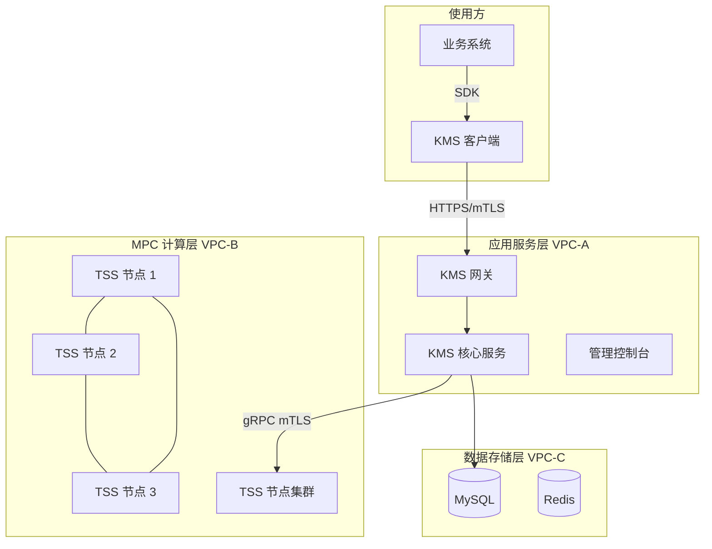
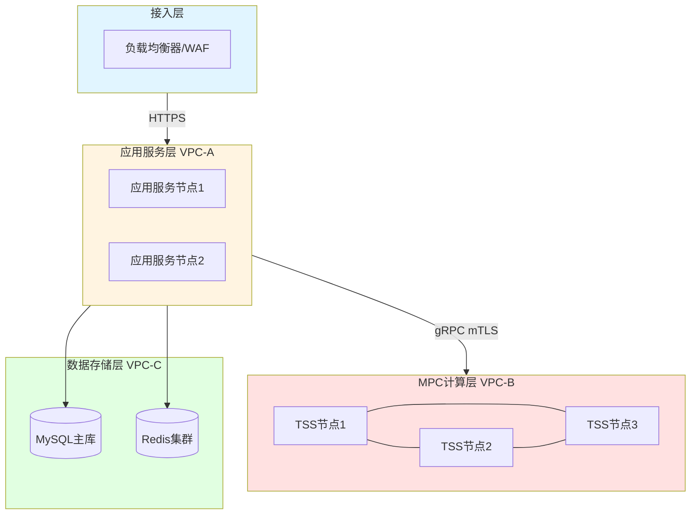
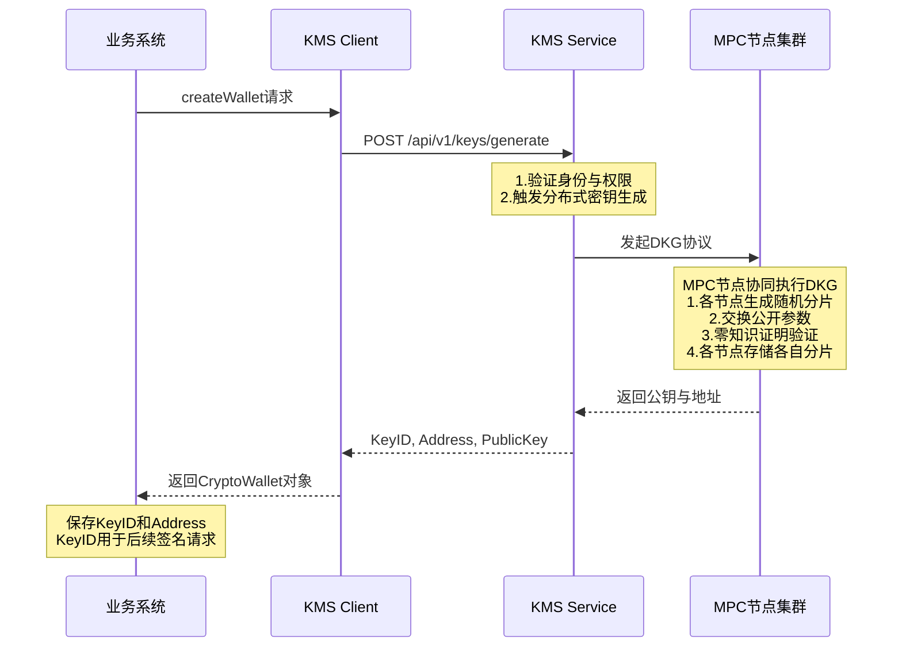
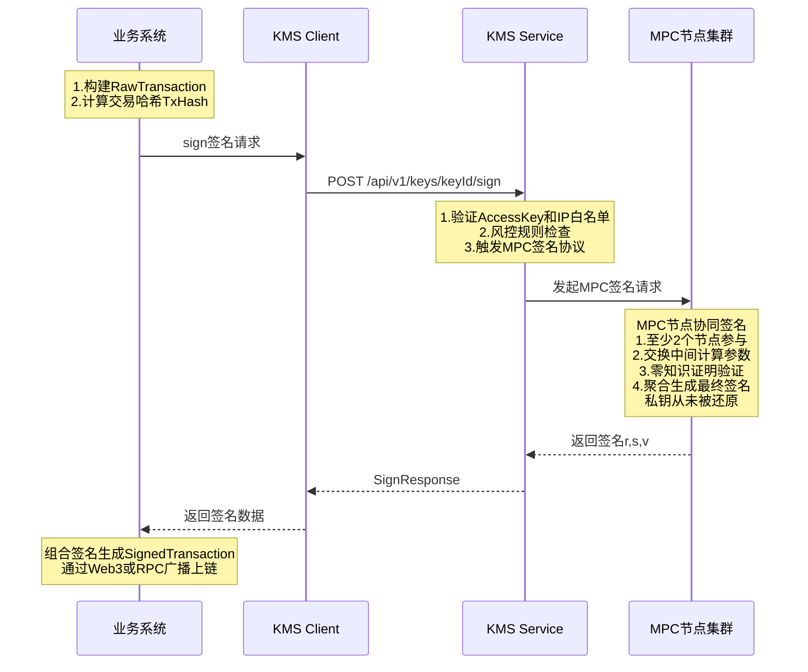
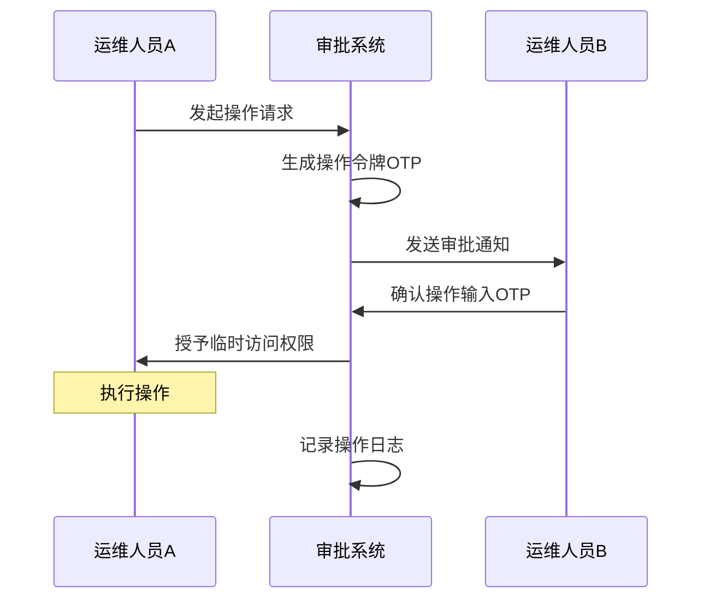

# 数字资产托管系统技术说明书

**文档编号：** KMS-TECH-SPEC-2026-001  
**版本：** 1.0  
**最后更新：** 2026年1月  
**文档性质：** 技术规格说明

---

## 目录

1. [系统概述](#1-系统概述)
2. [系统架构与网络安全](#2-系统架构与网络安全)
3. [核心业务流程](#3-核心业务流程)
4. [密钥管理与密码学实现](#4-密钥管理与密码学实现)
5. [运维安全与访问控制](#5-运维安全与访问控制)
6. [业务连续性与灾难恢复](#6-业务连续性与灾难恢复)
7. [审计日志与合规追溯](#7-审计日志与合规追溯)
8. [附录](#8-附录)

---

## 1. 系统概述

### 1.1 系统定位

本系统是一套基于多方安全计算（MPC, Multi-Party Computation）与门限签名方案（TSS, Threshold Signature Scheme）技术构建的企业级分布式密钥管理系统（KMS, Key Management Service）。系统为数字资产托管场景提供安全可靠的私钥管理与交易签名服务。

### 1.2 核心技术特性

| 特性 | 技术实现 | 说明 |
|------|---------|------|
| **无私钥存储** | MPC + TSS | 私钥从生成、使用到销毁，从未在任何单一节点的内存或磁盘中完整出现 |
| **门限签名** | (2, 3) 阈值方案 | 系统生成 3 个密钥分片，需至少 2 个分片参与才能生成有效签名 |
| **分布式架构** | 物理隔离部署 | 各分片存储于不同物理节点，节点间网络隔离 |
| **多链支持** | EVM / Bitcoin / TRON 等 | 支持主流区块链网络的地址生成与交易签名 |

### 1.3 支持的密码学算法

系统支持以下经过安全审计的 MPC 签名算法：

| 算法标识 | 算法名称 | 曲线类型 | 适用场景 |
|---------|---------|---------|---------|
| **GG18** | Gennaro-Goldfeder 2018 | SECP256K1 | ECDSA 签名（以太坊、比特币等） |
| **DMZ21** | Doerner-Mallesh-Zhao 2021 | SECP256K1 | ECDSA 签名（优化性能版本） |
| **DKLS23** | Doerner-Komlo-Lyubashevsky-Spooner 2023 | SECP256K1 | ECDSA 签名（两轮协议） |
| **EDDSA** | Edwards-curve DSA | ED25519 | EdDSA 签名（Solana 等） |
| **BLS** | Boneh-Lynn-Shacham | BLS12_381 | 聚合签名（以太坊 2.0 等） |

**默认配置：** 系统默认使用 **GG18** 算法（SECP256K1 曲线），可通过 API 参数指定其他算法。

### 1.4 遵循的技术标准

| 标准编号 | 标准名称 | 应用范围 |
|---------|---------|---------|
| NIST SP 800-57 Part 1 Rev 5 | 密钥管理建议 | 密钥生命周期管理 |
| NIST SP 800-90A | 确定性随机比特生成器 | 随机数生成 |
| FIPS 140-2 Level 3 | 密码模块安全要求 | HSM 集成标准（系统支持） |
| ISO 27001 | 信息安全管理体系 | 运维安全管理 |

---

## 2. 系统架构与网络安全

### 2.1 整体架构

系统采用分层架构设计，将业务逻辑与密钥管理完全解耦。各组件部署在独立的虚拟私有云（VPC）中，实现网络隔离。

**系统架构图：**




**网络拓扑架构图：**




### 2.2 组件说明

| 组件 | 功能说明 | 部署位置 |
|------|---------|---------|
| **业务系统** | 负责交易构建、nonce 管理、广播上链等业务逻辑。仅持有 KeyID，不接触任何私钥信息 | 使用方环境 |
| **KMS 客户端（SDK）** | 封装底层通信，提供 `generateKey`、`sign` 等高阶接口，负责请求签名与加密传输 | 使用方环境 |
| **KMS 网关** | 对外 API 入口，负责身份认证、请求路由、流量控制 | VPC-A |
| **KMS 核心服务** | 负责鉴权、风控策略检查及 MPC 任务调度 | VPC-A |
| **管理控制台** | 提供密钥管理、配置管理、审计查询的 Web 界面 | VPC-A |
| **TSS 节点集群** | 分布式部署的 MPC 计算节点，各节点持有密钥分片，协同完成签名计算 | VPC-B（物理隔离） |
| **MySQL** | 存储密钥元数据（KeyID、地址、分片分布信息），**不存储分片内容** | VPC-C |
| **Redis** | 缓存会话状态、限流计数等临时数据 | VPC-C |

### 2.3 网络隔离策略

系统采用严格的网络隔离策略，实现深度防御。

**VPC 隔离规则：**

| 网络层 | VPC 标识 | IP 网段 | 访问策略 |
|--------|---------|---------|---------|
| 公网接入层 | Public | - | 允许公网访问（通过 WAF 过滤） |
| 应用服务层 | VPC-A | 10.2.8.x/24 | 仅允许来自公网接入层的流量 |
| MPC 计算层 | VPC-B | 10.2.9.x/24 | **物理隔离**，仅允许来自 VPC-A 的流量 |
| 数据存储层 | VPC-C | 10.2.10.x/24 | 仅允许来自 VPC-A 的流量 |

**防火墙规则：**

**应用服务层入站规则：**
| 来源 | 端口 | 协议 | 说明 |
|------|------|------|------|
| 负载均衡器 IP 段 | 8080 | TCP | 网关 API 服务 |
| 负载均衡器 IP 段 | 8880 | TCP | 管理控制台 |
| — | — | — | **拒绝所有其他入站流量** |

**应用服务层出站规则：**
| 目标 | 端口 | 协议 | 说明 |
|------|------|------|------|
| TSS 节点 IP 段 (10.2.9.0/24) | 9000 | TCP | gRPC over mTLS |
| MySQL (10.2.10.0/24) | 3306 | TCP | 数据库连接 |
| Redis (10.2.10.0/24) | 6379 | TCP | 缓存连接 |
| — | — | — | **拒绝所有其他出站流量**（包括公网） |

**MPC 计算层（TSS 节点）规则：**
| 方向 | 来源/目标 | 端口 | 策略 |
|------|---------|------|------|
| 入站 | VPC-A (10.2.8.0/24) | 9000 | 允许 gRPC over mTLS |
| 入站 | 其他 | — | **拒绝所有**（包括公网） |
| 出站 | — | — | **拒绝所有出站流量** |

> **安全说明：** MPC 计算层采用"拒绝所有出站流量"策略。即便攻击者突破 TSS 节点，也无法将密钥分片数据传输至外部服务器，从根本上阻断数据外泄路径。

### 2.4 通信加密机制

**外部通信（客户端 → 网关）：**
| 协议 | 加密套件 | 证书管理 |
|------|---------|---------|
| HTTPS (TLS 1.2+) | TLS_ECDHE_RSA_WITH_AES_256_GCM_SHA384 等强加密套件 | 使用受信任 CA 签发的 SSL 证书 |

**内部通信（网关 → TSS 节点）：**
| 协议 | 认证方式 | 说明 |
|------|---------|------|
| gRPC over mTLS | 双向 TLS 认证 | 通信双方必须同时验证对方证书的有效性 |

**mTLS 证书配置：**
- 每个 TSS 节点拥有独立的 X.509 证书（由内部 CA 签发）
- 网关节点拥有独立的 X.509 证书（由内部 CA 签发）
- 未持有有效证书的连接请求将被拒绝

**证书层级结构：**
```
CA 根证书 (ca.cert, ca.key)
├── Gateway 证书 (gateway.cert, gateway.key)
└── TSS 节点证书
    ├── tss1.cert, tss1.key
    ├── tss2.cert, tss2.key
    └── tss3.cert, tss3.key
```

**证书存储路径：**
- CA 根证书：`/opt/kms/tss-server/certs/ca.cert`
- 节点证书：`/opt/kms/tss-server/certs/{node_id}/{node_id}.cert`
- 节点私钥：`/opt/kms/tss-server/certs/{node_id}/{node_id}.key`

**证书轮换：** 证书有效期 1 年，系统在到期前 30 天自动提醒进行轮换。

---

## 3. 核心业务流程

### 3.1 钱包创建流程

业务系统申请新钱包地址时，KMS 通过 MPC 协议生成密钥分片并返回唯一的 KeyID。

**流程图：**




**关键安全特性：**
1. **私钥从未完整出现：** 在密钥生成过程中，每个节点独立生成随机分片，私钥从未在任何节点的内存或磁盘中完整出现
2. **零知识证明：** 各节点通过零知识证明验证其他节点分片的有效性，无需暴露分片内容
3. **分片隔离存储：** 生成的 3 个分片存储在不同的物理节点，节点间网络隔离

### 3.2 交易签名流程

业务系统构建未签名的交易哈希，请求 KMS 进行签名。

**流程图：**




**关键安全特性：**
1. **私钥不还原：** 签名过程中，各节点交换中间计算参数，直接合成最终签名，私钥从未被还原
2. **门限控制：** 采用 (2, 3) 阈值方案，至少 2 个节点参与才能生成有效签名
3. **双重验证：** 请求需通过身份认证（AccessKey）和风控规则检查

### 3.3 支持的钱包操作

| 功能 | API 端点 | 说明 |
|------|---------|------|
| 创建钱包 | `POST /api/v1/keys/generate` | 生成密钥分片，返回 KeyID 和地址 |
| 查询详情 | `GET /api/v1/keys/{keyId}` | 查询钱包地址、公钥及状态 |
| 交易签名 | `POST /api/v1/keys/{keyId}/sign` | 对交易哈希进行 MPC 签名 |
| 消息签名 | `POST /api/v1/keys/{keyId}/sign` | 支持 EIP-191、EIP-712 格式 |
| 状态管理 | `PUT /api/v1/keys/{keyId}/status` | 激活、冻结、归档钱包 |

### 3.4 接口集成说明

业务方通过 KMS Client SDK 接入系统，主要配置参数如下：

| 参数 | 说明 | 备注 |
|------|------|------|
| `kms.gateway.baseUrl` | KMS 服务地址 | 内网或公网通过 HTTPS 访问 |
| `kms.gateway.accessKey` | 访问密钥 ID | 标识应用身份 |
| `kms.gateway.secretKey` | 访问密钥 Secret | 用于请求签名，支持加密存储 |
| `retry.policy` | 重试策略 | 建议配置指数退避策略 |

**SDK 使用示例（Java）：**
```java
// 1. 初始化 Client
KmsHighLevelClient client = new KmsHighLevelClientImpl(lowLevelClient);

// 2. 生成钱包地址
GenerateKeyRequest req = new GenerateKeyRequest();
req.setFormat(new KeyFormat("ECC", "SECP256K1", "GG18", 32));
req.setShardProperties(new ShardProperties(3, 2));  // (2, 3) 阈值

GenerateKeyResponse keyResp = client.generateKey(req);
String keyId = keyResp.getKeyId();
String address = keyResp.getAddress();

// 3. 交易签名
SignRequest signReq = new SignRequest();
signReq.setData(txHash);
signReq.setDataType("HASH");

SignResponse signResp = client.sign(keyId, signReq);
String signature = signResp.getSignature();  // RSV 格式签名
```

---

## 4. 密钥管理与密码学实现

### 4.1 密钥生成与分片

**分片配置：**

| 参数 | 值 | 说明 |
|------|---|------|
| ShardCount（分片总数） | 3 | 系统生成 3 个私钥分片 |
| Threshold（门限阈值） | 2 | 至少 2 个分片参与才能签名 |

**生成机制：**
- 采用分布式密钥生成（DKG, Distributed Key Generation）协议
- 密钥生成过程中，私钥从未在任何单一节点中完整出现
- 各节点仅持有自己的分片，无法推算出完整私钥

**密钥规格：**
```json
{
  "format": {
    "type": "ECC",
    "curve": "SECP256K1",
    "algo_type": "GG18",
    "size": 32
  },
  "shard_properties": {
    "shard_count": 3,
    "threshold": 2
  }
}
```

### 4.2 随机数生成

系统采用多层随机数生成策略，确保密码学安全性。

| 层级 | 来源 | 标准 |
|------|------|------|
| 操作系统级 | Linux `/dev/urandom` | 密码学安全伪随机数生成器 |
| 库级 | CSPRNG | NIST SP 800-90A 认证 |
| 算法级 | MPC 协议内置 RNG | 经安全审计的密码学库实现 |

**NIST 测试验证：** 所有生成的随机数通过 NIST Statistical Test Suite 的 15 项核心测试。

**随机数使用场景：**
1. 密钥生成：私钥分片的生成
2. MPC 协议：零知识证明中的随机挑战值
3. 签名过程：ECDSA 签名中的随机数 k（如算法需要）

### 4.3 静态数据加密（Encryption at Rest）

所有密钥分片在落地存储前，均经过多层加密保护。

**存储架构：**
| 数据类型 | 存储位置 | 加密方式 |
|---------|---------|---------|
| 密钥分片 | TSS 节点本地 LevelDB | AES-256-GCM 加密 |
| 元数据（KeyID、地址、分片分布） | MySQL | 不含分片内容 |

**存储路径：**
```
TSS 节点本地：
└── /opt/kms/tss-server/data/leveldb_{node_id}/  (加密的分片数据)

证书目录：
└── /opt/kms/tss-server/certs/{node_id}/
    ├── {node_id}.cert    (节点证书)
    ├── {node_id}.key     (节点私钥)
    └── {node_id}.dek     (加密的 DEK 文件)
```

**加密层级：**

```
密钥分片明文 (仅存在于内存)
    ↓ AES-256-GCM 加密
密钥分片密文 (存储在 LevelDB)
    ↓ 使用 DEK 加密
DEK 密文 (存储在 .dek 文件)
    ↓ 使用密码保护
密码 (由信息安全专员保管，启动时输入)
```

**DEK（Data Encryption Key）管理：**
| 特性 | 说明 |
|------|------|
| 存储方式 | 使用密码加密后存储在 `{node_id}.dek` 文件 |
| 内存驻留 | 服务启动时解密，仅存在于易失性内存中，不写入磁盘 |
| 物理分离 | DEK 文件与分片数据存储在不同目录路径 |
| 密钥派生 | 使用 PBKDF2（迭代次数 ≥ 10000）从密码派生加密密钥 |

> **防"拔硬盘"攻击：** 服务器断电后，内存中的 DEK 立即消失，磁盘上的分片数据变为无法解密的密文。

### 4.4 零知识证明（Zero-Knowledge Proof）

在 MPC 签名过程中，各节点通过零知识证明验证其他节点参数的正确性，无需暴露分片内容。

**密钥生成阶段（DKG）：**
1. 每个节点生成秘密分片 `s_i`
2. 使用零知识证明证明 `s_i` 的有效性（证明知道离散对数）
3. 其他节点验证证明，但无法获取 `s_i` 的值

**签名阶段：**
1. 参与签名的节点交换中间参数（如：`R_i = k_i × G`）
2. 使用零知识证明验证 `R_i` 的正确性（证明知道 `k_i`）
3. 最终签名 `(r, s)` 通过 MPC 协议计算得出

**安全保证：**
| 属性 | 说明 |
|------|------|
| 隐私性 | 任何节点无法获取其他节点的分片 |
| 正确性 | 通过零知识证明确保分片的有效性 |
| 可验证性 | 所有节点可以验证最终签名的正确性 |

### 4.5 硬件安全模块（HSM）集成

系统支持与硬件安全模块（HSM）集成，用于存储根密钥，进一步提升安全等级。

**支持的 HSM 类型：**
| 类型 | 示例 | 认证级别 |
|------|------|---------|
| 云 HSM | AWS CloudHSM、Azure Dedicated HSM | FIPS 140-2 Level 3 |
| 本地 HSM | Thales Luna、Utimaco | FIPS 140-2 Level 3 |

**HSM 使用场景：**
```
HSM 中的根密钥 (Master Key)
    ↓ (用于加密)
DEK (Data Encryption Key) - 存储在节点本地
    ↓ (用于加密)
密钥分片 (Key Shard) - 存储在 TSS 节点 LevelDB
```

---

## 5. 运维安全与访问控制

### 5.1 访问控制架构

系统采用三层访问控制架构，所有运维操作必须通过堡垒机进行。

**访问路径：**

```
公网/VPN
    ↓ SSH (密钥认证)
堡垒机 (Bastion Host)
    ↓ SSH (密钥认证)
应用服务节点 (Gateway/Console)
    ↓ SSH (密钥认证 + 双人复核)
MPC 计算节点 (TSS 节点)
```

**堡垒机机制：**
| 特性 | 说明 |
|------|------|
| 部署位置 | 独立服务器，仅允许特定 IP 段访问 |
| 认证方式 | SSH 密钥认证（ED25519 或 RSA-4096） |
| 审计记录 | 所有 SSH 会话记录（包括命令历史） |
| 会话录像 | 可选，根据合规要求开启 |

### 5.2 双人复核（4-Eyes Principle）

对于关键操作，系统强制执行双人复核机制。

**适用场景：**
- TSS 节点的 SSH 登录
- 密钥生成仪式（Key Ceremony）
- 系统配置修改
- 证书轮换操作

**操作流程：**




**日志记录内容：** 操作发起人、确认人、操作时间、操作内容、操作结果。

### 5.3 SSH 密钥管理

| 项目 | 规范 |
|------|------|
| 密钥类型 | ED25519（首选）或 RSA-4096 |
| 本地存储 | 加密存储（使用密码保护） |
| 服务器端 | 公钥存储在 `~/.ssh/authorized_keys` |
| 轮换周期 | 每 90 天轮换一次 |

**访问限制：**
- TSS 节点：仅允许来自应用服务节点的 SSH 连接
- 应用服务节点：仅允许来自堡垒机的 SSH 连接

### 5.4 代码发布与可信构建

**构建流程：**
1. **源代码审计：** 代码提交前进行安全审计
2. **自动化构建：** 使用 Docker 容器进行可重复构建
3. **二进制签名：** 使用代码签名证书对二进制文件进行签名
4. **哈希计算：** 计算 SHA-256 哈希值，存储在发布清单

**部署验证：**
```bash
# 1. 验证二进制签名
codesign --verify --verbose tss-server

# 2. 验证哈希值
sha256sum tss-server | diff - tss-server.sha256.expected

# 3. 验证发布清单
gpg --verify release-manifest.asc
```

**版本管理：**
- 使用语义化版本号（Semantic Versioning）
- 保留最近 3 个版本的二进制文件用于回滚
- 回滚操作需要双人复核

### 5.5 密钥生成仪式（Key Ceremony）

系统初始化及根密钥生成采用严格的仪式流程。

**参与人员：**
| 角色 | 人数 | 职责 |
|------|------|------|
| 信息安全专员 | 2 人 | 必须同时在场，执行密钥生成 |
| 系统管理员 | 1 人 | 负责系统操作 |
| 审计人员 | 1 人 | 负责记录和见证 |

**仪式流程：**

**阶段 1：环境准备**
1. 确认所有 TSS 节点处于初始状态（无密钥数据）
2. 确认网络隔离正常
3. 确认所有节点证书已正确部署

**阶段 2：根密钥生成**
1. 信息安全专员 A 在专用服务器上生成 CA 根密钥
2. 信息安全专员 B 验证生成过程
3. 将根密钥备份到 HSM（如使用）
4. 销毁临时文件

**阶段 3：节点密钥生成**
1. 为每个 TSS 节点生成 DEK
2. 使用密码加密 DEK（密码由两位专员分别保管一部分）
3. 将加密后的 DEK 分发到各节点
4. 验证各节点 DEK 正确性

**阶段 4：系统初始化**
1. 启动所有 TSS 节点（需输入 DEK 密码）
2. 执行首次密钥生成测试
3. 验证测试密钥的签名功能
4. 销毁测试密钥

**阶段 5：仪式完成**
1. 所有参与人员签署仪式记录
2. 将仪式记录归档（加密存储）
3. 系统正式上线

**仪式记录模板：**

```
=====================================
密钥生成仪式记录
=====================================

日期：____年____月____日
时间：____:____ - ____:____
地点：____________________

参与人员：
┌────────────────┬──────────────┬──────────────┐
│ 角色           │ 姓名         │ 签名         │
├────────────────┼──────────────┼──────────────┤
│ 信息安全专员 A │              │              │
│ 信息安全专员 B │              │              │
│ 系统管理员     │              │              │
│ 审计人员       │              │              │
└────────────────┴──────────────┴──────────────┘

仪式步骤确认：
[ ] 1. 环境准备完成（网络隔离验证、节点初始状态确认）
[ ] 2. CA 根密钥生成完成
[ ] 3. 节点 DEK 生成完成
[ ] 4. 系统初始化完成
[ ] 5. 测试验证通过

异常记录：
__________________________________________________
__________________________________________________

归档位置：/secure/ceremony-records/____-__-__/

签署确认：
本人确认上述记录真实准确，仪式过程符合安全规范要求。

信息安全专员 A 签名：______________ 日期：__________
信息安全专员 B 签名：______________ 日期：__________
系统管理员签名：    ______________ 日期：__________
审计人员签名：      ______________ 日期：__________
=====================================
```

---

## 6. 业务连续性与灾难恢复

### 6.1 恢复场景与指标

| 灾难级别 | 场景描述 | 应对策略 | RTO | RPO |
|---------|---------|---------|-----|-----|
| L1 | 单个 TSS 节点故障 | 自动隔离故障节点，依靠剩余节点维持服务 | < 30 分钟 | 0（实时冗余） |
| L2 | 数据中心级损毁 | 启动异地冷备份，执行密钥恢复仪式重建节点 | < 4 小时 | < 24 小时 |
| L3 | 数据库故障 | 切换至备用数据库 | < 1 小时 | < 1 小时 |

> **说明：**  
> - RTO（Recovery Time Objective）：恢复时间目标  
> - RPO（Recovery Point Objective）：数据丢失上限

### 6.2 场景 1：单个 TSS 节点故障

**影响范围：** 该节点上的密钥分片暂时不可用。由于采用 (2, 3) 阈值配置，系统仍可正常运行。

**恢复步骤：**

1. **故障检测（自动）**
   - 监控系统检测到节点无响应
   - 网关服务自动将该节点标记为不可用

2. **数据恢复（手动，需双人复核）**
   ```bash
   # 步骤 1：在新服务器上部署 TSS 节点
   # 步骤 2：从冷备份恢复数据
   rsync -avz backup-server:/backup/tss1/data/ /opt/kms/tss-server/data/
   
   # 步骤 3：恢复证书文件
   rsync -avz backup-server:/backup/tss1/certs/ /opt/kms/tss-server/certs/
   
   # 步骤 4：启动服务（需输入 DEK 密码）
   ./start.sh tss1
   
   # 步骤 5：验证节点健康状态
   curl -k https://10.2.9.104:9000/health
   ```

3. **验证恢复**
   - 使用测试密钥进行签名测试
   - 确认签名成功后恢复正常服务

### 6.3 场景 2：数据中心级损毁

**影响范围：** 多个 TSS 节点同时不可用。

**恢复步骤：**

1. **评估损失**
   - 确认受影响的节点列表

2. **从冷备份恢复**
   ```bash
   # 挂载冷备份设备
   mount /dev/sdb1 /mnt/backup
   
   # 恢复数据目录
   tar -xzf /mnt/backup/tss1_data.tar.gz -C /opt/kms/tss-server/data/
   
   # 恢复证书
   tar -xzf /mnt/backup/tss1_certs.tar.gz -C /opt/kms/tss-server/certs/
   
   # 启动所有恢复的节点
   for node in tss1 tss2; do
     ./start.sh $node
     # 输入 DEK 密码
   done
   ```

3. **数据一致性验证**
   - 验证密钥元数据一致性
   - 验证节点配置

4. **功能验证**
   - 使用受影响节点上的密钥进行签名测试

### 6.4 备份策略

| 数据类型 | 备份频率 | 备份位置 | 保留期限 |
|---------|---------|---------|---------|
| TSS 节点数据 | 每日一次（凌晨 2 点） | 冷存储（物理隔离） | 30 天 |
| 数据库 | 每小时一次 | 热备份（主从复制） | 7 天 |
| 证书文件 | 每周一次 | 冷存储（加密） | 1 年 |
| 配置文件 | 每次变更 | 版本控制系统（Git） | 永久 |

**备份安全措施：**
- 备份操作需要双人复核
- 备份日志记录在审计系统
- 每周验证备份文件完整性
- 备份传输使用 GPG 加密

**TSS 节点数据备份脚本示例：**

```bash
#!/bin/bash
# 备份脚本：/opt/kms/scripts/backup_tss.sh
# 执行频率：每日凌晨 2 点（crontab）
# 需要权限：双人复核（运维人员 A 执行，运维人员 B 确认）

set -e

# === 配置参数 ===
BACKUP_DATE=$(date +%Y%m%d)
BACKUP_DIR="/backup/tss/$BACKUP_DATE"
COLD_STORAGE="/mnt/cold-storage"
NODE_ID="tss1"

echo "[$(date)] 开始备份 $NODE_ID ..."

# === 步骤 1：创建备份目录 ===
mkdir -p "$BACKUP_DIR"

# === 步骤 2：创建数据快照 ===
tar -czf "$BACKUP_DIR/${NODE_ID}_data.tar.gz" \
  -C /opt/kms/tss-server data/leveldb_${NODE_ID}

# === 步骤 3：备份证书 ===
tar -czf "$BACKUP_DIR/${NODE_ID}_certs.tar.gz" \
  -C /opt/kms/tss-server certs/${NODE_ID}

# === 步骤 4：计算哈希值（完整性校验） ===
sha256sum "$BACKUP_DIR/${NODE_ID}_data.tar.gz" > "$BACKUP_DIR/${NODE_ID}_data.sha256"
sha256sum "$BACKUP_DIR/${NODE_ID}_certs.tar.gz" > "$BACKUP_DIR/${NODE_ID}_certs.sha256"

# === 步骤 5：GPG 加密后传输到冷存储 ===
gpg --encrypt --recipient backup@example.com \
  "$BACKUP_DIR/${NODE_ID}_data.tar.gz"

scp -i /opt/kms/backup_key \
  "$BACKUP_DIR/${NODE_ID}_data.tar.gz.gpg" \
  backup-server:/cold-storage/${NODE_ID}/

# === 步骤 6：验证传输完整性 ===
REMOTE_HASH=$(ssh backup-server "sha256sum /cold-storage/${NODE_ID}/${NODE_ID}_data.tar.gz.gpg" | awk '{print $1}')
LOCAL_HASH=$(sha256sum "$BACKUP_DIR/${NODE_ID}_data.tar.gz.gpg" | awk '{print $1}')

if [ "$REMOTE_HASH" != "$LOCAL_HASH" ]; then
  echo "[ERROR] 备份传输完整性校验失败！"
  exit 1
fi

# === 步骤 7：记录备份日志 ===
echo "$BACKUP_DATE $(date '+%Y-%m-%d %H:%M:%S') $NODE_ID backup completed" \
  >> /var/log/kms_backup.log

echo "[$(date)] 备份完成：$NODE_ID"
```

**自动清理脚本（保留 30 天）：**

```bash
#!/bin/bash
# 清理 30 天前的备份
find /backup/tss -type f -mtime +30 -delete
find /mnt/cold-storage -type f -mtime +30 -delete
echo "[$(date)] 备份清理完成"
```

---

## 7. 审计日志与合规追溯

### 7.1 日志记录范围

系统对所有关键操作进行完整记录，支持事后审计与合规追溯。

**记录的事件类型：**

| 事件类型 | 说明 | 记录内容 |
|---------|------|---------|
| KEY_GENERATE | 密钥生成 | KeyID、公钥、地址、请求者 |
| KEY_SIGN | 密钥签名 | KeyID、数据哈希、签名结果、耗时 |
| KEY_REFRESH | 密钥刷新 | KeyID、刷新原因 |
| KEY_DESTROY | 密钥销毁 | KeyID、销毁原因、审批信息 |
| APPROVAL_REQUEST | 审批请求 | 请求 ID、操作类型、请求者 |
| APPROVAL_RESULT | 审批结果 | 请求 ID、审批者、审批结果 |
| ADMIN_LOGIN | 管理员登录 | 用户 ID、IP 地址、登录结果 |
| CONFIG_CHANGE | 配置变更 | 配置项、旧值、新值、操作者 |
| NODE_START/STOP | 节点启停 | 节点 ID、操作时间、操作者 |
| BACKUP_CREATE/RESTORE | 备份操作 | 备份路径、哈希值、操作者 |

### 7.2 日志格式规范

**标准日志结构（JSON 格式）：**

```json
{
  "timestamp": "2025-01-01T10:00:00.123Z",
  "level": "INFO",
  "service": "gw-server",
  "node_id": "gateway-1",
  "event_type": "KEY_SIGN",
  "user_id": "user_12345",
  "request_id": "req_abc123",
  "key_id": "28HowEifVCeJzWRr9ztXVYBoFkZ",
  "operation": "sign",
  "data_hash": "sha256:abc123...",
  "result": "SUCCESS",
  "signature": "0xb3baa751...",
  "duration_ms": 145,
  "ip_address": "10.2.8.100",
  "audit_trail": {
    "who": "user_12345",
    "what": "KEY_SIGN",
    "when": "2025-01-01T10:00:00.123Z",
    "where": "gateway-1:10.2.8.100",
    "result": "SUCCESS"
  }
}
```

**审计追踪字段（audit_trail）：**

| 字段 | 说明 |
|------|------|
| who | 操作者（用户 ID 或系统标识） |
| what | 操作内容（事件类型） |
| when | 操作时间（ISO 8601 格式） |
| where | 操作位置（节点 ID:IP） |
| result | 操作结果 |

### 7.3 防篡改机制

**哈希链签名：**

每条日志记录包含前一条日志的哈希值，形成不可篡改的链式结构：

```
Log[0]: {data: "...", prev_hash: null, hash: H0}
Log[1]: {data: "...", prev_hash: H0, hash: H1}
Log[2]: {data: "...", prev_hash: H1, hash: H2}
...
```

任何对历史日志的删除或修改都会导致后续所有日志的哈希验证失败，从而立即暴露篡改行为。

**哈希链实现代码（Python 示例）：**

```python
import hashlib
import json
from datetime import datetime
from cryptography.hazmat.primitives import hashes
from cryptography.hazmat.primitives.asymmetric import padding

class AuditLogger:
    """
    审计日志记录器
    - 实现哈希链防篡改机制
    - 支持数字签名验证
    """
    
    def __init__(self, log_file: str, signing_key):
        self.log_file = log_file
        self.signing_key = signing_key
        self.prev_hash = self._load_last_hash()
    
    def _load_last_hash(self) -> str:
        """加载最后一条日志的哈希值"""
        try:
            with open(self.log_file, 'r') as f:
                lines = f.readlines()
                if lines:
                    last_entry = json.loads(lines[-1])
                    return last_entry.get('hash')
        except FileNotFoundError:
            pass
        return None
    
    def log(self, event_data: dict):
        """记录一条审计日志"""
        # 构建日志条目
        log_entry = {
            "timestamp": datetime.utcnow().isoformat() + "Z",
            "data": event_data,
            "prev_hash": self.prev_hash
        }
        
        # 计算当前日志的哈希值
        log_json = json.dumps(log_entry, sort_keys=True)
        log_hash = hashlib.sha256(log_json.encode()).hexdigest()
        log_entry["hash"] = log_hash
        
        # 使用私钥签名
        signature = self._sign(log_entry)
        log_entry["signature"] = signature
        
        # 写入日志文件（追加模式）
        with open(self.log_file, "a") as f:
            f.write(json.dumps(log_entry) + "\n")
        
        # 更新前一条哈希
        self.prev_hash = log_hash
    
    def _sign(self, data: dict) -> str:
        """使用 RSA 私钥签名"""
        signature = self.signing_key.sign(
            json.dumps(data, sort_keys=True).encode(),
            padding.PSS(
                mgf=padding.MGF1(hashes.SHA256()),
                salt_length=padding.PSS.MAX_LENGTH
            ),
            hashes.SHA256()
        )
        return signature.hex()
    
    def verify(self) -> bool:
        """验证日志文件的完整性"""
        prev_hash = None
        
        with open(self.log_file, "r") as f:
            for line_num, line in enumerate(f, 1):
                log_entry = json.loads(line)
                
                # 验证哈希链
                if prev_hash and log_entry["prev_hash"] != prev_hash:
                    raise ValueError(
                        f"哈希链断裂！行号: {line_num}, "
                        f"预期: {prev_hash}, 实际: {log_entry['prev_hash']}"
                    )
                
                # 验证哈希值计算正确性
                stored_hash = log_entry.pop("hash")
                stored_sig = log_entry.pop("signature")
                
                calculated_hash = hashlib.sha256(
                    json.dumps(log_entry, sort_keys=True).encode()
                ).hexdigest()
                
                if calculated_hash != stored_hash:
                    raise ValueError(f"哈希值不匹配！行号: {line_num}")
                
                log_entry["hash"] = stored_hash
                log_entry["signature"] = stored_sig
                prev_hash = stored_hash
        
        return True

# === 使用示例 ===
# logger = AuditLogger("/var/log/kms/audit.log", signing_key)
# logger.log({
#     "event_type": "KEY_SIGN",
#     "key_id": "28HowEifVCeJzWRr9ztXVYBoFkZ",
#     "user_id": "user_12345",
#     "result": "SUCCESS"
# })
# logger.verify()  # 验证日志完整性
```

**WORM 存储（Write Once Read Many）：**

| 措施 | 说明 |
|------|------|
| 文件只读 | 日志文件写入后立即设置为只读权限 |
| 远程同步 | 实时同步到远程 WORM 存储 |
| 不可删除 | 使用 `chattr +i` 或云存储 WORM 策略 |
| 保留期限 | 7 年（符合合规要求） |

### 7.4 日志存储与保留

| 存储位置 | 保留期限 | 访问权限 |
|---------|---------|---------|
| 本地日志文件 | 30 天 | 仅系统管理员（只读） |
| 远程 WORM 存储 | 7 年 | 仅审计人员（只读） |
| 数据库（摘要） | 1 年 | 系统管理员（查询） |

**完整性验证：**
- 每日自动验证日志哈希链完整性
- 对比本地与远程备份的哈希值
- 发现异常立即告警

---

## 8. 附录

### 8.1 术语表

| 术语 | 英文全称 | 说明 |
|------|---------|------|
| MPC | Multi-Party Computation | 多方计算，一种密码学协议，允许多方共同计算而不泄露各自输入 |
| TSS | Threshold Signature Scheme | 阈值签名方案，需要达到阈值数量的参与方才能生成有效签名 |
| DKG | Distributed Key Generation | 分布式密钥生成，多方协同生成密钥的协议 |
| DEK | Data Encryption Key | 数据加密密钥，用于加密实际数据 |
| KEK | Key Encryption Key | 密钥加密密钥，用于加密 DEK |
| HSM | Hardware Security Module | 硬件安全模块，专用于密钥存储和密码学运算的硬件设备 |
| mTLS | Mutual TLS | 双向 TLS 认证，通信双方互相验证证书 |
| WORM | Write Once Read Many | 一次写入多次读取，用于审计日志的不可篡改存储 |
| RTO | Recovery Time Objective | 恢复时间目标，系统恢复所需的最长时间 |
| RPO | Recovery Point Objective | 恢复点目标，可接受的最大数据丢失量 |
| VPC | Virtual Private Cloud | 虚拟私有云，隔离的云网络环境 |
| ECDSA | Elliptic Curve Digital Signature Algorithm | 椭圆曲线数字签名算法 |

### 8.2 参考标准

| 标准编号 | 标准名称 | 应用范围 |
|---------|---------|---------|
| FIPS 140-2 | 密码模块安全要求 | HSM 认证标准 |
| NIST SP 800-57 | 密钥管理建议 | 密钥生命周期管理 |
| NIST SP 800-90A | 确定性随机比特生成器 | 随机数生成 |
| ISO 27001 | 信息安全管理体系 | 运维安全管理 |
| PCI DSS | 支付卡行业数据安全标准 | 支付场景（如适用） |

### 8.3 算法参考文献

| 算法 | 论文 | 安全假设 |
|------|------|---------|
| GG18 | Gennaro, R., & Goldfeder, S. (2018). "Fast Multiparty Threshold ECDSA with Fast Trustless Setup" | 离散对数问题（DLP） |
| DMZ21 | Doerner, J., et al. (2021). "Threshold ECDSA from ECDSA Assumptions: The Multiparty Case" | 标准 ECDSA 安全假设 |
| DKLS23 | Doerner, J., et al. (2023). "Two-Round Threshold Signatures with FROST" | 随机预言机模型（ROM） |

### 8.4 版本历史

| 版本 | 日期 | 修订说明 |
|------|------|---------|
| 1.0 | 2026-01 | 初始版本 |

---

**文档编制：** 本公司技术部门  
**文档性质：** 技术规格说明  
**适用范围：** 数字资产托管业务
