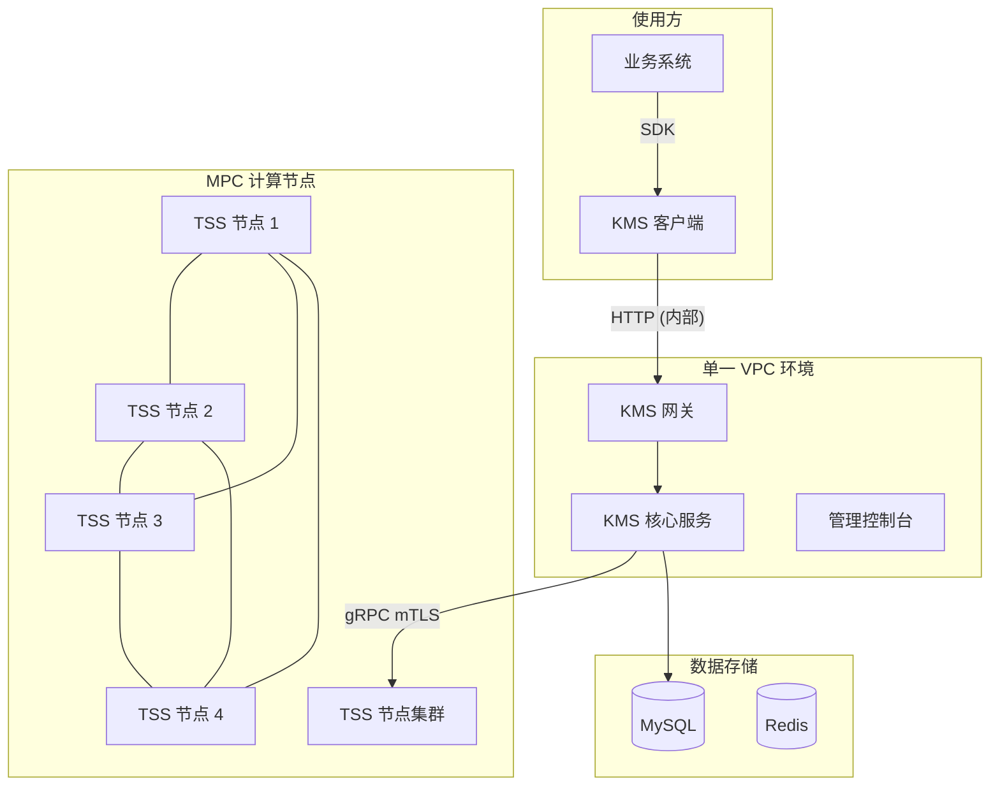
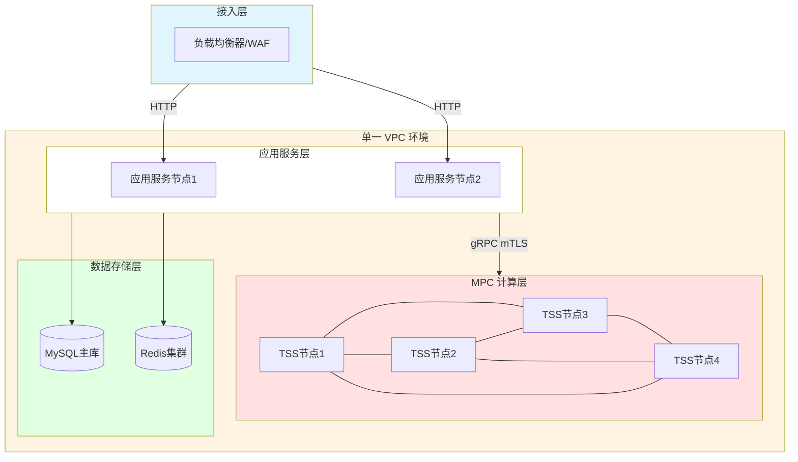
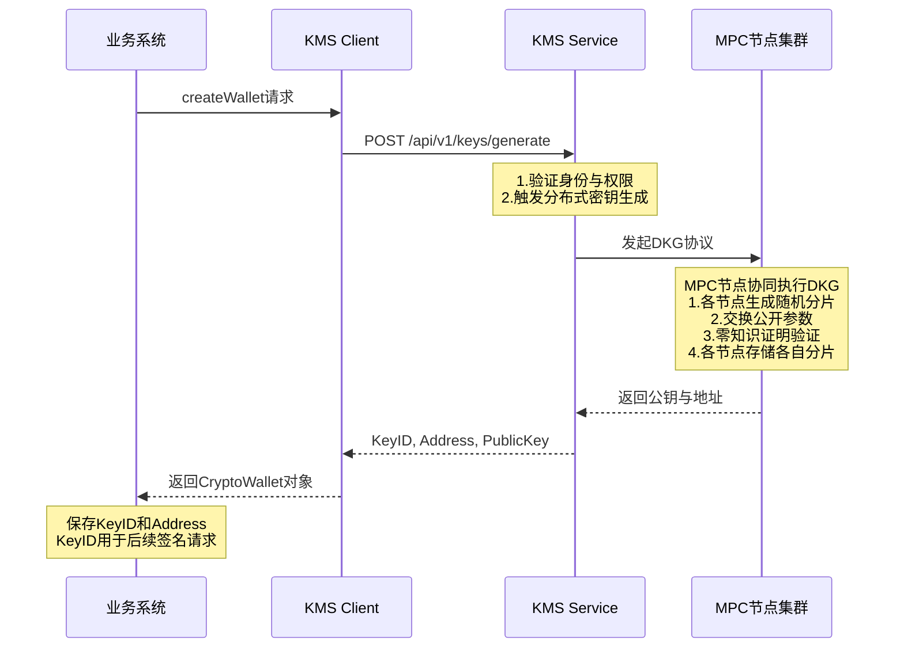
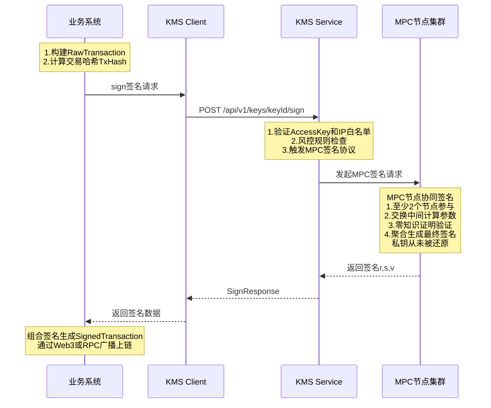

# 数字资产托管系统技术说明书

**文档编号：** KMS-TECH-SPEC-2026-001  
**版本：** 1.0  
**最后更新：** 2026年1月  
**文档性质：** 技术规格说明

---

## 目录

1. [系统概述](#1-系统概述)
2. [系统架构与网络安全](#2-系统架构与网络安全)
3. [核心业务流程](#3-核心业务流程)
4. [密钥管理与密码学实现](#4-密钥管理与密码学实现)
5. [运维安全与访问控制](#5-运维安全与访问控制)
6. [业务连续性与灾难恢复](#6-业务连续性与灾难恢复)
7. [审计日志与合规追溯](#7-审计日志与合规追溯)
8. [附录](#8-附录)

---

## 1. 系统概述

### 1.1 系统定位

本系统是一套基于多方安全计算（MPC, Multi-Party Computation）与门限签名方案（TSS, Threshold Signature Scheme）技术构建的企业级分布式密钥管理系统（KMS, Key Management Service）。系统为数字资产托管场景提供安全可靠的私钥管理与交易签名服务。

### 1.2 核心技术特性

| 特性           | 技术实现                | 说明                                                                                                                                         |
| -------------- | ----------------------- | -------------------------------------------------------------------------------------------------------------------------------------------- |
| **无私钥存储** | MPC + TSS               | 私钥从生成、使用到销毁，从未在任何单一节点的内存或磁盘中完整出现                                                                             |
| **门限签名**   | (2, 3) 阈值方案         | 系统部署 4 个计算节点，生成 3 个密钥分片，需至少 2 个分片参与才能生成有效签名。4 节点架构确保单节点升级或故障时，仍有 3 个节点可用于创建密钥 |
| **分布式架构** | 逻辑隔离部署            | 各分片存储于不同节点，节点间通过逻辑网络隔离                                                                                                 |
| **多链支持**   | EVM / Bitcoin / TRON 等 | 支持主流区块链网络的地址生成与交易签名                                                                                                       |

### 1.3 支持的密码学算法

系统支持以下经过安全审计的 MPC 签名算法：

| 算法标识   | 算法名称                                | 曲线类型  | 适用场景                       |
| ---------- | --------------------------------------- | --------- | ------------------------------ |
| **GG18**   | Gennaro-Goldfeder 2018                  | SECP256K1 | ECDSA 签名（以太坊、比特币等） |
| **DMZ21**  | Doerner-Mallesh-Zhao 2021               | SECP256K1 | ECDSA 签名（优化性能版本）     |
| **DKLS23** | Doerner-Komlo-Lyubashevsky-Spooner 2023 | SECP256K1 | ECDSA 签名（两轮协议）         |
| **EDDSA**  | Edwards-curve DSA                       | ED25519   | EdDSA 签名（Solana 等）        |
| **BLS**    | Boneh-Lynn-Shacham                      | BLS12_381 | 聚合签名（以太坊 2.0 等）      |

**默认配置：** 系统默认使用 **GG18** 算法（SECP256K1 曲线），可通过 API 参数指定其他算法。

### 1.4 遵循的技术标准

| 标准编号                    | 标准名称             | 应用范围                 |
| --------------------------- | -------------------- | ------------------------ |
| NIST SP 800-57 Part 1 Rev 5 | 密钥管理建议         | 密钥生命周期管理         |
| NIST SP 800-90A             | 确定性随机比特生成器 | 随机数生成               |
| FIPS 140-2 Level 3          | 密码模块安全要求     | HSM 集成标准（系统支持） |
| ISO 27001                   | 信息安全管理体系     | 运维安全管理             |

---

## 2. 系统架构与网络安全

### 2.1 整体架构

系统采用分层架构设计，将业务逻辑与密钥管理完全解耦。各组件部署在独立的虚拟私有云（VPC）中，实现网络隔离。

**系统架构图：**




**网络拓扑架构图：**




### 2.2 组件说明

| 组件                  | 功能说明                                                                       | 部署位置   |
| --------------------- | ------------------------------------------------------------------------------ | ---------- |
| **业务系统**          | 负责交易构建、nonce 管理、广播上链等业务逻辑。仅持有 KeyID，不接触任何私钥信息 | 使用方环境 |
| **KMS 客户端（SDK）** | 封装底层通信，提供 `generateKey`、`sign` 等高阶接口，负责请求签名与加密传输    | 使用方环境 |
| **KMS 网关**          | 对外 API 入口，负责身份认证、请求路由、流量控制                                | 同一 VPC   |
| **KMS 核心服务**      | 负责鉴权、风控策略检查及 MPC 任务调度                                          | 同一 VPC   |
| **管理控制台**        | 提供密钥管理、配置管理、审计查询的 Web 界面                                    | 同一 VPC   |
| **TSS 节点集群**      | 分布式部署的 MPC 计算节点，各节点持有密钥分片，协同完成签名计算                | 同一 VPC   |
| **MySQL**             | 存储密钥元数据（KeyID、地址、分片分布信息），**不存储分片内容**                | 同一 VPC   |
| **Redis**             | 缓存会话状态、限流计数等临时数据                                               | 同一 VPC   |

### 2.3 网络隔离策略

系统采用严格的网络隔离策略，实现深度防御。

**VPC 隔离规则：**

| 网络层     | VPC 标识   | IP 网段         | 访问策略                           |
| ---------- | ---------- | --------------- | ---------------------------------- |
| 公网接入层 | Public     | 任意 (Internet) | 允许公网通过 IP 白名单访问         |
| 应用服务层 | VPC (单一) | 内部网段        | 包含网关、控制台、TSS 节点及数据库 |
| MPC 计算层 | VPC (单一) | 内部网段        | 与应用服务在同一 VPC               |
| 数据存储层 | VPC (单一) | 内部网段        | 与应用服务在同一 VPC               |

**防火墙规则：**

| 区域           | 方向 | 来源/目标                  | 端口      | 协议 | 说明                                |
| :------------- | :--- | :------------------------- | :-------- | :--- | :---------------------------------- |
| **应用服务层** | 入站 | 负载均衡器 IP              | 8080/8880 | TCP  | 网关 API 与控制台服务               |
|                | 入站 | * (其他)                   | *         | *    | **拒绝所有**                        |
|                | 出站 | TSS 节点 (10.2.9.0/24)     | 9000      | TCP  | gRPC over mTLS                      |
|                | 出站 | MySQL/Redis (10.2.10.0/24) | 3306/6379 | TCP  | 数据持久化与缓存                    |
|                | 出站 | * (其他)                   | *         | *    | **拒绝所有**                        |
| **MPC 计算层** | 入站 | 应用服务层 (10.2.8.0/24)   | 9000      | TCP  | 仅允许来自应用层的 mTLS 连接        |
| (TSS 节点)     | 入站 | * (其他)                   | *         | *    | **拒绝所有**                        |
|                | 出站 | * (任何目标)               | *         | *    | **拒绝所有出站流量** (防止私钥外泄) |

> **安全说明：** MPC 计算层采用"拒绝所有出站流量"策略。即便攻击者突破 TSS 节点，也无法将密钥分片数据传输至外部服务器，从根本上阻断数据外泄路径。

### 2.4 通信加密机制

**外部通信（客户端 → 网关）：**
| 协议        | 加密套件 | 证书管理      |
| ----------- | -------- | ------------- |
| HTTP (内部) | 无       | IP 白名单控制 |

**访问控制策略说明：**
针对内部网络环境下的 HTTP 通信，系统实施了严格的 **IP 白名单** 访问控制策略作为关键安全屏障。仅允许预先登记的、受信任的业务系统 IP 地址访问 KMS 网关接口，所有来自非白名单 IP 的请求都将在网络接入层被直接拒绝，从而建立可信的通信边界。

**内部通信（网关 → TSS 节点）：**
| 协议           | 认证方式      | 说明                                 |
| -------------- | ------------- | ------------------------------------ |
| gRPC over mTLS | 双向 TLS 认证 | 通信双方必须同时验证对方证书的有效性 |

**mTLS 证书配置（已落地）：**
- 每个 TSS 节点拥有独立的 X.509 证书（由内部 CA 签发）
- 网关节点拥有独立的 X.509 证书（由内部 CA 签发）
- 只有持有有效内部证书的请求才会被接受，确保存储分片的 TSS 节点不接受任何非授权连接

**证书层级结构：**
```
CA 根证书 (ca.cert, ca.key)
├── Gateway 证书 (gateway.cert, gateway.key)
└── TSS 节点证书
    ├── tss1.cert, tss1.key
    ├── tss2.cert, tss2.key
    ├── tss3.cert, tss3.key
    └── tss4.cert, tss4.key
```

**证书存储路径：**
- CA 根证书：`/opt/kms/tss-server/certs/ca.cert`
- 节点证书：`/opt/kms/tss-server/certs/{node_id}/{node_id}.cert`
- 节点私钥：`/opt/kms/tss-server/certs/{node_id}/{node_id}.key`

**证书轮换：** 有效期一年，遵循《密钥管理规范》定义的生命周期管理流程，由安全运维团队定期执行轮换操作，确保持续的通信安全。

---

## 3. 核心业务流程

### 3.1 钱包创建流程

业务系统申请新钱包地址时，KMS 通过 MPC 协议生成密钥分片并返回唯一的 KeyID。

**流程图：**




**关键安全特性：**
1. **私钥从未完整出现：** 在密钥生成过程中，每个节点独立生成随机分片，私钥从未在任何节点的内存或磁盘中完整出现
2. **零知识证明：** 各节点通过零知识证明验证其他节点分片的有效性，无需暴露分片内容
3. **分片隔离存储：** 生成的 3 个分片存储在不同的物理节点，节点间网络隔离

### 3.2 交易签名流程

业务系统构建未签名的交易哈希，请求 KMS 进行签名。

**流程图：**




**关键安全特性：**
1. **私钥不还原：** 签名过程中，各节点交换中间计算参数，直接合成最终签名，私钥从未被还原
2. **门限控制：** 采用 (2, 3) 阈值方案，至少 2 个节点参与即可生成有效签名
3. **双重验证：** 请求需通过身份认证（AccessKey）和风控规则检查

### 3.3 支持的钱包操作

| 功能     | API 端点                          | 说明                            |
| -------- | --------------------------------- | ------------------------------- |
| 创建钱包 | `POST /api/v1/keys/generate`      | 生成密钥分片，返回 KeyID 和地址 |
| 查询详情 | `GET /api/v1/keys/{keyId}`        | 查询钱包地址、公钥及状态        |
| 交易签名 | `POST /api/v1/keys/{keyId}/sign`  | 对交易哈希进行 MPC 签名         |
| 消息签名 | `POST /api/v1/keys/{keyId}/sign`  | 支持 EIP-191、EIP-712 格式      |
| 状态管理 | `PUT /api/v1/keys/{keyId}/status` | 激活、冻结、归档钱包            |

### 3.4 接口集成说明

业务方通过 KMS Client SDK 接入系统，主要配置参数如下：

| 参数                    | 说明            | 备注                            |
| ----------------------- | --------------- | ------------------------------- |
| `kms.gateway.baseUrl`   | KMS 服务地址    | 仅限内网访问 (HTTP + IP 白名单) |
| `kms.gateway.accessKey` | 访问密钥 ID     | 标识应用身份                    |
| `kms.gateway.secretKey` | 访问密钥 Secret | 用于请求签名，支持加密存储      |
| `retry.policy`          | 重试策略        | 建议配置指数退避策略            |

**SDK 使用示例（Java）：**
```java
// 1. 初始化 Client
KmsHighLevelClient client = new KmsHighLevelClientImpl(lowLevelClient);

// 2. 生成钱包地址
GenerateKeyRequest req = new GenerateKeyRequest();
req.setFormat(new KeyFormat("ECC", "SECP256K1", "GG18", 32));
req.setShardProperties(new ShardProperties(3, 2));  // (2, 3) 阈值，4 节点部署保障高可用

GenerateKeyResponse keyResp = client.generateKey(req);
String keyId = keyResp.getKeyId();
String address = keyResp.getAddress();

// 3. 交易签名
SignRequest signReq = new SignRequest();
signReq.setData(txHash);
signReq.setDataType("HASH");

SignResponse signResp = client.sign(keyId, signReq);
String signature = signResp.getSignature();  // RSV 格式签名
```

---

## 4. 密钥管理与密码学实现

### 4.1 密钥生成与分片

**分片配置：**

| 参数                   | 值  | 说明                                                            |
| ---------------------- | --- | --------------------------------------------------------------- |
| ShardCount（分片总数） | 3   | 系统生成 3 个私钥分片                                           |
| Threshold（门限阈值）  | 2   | 至少 2 个分片参与即可签名                                       |
| NodeCount（节点总数）  | 4   | 部署 4 个 TSS 节点，保障单节点故障时仍有 3 个节点可用于创建密钥 |

**生成机制：**
- 采用分布式密钥生成（DKG, Distributed Key Generation）协议
- 密钥生成过程中，私钥从未在任何单一节点中完整出现
- 各节点仅持有自己的分片，无法推算出完整私钥

**密钥规格：**
```json
{
  "format": {
    "type": "ECC",
    "curve": "SECP256K1",
    "algo_type": "GG18",
    "size": 32
  },
  "shard_properties": {
    "shard_count": 3,
    "threshold": 2
  }
}
```

### 4.2 随机数生成

系统采用高强度的随机数生成策略，确保密码学安全性。

| 层级       | 来源                 | 标准                     |
| ---------- | -------------------- | ------------------------ |
| 操作系统级 | Linux `/dev/urandom` | 密码学安全伪随机数生成器 |
| 库级       | **ChaCha20**         | 高性能 CSPRNG            |
| 算法级     | MPC 协议内置 RNG     | 经安全审计的密码学库实现 |

**NIST 测试验证：** 所有生成的随机数通过 NIST Statistical Test Suite 的 15 项核心测试。

**随机数使用场景（已全覆盖）：**
1. 密钥生成：私钥分片的生成
2. MPC 协议：零知识证明中的随机挑战值（含同态密钥有效性证明）
3. 签名过程：ECDSA 签名中的随机数 k
4. **OT 协议：** Oblivious Transfer 随机种子生成

### 4.3 静态数据加密（Encryption at Rest）

所有敏感数据在落地存储前，均经过多层加密保护，**全链路采用 AES-256-GCM 强加密**。

**存储架构与加密现状：**
| 数据类型                        | 存储位置             | 加密方式         |
| ------------------------------- | -------------------- | ---------------- |
| 密钥分片                        | TSS 节点本地 LevelDB | AES-256-GCM 加密 |
| 数据库密码                      | 配置文件             | AES-256-GCM 加密 |
| Redis 密码                      | 配置文件             | AES-256-GCM 加密 |
| 元数据（KeyID、地址、分片分布） | MySQL                | 不含分片内容     |

**存储路径：**
```
TSS 节点本地：
└── /opt/kms/tss-server/data/leveldb_{node_id}/  (加密的分片数据)

证书目录：
└── /opt/kms/tss-server/certs/{node_id}/
    ├── {node_id}.cert    (节点证书)
    ├── {node_id}.key     (节点私钥)
    └── {node_id}.dek     (加密的 DEK 文件)
```

**加密层级：**

```
密钥分片明文 (仅存在于内存)
    ↓ AES-256-GCM 加密
密钥分片密文 (存储在 LevelDB)
    ↓ 使用 DEK 加密
DEK 密文 (存储在 .dek 文件)
    ↓ 使用密码保护
密码 (由信息安全专员人工保管，启动时手动输入)
```

**DEK（Data Encryption Key）管理：**
| 特性     | 说明                                              |
| -------- | ------------------------------------------------- |
| 存储方式 | 使用密码加密后存储在 `{node_id}.dek` 文件         |
| 内存驻留 | 服务启动时解密，仅存在于易失性内存中，不写入磁盘  |
| 物理分离 | DEK 文件与分片数据存储在不同目录路径              |
| 密钥派生 | 使用 PBKDF2（迭代次数 ≥ 10000）从密码派生加密密钥 |

> **防"拔硬盘"攻击：** 服务器断电后，内存中的 DEK 立即消失，磁盘上的分片数据变为无法解密的密文。

### 4.4 零知识证明（Zero-Knowledge Proof）

在 MPC 签名过程中，各节点通过零知识证明验证其他节点参数的正确性，无需暴露分片内容。

**密钥生成阶段（DKG）：**
1. 每个节点生成秘密分片 `s_i`
2. 使用零知识证明证明 `s_i` 的有效性（证明知道离散对数）
3. 其他节点验证证明，但无法获取 `s_i` 的值

**签名阶段：**
1. 参与签名的节点交换中间参数（如：`R_i = k_i × G`）
2. 使用零知识证明验证 `R_i` 的正确性（证明知道 `k_i`）
3. 最终签名 `(r, s)` 通过 MPC 协议计算得出

**安全保证：**
| 属性     | 说明                             |
| -------- | -------------------------------- |
| 隐私性   | 任何节点无法获取其他节点的分片   |
| 正确性   | 通过零知识证明确保分片的有效性   |
| 可验证性 | 所有节点可以验证最终签名的正确性 |

### 4.5 硬件安全模块（HSM）集成

### 4.5 硬件安全模块（HSM）兼容架构

系统采用 Hardware-Ready 架构设计，支持无缝集成各类硬件安全模块。

**当前密钥管理：**
采用**分层密钥加密体系**（Layered Encryption Scheme），根密钥由信息安全专员在离线环境中通过物理隔离的方式进行安全保管，确保根信任源的可控性。

**扩展能力（HSM）：**
系统已预置标准 PKCS#11 接口，支持在需更高安全等级场景下，将根密钥平滑迁移至 FIPS 140-2 Level 3 认证的硬件设备中。

**规划支持的 HSM 类型：**
| 类型     | 示例                              | 认证级别           |
| -------- | --------------------------------- | ------------------ |
| 云 HSM   | AWS CloudHSM、Azure Dedicated HSM | FIPS 140-2 Level 3 |
| 本地 HSM | Thales Luna、Utimaco              | FIPS 140-2 Level 3 |

---

## 5. 运维安全与访问控制

### 5.1 访问控制架构

系统采用三层访问控制架构，所有运维操作必须通过堡垒机进行。

**访问路径：**

```
公网/VPN
    ↓ SSH (密钥认证)
堡垒机 (Bastion Host)
    ↓ SSH (密钥认证)
应用服务节点 (Gateway/Console)
    ↓ SSH (密钥认证 + 双人复核)
MPC 计算节点 (TSS 节点)
```

**堡垒机机制（已完全落地）：**
| 特性     | 说明                                    |
| -------- | --------------------------------------- |
| 部署位置 | 独立服务器，仅允许特定 IP 段访问        |
| 认证方式 | SSH 密钥认证（ED25519 或 RSA-4096）     |
| 审计记录 | **自动记录所有 SSH 会话（含命令历史）** |
| 访问控制 | 所有运维操作必须经由堡垒机跳转          |

### 5.2 多重身份复核机制

为确保高敏操作的安全性，系统在技术层面实施了严格的身份验证与权限控制。

**当前控制措施：**
1.  **链路控制：** 所有操作必须经过堡垒机跳转，拒绝任何直连尝试。
2.  **身份凭证：** 强制使用高强度 SSH 密钥（ED25519/RSA-4096）进行身份识别。
3.  **权限分离：** 不同角色的密钥分发严格隔离，开发人员无法访问生产节点。

**规划中的增强措施：**
计划在管理控制台集成双人复核（4-Eyes Principle）审批流，对关键配置变更引入多人联签机制，进一步强化操作合规性。

### 5.3 SSH 密钥管理

| 项目     | 规范                                |
| -------- | ----------------------------------- |
| 密钥类型 | ED25519（首选）或 RSA-4096          |
| 本地存储 | 加密存储（使用密码保护）            |
| 服务器端 | 公钥存储在 `~/.ssh/authorized_keys` |
| 轮换周期 | 每 90 天轮换一次                    |

**访问限制：**
- TSS 节点：仅允许来自应用服务节点的 SSH 连接
- 应用服务节点：仅允许来自堡垒机的 SSH 连接

### 5.4 代码发布与可信构建

系统采用标准化的 CI/CD 流水线进行代码构建与发布，确保发布过程的可控性与可追溯性。

**构建流程：**
1.  **版本控制：** 所有代码均托管于 Git 版本控制系统，关键分支受保护。
2.  **自动化构建：** 使用 Jenkins 流水线自动编译代码，避免人工构建带来的不一致性。
3.  **发布记录：** 每次构建均生成唯一的 Build ID，并记录相关元数据。

**规划中的增强措施：**
为进一步提升软件供应链安全，计划引入代码签名证书及隔离构建环境，生成可验证的 SBOM (Software Bill of Materials)。

### 5.5 密钥生成仪式（Key Ceremony）

系统执行严格的密钥生成流程，确保根密钥的安全生成与存储。

**当前执行流程：**
1.  **执行人员：** 由授权的信息安全专员（Security Specialist）在安全环境专责执行。
2.  **物理环境：** 密钥生成在独立的离线环境或受控服务器上进行，杜绝网络攻击。
3.  **密钥分发：** 生成的 DEK 及相关凭证通过加密通道直接分发至目标节点。

**规划中的增强措施：**
计划引入更为庄重的多方见证仪式流程，包括审计人员现场鉴证及全程影像归档，以满足最高级别的合规审计要求。

---

## 6. 业务连续性与灾难恢复

### 6.1 恢复场景与指标

| 灾难级别 | 场景描述          | 应对策略                               | RTO    | RPO           |
| -------- | ----------------- | -------------------------------------- | ------ | ------------- |
| L1       | 单个 TSS 节点故障 | 自动隔离故障节点，依靠剩余节点维持服务 | 评估中 | 0（实时冗余） |
| L2       | 数据中心级损毁    | 启动异地冷备份（跨区域恢复）           | 评估中 | < 24 小时     |
| L3       | 数据库故障        | 切换至备用数据库                       | 评估中 | < 24 小时     |

> **说明：**  
> - RTO（Recovery Time Objective）：恢复时间目标  
> - RPO（Recovery Point Objective）：数据丢失上限

### 6.2 场景 1：单个 TSS 节点故障

**影响范围：** 该节点上的密钥分片暂时不可用。由于采用 (2, 3) 阈值配置且系统部署了 4 个节点，剩余 3 个节点仍可满足签名门限（只需 2 个分片）和创建密钥需求（需 3 个节点）。

**恢复步骤：**

1. **故障检测（自动）**
   - 监控系统检测到节点无响应
   - 网关服务自动将该节点标记为不可用

2. **数据恢复流程（标准运维程序）**
   ```bash
   # 步骤 1：在新服务器上部署 TSS 节点
   # 步骤 2：从冷备份恢复数据
   rsync -avz backup-server:/backup/tss1/data/ /opt/kms/tss-server/data/
   
   # 步骤 3：恢复证书文件
   rsync -avz backup-server:/backup/tss1/certs/ /opt/kms/tss-server/certs/
   
   # 步骤 4：启动服务（需输入 DEK 密码）
   ./start.sh tss1
   
   # 步骤 5：验证节点健康状态
   curl -k https://10.2.9.104:9000/health
   ```

3. **验证恢复**
   - 使用测试密钥进行签名测试
   - 确认签名成功后恢复正常服务

### 6.2 场景 2：数据中心级损毁

**现状说明：系统已实现跨大洲级别的生产-容灾架构。**
- **生产环境：** 新加坡区域 (Singapore)
- **异地灾备：** 法兰克福区域 (Frankfurt)
- **同步机制：** 通过 VPC 对等连接实现加密跨区域备份

**影响范围：** 多个 TSS 节点同时不可用。

**恢复步骤（实战演练已验证）：**

1. **评估损失**
   - 确认受影响的节点列表

2. **从冷备份恢复**
   ```bash
   # 挂载冷备份设备
   mount /dev/sdb1 /mnt/backup
   
   # 恢复数据目录
   tar -xzf /mnt/backup/tss1_data.tar.gz -C /opt/kms/tss-server/data/
   
   # 恢复证书
   tar -xzf /mnt/backup/tss1_certs.tar.gz -C /opt/kms/tss-server/certs/
   
   # 启动所有恢复的节点
   for node in tss1 tss2; do
     ./start.sh $node
     # 输入 DEK 密码
   done
   ```

3. **数据一致性验证**
   - 验证密钥元数据一致性
   - 验证节点配置

4. **功能验证**
   - 使用受影响节点上的密钥进行签名测试

### 6.4 备份策略

系统实施了优于行业标准的备份频率，确保数据安全性。

| 数据类型     | 备份频率              | 备份位置               | 保留期限 |
| ------------ | --------------------- | ---------------------- | -------- |
| TSS 节点数据 | 每日一次（凌晨 2 点） | 跨区域备份（法兰克福） | 30 天    |
| 数据库       | 每日一次              | 云厂商自动备份         | 7 天     |
| 证书文件     | **每日一次**          | S3 存储桶              | 1 年     |
| 配置文件     | 每日一次              | 跨区域备份             | 永久     |

**备份安全措施：**
- 备份操作需要双人复核
- 备份日志记录在审计系统
- 每周验证备份文件完整性
- 备份传输使用 GPG 加密

**TSS 节点数据备份脚本示例：**

```bash
#!/bin/bash
# 备份脚本：/opt/kms/scripts/backup_tss.sh
# 执行频率：每日凌晨 2 点（crontab）
# 需要权限：双人复核（运维人员 A 执行，运维人员 B 确认）

set -e

# === 配置参数 ===
BACKUP_DATE=$(date +%Y%m%d)
BACKUP_DIR="/backup/tss/$BACKUP_DATE"
COLD_STORAGE="/mnt/cold-storage"
NODE_ID="tss1"

echo "[$(date)] 开始备份 $NODE_ID ..."

# === 步骤 1：创建备份目录 ===
mkdir -p "$BACKUP_DIR"

# === 步骤 2：创建数据快照 ===
tar -czf "$BACKUP_DIR/${NODE_ID}_data.tar.gz" \
  -C /opt/kms/tss-server data/leveldb_${NODE_ID}

# === 步骤 3：备份证书 ===
tar -czf "$BACKUP_DIR/${NODE_ID}_certs.tar.gz" \
  -C /opt/kms/tss-server certs/${NODE_ID}

# === 步骤 4：计算哈希值（完整性校验） ===
sha256sum "$BACKUP_DIR/${NODE_ID}_data.tar.gz" > "$BACKUP_DIR/${NODE_ID}_data.sha256"
sha256sum "$BACKUP_DIR/${NODE_ID}_certs.tar.gz" > "$BACKUP_DIR/${NODE_ID}_certs.sha256"

# === 步骤 5：GPG 加密后传输到冷存储 ===
gpg --encrypt --recipient backup@example.com \
  "$BACKUP_DIR/${NODE_ID}_data.tar.gz"

scp -i /opt/kms/backup_key \
  "$BACKUP_DIR/${NODE_ID}_data.tar.gz.gpg" \
  backup-server:/cold-storage/${NODE_ID}/

# === 步骤 6：验证传输完整性 ===
REMOTE_HASH=$(ssh backup-server "sha256sum /cold-storage/${NODE_ID}/${NODE_ID}_data.tar.gz.gpg" | awk '{print $1}')
LOCAL_HASH=$(sha256sum "$BACKUP_DIR/${NODE_ID}_data.tar.gz.gpg" | awk '{print $1}')

if [ "$REMOTE_HASH" != "$LOCAL_HASH" ]; then
  echo "[ERROR] 备份传输完整性校验失败！"
  exit 1
fi

# === 步骤 7：记录备份日志 ===
echo "$BACKUP_DATE $(date '+%Y-%m-%d %H:%M:%S') $NODE_ID backup completed" \
  >> /var/log/kms_backup.log

echo "[$(date)] 备份完成：$NODE_ID"
```

**自动清理脚本（保留 30 天）：**

```bash
#!/bin/bash
# 清理 30 天前的备份
find /backup/tss -type f -mtime +30 -delete
find /mnt/cold-storage -type f -mtime +30 -delete
echo "[$(date)] 备份清理完成"
```

---

## 7. 审计日志与合规追溯

### 7.1 日志记录范围

系统对所有关键操作进行完整记录，支持事后审计与合规追溯。

**记录的事件类型：**

| 事件类型              | 说明       | 记录内容                        |
| --------------------- | ---------- | ------------------------------- |
| KEY_GENERATE          | 密钥生成   | KeyID、公钥、地址、请求者       |
| KEY_SIGN              | 密钥签名   | KeyID、数据哈希、签名结果、耗时 |
| KEY_REFRESH           | 密钥刷新   | KeyID、刷新原因                 |
| KEY_DESTROY           | 密钥销毁   | KeyID、销毁原因、审批信息       |
| APPROVAL_REQUEST      | 审批请求   | 请求 ID、操作类型、请求者       |
| APPROVAL_RESULT       | 审批结果   | 请求 ID、审批者、审批结果       |
| ADMIN_LOGIN           | 管理员登录 | 用户 ID、IP 地址、登录结果      |
| CONFIG_CHANGE         | 配置变更   | 配置项、旧值、新值、操作者      |
| NODE_START/STOP       | 节点启停   | 节点 ID、操作时间、操作者       |
| BACKUP_CREATE/RESTORE | 备份操作   | 备份路径、哈希值、操作者        |

### 7.2 日志格式规范

**存储架构：** 审计日志采用结构化存储方案，持久化于核心业务数据库（如 `t_key_operation_log`），以确保日志数据与业务事务的强一致性及关联查询效率。

**记录字段：**
| 字段         | 说明            |
| ------------ | --------------- |
| user_id      | 操作用户 ID     |
| key_id       | 密钥 ID         |
| operation    | 操作类型        |
| result       | 操作结果        |
| created_time | 操作时间        |
| service_name | 服务名称        |
| node_id      | 节点 ID         |
| duration_ms  | 耗时            |
| data_hash    | 数据哈希        |
| audit_trail  | 审计追踪(IP/UA) |

### 7.3 防篡改机制

**完整性保护机制：**
系统通过严格的数据库访问控制列表 (ACL) 实现日志防篡改。仅授权的审计服务账号拥有写入权限，严禁任何业务账号或管理员账号直接修改日志表数据。

**规划中的防篡改方案（待实现）：**
- 引入哈希链签名
- 引入数字签名验证
- 引入 WORM 存储

### 7.4 日志存储与保留

| 存储位置                  | 保留期限         | 访问权限                 |
| :------------------------ | :--------------- | :----------------------- |
| **在线存储** (业务数据库) | 1 年             | 仅授权服务账号 (AppRole) |
| **归档存储** (S3 冷备)    | 永久 (Permanent) | 审计员 (只读)            |

**完整性验证：** 
采用定期审计机制，由内部审计团队每季度对日志记录与备份数据进行一致性校验，确保存档数据的真实有效。

---

## 8. 附录

### 8.1 术语表

| 术语  | 英文全称                                   | 说明                                                       |
| ----- | ------------------------------------------ | ---------------------------------------------------------- |
| MPC   | Multi-Party Computation                    | 多方计算，一种密码学协议，允许多方共同计算而不泄露各自输入 |
| TSS   | Threshold Signature Scheme                 | 阈值签名方案，需要达到阈值数量的参与方才能生成有效签名     |
| DKG   | Distributed Key Generation                 | 分布式密钥生成，多方协同生成密钥的协议                     |
| DEK   | Data Encryption Key                        | 数据加密密钥，用于加密实际数据                             |
| KEK   | Key Encryption Key                         | 密钥加密密钥，用于加密 DEK                                 |
| HSM   | Hardware Security Module                   | 硬件安全模块，专用于密钥存储和密码学运算的硬件设备         |
| mTLS  | Mutual TLS                                 | 双向 TLS 认证，通信双方互相验证证书                        |
| WORM  | Write Once Read Many                       | 一次写入多次读取，用于审计日志的不可篡改存储               |
| RTO   | Recovery Time Objective                    | 恢复时间目标，系统恢复所需的最长时间                       |
| RPO   | Recovery Point Objective                   | 恢复点目标，可接受的最大数据丢失量                         |
| VPC   | Virtual Private Cloud                      | 虚拟私有云，隔离的云网络环境                               |
| ECDSA | Elliptic Curve Digital Signature Algorithm | 椭圆曲线数字签名算法                                       |

### 8.2 参考标准

| 标准编号        | 标准名称               | 应用范围           |
| --------------- | ---------------------- | ------------------ |
| FIPS 140-2      | 密码模块安全要求       | HSM 认证标准       |
| NIST SP 800-57  | 密钥管理建议           | 密钥生命周期管理   |
| NIST SP 800-90A | 确定性随机比特生成器   | 随机数生成         |
| ISO 27001       | 信息安全管理体系       | 运维安全管理       |
| PCI DSS         | 支付卡行业数据安全标准 | 支付场景（如适用） |

### 8.3 算法参考文献

| 算法   | 论文                                                                                             | 安全假设              |
| ------ | ------------------------------------------------------------------------------------------------ | --------------------- |
| GG18   | Gennaro, R., & Goldfeder, S. (2018). "Fast Multiparty Threshold ECDSA with Fast Trustless Setup" | 离散对数问题（DLP）   |
| DMZ21  | Doerner, J., et al. (2021). "Threshold ECDSA from ECDSA Assumptions: The Multiparty Case"        | 标准 ECDSA 安全假设   |
| DKLS23 | Doerner, J., et al. (2023). "Two-Round Threshold Signatures with FROST"                          | 随机预言机模型（ROM） |

### 8.4 版本历史

| 版本 | 日期    | 修订说明 |
| ---- | ------- | -------- |
| 1.0  | 2026-01 | 初始版本 |

---

**文档编制：** 本公司技术部门  
**文档性质：** 技术规格说明  
**适用范围：** 数字资产托管业务
